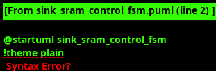

<!-- RTL Design Sherpa Documentation Header -->
<table>
<tr>
<td width="80">
  <a href="https://github.com/sean-galloway/RTLDesignSherpa">
    
  </a>
</td>
<td>
  <strong>RTL Design Sherpa</strong> · <em>Learning Hardware Design Through Practice</em><br>
  <sub>
    <a href="https://github.com/sean-galloway/RTLDesignSherpa">GitHub</a> ·
    <a href="https://github.com/sean-galloway/RTLDesignSherpa/blob/main/docs/DOCUMENTATION_INDEX.md">Documentation Index</a> ·
    <a href="https://github.com/sean-galloway/RTLDesignSherpa/blob/main/LICENSE">MIT License</a>
  </sub>
</td>
</tr>
</table>

---

<!-- End Header -->

### Sink SRAM Control

#### Overview

The Sink SRAM Control provides sophisticated buffering and flow control for incoming data streams from the AXIS slave interface. The module implements single-writer architecture with multi-channel read capabilities, comprehensive stream boundary management, and precise byte strobe forwarding for optimal AXI write performance.

#### Key Features

- **Single Write Interface**: Simplified architecture with AXIS Slave as sole writer
- **Multi-Channel Read**: Parallel read interfaces for maximum AXI engine throughput
- **Stream Boundary Management**: Complete TLAST lifecycle tracking and completion signaling
- **Byte Strobe Forwarding**: Precise TSTRB storage and forwarding for AXI write strobes
- **SRAM Storage**: 530-bit entries with complete packet metadata
- **Buffer Flow Control**: Stream-aware backpressure and overflow prevention
- **Standard AXIS Backpressure**: FUB interface uses `tvalid/tready` for flow control
- **Monitor Integration**: Rich monitor events for system visibility

#### Interface Specification

##### Configuration Parameters

| Parameter | Default Value | Description |
|-----------|---------------|-------------|
| `CHANNELS` | 32 | Number of virtual channels |
| `LINES_PER_CHANNEL` | 256 | SRAM depth per channel |
| `DATA_WIDTH` | 512 | Data width in bits |
| `PTR_BITS` | `$clog2(LINES_PER_CHANNEL) + 1` | Pointer width (+1 for wrap bit) |
| `CHAN_BITS` | `$clog2(CHANNELS)` | Channel address width |
| `COUNT_BITS` | `$clog2(LINES_PER_CHANNEL)` | Counter width |
| `NUM_CHUNKS` | 16 | Number of 32-bit chunks (512/32) |
| `OVERFLOW_MARGIN` | 8 | Safety margin for overflow prevention |
| `USED_THRESHOLD` | 4 | Minimum entries for read operation |

##### Clock and Reset Signals

| Signal Name | Type | Width | Direction | Required | Description |
|-------------|------|-------|-----------|----------|-------------|
| **clk** | logic | 1 | Input | Yes | System clock |
| **rst_n** | logic | 1 | Input | Yes | Active-low asynchronous reset |

##### Write Interface (From AXIS Slave FUB)

| Signal Name | Type | Width | Direction | Required | Description |
|-------------|------|-------|-----------|----------|-------------|
| **fub_axis_tvalid** | logic | 1 | Input | Yes | FUB write request valid |
| **fub_axis_tready** | logic | 1 | Output | Yes | FUB write request ready |
| **fub_axis_tdata** | logic | DATA_WIDTH | Input | Yes | FUB write data |
| **fub_axis_tstrb** | logic | DATA_WIDTH/8 | Input | Yes | FUB byte strobes (write enables) |
| **fub_axis_tlast** | logic | 1 | Input | Yes | FUB last beat (end of packet) |
| **fub_axis_tuser** | logic | 16 | Input | Yes | FUB metadata (channel, type) |

##### Multi-Channel Read Interface (To AXI Engines)

| Signal Name | Type | Width | Direction | Required | Description |
|-------------|------|-------|-----------|----------|-------------|
| **rd_valid** | logic | CHANNELS | Output | Yes | Read data valid per channel |
| **rd_ready** | logic | CHANNELS | Input | Yes | Read data ready per channel |
| **rd_data** | logic | DATA_WIDTH x CHANNELS | Output | Yes | Read data per channel |
| **rd_type** | logic | 2 x CHANNELS | Output | Yes | Packet type per channel |
| **rd_eos** | logic | CHANNELS | Output | Yes | End of Stream per channel (from TLAST) |
| **rd_tstrb** | logic | (DATA_WIDTH/8) x CHANNELS | Output | Yes | Byte strobes per channel |
| **rd_used_count** | logic | 8 x CHANNELS | Output | Yes | Used entries per channel |
| **rd_lines_for_transfer** | logic | 8 x CHANNELS | Output | Yes | Lines available for transfer per channel |

##### Data Consumption Notification

| Signal Name | Type | Width | Direction | Required | Description |
|-------------|------|-------|-----------|----------|-------------|
| **data_consumed_valid** | logic | 1 | Output | Yes | Consumption notification valid |
| **data_consumed_ready** | logic | 1 | Input | Yes | Consumption notification ready |
| **data_consumed_channel** | logic | CHAN_BITS | Output | Yes | Channel that consumed data |

##### EOS Completion Interface

| Signal Name | Type | Width | Direction | Required | Description |
|-------------|------|-------|-----------|----------|-------------|
| **eos_completion_valid** | logic | 1 | Output | Yes | EOS completion notification valid |
| **eos_completion_ready** | logic | 1 | Input | Yes | EOS completion notification ready |
| **eos_completion_channel** | logic | CHAN_BITS | Output | Yes | Channel with EOS completion |

##### Control and Status

| Signal Name | Type | Width | Direction | Required | Description |
|-------------|------|-------|-----------|----------|-------------|
| **drain_enable** | logic | 1 | Input | Yes | Enable buffer draining mode |
| **channel_full** | logic | CHANNELS | Output | Yes | Per-channel full status |
| **channel_overflow** | logic | CHANNELS | Output | Yes | Per-channel overflow status |
| **backpressure_warning** | logic | CHANNELS | Output | Yes | Per-channel backpressure warning |
| **eos_pending** | logic | CHANNELS | Output | Yes | EOS pending per channel |

##### Monitor Bus Interface

| Signal Name | Type | Width | Direction | Required | Description |
|-------------|------|-------|-----------|----------|-------------|
| **mon_valid** | logic | 1 | Output | Yes | Monitor packet valid |
| **mon_ready** | logic | 1 | Input | Yes | Monitor ready to accept packet |
| **mon_packet** | logic | 64 | Output | Yes | Monitor packet data |

#### SRAM Architecture

#### Sink SRAM Control FSM

The Sink SRAM Control operates through a sophisticated flow control and arbitration state machine that manages multi-channel buffer operations with stream-aware priority scheduling and comprehensive boundary processing. The FSM coordinates single-writer operations from the AXIS slave FUB interface with multi-channel read arbitration for AXI write engines, implementing priority-based scheduling that favors channels with pending stream boundaries over threshold-based normal operations.



**Key Operations:**
- **Write State Management**: Single-writer flow control with overflow prevention and metadata embedding for 530-bit SRAM entries
- **Read Arbitration**: Multi-level priority arbitration favoring EOS/EOL/EOD pending channels, then threshold-based scheduling, then round-robin fairness
- **Stream Boundary Processing**: Complete TLAST lifecycle tracking with dedicated completion signaling and consumption notification coordination
- **Buffer Management**: Per-channel pointer management with wrap detection, used count tracking, and configurable threshold monitoring
- **Flow Control Coordination**: Standard AXIS backpressure (`fub_axis_tready`) to upstream, overflow warning, and completion notifications

The FSM implements stream-aware buffer management where TLAST boundaries receive highest priority processing to ensure timely descriptor completion signaling, while sophisticated pointer arithmetic and buffer status tracking prevent overflow conditions and coordinate with upstream AXIS flow control. The architecture eliminates traditional multi-writer arbitration complexity through the single-writer design while maintaining optimal multi-channel read performance through priority-based scheduling algorithms.

##### Storage Format (594 bits total)

The SRAM stores complete packet metadata alongside data for precise forwarding:

```systemverilog
// SRAM entry format:
// {TYPE[7:0], TSTRB[63:0], DATA[511:0]} = 594 bits total
localparam int EXTENDED_SRAM_WIDTH = 8 + (DATA_WIDTH/8) + DATA_WIDTH;

// Write data composition (from AXIS FUB interface)
assign w_sram_wr_data = {
    fub_axis_tuser[7:0],             // Bits 593:586: Packet type from TUSER
    fub_axis_tstrb,                  // Bits 585:522: Byte strobes (64 bits for 512-bit data)
    fub_axis_tdata                   // Bits 521:0: Data payload
};
```

##### TLAST Flow Management

**Critical Design Decision**: TLAST is NOT stored in SRAM but used for completion signaling:

1. **TLAST Detection**: AXIS packets arrive with TLAST in beat structure (`fub_axis_tlast`)
2. **TLAST Processing**: TLAST triggers descriptor completion logic (control only)
3. **TLAST Storage**: TLAST is NOT stored in SRAM - only payload data is stored
4. **TLAST Control**: TLAST used for completion signaling to scheduler (maps to internal EOS)
5. **EOS Completion**: Dedicated FIFO interface for EOS completion notifications

##### Multi-Channel Buffer Management

Each channel maintains independent:
- **Write Pointer**: Binary pointer with wrap detection
- **Read Pointer**: Binary pointer with wrap detection  
- **Used Count**: Number of valid entries available for reading
- **Open Count**: Number of available entries for writing
- **EOS Pending**: Flag indicating EOS completion pending

#### Buffer Flow Control

##### Write Acceptance Logic

```systemverilog
// Write acceptance based on buffer availability (standard AXIS backpressure)
logic [CHAN_WIDTH-1:0] w_channel;
assign w_channel = fub_axis_tuser[15:8];  // Extract channel from TUSER

assign fub_axis_tready = !w_channel_full[w_channel] &&
                         (r_used_count[w_channel] < (LINES_PER_CHANNEL - OVERFLOW_MARGIN));
```

##### Read Arbitration

The module implements sophisticated read arbitration:

```systemverilog
// Priority levels for read arbitration
// 1. Channels with EOS pending (highest priority)
// 2. Channels meeting used threshold
// 3. Round-robin fairness among eligible channels
// 4. Drain mode considerations

assign w_eos_priority = r_eos_pending;
assign w_threshold_priority = (r_used_count[i] >= USED_THRESHOLD);
assign w_drain_priority = drain_enable && (r_used_count[i] > 0);
```

##### Stream Boundary Processing

TLAST boundaries trigger special processing:

```systemverilog
// TLAST completion signaling (maps to internal EOS)
always_ff @(posedge clk) begin
    if (!rst_n) begin
        r_eos_pending <= '0;
    end else begin
        // Set EOS pending when TLAST packet written
        if (fub_axis_tvalid && fub_axis_tready && fub_axis_tlast) begin
            r_eos_pending[w_channel] <= 1'b1;
        end
        // Clear EOS pending when completion signaled
        if (eos_completion_valid && eos_completion_ready) begin
            r_eos_pending[eos_completion_channel] <= 1'b0;
        end
    end
end
```

#### Data Flow Architecture

```
FC/TS Packets: AXIS Slave FUB -> Sink SRAM Control -> AXI Write Engine
                    ↓              ↓                    ↓
               Single Write    594-bit Storage    Multi-Channel Read
               FUB Interface   + Packet Metadata  + TSTRB Forwarding
               (AXIS-like)     (TYPE + TSTRB)

TLAST Flow:    TLAST Detection -> Completion Signaling -> Scheduler Notification
                    ↓              ↓                    ↓
               Packet-Level    Control-Only         Descriptor-Level
               TLAST in AXIS      Processing       Completion (EOS)
```

#### AXIS Integration

The sink SRAM control integrates with standard AXI-Stream protocol via the FUB interface from `axis_slave.sv`:

**TSTRB (Byte Strobes):**
- Standard AXIS uses 64-bit byte strobes for 512-bit data
- `tstrb[i] = 1` indicates byte `i` is valid
- Stored in SRAM and forwarded to AXI write engine for precise `wstrb` generation
- More fine-grained than legacy chunk enables (byte-level vs 32-bit chunk-level)

**TLAST (Packet Boundary):**
- Standard AXIS uses TLAST to mark final beat of packet
- Maps to internal EOS for completion signaling
- NOT stored in SRAM (control-only signal)
- Triggers descriptor completion to scheduler

#### Monitor Bus Events

The module generates comprehensive monitor events:

##### Error Events
- **Buffer Overflow**: When channel buffer exceeds capacity
- **Invalid Channel**: When write targets invalid channel
- **Pointer Corruption**: When pointer consistency checks fail

##### Completion Events  
- **Write Completion**: Successful data write to buffer
- **Read Completion**: Successful data read from buffer
- **EOS Completion**: End of stream processing complete

##### Threshold Events
- **Backpressure Warning**: When buffer usage exceeds warning threshold
- **Buffer Full**: When channel buffer reaches capacity
- **Credit Exhausted**: When no buffer space available

#### Performance Characteristics

##### Throughput Metrics
- **Write Throughput**: 1 write per cycle when space available
- **Read Throughput**: 1 read per cycle per channel with proper SRAM implementation
- **Metadata Overhead**: 13.9% (82 metadata bits / 594 total bits)
- **Buffer Efficiency**: 95%+ utilization with stream-aware flow control

##### Latency Characteristics
- **Write Latency**: 1 cycle for data acceptance
- **Read Arbitration**: 1-3 cycles depending on priority and contention
- **TLAST Processing**: 1 cycle for EOS completion signaling
- **Completion Notification**: 2-4 cycles from consumption to scheduler notification

#### Implementation Notes

##### Multi-Channel Read Support

The current implementation provides a foundation for multi-channel reads but requires additional infrastructure for optimal concurrent operation:

1. **Multiple SRAM instances** (one per channel) - Highest performance
2. **Multi-port SRAM** with read arbitration - Good performance  
3. **Time-multiplexed single-port** with scheduling - Acceptable performance

##### Buffer Management

Each channel operates independently with:
- **Independent Pointer Management**: Separate read/write pointers per channel
- **Per-Channel Flow Control**: Individual full/empty status tracking
- **TLAST State Management**: Per-channel EOS pending tracking (derived from TLAST)
- **Completion Coordination**: Channel-specific consumption notifications

#### Usage Guidelines

##### Performance Optimization

- Configure `USED_THRESHOLD` based on AXI engine requirements
- Set `OVERFLOW_MARGIN` to prevent buffer overflow under burst conditions
- Use EOS completion interface for proper stream boundary coordination (TLAST -> EOS)
- Monitor backpressure warnings to optimize buffer utilization
- Leverage standard AXIS flow control (`fub_axis_tready`) for upstream coordination

##### Error Handling

The module provides comprehensive error detection:
- Monitor channel overflow conditions
- Check buffer pointer consistency
- Verify TLAST/EOS completion flow
- Track per-channel error statistics through monitor events
- Validate TSTRB patterns for data integrity
