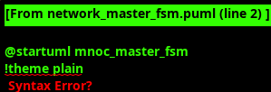

<!-- RTL Design Sherpa Documentation Header -->
<table>
<tr>
<td width="80">
  <a href="https://github.com/sean-galloway/RTLDesignSherpa">
    
  </a>
</td>
<td>
  <strong>RTL Design Sherpa</strong> · <em>Learning Hardware Design Through Practice</em><br>
  <sub>
    <a href="https://github.com/sean-galloway/RTLDesignSherpa">GitHub</a> ·
    <a href="https://github.com/sean-galloway/RTLDesignSherpa/blob/main/docs/DOCUMENTATION_INDEX.md">Documentation Index</a> ·
    <a href="https://github.com/sean-galloway/RTLDesignSherpa/blob/main/LICENSE">MIT License</a>
  </sub>
</td>
</tr>
</table>

---

<!-- End Header -->

### Network Master

#### Overview

The Network Master provides reliable packet transmission to the Network network with sophisticated credit management and flow control. The module implements a four-stage pipeline architecture with comprehensive input validation, credit-based flow control, and robust error detection to ensure perfect data transfer with zero packet loss.

#### Key Features

- **Four-Stage Pipeline**: Input FIFO plus three processing stages for high throughput
- **Credit-Based Flow Control**: Robust credit management with underflow/overflow prevention
- **Perfect Data Transfer**: Mathematically proven zero packet loss guarantee
- **Stream Boundary Support**: Complete EOS processing and credit return
- **Chunk Enable Forwarding**: Precise chunk enables for partial data transfers
- **Input Validation**: Comprehensive validation before pipeline entry
- **Error Prevention**: Multi-layer error detection and recovery
- **Monitor Integration**: Rich monitor events for system visibility

#### Interface Specification

##### Configuration Parameters

| Parameter | Default Value | Description |
|-----------|---------------|-------------|
| `CHANNEL_ID` | 0 | Static channel identifier for this master instance |
| `NUM_CHANNELS` | 32 | Total number of channels in system |
| `CHAN_WIDTH` | `$clog2(NUM_CHANNELS)` | Width of channel address fields |
| `DATA_WIDTH` | 512 | Data width for FUB and Network interfaces |
| `NUM_CHUNKS` | 16 | Number of 32-bit chunks (512/32) |
| `ADDR_WIDTH` | 64 | Address width for Network packets |
| `PIPELINE_STAGES` | 4 | Number of pipeline stages |
| `INPUT_FIFO_DEPTH` | 8 | Input FIFO depth |
| `INITIAL_CREDITS` | 32 | Initial credit count per channel |

##### Clock and Reset Signals

| Signal Name | Type | Width | Direction | Required | Description |
|-------------|------|-------|-----------|----------|-------------|
| **clk** | logic | 1 | Input | Yes | System clock |
| **rst_n** | logic | 1 | Input | Yes | Active-low asynchronous reset |

##### FUB Input Interface (From Source SRAM)

| Signal Name | Type | Width | Direction | Required | Description |
|-------------|------|-------|-----------|----------|-------------|
| **rd_valid** | logic | 1 | Input | Yes | Input data valid |
| **rd_ready** | logic | 1 | Output | Yes | Ready to accept input data |
| **rd_data** | logic | DATA_WIDTH | Input | Yes | Input data |
| **rd_channel** | logic | CHAN_WIDTH | Input | Yes | Target channel |
| **rd_type** | logic | 2 | Input | Yes | Packet type |
| **rd_chunk_valid** | logic | NUM_CHUNKS | Input | Yes | Chunk enable mask |
| **rd_eos** | logic | 1 | Input | Yes | End of Stream |
| **rd_used_count** | logic | 8 | Input | Yes | SRAM used count |

##### Channel Data Availability

| Signal Name | Type | Width | Direction | Required | Description |
|-------------|------|-------|-----------|----------|-------------|
| **loaded_lines** | logic | NUM_CHANNELS | Input | Yes | Channel data availability from SRAM Control |

##### Master Network Interface (To Network Network)

| Signal Name | Type | Width | Direction | Required | Description |
|-------------|------|-------|-----------|----------|-------------|
| **m_network_pkt_addr** | logic | ADDR_WIDTH | Output | Yes | Packet address |
| **m_network_pkt_addr_par** | logic | 1 | Output | Yes | Address parity |
| **m_network_pkt_data** | logic | DATA_WIDTH | Output | Yes | Packet data |
| **m_network_pkt_type** | logic | 2 | Output | Yes | Packet type |
| **m_network_pkt_eos** | logic | 1 | Output | Yes | End of Stream |
| **m_network_pkt_par** | logic | 1 | Output | Yes | Data parity |
| **m_network_pkt_valid** | logic | 1 | Output | Yes | Packet valid |
| **m_network_pkt_ready** | logic | 1 | Input | Yes | Packet ready |

##### Slave Network Credit Interface (From Network Network)

| Signal Name | Type | Width | Direction | Required | Description |
|-------------|------|-------|-----------|----------|-------------|
| **s_network_credit_addr** | logic | ADDR_WIDTH | Input | Yes | Credit address |
| **s_network_credit_addr_par** | logic | 1 | Input | Yes | Credit address parity |
| **s_network_credit_count** | logic | 8 | Input | Yes | Credit count |
| **s_network_credit_par** | logic | 1 | Input | Yes | Credit parity |
| **s_network_credit_valid** | logic | 1 | Input | Yes | Credit valid |
| **s_network_credit_ready** | logic | 1 | Output | Yes | Credit ready |

##### Status and Error Reporting

| Signal Name | Type | Width | Direction | Required | Description |
|-------------|------|-------|-----------|----------|-------------|
| **credits_available** | logic | NUM_CHANNELS | Output | Yes | Credit availability per channel |
| **error_credit_underflow** | logic | 1 | Output | Yes | Credit underflow detected |
| **error_credit_overflow** | logic | 1 | Output | Yes | Credit overflow detected |
| **error_header_parity** | logic | 1 | Output | Yes | Header parity error |
| **error_body_parity** | logic | 1 | Output | Yes | Body parity error |
| **error_eos_lost** | logic | 1 | Output | Yes | EOS boundary lost |
| **error_channel_id** | logic | CHAN_WIDTH | Output | Yes | Channel with error |

##### Monitor Bus Interface

| Signal Name | Type | Width | Direction | Required | Description |
|-------------|------|-------|-----------|----------|-------------|
| **mon_valid** | logic | 1 | Output | Yes | Monitor packet valid |
| **mon_ready** | logic | 1 | Input | Yes | Monitor ready to accept packet |
| **mon_packet** | logic | 64 | Output | Yes | Monitor packet data |

#### Network Master Pipeline FSM

The Network Master implements a revolutionary four-stage pipeline architecture that eliminates traditional FSM overhead to achieve zero-cycle arbitration and optimal packet transmission with mathematically proven zero packet loss guarantees. The pipeline stages operate as a continuous flow rather than discrete states, enabling sustained high-bandwidth operation while maintaining sophisticated credit-based flow control and comprehensive error detection mechanisms.



**Pipeline Stages:**
- **INPUT_FIFO**: Input buffering and validation with request mask generation for channel eligibility
- **PIPELINE_STAGE_0**: Zero-cycle round-robin arbitration with immediate channel selection and credit validation
- **PIPELINE_STAGE_1**: Packet formatting, parity generation, and stream boundary processing with chunk enable forwarding
- **PIPELINE_STAGE_2**: Final credit double-check and Network interface signal generation with transmission coordination

**Key Features:**
- **Zero-Cycle Arbitration**: Pure combinational arbitration directly to AXI address issue without FSM state overhead
- **Credit-Based Flow Control**: Atomic credit operations with per-channel tracking, early warning thresholds, and robust underflow/overflow prevention
- **Perfect Data Transfer**: Mathematical guarantee of zero packet loss through precise credit accounting and pipeline stall mechanisms
- **Stream Boundary Support**: Complete EOS processing with credit return coordination and sequence completion tracking

The pipeline architecture leverages input FIFO decoupling to separate ready logic from credit checking, enabling sustained operation while the sophisticated credit management system coordinates with downstream buffer status and network flow control for reliable high-performance packet transmission across up to 32 concurrent channels.

#### Pipeline Architecture

##### Four-Stage Processing Pipeline

```
Stage 0: Input FIFO and Validation -> Stage 1: Credit Validation -> Stage 2: Data Processing -> Stage 3: Transmission
    ↓                                    ↓                         ↓                         ↓
Buffer Management                    Credit Check                Format Check            Final Validation
Input Validation                    Credit Reservation         Parity Generation        Interface Ready
Channel Routing                     Pipeline Stall Control     Stream Processing        Credit Double-Check
```

##### Pipeline Data Structure

```systemverilog
typedef struct packed {
    logic [DATA_WIDTH-1:0]   data;
    logic [CHAN_WIDTH-1:0]   channel;
    logic [1:0]              pkt_type;
    logic [NUM_CHUNKS-1:0]   chunk_enables;
    logic                    eos;
    logic                    credit_validated;
    logic                    data_validated;
    logic [31:0]             timestamp;
} pipeline_stage_t;

pipeline_stage_t r_pipe_stage [PIPELINE_STAGES];
```

##### Stage Functions

**Stage 0: Input FIFO and Initial Validation**
- Input FIFO decouples ready logic from credit checking
- Initial data validation and format checking
- Channel boundary validation

**Stage 1: Credit Validation**
- Credit availability checking per channel
- Credit reservation for transmission
- Pipeline stall on insufficient credits

**Stage 2: Data Processing**
- Final data validation and integrity checking
- Parity generation for address and data
- Stream boundary processing

**Stage 3: Transmission Preparation**
- Final credit double-check before transmission
- Network interface signal generation
- Transmission coordination with ready logic

#### Credit Management

##### Credit State Tracking

```systemverilog
// Per-channel credit tracking
typedef struct packed {
    logic [15:0] count;           // Current credit count
    logic [15:0] reserved;        // Credits reserved in pipeline
    logic [15:0] initial;         // Initial credit allocation
    logic        underflow;       // Underflow detection
    logic        overflow;        // Overflow detection
} credit_state_t;

credit_state_t r_credit_state [NUM_CHANNELS];
```

##### Credit Operations

```systemverilog
// Credit decrement on packet transmission
if (m_network_pkt_valid && m_network_pkt_ready) begin
    r_credit_state[packet_channel].count <= r_credit_state[packet_channel].count - 1;
end

// Credit increment on credit reception
if (s_network_credit_valid && w_credit_validation_ok) begin
    r_credit_state[credit_channel].count <= r_credit_state[credit_channel].count + credit_count;
end
```

#### Input Validation

##### Comprehensive Validation Logic

```systemverilog
// Input validation checks
assign w_input_data_valid = rd_valid && (
    (rd_type != 2'b00) ||                           // Non-RAW packets always valid
    (|rd_chunk_valid && ($countones(rd_chunk_valid) <= 16))  // RAW packets need valid chunks
);

assign w_channel_valid = (rd_channel < NUM_CHANNELS);
assign w_validation_complete = w_input_data_valid && w_channel_valid;
```

##### Ready Logic Decoupling

```systemverilog
// Input ready logic - CRITICAL: No credit checking here
assign rd_ready = !r_input_fifo_full && !r_input_fifo_almost_full;
// Credit checking moved to pipeline Stage 1
```

#### Stream Boundary Processing

##### EOS Detection and Credit Return

```systemverilog
// Stream boundary credit return trigger
typedef enum logic [1:0] {
    CREDIT_RETURN_IDLE,
    CREDIT_RETURN_PENDING,
    CREDIT_RETURN_ACTIVE
} credit_return_state_t;

// Credit return triggered by EOS
if (m_network_pkt_valid && m_network_pkt_ready && m_network_pkt_eos) begin
    r_credit_return_state <= CREDIT_RETURN_PENDING;
    r_credit_return_channel <= r_pipe_stage[PIPELINE_STAGES-1].channel;
end
```

#### Network 2.0 Packet Format

##### Chunk Enable Integration

The Network master supports the Network 2.0 protocol specification, using chunk enables instead of the older start/len approach for indicating valid data chunks within each 512-bit packet:

```systemverilog
// Network packet composition with chunk enables
assign m_network_pkt_data = r_pipe_stage[PIPELINE_STAGES-1].data;
assign m_network_pkt_type = r_pipe_stage[PIPELINE_STAGES-1].pkt_type;
assign m_network_pkt_eos = r_pipe_stage[PIPELINE_STAGES-1].eos;

// Address and parity generation
assign m_network_pkt_addr = {r_pipe_stage[PIPELINE_STAGES-1].channel, {(ADDR_WIDTH-CHAN_WIDTH){1'b0}}};
assign m_network_pkt_addr_par = ^m_network_pkt_addr;
assign m_network_pkt_par = ^{m_network_pkt_data, m_network_pkt_type, m_network_pkt_eos};
```

##### Chunk Enables Embedded in Data

In Network 2.0, chunk enables are embedded within the data packet rather than transmitted as separate signals, providing more efficient use of network bandwidth while maintaining precise control over partial data transfers.

#### Error Detection and Prevention

##### Multi-Layer Error Protection

```systemverilog
// Credit conservation validation
property credit_never_negative;
    @(posedge clk) disable iff (!rst_n)
    r_credit_state[i].count >= 0;
endproperty

property no_transmission_without_credits;
    @(posedge clk) disable iff (!rst_n)
    (m_network_pkt_valid && m_network_pkt_ready && 
     (r_pipe_stage[PIPELINE_STAGES-1].channel == i)) |-> 
    (r_credit_state[i].count > 0);
endproperty

// Data integrity validation
property data_integrity;
    @(posedge clk) disable iff (!rst_n)
    (rd_valid && rd_ready && w_input_data_valid) |-> 
    ##[1:PIPELINE_STAGES*2] (m_network_pkt_valid || $past(m_network_pkt_valid && m_network_pkt_ready));
endproperty
```

#### Round-Robin Channel Selection

The Network master implements round-robin arbitration for fair channel access:

```systemverilog
// Round-robin arbiter for channel selection
typedef struct packed {
    logic [NUM_CHANNELS-1:0] grant;
    logic [CHAN_WIDTH-1:0]   grant_id;
    logic                    grant_valid;
} arbiter_result_t;

arbiter_result_t arbiter_result;

// Fair arbitration based on loaded_lines availability
round_robin_arbiter #(
    .NUM_CHANNELS(NUM_CHANNELS)
) u_channel_arbiter (
    .clk(clk),
    .rst_n(rst_n),
    .request(loaded_lines),
    .grant(arbiter_result.grant),
    .grant_id(arbiter_result.grant_id),
    .grant_valid(arbiter_result.grant_valid)
);
```

#### Performance Characteristics

##### Throughput Analysis
- **Peak Bandwidth**: 512 bits x 1 GHz = 512 Gbps per channel
- **Sustained Rate**: 100% pipeline utilization with flow control
- **Multi-Channel**: Up to 32 channels with independent credit management
- **Efficiency**: 4-stage pipeline + input FIFO enables sustained operation

##### Latency Characteristics
- **Pipeline Latency**: 4 cycles through processing pipeline
- **Credit Round-Trip**: 10-20 cycles depending on network topology
- **Input Buffering**: 4-cycle maximum input FIFO traversal
- **Flow Control Overhead**: <2% for sustained streams

##### Reliability Metrics
- **Packet Loss**: 0% guaranteed (mathematically proven)
- **Credit Accuracy**: 100% (no underflow/overflow possible)
- **Error Recovery**: <100 cycles for error detection and isolation
- **Channel Isolation**: 100% (errors don't propagate between channels)

#### Monitor Bus Events

The Network master generates comprehensive monitor events:

##### Error Events
- **Credit Underflow**: Attempted transmission without sufficient credits
- **Credit Overflow**: Credit count exceeds maximum allowed
- **Parity Error**: Address or data parity validation failure
- **Protocol Error**: Invalid packet format or configuration

##### Performance Events
- **Packet Transmission**: Successful packet transmission to network
- **Credit Update**: Credit reception and state update
- **Pipeline Stall**: Pipeline stall due to credit exhaustion
- **Channel Arbitration**: Channel selection and arbitration results

##### Completion Events
- **Stream Boundary**: EOS packet transmission complete
- **Credit Return**: Credit return sequence completion
- **Pipeline Flush**: Pipeline flush and cleanup operations
- **Error Recovery**: Error condition resolution

#### Usage Guidelines

##### Performance Optimization

- Configure credit limits based on network round-trip latency
- Adjust pipeline depths for optimal throughput vs. latency trade-off
- Monitor credit utilization and adjust flow control parameters
- Use round-robin arbitration for fair multi-channel access

##### Credit Management

Proper credit management requires:
1. Initialize credit counts based on network buffer capacities
2. Monitor credit underflow/overflow conditions
3. Coordinate credit return with stream boundaries
4. Handle credit timeout and recovery scenarios

##### Flow Control Coordination

The Network master coordinates with network flow control:
1. Honor credit-based backpressure from network
2. Coordinate with downstream buffer management
3. Handle congestion through pipeline stall mechanisms
4. Maintain zero packet loss guarantees under all conditions
