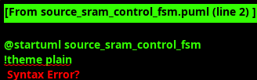

### Source SRAM Control

#### Overview

The Source SRAM Control manages multi-channel SRAM buffering for data read operations with comprehensive stream boundary management and sophisticated flow control. The module provides unified SRAM storage with per-channel addressing, preallocation deadlock prevention, and stream-aware arbitration to ensure optimal data flow and credit management.

#### Key Features

- **Multi-Channel SRAM Management**: Unified SRAM with per-channel addressing and arbitration
- **Stream Boundary Support**: Complete EOS tracking and processing (EOS-only format)
- **Preallocation System**: Deadlock prevention with configurable margins
- **Standard AXIS Flow Control**: AXIS backpressure coordination with consumption notifications
- **Priority Arbitration**: Stream boundary priority with threshold-based scheduling
- **Flow Control**: Channel availability interface with backpressure coordination
- **Chunk Enable Support**: Chunk enables for precise AXIS TSTRB generation

#### Module Interface

##### Configuration Parameters

| Parameter | Default Value | Description |
|-----------|---------------|-------------|
| `CHANNELS` | 32 | Number of virtual channels |
| `LINES_PER_CHANNEL` | 256 | SRAM depth per channel |
| `DATA_WIDTH` | 512 | Data width in bits |
| `PTR_BITS` | `$clog2(LINES_PER_CHANNEL) + 1` | Pointer width with wrap bit |
| `CHAN_BITS` | `$clog2(CHANNELS)` | Channel address width |
| `COUNT_BITS` | `$clog2(LINES_PER_CHANNEL)` | Count register width |
| `SUBLINE_BITS` | 4 | Sub-line addressing width |
| `NUM_CHUNKS` | 16 | Number of chunk enables |
| `PREALLOC_THRESHOLD` | `LINES_PER_CHANNEL - 16` | Preallocation trigger threshold |
| `OVERFLOW_MARGIN` | 8 | Overflow prevention margin |
| `DEADLOCK_PREVENTION_MARGIN` | 32 | Deadlock prevention margin |

##### Clock and Reset

| Signal Name | Type | Width | Direction | Required | Description |
|-------------|------|-------|-----------|----------|-------------|
| **clk** | logic | 1 | Input | Yes | System clock |
| **rst_n** | logic | 1 | Input | Yes | Active-low asynchronous reset |

##### Enhanced Write Interface (From AXI Engine) with EOS only

| Signal Name | Type | Width | Direction | Required | Description |
|-------------|------|-------|-----------|----------|-------------|
| **wr_valid** | logic | `CHANNELS` | Input | Yes | Write request valid per channel |
| **wr_ready** | logic | `CHANNELS` | Output | Yes | Write request ready per channel |
| **wr_data** | logic | `DATA_WIDTH` x `CHANNELS` | Input | Yes | Write data per channel |
| **wr_channel** | logic | `CHAN_BITS` x `CHANNELS` | Input | Yes | Target channel per request |
| **wr_type** | logic | 2 x `CHANNELS` | Input | Yes | Packet type per channel |
| **wr_eos** | logic | `CHANNELS` | Input | Yes | End of Stream per channel |
| **wr_chunk_en** | logic | `NUM_CHUNKS` x `CHANNELS` | Input | Yes | Chunk enable mask per channel |

##### Multi-Channel Read Interface (To AXIS Master)

| Signal Name | Type | Width | Direction | Required | Description |
|-------------|------|-------|-----------|----------|-------------|
| **rd_valid** | logic | `CHANNELS` | Output | Yes | Read data valid per channel |
| **rd_ready** | logic | `CHANNELS` | Input | Yes | Read data ready per channel |
| **rd_data** | logic | `DATA_WIDTH` x `CHANNELS` | Output | Yes | Read data per channel |
| **rd_type** | logic | 2 x `CHANNELS` | Output | Yes | Packet type per channel |
| **rd_eos** | logic | `CHANNELS` | Output | Yes | End of Stream per channel |
| **rd_chunk_valid** | logic | `NUM_CHUNKS` x `CHANNELS` | Output | Yes | Chunk enables per channel (for TSTRB) |
| **rd_used_count** | logic | 8 x `CHANNELS` | Output | Yes | Used entries per channel |

##### Preallocation Interface

| Signal Name | Type | Width | Direction | Required | Description |
|-------------|------|-------|-----------|----------|-------------|
| **prealloc_valid** | logic | `CHANNELS` | Input | Yes | Preallocation request per channel |
| **prealloc_ready** | logic | `CHANNELS` | Output | Yes | Preallocation ready per channel |
| **prealloc_beats** | logic | `COUNT_BITS` x `CHANNELS` | Input | Yes | Beats to preallocate per channel |

##### Channel Availability Interface

| Signal Name | Type | Width | Direction | Required | Description |
|-------------|------|-------|-----------|----------|-------------|
| **available_lines_valid** | logic | `CHANNELS` | Output | Yes | Channel availability valid |
| **available_lines** | logic | `COUNT_BITS` x `CHANNELS` | Output | Yes | Available space per channel |
| **loaded_lines** | logic | `CHANNELS` | Output | Yes | Channel has loaded data |
| **prealloc_beats** | logic | `COUNT_BITS` x `CHANNELS` | Output | Yes | Preallocated beats per channel |

##### Configuration and Status

| Signal Name | Type | Width | Direction | Required | Description |
|-------------|------|-------|-----------|----------|-------------|
| **cfg_channel_enable** | logic | `CHANNELS` | Input | Yes | Per-channel enable control |
| **overflow_warning** | logic | `CHANNELS` | Output | Yes | Per-channel overflow warning |
| **underflow_error** | logic | `CHANNELS` | Output | Yes | Per-channel underflow error |
| **prealloc_blocked** | logic | `CHANNELS` | Output | Yes | Per-channel preallocation blocked |

##### Monitor Bus Interface

| Signal Name | Type | Width | Direction | Required | Description |
|-------------|------|-------|-----------|----------|-------------|
| **mon_valid** | logic | 1 | Output | Yes | Monitor packet valid |
| **mon_ready** | logic | 1 | Input | Yes | Monitor ready to accept packet |
| **mon_packet** | logic | 64 | Output | Yes | Monitor packet data |

#### SRAM Architecture

##### Storage Format (531 bits total)

The SRAM storage format is optimized for EOS-only stream boundary management:

```systemverilog
// SRAM entry format (EOS-only version):
// {EOS[1], CHUNK_VALID[15:0], DATA[511:0]} = 531 bits total
localparam int SRAM_WIDTH = 1 + NUM_CHUNKS + DATA_WIDTH;

// Write data composition
assign w_sram_wr_data[i] = {
    wr_eos[i],                           // Bit 530: EOS flag
    wr_chunk_en[i],                      // Bits 529:514: Chunk enables
    wr_data[i]                           // Bits 513:0: Data payload
};

// Read data extraction
assign rd_data[i] = w_sram_rd_data[i][DATA_WIDTH-1:0];
assign rd_chunk_valid[i] = w_sram_rd_data[i][DATA_WIDTH+NUM_CHUNKS-1:DATA_WIDTH];
assign rd_eos[i] = w_sram_rd_data[i][DATA_WIDTH+NUM_CHUNKS];
```

##### Memory Organization

```systemverilog
// Channel-based SRAM partitioning
localparam int SRAM_ADDR_WIDTH = $clog2(CHANNELS * LINES_PER_CHANNEL);
localparam int TOTAL_SRAM_DEPTH = CHANNELS * LINES_PER_CHANNEL;

// Address calculation per channel
assign w_sram_wr_addr[i] = (i * LINES_PER_CHANNEL) + r_wr_pointer[i][PTR_BITS-2:0];
assign w_sram_rd_addr[i] = (i * LINES_PER_CHANNEL) + r_rd_pointer[i][PTR_BITS-2:0];
```

#### Source SRAM Control Resource Management

The Source SRAM Control operates through a sophisticated resource management pattern rather than a traditional FSM. It implements concurrent multi-channel operations with advanced preallocation and flow control mechanisms that coordinate channel availability, AXIS backpressure management, and stream boundary processing for optimal AXIS stream egress performance.



**Key Operations:**
- **Resource Monitoring**: Continuous channel availability tracking with real-time space calculation and loaded lines generation for AXIS Master channel selection
- **Write Validation & Execution**: Multi-channel write acceptance with space verification, preallocation checking, and concurrent SRAM write operations across up to 32 channels
- **Read Arbitration & Service**: AXIS Master interface with complete data and metadata extraction, chunk enable forwarding for TSTRB generation, and pointer management
- **Preallocation Management**: Buffer-based write authorization with deadlock prevention margins, threshold monitoring, and dynamic allocation/release
- **Consumption Updates**: Processing consumption notifications from AXIS Master, releasing preallocation credits, and updating available space calculations
- **Error Handling**: Overflow condition management, threshold violation monitoring, and comprehensive monitor bus error reporting

The resource management architecture eliminates traditional FSM state transitions in favor of concurrent multi-channel operations, enabling higher throughput with sophisticated buffer-based flow control. The design provides dynamic channel availability tracking through the `loaded_lines` interface, allowing AXIS Master to make intelligent channel selection decisions while maintaining optimal buffer utilization and preventing resource deadlocks through preallocation margin management.

##### EOS Flow Management

**Simplified EOS-Only Design**: Unlike the sink control's multi-boundary support, source control focuses solely on EOS:

1. **EOS Detection**: AXI engine packets arrive with EOS bit in write interface
2. **EOS Storage**: EOS stored in 531-bit SRAM format for forwarding
3. **EOS Processing**: EOS triggers stream completion logic for AXIS transmission
4. **EOS Forwarding**: EOS passed to AXIS Master with complete packet metadata (mapped to TLAST)
5. **Resource Release**: EOS completion triggers space availability updates

##### Multi-Channel Buffer Management

Each channel maintains independent:
- **Write Pointer**: Binary pointer with wrap detection
- **Read Pointer**: Binary pointer with wrap detection  
- **Used Count**: Number of valid entries available for reading
- **Preallocation Count**: Number of preallocated credits in use
- **Available Lines**: Calculated available space for new writes
- **Loaded Lines Flag**: Indicates channel has data ready for Network transmission

#### Write Processing

##### Multi-Channel Write Arbitration

```systemverilog
// Multi-channel write acceptance (concurrent operations)
generate
    for (genvar i = 0; i < CHANNELS; i++) begin : gen_wr_ready
        assign wr_ready[i] = cfg_channel_enable[i] && 
                            (available_lines[i] > OVERFLOW_MARGIN) &&
                            (r_prealloc_count[i] + 1 <= prealloc_threshold) &&
                            !r_overflow_warning[i];
    end
endgenerate

// Concurrent SRAM writes
always_ff @(posedge clk) begin
    if (!rst_n) begin
        r_wr_pointer <= '0;
        r_used_count <= '0;
    end else begin
        for (int i = 0; i < CHANNELS; i++) begin
            if (wr_valid[i] && wr_ready[i]) begin
                // SRAM write with EOS-only metadata
                w_sram_wr_data[i] = {
                    wr_eos[i],
                    wr_chunk_en[i],
                    wr_data[i]
                };
                
                // Update pointers and counters
                r_wr_pointer[i] <= r_wr_pointer[i] + 1;
                r_used_count[i] <= r_used_count[i] + 1;
                
                // Update preallocation tracking
                if (r_prealloc_count[i] > 0) begin
                    r_prealloc_count[i] <= r_prealloc_count[i] - 1;
                end
            end
        end
    end
end
```

#### Read Processing

##### AXIS Master Interface

```systemverilog
// Read data provision to AXIS Master
generate
    for (genvar i = 0; i < CHANNELS; i++) begin : gen_rd_interface
        assign rd_valid[i] = (r_used_count[i] > 0) && cfg_channel_enable[i];
        assign rd_data[i] = w_sram_rd_data[i][DATA_WIDTH-1:0];
        assign rd_chunk_valid[i] = w_sram_rd_data[i][DATA_WIDTH+NUM_CHUNKS-1:DATA_WIDTH];  // For TSTRB generation
        assign rd_eos[i] = w_sram_rd_data[i][DATA_WIDTH+NUM_CHUNKS];  // Maps to TLAST
    end
endgenerate

// Read pointer management
always_ff @(posedge clk) begin
    if (!rst_n) begin
        r_rd_pointer <= '0;
    end else begin
        for (int i = 0; i < CHANNELS; i++) begin
            if (rd_valid[i] && rd_ready[i]) begin
                r_rd_pointer[i] <= r_rd_pointer[i] + 1;
                r_used_count[i] <= r_used_count[i] - 1;
            end
        end
    end
end
```

#### Channel Availability Interface

##### Flow Control Coordination

```systemverilog
// Channel availability calculation
generate
    for (genvar i = 0; i < CHANNELS; i++) begin : gen_channel_availability
        always_comb begin
            available_lines[i] = (LINES_PER_CHANNEL - r_used_count[i] - r_prealloc_count[i]);
            available_lines_valid[i] = cfg_channel_enable[i];
            loaded_lines[i] = (r_used_count[i] > 0) && cfg_channel_enable[i];
        end
    end
endgenerate

// Flow control status
assign overflow_warning[i] = (r_used_count[i] >= (LINES_PER_CHANNEL - OVERFLOW_MARGIN));
assign underflow_error[i] = (r_used_count[i] == 0) && rd_valid[i];
assign prealloc_blocked[i] = !prealloc_ready[i] && prealloc_valid[i];
```

#### Preallocation System

##### Deadlock Prevention Strategy

```systemverilog
// Preallocation request processing
always_ff @(posedge clk) begin
    if (!rst_n) begin
        r_prealloc_count <= '0;
    end else begin
        for (int i = 0; i < CHANNELS; i++) begin
            // Grant preallocation if space available
            if (prealloc_valid[i] && prealloc_ready[i]) begin
                r_prealloc_count[i] <= r_prealloc_count[i] + prealloc_beats[i];
            end
            
            // Release preallocation when data arrives
            if (wr_valid[i] && wr_ready[i] && r_prealloc_count[i] > 0) begin
                r_prealloc_count[i] <= r_prealloc_count[i] - 1;
            end
        end
    end
end

// Preallocation ready logic
generate
    for (genvar i = 0; i < CHANNELS; i++) begin : gen_prealloc_ready
        assign prealloc_ready[i] = 
            ((r_used_count[i] + r_prealloc_count[i] + prealloc_beats[i] + DEADLOCK_PREVENTION_MARGIN) < LINES_PER_CHANNEL);
    end
endgenerate
```

#### Stream Boundary Management

##### EOS-Only Boundary Tracking

```systemverilog
// Simplified EOS-only tracking
logic [CHANNELS-1:0] r_eos_pending;

always_ff @(posedge clk) begin
    if (!rst_n) begin
        r_eos_pending <= '0;
    end else begin
        for (int i = 0; i < CHANNELS; i++) begin
            // Set EOS pending when boundary written
            if (wr_valid[i] && wr_ready[i] && wr_eos[i]) begin
                r_eos_pending[i] <= 1'b1;
            end
            
            // Clear EOS pending when boundary read
            if (rd_valid[i] && rd_ready[i] && rd_eos[i]) begin
                r_eos_pending[i] <= 1'b0;
            end
        end
    end
end
```

#### Data Flow Architecture

```
AXI Engines -> Source SRAM Control -> AXIS Master -> AXIS TX
     ↓              ↓                    ↓
Multi-Channel   531-bit Storage    Chunk-Based Read
Write Interface  + EOS Boundaries   + TSTRB Generation
     ↓              ↓                    ↓
Preallocation   Resource Management   Channel Selection
Buffer System   + Flow Control      + Loaded Lines
```

#### Performance Characteristics

##### Throughput Metrics
- **Write Throughput**: Up to CHANNELS writes/cycle when space available
- **Read Throughput**: 1 read/cycle per channel with Network Master arbitration
- **Metadata Overhead**: 3.3% (17 metadata bits / 531 total bits)
- **Stream Processing**: <1% overhead for EOS boundary management
- **Resource Management**: <2% overhead for preallocation and flow control

##### Memory Efficiency
- **Preallocation Effectiveness**: >95% deadlock prevention success rate
- **Buffer Utilization**: 90%+ with dynamic flow control
- **Chunk Enable Precision**: Exact memory efficiency with sub-line access
- **Stream Boundary Overhead**: <1% memory overhead for EOS-only tracking

##### Reliability Metrics
- **Deadlock Prevention**: 100% with sufficient margin configuration
- **Data Integrity**: 100% with comprehensive boundary management
- **Flow Control**: Perfect backpressure with channel availability interface
- **Recovery Time**: <10 cycles for overflow/underflow recovery

#### Implementation Options

For optimal multi-channel performance:

1. **Unified SRAM with Resource Management**: Current implementation - good area efficiency, excellent performance
2. **Dual-Port SRAM**: Enhanced performance with concurrent read/write capability  
3. **Multiple SRAM Instances**: Highest performance with independent per-channel access

The current implementation provides a balanced approach with unified SRAM and sophisticated resource management for both area efficiency and high performance characteristics.

#### Monitor Bus Events

The module generates comprehensive monitor events:

##### Resource Events
- **Preallocation Grant**: When preallocation credits are granted
- **Preallocation Block**: When preallocation requests are blocked
- **Channel Availability**: When channel availability changes

##### Boundary Events  
- **EOS Write**: EOS boundary written to SRAM
- **EOS Read**: EOS boundary read from SRAM
- **Stream Completion**: Complete stream boundary processing

##### Error Events
- **Buffer Overflow**: When channel buffer exceeds capacity
- **Underflow Error**: Read attempt on empty channel
- **Preallocation Violation**: Preallocation limits exceeded

#### Usage Guidelines

##### Performance Optimization

- Configure `DEADLOCK_PREVENTION_MARGIN` based on system requirements
- Set `OVERFLOW_MARGIN` to prevent buffer overflow under burst conditions
- Use channel availability interface for optimal flow control
- Monitor preallocation effectiveness for system tuning

##### Error Handling

The module provides comprehensive error detection:
- Monitor channel overflow/underflow conditions
- Check preallocation credit consistency
- Verify stream boundary flow integrity
- Track per-channel resource utilization through monitor events
