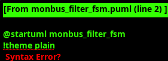

<!-- RTL Design Sherpa Documentation Header -->
<table>
<tr>
<td width="80">
  
</td>
<td>
  <strong>RTL Design Sherpa</strong> · <em>Learning Hardware Design Through Practice</em> 
  
    <a href="https://github.com/sean-galloway/RTLDesignSherpa">GitHub</a> ·
    <a href="https://github.com/sean-galloway/RTLDesignSherpa/blob/main/docs/DOCUMENTATION_INDEX.md">Documentation Index</a> ·
    <a href="https://github.com/sean-galloway/RTLDesignSherpa/blob/main/LICENSE">MIT License</a>
  
</td>
</tr>
</table>

---

<!-- End Header -->

### Monitor Bus AXI-Lite Group

#### Overview

The Monitor Bus AXI-Lite Group aggregates monitor bus streams from source and sink data paths, applies configurable filtering based on protocol and packet types, and routes filtered packets to dual output paths for comprehensive system monitoring and interrupt generation.

The wrapper implements round-robin arbitration between source and sink monitor streams, comprehensive packet filtering for AXI, Network, and CORE protocols, and provides both interrupt generation and external logging capabilities through separate AXI-Lite interfaces.

#### Key Features

- **Round-Robin Arbitration**: Between source and sink monitor streams with built-in skid buffering
- **Multi-Protocol Filtering**: Configurable packet filtering for AXI, Network, and CORE protocols
- **Dual Output Paths**: Error/interrupt FIFO for immediate attention and master write FIFO for logging
- **Interrupt Generation**: Automatic interrupt assertion when error FIFO contains events
- **Address Management**: Configurable address range for master write operations with automatic wraparound
- **Deep Buffering**: Separate FIFO depths for error/interrupt and master write paths

#### Interface Specification

##### Clock and Reset

| Signal Name | Type | Width | Direction | Required | Description |
|-------------|------|-------|-----------|----------|-------------|
| **axi_aclk** | logic | 1 | Input | Yes | AXI clock |
| **axi_aresetn** | logic | 1 | Input | Yes | AXI active-low reset |

##### Monitor Bus Inputs

| Signal Name | Type | Width | Direction | Required | Description |
|-------------|------|-------|-----------|----------|-------------|
| **source_monbus_valid** | logic | 1 | Input | Yes | Source monitor stream valid |
| **source_monbus_ready** | logic | 1 | Output | Yes | Source monitor stream ready |
| **source_monbus_packet** | logic | 64 | Input | Yes | Source monitor packet data |
| **sink_monbus_valid** | logic | 1 | Input | Yes | Sink monitor stream valid |
| **sink_monbus_ready** | logic | 1 | Output | Yes | Sink monitor stream ready |
| **sink_monbus_packet** | logic | 64 | Input | Yes | Sink monitor packet data |

##### AXI-Lite Slave Interface (Error/Interrupt FIFO Access)

| Signal Name | Type | Width | Direction | Required | Description |
|-------------|------|-------|-----------|----------|-------------|
| **s_axil_arvalid** | logic | 1 | Input | Yes | Read address valid |
| **s_axil_arready** | logic | 1 | Output | Yes | Read address ready |
| **s_axil_araddr** | logic | ADDR_WIDTH | Input | Yes | Read address |
| **s_axil_arprot** | logic | 3 | Input | Yes | Read protection attributes |
| **s_axil_rvalid** | logic | 1 | Output | Yes | Read data valid |
| **s_axil_rready** | logic | 1 | Input | Yes | Read data ready |
| **s_axil_rdata** | logic | DATA_WIDTH | Output | Yes | Read data |
| **s_axil_rresp** | logic | 2 | Output | Yes | Read response |

##### AXI-Lite Master Interface (Monitor Data Logging)

| Signal Name | Type | Width | Direction | Required | Description |
|-------------|------|-------|-----------|----------|-------------|
| **m_axil_awvalid** | logic | 1 | Output | Yes | Write address valid |
| **m_axil_awready** | logic | 1 | Input | Yes | Write address ready |
| **m_axil_awaddr** | logic | ADDR_WIDTH | Output | Yes | Write address |
| **m_axil_awprot** | logic | 3 | Output | Yes | Write protection attributes |
| **m_axil_wvalid** | logic | 1 | Output | Yes | Write data valid |
| **m_axil_wready** | logic | 1 | Input | Yes | Write data ready |
| **m_axil_wdata** | logic | DATA_WIDTH | Output | Yes | Write data |
| **m_axil_wstrb** | logic | DATA_WIDTH/8 | Output | Yes | Write strobes |
| **m_axil_bvalid** | logic | 1 | Input | Yes | Write response valid |
| **m_axil_bready** | logic | 1 | Output | Yes | Write response ready |
| **m_axil_bresp** | logic | 2 | Input | Yes | Write response |

##### Configuration Interface

| Signal Name | Type | Width | Direction | Required | Description |
|-------------|------|-------|-----------|----------|-------------|
| **cfg_base_addr** | logic | ADDR_WIDTH | Input | Yes | Base address for master writes |
| **cfg_limit_addr** | logic | ADDR_WIDTH | Input | Yes | Limit address for master writes |

##### AXI Protocol Configuration

| Signal Name | Type | Width | Direction | Required | Description |
|-------------|------|-------|-----------|----------|-------------|
| **cfg_axi_pkt_mask** | logic | 16 | Input | Yes | Drop mask for AXI packet types |
| **cfg_axi_err_select** | logic | 16 | Input | Yes | Error FIFO select for AXI packet types |
| **cfg_axi_error_mask** | logic | 16 | Input | Yes | AXI error event mask |
| **cfg_axi_timeout_mask** | logic | 16 | Input | Yes | AXI timeout event mask |
| **cfg_axi_compl_mask** | logic | 16 | Input | Yes | AXI completion event mask |
| **cfg_axi_thresh_mask** | logic | 16 | Input | Yes | AXI threshold event mask |
| **cfg_axi_perf_mask** | logic | 16 | Input | Yes | AXI performance event mask |
| **cfg_axi_addr_mask** | logic | 16 | Input | Yes | AXI address match event mask |
| **cfg_axi_debug_mask** | logic | 16 | Input | Yes | AXI debug event mask |

##### Network Protocol Configuration

| Signal Name | Type | Width | Direction | Required | Description |
|-------------|------|-------|-----------|----------|-------------|
| **cfg_network_pkt_mask** | logic | 16 | Input | Yes | Drop mask for Network packet types |
| **cfg_network_err_select** | logic | 16 | Input | Yes | Error FIFO select for Network packet types |
| **cfg_network_error_mask** | logic | 16 | Input | Yes | Network error event mask |
| **cfg_network_timeout_mask** | logic | 16 | Input | Yes | Network timeout event mask |
| **cfg_network_compl_mask** | logic | 16 | Input | Yes | Network completion event mask |
| **cfg_network_credit_mask** | logic | 16 | Input | Yes | Network credit event mask |
| **cfg_network_channel_mask** | logic | 16 | Input | Yes | Network channel event mask |
| **cfg_network_stream_mask** | logic | 16 | Input | Yes | Network stream event mask |

##### CORE Protocol Configuration

| Signal Name | Type | Width | Direction | Required | Description |
|-------------|------|-------|-----------|----------|-------------|
| **cfg_core_pkt_mask** | logic | 16 | Input | Yes | Drop mask for CORE packet types |
| **cfg_core_err_select** | logic | 16 | Input | Yes | Error FIFO select for CORE packet types |
| **cfg_core_error_mask** | logic | 16 | Input | Yes | CORE error event mask |
| **cfg_core_timeout_mask** | logic | 16 | Input | Yes | CORE timeout event mask |
| **cfg_core_compl_mask** | logic | 16 | Input | Yes | CORE completion event mask |
| **cfg_core_thresh_mask** | logic | 16 | Input | Yes | CORE threshold event mask |
| **cfg_core_perf_mask** | logic | 16 | Input | Yes | CORE performance event mask |
| **cfg_core_debug_mask** | logic | 16 | Input | Yes | CORE debug event mask |

##### Status and Interrupt

| Signal Name | Type | Width | Direction | Required | Description |
|-------------|------|-------|-----------|----------|-------------|
| **irq_out** | logic | 1 | Output | Yes | Interrupt output (asserted when error FIFO not empty) |

#### Architecture

##### Internal Components

- **Monitor Bus Arbiter**: Round-robin arbitration between source and sink streams
- **Packet Filter**: Multi-level filtering based on protocol, packet type, and event codes
- **Error/Interrupt FIFO**: Stores filtered events requiring immediate attention
- **Master Write FIFO**: Stores filtered events for external logging
- **AXI-Lite Slave**: Provides access to error/interrupt FIFO contents
- **AXI-Lite Master**: Writes monitor data to configurable memory regions

##### Filtering Pipeline

1. **Protocol Extraction**: Extract protocol field from 64-bit monitor packet
2. **Packet Type Filtering**: Apply protocol-specific packet type masks
3. **Event Code Filtering**: Apply individual event code masks within each packet type
4. **Routing Decision**: Route to error FIFO, master write FIFO, or drop based on configuration

##### Address Management

The master write interface maintains an address counter that:
- Starts at `cfg_base_addr`
- Increments by 4 bytes (32-bit bus) or 8 bytes (64-bit bus) per transaction
- Wraps to `cfg_base_addr` when exceeding `cfg_limit_addr`
- Supports both 32-bit and 64-bit AXI-Lite data widths

#### Monitor Bus AXI-Lite Group FSM

The Monitor Bus AXI-Lite Group implements a dedicated master write state machine that manages efficient logging of filtered monitor packets to external memory through configurable AXI-Lite write operations. The FSM coordinates 64-bit monitor packet adaptation to both 32-bit and 64-bit AXI-Lite data buses with sophisticated address management and comprehensive error handling for reliable system observability.

**Key Operations:**
- **Write Transaction Management**: AXI4-Lite compliant write operations with proper address and data phase coordination for reliable monitor packet logging
- **Bus Width Adaptation**: Dynamic adaptation between 64-bit monitor packets and configurable 32-bit/64-bit AXI-Lite data buses with automatic two-phase writes for narrow buses
- **Address Management**: Configurable base address with automatic increment and wraparound logic for circular buffer logging with overflow prevention
- **FIFO Coordination**: Deep FIFO buffering for monitor packets with ready/valid handshake management to prevent data loss during high-frequency monitoring events
- **Error Recovery**: Comprehensive error detection and recovery for AXI-Lite transaction failures with monitor event logging for system diagnostics

The FSM operates as a dedicated AXI-Lite master that provides robust monitor packet logging capabilities, implementing a five-state transaction pipeline that ensures reliable write operations while adapting to different bus configurations. The architecture supports both immediate error/interrupt FIFO access through a slave interface and continuous logging through the master interface, enabling comprehensive system monitoring with configurable filtering and dual-path event routing for both real-time alerts and historical analysis.

#### Network 2.0 Support

The monitor bus aggregation supports the Network 2.0 protocol specification, which uses chunk enables instead of the older start/len approach for indicating valid data chunks within each 512-bit packet. This provides more flexible and precise control over partial data transfers.

#### Usage Guidelines

##### Configuration Setup

1. Configure base and limit addresses for master write logging region
2. Set protocol-specific packet type masks to drop unwanted events
3. Configure error select masks to route critical events to interrupt FIFO
4. Set individual event masks for fine-grained filtering control

##### Interrupt Handling

The interrupt output is asserted whenever the error/interrupt FIFO contains one or more events. Software should:
1. Read from the slave AXI-Lite interface to retrieve error events
2. Process events appropriately based on protocol and event type
3. Continue reading until FIFO is empty (interrupt deasserts)

##### Performance Considerations

- Configure FIFO depths based on expected event rates and processing latency
- Use appropriate address ranges to avoid memory conflicts
- Monitor FIFO status to prevent overflow conditions
- Consider using deeper FIFOs for systems with high monitor event rates
