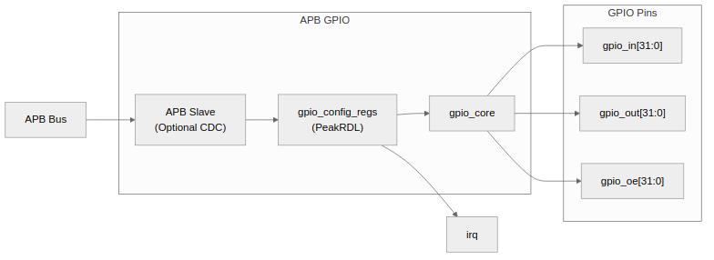

<!-- RTL Design Sherpa Documentation Header -->
<table>
<tr>
<td width="80">
  
</td>
<td>
  <strong>RTL Design Sherpa</strong> · <em>Learning Hardware Design Through Practice</em> 
  
    <a href="https://github.com/sean-galloway/RTLDesignSherpa">GitHub</a> ·
    <a href="https://github.com/sean-galloway/RTLDesignSherpa/blob/main/docs/DOCUMENTATION_INDEX.md">Documentation Index</a> ·
    <a href="https://github.com/sean-galloway/RTLDesignSherpa/blob/main/LICENSE">MIT License</a>
  
</td>
</tr>
</table>

---

<!-- End Header -->

# APB GPIO - Overview

## Overview

The APB GPIO controller is a 32-bit general-purpose I/O block on the APB bus. Software gets per-bit direction control, per-bit interrupt configuration, and atomic output updates; the system gets a single interrupt line and a clean tri-state interface to the pads. Nothing exotic — which is exactly what you want from a GPIO.

### Features

#### Core Functionality
- 32-bit bidirectional GPIO port
- Per-bit direction control (input/output)
- Per-bit output enable control
- Input synchronization for metastability protection

#### Interrupt Capabilities
- Per-bit interrupt enable
- Edge-triggered interrupts (rising, falling, or both)
- Level-triggered interrupts (high or low)
- Combined interrupt output (OR of all enabled sources)
- Write-1-to-clear interrupt status

#### Atomic Operations
- Atomic set (OR with mask)
- Atomic clear (AND with inverted mask)
- Atomic toggle (XOR with mask)
- No read-modify-write race conditions

#### Clock Domain Crossing
- Optional CDC support via `CDC_ENABLE` parameter
- Separate GPIO clock domain for async I/O
- Multi-stage input synchronization

### Applications

#### Typical Use Cases
- LED control and status indication
- Push-button and switch inputs
- External device reset control
- Interrupt generation from external events
- Bit-banged serial protocols (I2C, SPI fallback)
- Debug signals and test points

#### System Integration
- Memory-mapped APB peripheral
- Single interrupt line to CPU/interrupt controller
- Direct connection to FPGA I/O pads via IOBUFs
- Compatible with standard GPIO software drivers

### Figure 1.1: APB GPIO Block Diagram

## Parameters

The headline numbers. GPIO width and synchronizer depth are parameters, so treat the 32-bit default as exactly that — a default.

| Parameter | Value |
|-----------|-------|
| GPIO Width | 32 bits (configurable) |
| APB Data Width | 32 bits |
| APB Address Width | 12 bits (4KB) |
| Sync Stages | 2 (configurable) |
| CDC Support | Optional |

### Register Summary

The full map with field-level detail is in Chapter 5. Here's the quick reference:

| Offset | Name | Access | Reset | Description |
|--------|------|--------|-------|-------------|
| 0x000 | GPIO_CONTROL | RW | 0x00000001 | Global enable and interrupt enable |
| 0x004 | GPIO_DIRECTION | RW | 0x00000000 | Per-bit direction (1=output) |
| 0x008 | GPIO_OUTPUT | RW | 0x00000000 | Output data value |
| 0x00C | GPIO_INPUT | RO | - | Input data (read-only) |
| 0x010 | GPIO_INT_ENABLE | RW | 0x00000000 | Per-bit interrupt enable |
| 0x014 | GPIO_INT_TYPE | RW | 0x00000000 | Interrupt type (1=level, 0=edge) |
| 0x018 | GPIO_INT_POLARITY | RW | 0xFFFFFFFF | Polarity (1=high/rising) |
| 0x01C | GPIO_INT_BOTH | RW | 0x00000000 | Both-edge enable |
| 0x020 | GPIO_INT_STATUS | W1C | 0x00000000 | Interrupt status (W1C) |
| 0x024 | GPIO_RAW_INT | RO | 0 (live) | Raw interrupt (pre-mask) |
| 0x028 | GPIO_OUTPUT_SET | WO | 0x00000000 | Atomic set |
| 0x02C | GPIO_OUTPUT_CLR | WO | 0x00000000 | Atomic clear |
| 0x030 | GPIO_OUTPUT_TGL | WO | 0x00000000 | Atomic toggle |

---

## Navigation

**Next:** [02_architecture.md](02_architecture.md) - High-level architecture
