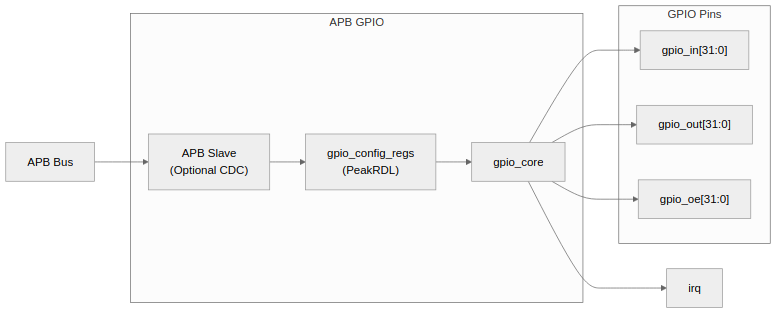
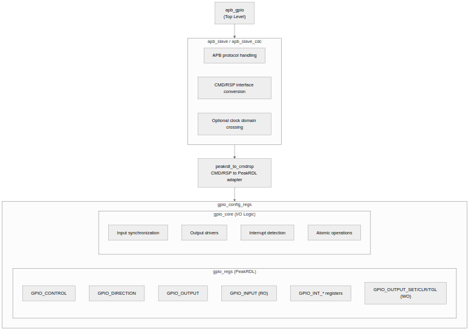
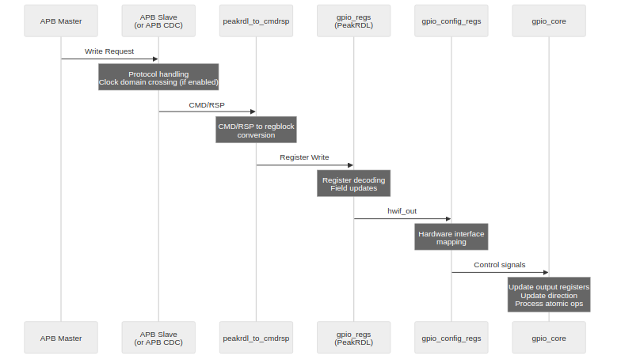
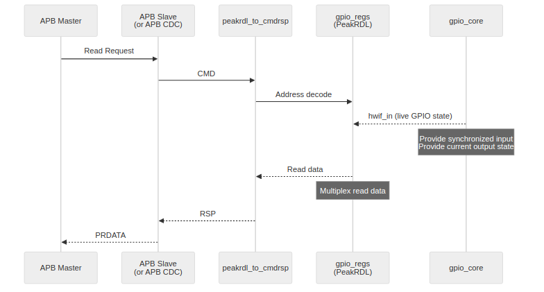
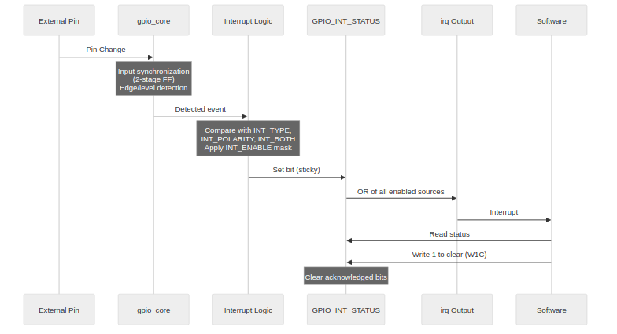
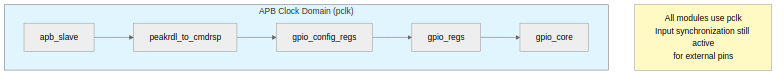
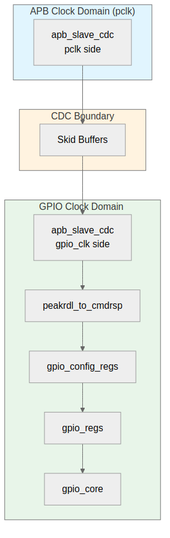

<!-- RTL Design Sherpa Documentation Header -->
<table>
<tr>
<td width="80">
  
</td>
<td>
  <strong>RTL Design Sherpa</strong> · <em>Learning Hardware Design Through Practice</em> 
  
    <a href="https://github.com/sean-galloway/RTLDesignSherpa">GitHub</a> ·
    <a href="https://github.com/sean-galloway/RTLDesignSherpa/blob/main/docs/DOCUMENTATION_INDEX.md">Documentation Index</a> ·
    <a href="https://github.com/sean-galloway/RTLDesignSherpa/blob/main/LICENSE">MIT License</a>
  
</td>
</tr>
</table>

---

<!-- End Header -->

# APB GPIO - Architecture

## High-Level Block Diagram

### Figure 1.2: APB GPIO Top-Level Architecture

## Module Hierarchy

### Figure 1.3: APB GPIO Module Hierarchy

## Data Flow

### Write Transaction Flow

### Figure 1.4: Write Transaction Flow

### Read Transaction Flow

### Figure 1.5: Read Transaction Flow

### Interrupt Flow

### Figure 1.6: Interrupt Flow

## Clock Domains

### Synchronous Mode (CDC_ENABLE = 0)

### Figure 1.7: Synchronous Mode Clock Domains

In synchronous mode, all modules operate on the APB clock (pclk). Input synchronization remains active for external GPIO pins to prevent metastability.

### Asynchronous Mode (CDC_ENABLE = 1)

### Figure 1.8: Asynchronous Mode Clock Domains

In asynchronous mode, the APB clock domain handles protocol conversion while the GPIO clock domain handles all register and I/O operations. Skid buffers provide safe clock domain crossing.

## Parameterization

| Parameter | Type | Default | Description |
|-----------|------|---------|-------------|
| `GPIO_WIDTH` | int | 32 | Number of GPIO pins |
| `SYNC_STAGES` | int | 2 | Input synchronizer stages |
| `CDC_ENABLE` | int | 0 | Enable clock domain crossing |
| `SKID_DEPTH` | int | 2 | CDC skid buffer depth |

: Table 1.1: GPIO Parameters

## Resource Estimates

| Component | Flip-Flops | LUTs |
|-----------|-----------|------|
| gpio_core | ~200 | ~300 |
| gpio_regs | ~400 | ~200 |
| gpio_config_regs | ~50 | ~100 |
| apb_slave (no CDC) | ~20 | ~50 |
| apb_slave_cdc | ~100 | ~150 |
| **Total (no CDC)** | ~670 | ~650 |
| **Total (with CDC)** | ~750 | ~750 |

: Table 1.2: Resource Estimates

---

**Next:** [03_clocks_and_reset.md](03_clocks_and_reset.md) - Clock and reset behavior
