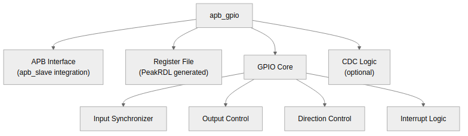

<!-- RTL Design Sherpa Documentation Header -->
<table>
<tr>
<td width="80">
  
</td>
<td>
  <strong>RTL Design Sherpa</strong> · <em>Learning Hardware Design Through Practice</em> 
  
    <a href="https://github.com/sean-galloway/RTLDesignSherpa">GitHub</a> ·
    <a href="https://github.com/sean-galloway/RTLDesignSherpa/blob/main/docs/DOCUMENTATION_INDEX.md">Documentation Index</a> ·
    <a href="https://github.com/sean-galloway/RTLDesignSherpa/blob/main/LICENSE">MIT License</a>
  
</td>
</tr>
</table>

---

<!-- End Header -->

# APB GPIO - Block Descriptions Overview

## Module Hierarchy

### Figure 2.1: APB GPIO Module Hierarchy

## Block Summary

| Block | File | Description |
|-------|------|-------------|
| APB GPIO Top | apb_gpio.sv | Top-level module with all GPIO functionality |
| Register File | apb_gpio_regs.sv | PeakRDL-generated control/status registers |

: Table 2.1: Block Summary

## Detailed Block Descriptions

### 1. APB Interface
Handles APB protocol conversion and register access.

**See:** [01_apb_interface.md](01_apb_interface.md)

### 2. Register File
PeakRDL-generated registers for configuration and status.

**See:** [02_register_file.md](02_register_file.md)

### 3. GPIO Core
Main GPIO functionality including I/O control and interrupts.

**See:** [03_gpio_core.md](03_gpio_core.md)

### 4. Interrupt Controller
Edge detection, level sensing, and interrupt aggregation.

**See:** [04_interrupt_controller.md](04_interrupt_controller.md)

### 5. CDC Logic
Optional clock domain crossing for asynchronous GPIO clock.

**See:** [05_cdc_logic.md](05_cdc_logic.md)

---

**Next:** [01_apb_interface.md](01_apb_interface.md) - APB Interface details
