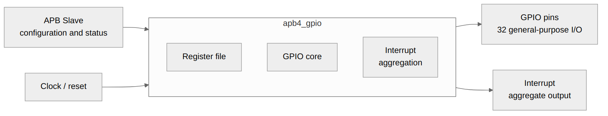

<!-- RTL Design Sherpa Documentation Header -->
<table>
<tr>
<td width="80">
  <a href="https://github.com/sean-galloway/RTLDesignSherpa">
    
  </a>
</td>
<td>
  <strong>RTL Design Sherpa</strong> · <em>Learning Hardware Design Through Practice</em><br>
  <sub>
    <a href="https://github.com/sean-galloway/RTLDesignSherpa">GitHub</a> ·
    <a href="https://github.com/sean-galloway/RTLDesignSherpa/blob/main/docs/DOCUMENTATION_INDEX.md">Documentation Index</a> ·
    <a href="https://github.com/sean-galloway/RTLDesignSherpa/blob/main/LICENSE">MIT License</a>
  </sub>
</td>
</tr>
</table>

---

<!-- End Header -->

# APB GPIO - APB Interface Block

## Overview

The APB interface is the bridge between the system APB bus and the GPIO register file — a small FSM that turns APB's two-phase transfers into the command/response handshake the register block speaks.

### Block Diagram



## Ports

### APB Slave Interface

| Signal | Width | Direction | Description |
|--------|-------|-----------|-------------|
| s_apb_PSEL | 1 | Input | Slave select |
| s_apb_PENABLE | 1 | Input | Enable phase |
| s_apb_PWRITE | 1 | Input | Write operation |
| s_apb_PADDR | 12 | Input | Address bus |
| s_apb_PWDATA | 32 | Input | Write data |
| s_apb_PSTRB | 4 | Input | Byte strobes |
| s_apb_PPROT | 3 | Input | Protection attributes (accepted, unused) |
| s_apb_PRDATA | 32 | Output | Read data |
| s_apb_PREADY | 1 | Output | Ready response |
| s_apb_PSLVERR | 1 | Output | Error response |

## Functional Description

### Read Transaction
1. Master asserts `psel` and `paddr`
2. Master asserts `penable` on next cycle
3. Slave returns `prdata` with `pready`

### Write Transaction
1. Master asserts `psel`, `paddr`, `pwdata`, `pwrite`
2. Master asserts `penable` on next cycle
3. Slave samples data with `pready`

## Timing

A basic APB access, start to finish:

```
         _____       _____       _____
pclk  __/     \_____/     \_____/     \_____

         _________________
psel  __/                 \_________________

                   _______
penable __________|       |_________________

paddr   XXXXXXXXXX|  ADDR |XXXXXXXXXXXXXXXXX

prdata  XXXXXXXXXX|  DATA |XXXXXXXXXXXXXXXXX
                   _______
pready  __________|       |_________________
```

## Design Notes

- PREADY-gated: the bridge FSM adds a few wait states per access (no
  stalls originate in the register block itself)
- No error responses (pslverr always 0)
- 32-bit aligned access only

---

## Navigation

**Next:** [02_register_file.md](02_register_file.md) - Register File
