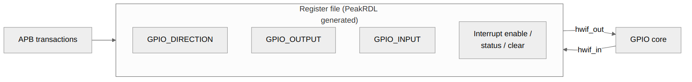

<!-- RTL Design Sherpa Documentation Header -->
<table>
<tr>
<td width="80">
  
</td>
<td>
  <strong>RTL Design Sherpa</strong> · <em>Learning Hardware Design Through Practice</em> 
  
    <a href="https://github.com/sean-galloway/RTLDesignSherpa">GitHub</a> ·
    <a href="https://github.com/sean-galloway/RTLDesignSherpa/blob/main/docs/DOCUMENTATION_INDEX.md">Documentation Index</a> ·
    <a href="https://github.com/sean-galloway/RTLDesignSherpa/blob/main/LICENSE">MIT License</a>
  
</td>
</tr>
</table>

---

<!-- End Header -->

# APB GPIO - Register File Block

## Overview

The register file is generated by PeakRDL from `peakrdl/gpio_regs.rdl` and is the hardware/software contract for the whole block. If a bit isn't in the RDL, it doesn't exist.

### Block Diagram

## Ports

### Hardware-to-Software (hw2reg)

Signals the RTL drives into the register file:

| Signal | Width | Description |
|--------|-------|-------------|
| GPIO_INPUT.input_data | 32 | Current GPIO input values |
| GPIO_OUTPUT.output_data | 32 | Live output latch write-back (we-gated, the cycle after an atomic op) |
| GPIO_INT_STATUS.int_status | 32 | Interrupt status set requests (sticky; includes the deferred W1C-coincident set) |
| GPIO_RAW_INT.raw_status | 32 | Live raw event-detector status |

### Software-to-Hardware (reg2hw)

Signals the register file drives out to the RTL:

| Signal | Width | Description |
|--------|-------|-------------|
| GPIO_CONTROL.gpio_enable | 1 | GPIO output enable (gates gpio_oe only; resets 1) |
| GPIO_CONTROL.int_enable | 1 | Global interrupt enable (gates irq; resets 0) |
| GPIO_DIRECTION.direction | 32 | Pin direction (0=in, 1=out) |
| GPIO_OUTPUT.output_data | 32 | Output values (+ swmod write strobe) |
| GPIO_INT_ENABLE.int_enable | 32 | Interrupt enable per pin |
| GPIO_INT_TYPE.int_type | 32 | Interrupt type (0=edge, 1=level) |
| GPIO_INT_POLARITY.int_polarity | 32 | Polarity (0=fall/low, 1=rise/high) |
| GPIO_INT_BOTH.int_both | 32 | Both edges enable |
| GPIO_OUTPUT_SET.set_bits | 32 | Atomic set mask (+ swmod write strobe) |
| GPIO_OUTPUT_CLR.clear_bits | 32 | Atomic clear mask (+ swmod write strobe) |
| GPIO_OUTPUT_TGL.toggle_bits | 32 | Atomic toggle mask (+ swmod write strobe) |
| GPIO_INT_STATUS.int_status | 32 | Sticky status value (+ swmod W1C write strobe) |

## Functional Description

### Byte Enable Support

All registers support byte-granular writes via pstrb:
- `pstrb[0]` enables bits [7:0]
- `pstrb[1]` enables bits [15:8]
- `pstrb[2]` enables bits [23:16]
- `pstrb[3]` enables bits [31:24]

### Access Types

| Type | Read Behavior | Write Behavior |
|------|---------------|----------------|
| RW | Returns current value | Updates register |
| RO | Returns hardware value | No effect |
| W1C | Returns current value | Clears bits where 1 written |

## Design Notes

- Generated by PeakRDL regblock
- Clocked by the core clock (w_core_clk = gpio_clk when CDC_ENABLE=1,
  pclk otherwise -- see the CDC chapter)
- Registers reset to 0 except GPIO_CONTROL.GPIO_ENABLE (resets to 1) and
  GPIO_INT_POLARITY (resets to 0xFFFFFFFF); reset is synchronous inside
  the generated block
- `swmod` on GPIO_OUTPUT, GPIO_OUTPUT_SET/CLR/TGL and GPIO_INT_STATUS is a
  level held for the whole command-bridge transaction and leads the field
  storage by one cycle; `gpio_config_regs` edge-detects and re-aligns it
  before use, so every write is one operation (see Chapter 5)

---

## Navigation

**Next:** [03_gpio_core.md](03_gpio_core.md) - GPIO Core
