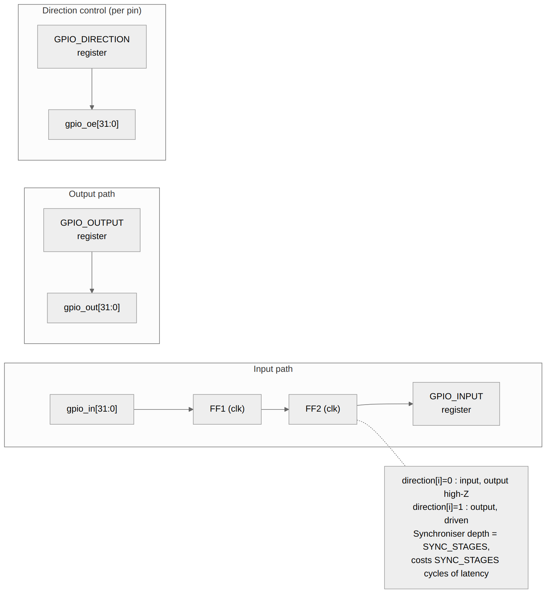
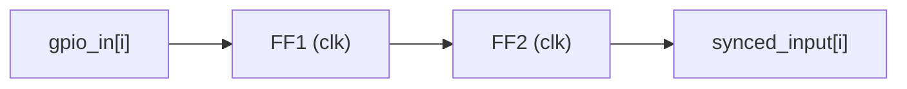

<!-- RTL Design Sherpa Documentation Header -->
<table>
<tr>
<td width="80">
  <a href="https://github.com/sean-galloway/RTLDesignSherpa">
    
  </a>
</td>
<td>
  <strong>RTL Design Sherpa</strong> · <em>Learning Hardware Design Through Practice</em><br>
  <sub>
    <a href="https://github.com/sean-galloway/RTLDesignSherpa">GitHub</a> ·
    <a href="https://github.com/sean-galloway/RTLDesignSherpa/blob/main/docs/DOCUMENTATION_INDEX.md">Documentation Index</a> ·
    <a href="https://github.com/sean-galloway/RTLDesignSherpa/blob/main/LICENSE">MIT License</a>
  </sub>
</td>
</tr>
</table>

---

<!-- End Header -->

# APB GPIO - GPIO Core Block

## Overview

The core is where the pins live: input synchronization, output driving, and direction control for all 32 GPIOs.

### Block Diagram



## Ports

| Signal | Width | Direction | Description |
|--------|-------|-----------|-------------|
| gpio_out | 32 | Output | Output data values |
| gpio_oe | 32 | Output | Output enables (active high) |
| gpio_in | 32 | Input | Input data values |

## Functional Description

### Input Path

#### Synchronization

External inputs pass through a dual flip-flop synchronizer:



- Prevents metastability from asynchronous inputs
- Configurable depth via `SYNC_STAGES` parameter
- Adds SYNC_STAGES clock cycles of latency

#### Input Register

Synchronized inputs land in the `GPIO_INPUT` register, which is what software reads.

### Output Path

#### Output Register

Software writes to `GPIO_OUTPUT` to set output values. The write reaches the
core as a one-cycle strobe (`cfg_output_wr_stb`, built in `gpio_config_regs`
from the register's write strobe) alongside the data, so it is a write
whether or not the value changed. A direct write takes priority over an
atomic operation in the same cycle (direct > toggle > set > clear):

```
if (cfg_output_wr_stb)        r_output_data <= cfg_output_data;
else                          // toggle, then set, then clear
```

`r_output_data` drives the pins and is written back into `GPIO_OUTPUT` after
each atomic operation, so the register reads the live value.

#### Output Enable

The direction register controls the tri-state buffers:
- `direction[i] = 0`: Pin is input (high-Z output)
- `direction[i] = 1`: Pin is output (driven)

### Direction Control

#### Per-Pin Configuration

Each pin is configured independently:

```
// gpio_oe = cfg_gpio_enable ? cfg_direction : '0;   (gpio_core.sv)
if (gpio_enable && direction[i]) begin
    // Output mode
    gpio_oe[i] = 1'b1;
    gpio_out[i] = output_reg[i];
end else begin
    // Input mode, or GPIO_CONTROL.ENABLE == 0 (all pins high-Z)
    gpio_oe[i] = 1'b0;
    // gpio_out[i] = don't care
end
```

GPIO_CONTROL.ENABLE gates ONLY the output enables: when it is 0 every pin is
high-Z, but output data, input synchronization, and interrupt
detection/status all keep running.

#### Read-Back Behavior

Reading `GPIO_INPUT` returns:
- For input pins: External signal value (synchronized)
- For output pins: External signal value (may differ from output_reg if open-drain)

## Design Notes

- All 32 pins processed in parallel
- Output updates one core-clock after the GPIO_OUTPUT field updates (the
  write strobe is aligned to the field, and `r_output_data` registers it)
- The core exports `sts_raw_int` and `sts_int_pending` only; the aggregate
  `irq` is built in `gpio_config_regs` from the sticky status register and
  the live level pins. The core has no irq output and no global-enable input
- Input synchronization always active

---

## Navigation

**Next:** [04_interrupt_controller.md](04_interrupt_controller.md) - Interrupt Controller
