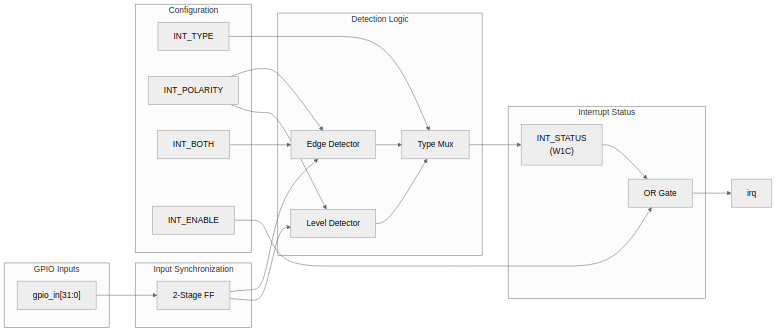
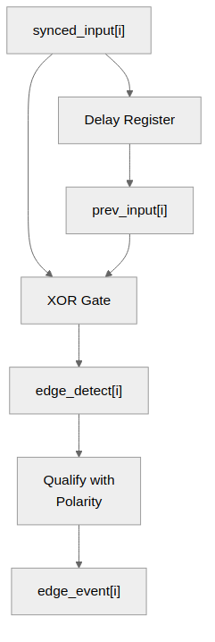

<!-- RTL Design Sherpa Documentation Header -->
<table>
<tr>
<td width="80">
  <a href="https://github.com/sean-galloway/RTLDesignSherpa">
    
  </a>
</td>
<td>
  <strong>RTL Design Sherpa</strong> · <em>Learning Hardware Design Through Practice</em><br>
  <sub>
    <a href="https://github.com/sean-galloway/RTLDesignSherpa">GitHub</a> ·
    <a href="https://github.com/sean-galloway/RTLDesignSherpa/blob/main/docs/DOCUMENTATION_INDEX.md">Documentation Index</a> ·
    <a href="https://github.com/sean-galloway/RTLDesignSherpa/blob/main/LICENSE">MIT License</a>
  </sub>
</td>
</tr>
</table>

---

<!-- End Header -->

# APB GPIO - Interrupt Controller Block

## Overview

The interrupt controller provides flexible interrupt generation for each GPIO pin with support for edge and level triggering.

## Block Diagram

### Figure 2.5: Interrupt Controller Block Diagram



## Interrupt Modes

### Edge-Triggered Mode
`GPIO_INT_TYPE[i] = 0`

| GPIO_INT_POLARITY | GPIO_INT_BOTH | Trigger Condition |
|-------------------|---------------|-------------------|
| 0 | 0 | Falling edge only |
| 1 | 0 | Rising edge only |
| X | 1 | Both edges |

: Table 2.5: Edge-Triggered Modes

### Level-Sensitive Mode
`GPIO_INT_TYPE[i] = 1`

| GPIO_INT_POLARITY | Trigger Condition |
|-------------------|-------------------|
| 0 | Active low (interrupt while pin = 0) |
| 1 | Active high (interrupt while pin = 1) |

: Table 2.6: Level-Sensitive Modes

## Edge Detection Logic

### Figure 2.6: Edge Detection Logic



## Interrupt Status

### Status Register

- Each bit in `GPIO_INT_STATUS` corresponds to one pin
- Set when interrupt condition detected
- Cleared by writing 1 to the bit (W1C)

### Interrupt Enable

- `GPIO_INT_ENABLE[i] = 1` enables interrupt for pin i
- Disabled pins don't affect `irq` output
- Status bits still set regardless of enable

## Aggregate IRQ Output

```
irq = |(gpio_int_status & gpio_int_enable)
```

Single IRQ output is OR of all enabled, active interrupts.

## Interrupt Handling Flow

1. Hardware detects condition, sets status bit
2. IRQ asserted to processor
3. Software reads `GPIO_INT_STATUS` to identify source
4. Software handles interrupt
5. Software writes 1 to status bit to clear
6. IRQ deasserts (if no other sources active)

## Implementation Notes

- Edge detection uses synchronized input
- Level-sensitive interrupts re-trigger if not cleared
- Status bits latch until software clears

---

**Next:** [05_cdc_logic.md](05_cdc_logic.md) - CDC Logic
