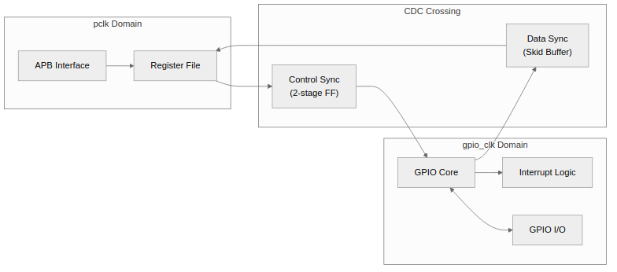
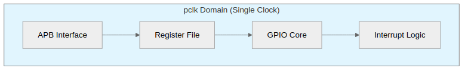
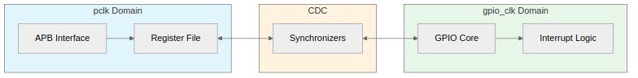

<!-- RTL Design Sherpa Documentation Header -->
<table>
<tr>
<td width="80">
  
</td>
<td>
  <strong>RTL Design Sherpa</strong> · <em>Learning Hardware Design Through Practice</em> 
  
    <a href="https://github.com/sean-galloway/RTLDesignSherpa">GitHub</a> ·
    <a href="https://github.com/sean-galloway/RTLDesignSherpa/blob/main/docs/DOCUMENTATION_INDEX.md">Documentation Index</a> ·
    <a href="https://github.com/sean-galloway/RTLDesignSherpa/blob/main/LICENSE">MIT License</a>
  
</td>
</tr>
</table>

---

<!-- End Header -->

# APB GPIO - CDC Logic Block

## Overview

Optional clock domain crossing logic enables GPIO core to run on a separate clock from the APB interface.

## Block Diagram

### Figure 2.7: CDC Logic Block Diagram

## Configuration

### Parameter: CDC_ENABLE

| Value | Behavior |
|-------|----------|
| 0 | Single clock domain, all logic on pclk |
| 1 | Dual clock domain, GPIO core on gpio_clk |

: Table 2.7: CDC Enable Parameter

## Clock Domains

### When CDC_ENABLE = 0

### Figure 2.8: Single Clock Domain (CDC Disabled)

### When CDC_ENABLE = 1

### Figure 2.9: Dual Clock Domain (CDC Enabled)

## CDC Implementation

### APB to GPIO Direction

Register values synchronized to gpio_clk domain:
- `gpio_direction`
- `gpio_output`
- `gpio_int_enable`
- `gpio_int_type`
- `gpio_int_polarity`
- `gpio_int_both`

### GPIO to APB Direction

Status values synchronized to pclk domain:
- `gpio_input` (synchronized input values)
- `gpio_int_status` (interrupt status)

## Synchronization Method

### Control Signals
Dual flip-flop synchronizers for single-bit controls.

### Multi-bit Data
Skid buffers with handshake protocol for register transfers.

## Timing Considerations

### Latency

| Path | Latency |
|------|---------|
| Register write to GPIO output | 2-4 gpio_clk cycles |
| GPIO input to register read | 2-4 pclk cycles |
| Interrupt detection to IRQ | 2-4 pclk cycles |

: Table 2.8: CDC Latency

### Coherency

- No guaranteed atomicity across clock domains
- Software must handle potential inconsistencies
- Interrupt status always reflects gpio_clk domain

## Reset Synchronization

Both resets must be asserted at power-on:
1. Assert both `presetn` and `gpio_rstn`
2. Release `gpio_rstn` first
3. Release `presetn` after gpio_clk domain stable

---

**Back to:** [00_overview.md](00_overview.md) - Block Descriptions Overview

**Next Chapter:** [Chapter 3: Interfaces](../ch03_interfaces/00_overview.md)
