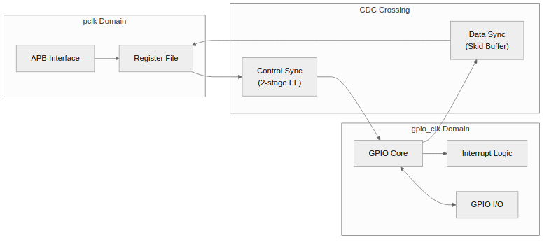
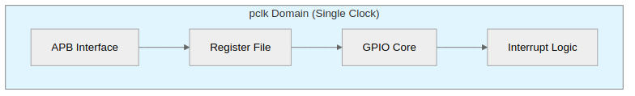
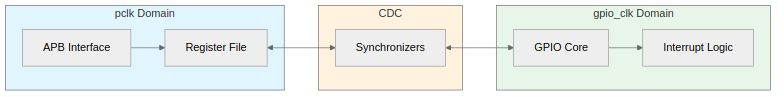

<!-- RTL Design Sherpa Documentation Header -->
<table>
<tr>
<td width="80">
  
</td>
<td>
  <strong>RTL Design Sherpa</strong> · <em>Learning Hardware Design Through Practice</em> 
  
    <a href="https://github.com/sean-galloway/RTLDesignSherpa">GitHub</a> ·
    <a href="https://github.com/sean-galloway/RTLDesignSherpa/blob/main/docs/DOCUMENTATION_INDEX.md">Documentation Index</a> ·
    <a href="https://github.com/sean-galloway/RTLDesignSherpa/blob/main/LICENSE">MIT License</a>
  
</td>
</tr>
</table>

---

<!-- End Header -->

# APB GPIO - CDC Logic Block

## Overview

When you need the GPIO core on its own clock, asynchronous to the APB bus, `CDC_ENABLE` moves the whole register file across the domain boundary. Everything about the crossing lives in this one block.

### Figure 2.7: CDC Logic Block Diagram

## Parameters

### CDC_ENABLE

| Value | Behavior |
|-------|----------|
| 0 | Single clock domain, all logic on pclk |
| 1 | Dual clock domain, GPIO core on gpio_clk |

: Table 2.7: CDC Enable Parameter

## Functional Description

### Clock Domains

#### Figure 2.8: Single Clock Domain (CDC Disabled)

#### Figure 2.9: Dual Clock Domain (CDC Enabled)

### CDC Implementation

When CDC_ENABLE=1 the ENTIRE register file and GPIO core sit in the gpio_clk
domain; no register value is individually synchronized. The only crossing is
the APB command/response stream itself, carried through an `apb4_slave_cdc`
instance at the bus boundary (`apb4_gpio.sv`, `gen_cdc`). An APB access
therefore completes with CDC handshake latency, and once it lands in the
gpio_clk domain every register behaves exactly as in the single-clock
configuration.

### The `irq` Output

`irq` is generated in the gpio_clk domain (`gpio_config_regs.sv`) and is
driven out WITHOUT a synchronizer. When CDC_ENABLE=1 it is a gpio_clk-domain
output: the integrator must synchronize it into the interrupt controller's
clock domain (it is level-style and safe to double-flop). This is tracked as
RTL issue #44; until the RTL synchronizes it internally, treat `irq` as
asynchronous to pclk.

### Coherency

- No guaranteed atomicity across clock domains
- Software must handle potential inconsistencies
- Interrupt status always reflects gpio_clk domain

### Reset Synchronization

Both resets must be asserted at power-on:
1. Assert both `presetn` and `gpio_rstn`
2. Release `gpio_rstn` first
3. Release `presetn` after gpio_clk domain stable

## Timing

### Latency

| Path | Latency |
|------|---------|
| APB write to gpio_clk-domain register | APB access + apb4_slave_cdc handshake (a few cycles of each clock) |
| APB read of gpio_clk-domain state | Same crossing, in both directions |
| Interrupt detection to IRQ | gpio_clk-domain only - `irq` is NOT synchronized to pclk (see above) |

: Table 2.8: CDC Latency

---

## Navigation

**Back to:** [00_overview.md](00_overview.md) - Block Descriptions Overview

**Next Chapter:** [Chapter 3: Interfaces](../ch03_interfaces/00_overview.md)
