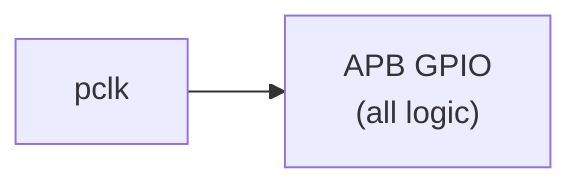
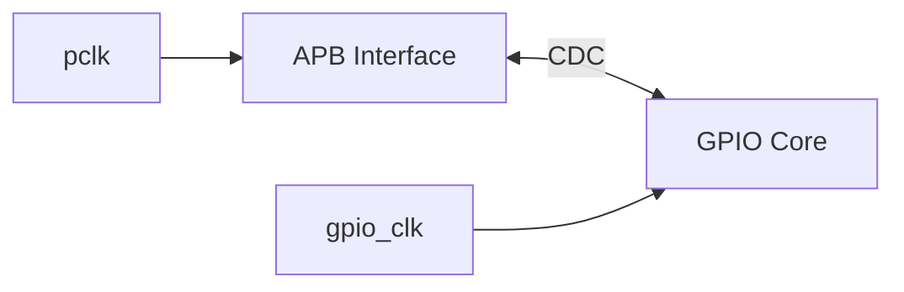

<!-- RTL Design Sherpa Documentation Header -->
<table>
<tr>
<td width="80">
  <a href="https://github.com/sean-galloway/RTLDesignSherpa">
    
  </a>
</td>
<td>
  <strong>RTL Design Sherpa</strong> · <em>Learning Hardware Design Through Practice</em><br>
  <sub>
    <a href="https://github.com/sean-galloway/RTLDesignSherpa">GitHub</a> ·
    <a href="https://github.com/sean-galloway/RTLDesignSherpa/blob/main/docs/DOCUMENTATION_INDEX.md">Documentation Index</a> ·
    <a href="https://github.com/sean-galloway/RTLDesignSherpa/blob/main/LICENSE">MIT License</a>
  </sub>
</td>
</tr>
</table>

---

<!-- End Header -->

# APB GPIO - System Interface

## Clock Signals

### pclk - APB Clock

| Parameter | Value |
|-----------|-------|
| Purpose | APB interface clock |
| Frequency | 50-200 MHz typical |
| Domain | APB bus timing |

Used for:
- APB protocol timing
- Register file access
- IRQ generation (single-clock mode)

### gpio_clk - GPIO Clock

| Parameter | Value |
|-----------|-------|
| Purpose | GPIO core clock |
| Frequency | Application dependent |
| Usage | Only when CDC_ENABLE=1 |

Used for:
- Input synchronization
- Output register updates
- Interrupt detection

## Reset Signals

### presetn - APB Reset

| Parameter | Value |
|-----------|-------|
| Polarity | Active low |
| Type | Asynchronous assert, synchronous deassert |
| Scope | APB interface logic |

Resets:
- APB state machine
- Register file
- Response logic

### gpio_rstn - GPIO Reset

| Parameter | Value |
|-----------|-------|
| Polarity | Active low |
| Type | Asynchronous assert, synchronous deassert |
| Usage | Only when CDC_ENABLE=1 |

Resets:
- GPIO output registers
- Input synchronizers
- Interrupt state

## Clock Configurations

### Single Clock Domain (CDC_ENABLE = 0)



gpio_clk: Tie to pclk or leave unconnected

### Dual Clock Domain (CDC_ENABLE = 1)



## Reset Sequence

### Power-On Reset

1. Assert both presetn and gpio_rstn low
2. Clocks may be running or stopped
3. Hold reset for minimum 2 clock cycles
4. Release gpio_rstn first
5. Wait 2 gpio_clk cycles
6. Release presetn
7. Wait 2 pclk cycles before APB access

### Timing Diagram

```
          ________________________________________
pclk     |  |  |  |  |  |  |  |  |  |  |  |  |  |

          ________________________________________
gpio_clk |  |  |  |  |  |  |  |  |  |  |  |  |  |

                              _____________________
presetn  ____________________|

                        ___________________________
gpio_rstn ______________|

              |<- min 2 ->|<- 2 ->|<- 2 ->|
                 clocks    gclk    pclk
```

## Constraints

### Clock Relationship

| Mode | Constraint |
|------|------------|
| CDC_ENABLE=0 | Single clock, no special constraints |
| CDC_ENABLE=1 | Set false_path between domains |

### Reset Recovery

- Allow minimum 2 clock cycles after reset deassert
- First APB transaction may start on 3rd cycle

---

**Back to:** [00_overview.md](00_overview.md) - Interfaces Overview

**Next Chapter:** [Chapter 4: Programming Model](../ch04_programming/00_overview.md)
