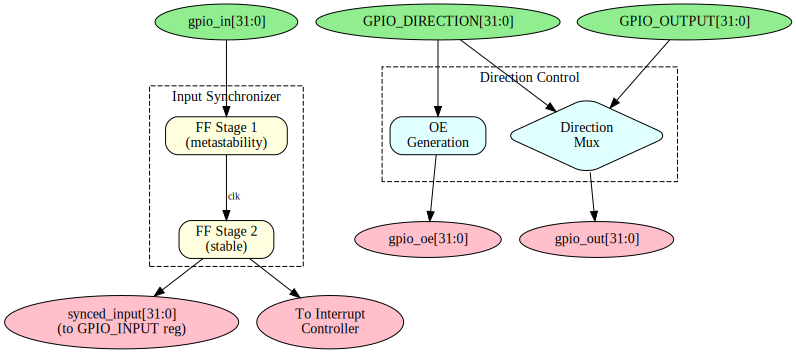

# APB GPIO - GPIO Core Block

## Overview

The GPIO core handles input synchronization, output driving, and direction control for all 32 GPIO pins.

## Block Diagram



## Input Path

### Synchronization

External inputs pass through a dual flip-flop synchronizer:

```
gpio_in[i] --> FF1 --> FF2 --> synced_input[i]
              (clk)   (clk)
```

- Prevents metastability from asynchronous inputs
- Configurable depth via `SYNC_STAGES` parameter
- Adds SYNC_STAGES clock cycles of latency

### Input Register

Synchronized inputs are presented to software via `GPIO_INPUT` register.

## Output Path

### Output Register

Software writes to `GPIO_OUTPUT` register to set output values.

### Output Enable

Direction register controls tri-state buffers:
- `direction[i] = 0`: Pin is input (high-Z output)
- `direction[i] = 1`: Pin is output (driven)

### External Signals

| Signal | Width | Description |
|--------|-------|-------------|
| gpio_out | 32 | Output data values |
| gpio_oe | 32 | Output enables (active high) |
| gpio_in | 32 | Input data values |

## Direction Control

### Per-Pin Configuration

Each pin independently configured:

```
if (direction[i]) begin
    // Output mode
    gpio_oe[i] = 1'b1;
    gpio_out[i] = output_reg[i];
end else begin
    // Input mode
    gpio_oe[i] = 1'b0;
    // gpio_out[i] = don't care
end
```

### Read-Back Behavior

Reading `GPIO_INPUT` returns:
- For input pins: External signal value (synchronized)
- For output pins: External signal value (may differ from output_reg if open-drain)

## Implementation Notes

- All 32 pins processed in parallel
- Zero-latency output updates
- Input synchronization always active

---

**Next:** [04_interrupt_controller.md](04_interrupt_controller.md) - Interrupt Controller
