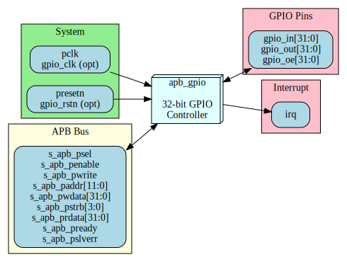

# APB GPIO - Interfaces Overview

## External Interfaces

The APB GPIO module has the following external interfaces:

| Interface | Type | Description |
|-----------|------|-------------|
| APB Slave | Bus | Configuration and status access |
| GPIO Pins | I/O | 32 general-purpose I/O pins |
| Interrupt | Signal | Aggregate interrupt output |
| Clocks/Reset | System | Clock and reset inputs |

## Interface Summary Diagram

## Chapter Contents

### APB Slave Interface
Complete APB protocol interface for register access.

**See:** [01_apb_slave.md](01_apb_slave.md)

### GPIO Pin Interface
External GPIO pin connections with tri-state control.

**See:** [02_gpio_pins.md](02_gpio_pins.md)

### Interrupt Interface
Interrupt request output signal.

**See:** [03_interrupt.md](03_interrupt.md)

### System Interface
Clock and reset signal requirements.

**See:** [04_system.md](04_system.md)

---

**Next:** [01_apb_slave.md](01_apb_slave.md) - APB Slave Interface
