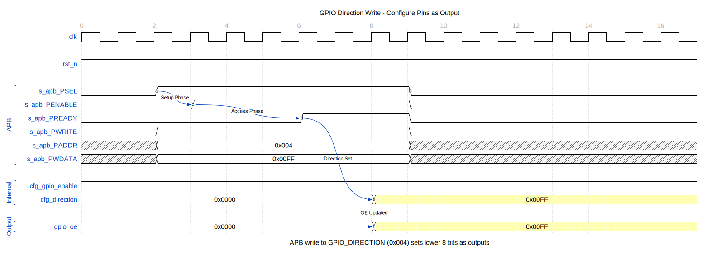
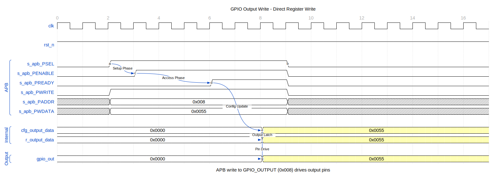
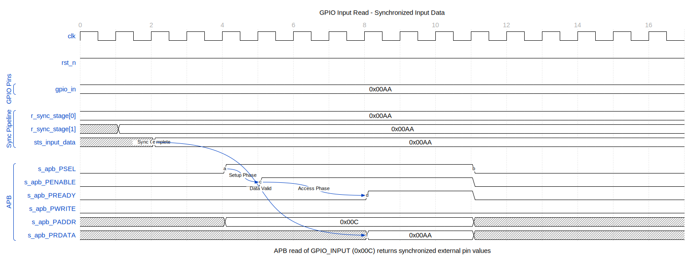
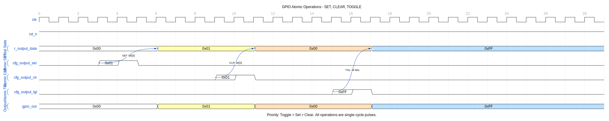

# APB GPIO - Basic Operations

## Timing Diagrams

The following diagrams show the internal signal flow for basic GPIO operations.

### Direction Configuration

When software writes to GPIO_DIRECTION, the direction register updates and controls the output enable for each pin.



The APB write completes in a single cycle. The direction register (`r_gpio_direction`) updates on the clock edge following PREADY, and the output enable (`gpio_oe`) reflects the new configuration immediately.

### Output Write

Writing to GPIO_OUTPUT sets the output data register, which drives the external pins when direction is set to output.



The write data flows through the APB interface to the output register. When `gpio_oe[n]` is high (output mode), `gpio_out[n]` drives the written value to the external pin.

### Input Read

Reading GPIO_INPUT returns the synchronized input values from external pins.



External inputs pass through a 2-stage synchronizer before being captured. The synchronized value (`w_gpio_sync`) is returned on `s_apb_PRDATA` during the APB read transaction.

### Input Synchronization

All GPIO inputs pass through a 2-stage synchronizer to prevent metastability.


The synchronizer adds 2 clock cycles of latency. External asynchronous transitions on `gpio_in` propagate through `sync_stage1` and `sync_stage2` before appearing on the internal synchronized signal `w_gpio_sync`.

### Atomic Operations

The SET, CLEAR, and TOGGLE registers provide atomic bit manipulation without read-modify-write races.



Three consecutive APB writes demonstrate:
1. **GPIO_SET**: Sets bits where write data is 1, leaves others unchanged
2. **GPIO_CLEAR**: Clears bits where write data is 1, leaves others unchanged
3. **GPIO_TOGGLE**: Inverts bits where write data is 1, leaves others unchanged

---

## Initialization

### Reset State

After reset, all registers are 0:
- GPIO disabled
- All pins configured as inputs
- No interrupts enabled

### Enable GPIO

```c
// Enable GPIO controller
GPIO_CONTROL = 0x00000001;
```

## Output Operations

### Configure as Output

```c
// Set pins 7:4 as outputs (bits = 1 for output)
GPIO_DIRECTION = 0x000000F0;
```

### Write Output Values

```c
// Set pins 7:4 to value 0101
GPIO_OUTPUT = 0x00000050;
```

### Toggle Outputs

```c
// Read current output, XOR to toggle
uint32_t current = GPIO_OUTPUT;
GPIO_OUTPUT = current ^ 0x000000F0;  // Toggle pins 7:4
```

### Atomic Bit Operations

```c
// Set specific bits (pins 5 and 7)
GPIO_OUTPUT |= 0x000000A0;

// Clear specific bits (pins 4 and 6)
GPIO_OUTPUT &= ~0x00000050;
```

## Input Operations

### Configure as Input

```c
// Set pins 3:0 as inputs (bits = 0 for input)
GPIO_DIRECTION &= ~0x0000000F;
```

### Read Input Values

```c
// Read all inputs
uint32_t inputs = GPIO_INPUT;

// Check specific pin (pin 2)
if (inputs & 0x00000004) {
    // Pin 2 is high
}
```

### Read with Mask

```c
// Read only pins 3:0
uint32_t low_nibble = GPIO_INPUT & 0x0000000F;
```

## Mixed I/O Configuration

### Configure Mixed Directions

```c
// Pins 31:16 = outputs, pins 15:0 = inputs
GPIO_DIRECTION = 0xFFFF0000;
```

### Read-Modify-Write Pattern

```c
// Change only pins 11:8 to outputs
uint32_t dir = GPIO_DIRECTION;
dir |= 0x00000F00;    // Set pins 11:8
GPIO_DIRECTION = dir;
```

## Output Enable Behavior

### Hardware Interface

When direction bit is set:
- `gpio_oe[i]` = 1 (output enabled)
- `gpio_out[i]` = GPIO_OUTPUT[i] value

When direction bit is clear:
- `gpio_oe[i]` = 0 (high impedance)
- `gpio_out[i]` = don't care

### Glitch Considerations

To avoid output glitches when switching direction:
1. Set GPIO_OUTPUT to desired value
2. Then change GPIO_DIRECTION

```c
// Safe direction change to output
GPIO_OUTPUT = desired_value;    // Set value first
GPIO_DIRECTION |= pin_mask;     // Then enable output
```

---

**Next:** [02_interrupt_config.md](02_interrupt_config.md) - Interrupt Configuration
