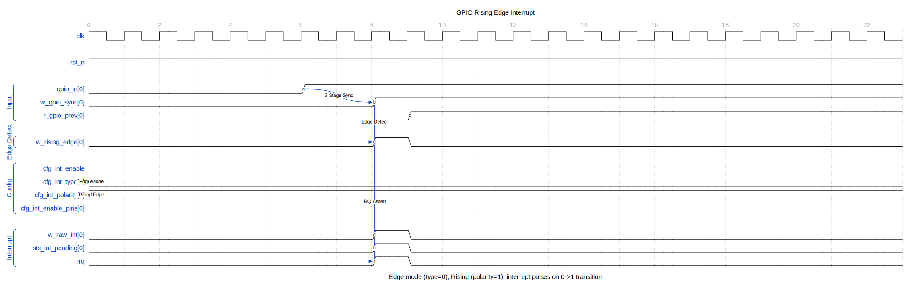
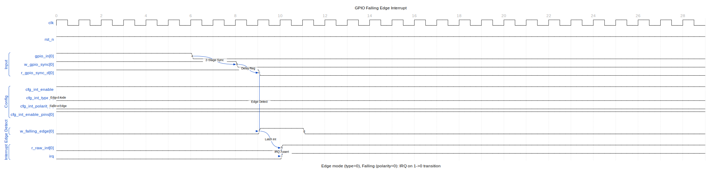
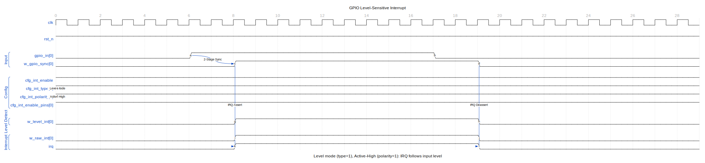
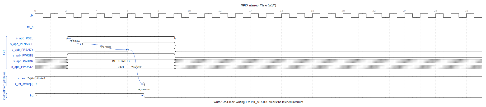

# APB GPIO - Interrupt Configuration

## Interrupt Timing Diagrams

The following diagrams illustrate GPIO interrupt detection and handling.

### Rising Edge Interrupt

Edge-triggered interrupts detect transitions on input pins.



The detection sequence:
1. External input `gpio_in[0]` transitions from 0 to 1
2. 2-stage synchronizer captures the transition (`w_gpio_sync`)
3. Edge detector compares current vs. delayed value (`r_gpio_sync_d`)
4. Rising edge pulse (`w_rising_edge`) generated for one clock
5. Raw interrupt latched in `r_raw_int[0]`
6. Combined `irq` output asserts

### Falling Edge Interrupt

Falling edge detection uses inverted polarity configuration.



With `cfg_int_type[0]=0` (edge mode) and `cfg_int_polarity[0]=0` (falling edge), the detector triggers on 1-to-0 transitions.

### Level-Sensitive Interrupt

Level-sensitive interrupts track the input state directly.



Key differences from edge mode:
- `irq` follows the input level (not latched)
- No edge detection logic involved
- Interrupt re-asserts if source not cleared before ISR exit

### Interrupt Clear (W1C)

Write-1-to-Clear mechanism clears latched interrupts.



The clear sequence:
1. `r_raw_int[0]` is active (edge was detected)
2. Software writes 0x01 to INT_STATUS register
3. W1C logic clears `r_int_status[0]`
4. `irq` deasserts

Note: For level-sensitive interrupts, the external source must be cleared first, otherwise the interrupt immediately re-asserts.

---

## Interrupt Setup

### 1. Configure Interrupt Type

```c
// Edge-triggered (0) or Level-sensitive (1)
// Pins 3:0 edge, pins 7:4 level
GPIO_INT_TYPE = 0x000000F0;
```

### 2. Configure Polarity

For edge mode:
- 0 = falling edge
- 1 = rising edge

For level mode:
- 0 = active low
- 1 = active high

```c
// Rising edge / active high for pins 7:0
GPIO_INT_POLARITY = 0x000000FF;
```

### 3. Configure Both-Edge Mode (Edge Mode Only)

```c
// Enable both edges for pin 0
GPIO_INT_BOTH = 0x00000001;
```

### 4. Enable Interrupts

```c
// Enable interrupts on pins 7:0
GPIO_INT_ENABLE = 0x000000FF;
```

## Interrupt Configuration Table

| INT_TYPE | INT_POLARITY | INT_BOTH | Trigger |
|----------|--------------|----------|---------|
| 0 | 0 | 0 | Falling edge |
| 0 | 1 | 0 | Rising edge |
| 0 | X | 1 | Both edges |
| 1 | 0 | X | Active low |
| 1 | 1 | X | Active high |

## Complete Setup Examples

### Rising Edge Interrupt

```c
// Configure pin 5 for rising edge interrupt
GPIO_INT_TYPE &= ~(1 << 5);      // Edge mode
GPIO_INT_POLARITY |= (1 << 5);   // Rising edge
GPIO_INT_BOTH &= ~(1 << 5);      // Single edge
GPIO_INT_ENABLE |= (1 << 5);     // Enable
```

### Both-Edge Interrupt

```c
// Configure pin 3 for both-edge interrupt
GPIO_INT_TYPE &= ~(1 << 3);      // Edge mode
GPIO_INT_BOTH |= (1 << 3);       // Both edges
GPIO_INT_ENABLE |= (1 << 3);     // Enable
```

### Active-Low Level Interrupt

```c
// Configure pin 7 for active-low level interrupt
GPIO_INT_TYPE |= (1 << 7);       // Level mode
GPIO_INT_POLARITY &= ~(1 << 7);  // Active low
GPIO_INT_ENABLE |= (1 << 7);     // Enable
```

## Interrupt Handling

### Check Interrupt Status

```c
uint32_t status = GPIO_INT_STATUS;
```

### Clear Interrupts (Write-1-to-Clear)

```c
// Clear specific interrupt (pin 5)
GPIO_INT_STATUS = (1 << 5);

// Clear all pending interrupts
GPIO_INT_STATUS = 0xFFFFFFFF;
```

### Complete ISR Example

```c
void gpio_isr(void) {
    // Read status
    uint32_t status = GPIO_INT_STATUS;

    // Handle each pending interrupt
    for (int i = 0; i < 32; i++) {
        if (status & (1 << i)) {
            handle_gpio_event(i);
        }
    }

    // Clear handled interrupts
    GPIO_INT_STATUS = status;
}
```

## Level-Sensitive Considerations

### Avoid Interrupt Storm

For level-sensitive interrupts, the source must be cleared before the status:

```c
void level_sensitive_isr(void) {
    uint32_t status = GPIO_INT_STATUS;

    // For level-sensitive pins, handle source first
    if (status & LEVEL_PIN_MASK) {
        clear_external_source();  // Clear what's driving pin
    }

    // Then clear status
    GPIO_INT_STATUS = status;
}
```

### Masking During Handling

```c
// Temporarily disable while handling
uint32_t saved_enable = GPIO_INT_ENABLE;
GPIO_INT_ENABLE = 0;  // Disable all

// Handle interrupt source
handle_interrupt();

// Re-enable
GPIO_INT_ENABLE = saved_enable;
```

---

**Next:** [03_examples.md](03_examples.md) - Programming Examples
