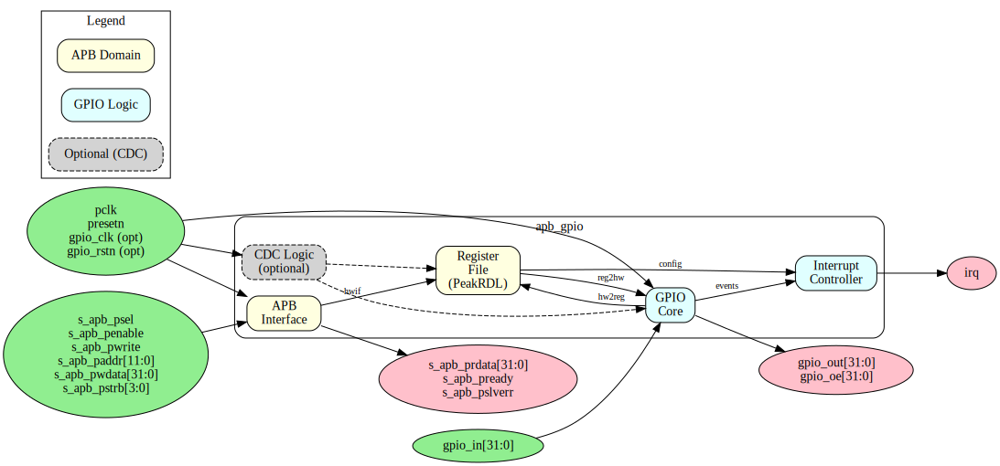

# APB GPIO Specification - Table of Contents

**Component:** APB General Purpose I/O (GPIO) Controller
**Version:** 1.0
**Last Updated:** 2025-12-01
**Status:** Production Ready

---

## Document Organization

This specification is organized into five chapters covering all aspects of the APB GPIO component:

### Chapter 1: Overview
**Location:** `ch01_overview/`

- [01_overview.md](ch01_overview/01_overview.md) - Component overview, features, applications
- [02_architecture.md](ch01_overview/02_architecture.md) - High-level architecture and block hierarchy
- [03_clocks_and_reset.md](ch01_overview/03_clocks_and_reset.md) - Clock domains and reset behavior
- [04_acronyms.md](ch01_overview/04_acronyms.md) - Acronyms and terminology
- [05_references.md](ch01_overview/05_references.md) - External references and standards

### Chapter 2: Blocks
**Location:** `ch02_blocks/`

- [00_overview.md](ch02_blocks/00_overview.md) - Block hierarchy overview
- [01_apb_interface.md](ch02_blocks/01_apb_interface.md) - APB interface block
- [02_register_file.md](ch02_blocks/02_register_file.md) - PeakRDL register file
- [03_gpio_core.md](ch02_blocks/03_gpio_core.md) - Core GPIO logic (I/O, direction)
- [04_interrupt_controller.md](ch02_blocks/04_interrupt_controller.md) - Interrupt logic
- [05_cdc_logic.md](ch02_blocks/05_cdc_logic.md) - Optional CDC logic

### Chapter 3: Interfaces
**Location:** `ch03_interfaces/`

- [00_overview.md](ch03_interfaces/00_overview.md) - Interface summary
- [01_apb_slave.md](ch03_interfaces/01_apb_slave.md) - APB protocol specification
- [02_gpio_pins.md](ch03_interfaces/02_gpio_pins.md) - GPIO pin interface
- [03_interrupt.md](ch03_interfaces/03_interrupt.md) - Interrupt output
- [04_system.md](ch03_interfaces/04_system.md) - Clock and reset interface

### Chapter 4: Programming Model
**Location:** `ch04_programming/`

- [00_overview.md](ch04_programming/00_overview.md) - Programming overview
- [01_basic_operations.md](ch04_programming/01_basic_operations.md) - Basic I/O operations
- [02_interrupt_config.md](ch04_programming/02_interrupt_config.md) - Interrupt configuration
- [03_examples.md](ch04_programming/03_examples.md) - Programming examples
- [04_software_notes.md](ch04_programming/04_software_notes.md) - Software considerations

### Chapter 5: Registers
**Location:** `ch05_registers/`

- [01_register_map.md](ch05_registers/01_register_map.md) - Complete register address map and field descriptions

---

## Block Diagram

---

## Quick Navigation

### For Software Developers
- Start with [Chapter 4: Programming Model](ch04_programming/01_initialization.md)
- Reference [Chapter 5: Registers](ch05_registers/01_register_map.md)

### For Hardware Integrators
- Start with [Chapter 1: Overview](ch01_overview/01_overview.md)
- Reference [Chapter 3: Interfaces](ch03_interfaces/01_top_level.md)

### For Verification Engineers
- Start with [Chapter 2: Blocks](ch02_blocks/00_overview.md)
- Reference [Register Map](ch05_registers/01_register_map.md)

---

## Document Conventions

### Notation
- **bold** - Important terms, signal names
- `code` - Register names, field names, code examples
- *italic* - Emphasis, notes

### Signal Naming
- `pclk` - APB clock
- `gpio_clk` - Optional GPIO clock domain
- `gpio_in[31:0]` - GPIO inputs
- `gpio_out[31:0]` - GPIO outputs
- `gpio_oe[31:0]` - Output enables
- `irq` - Interrupt output

### Register Notation
- `GPIO_CONTROL` - Register name
- `GPIO_DIRECTION[31:0]` - Specific bit field
- `0x004` - Register address (hexadecimal)

---

## Version History

| Version | Date | Author | Changes |
|---------|------|--------|---------|
| 1.0 | 2025-12-01 | RTL Design Sherpa | Initial specification |

---

**Related Documentation:**
- [PRD.md](../../PRD.md) - Product Requirements Document
- [IMPLEMENTATION_STATUS.md](../IMPLEMENTATION_STATUS.md) - Test results and validation status
