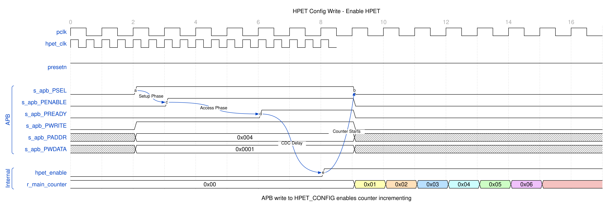
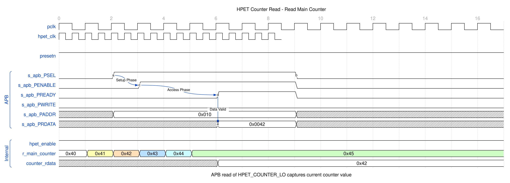
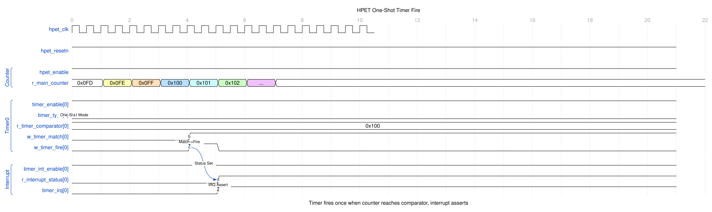
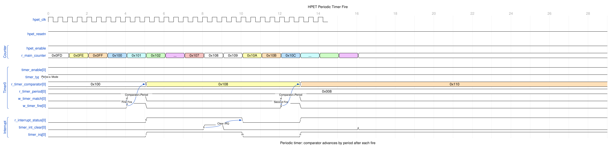
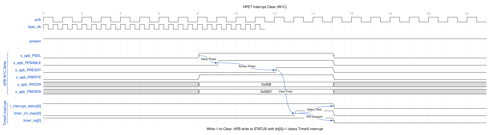
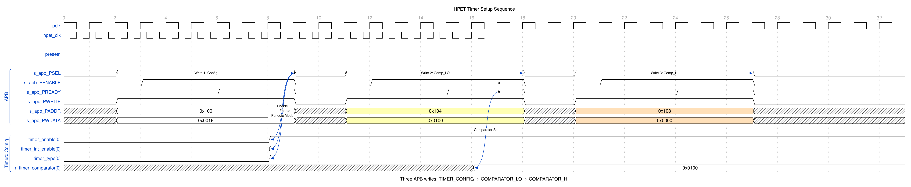
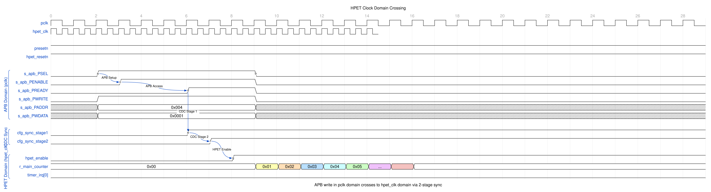

<!-- RTL Design Sherpa Documentation Header -->
<table>
<tr>
<td width="80">
  <a href="https://github.com/sean-galloway/RTLDesignSherpa">
    
  </a>
</td>
<td>
  <strong>RTL Design Sherpa</strong> · <em>Learning Hardware Design Through Practice</em><br>
  <sub>
    <a href="https://github.com/sean-galloway/RTLDesignSherpa">GitHub</a> ·
    <a href="https://github.com/sean-galloway/RTLDesignSherpa/blob/main/docs/DOCUMENTATION_INDEX.md">Documentation Index</a> ·
    <a href="https://github.com/sean-galloway/RTLDesignSherpa/blob/main/LICENSE">MIT License</a>
  </sub>
</td>
</tr>
</table>

---

<!-- End Header -->

# APB HPET Blocks

## Overview

The APB HPET component consists of four primary SystemVerilog modules organized in a hierarchical structure. This chapter walks through what each one owns and how they talk to each other.

### Block Hierarchy

```
apb4_hpet (Top Level)
+-- APB Slave Interface
|   +-- apb4_slave.sv (CDC_ENABLE=0) OR
|   +-- apb4_slave_cdc.sv (CDC_ENABLE=1)
|
+-- hpet_config_regs (Register Wrapper)
|   +-- hpet_regs (PeakRDL Generated)
|   |   +-- Register File Logic
|   |
|   +-- Mapping Logic
|       +-- Per-Timer Data Buses
|       +-- Write-Strobe Alignment (swmod rising edge, per half)
|       +-- HPET_STATUS Mirror and W1C Decode
|
+-- hpet_core (Timer Logic)
    +-- 64-bit Free-Running Counter
    +-- Per-Timer Comparators [NUM_TIMERS]
    +-- Armed Latch and Fire Pulse [NUM_TIMERS]
    +-- Next-Epoch Hold Bit [NUM_TIMERS]
    +-- Interrupt Generation [NUM_TIMERS]
```

---

## Functional Description

### Module Responsibilities

#### 1. apb4_hpet (Top Level Integration)
**File:** `rtl/hpet/apb4_hpet.sv`
**Purpose:** System integration and CDC selection

**Responsibilities:**
- Instantiates APB slave with or without CDC based on `CDC_ENABLE` parameter
- Routes signals between APB interface and configuration registers
- Exposes timer interrupts to system
- Provides unified external interface

**Key Features:**
- Conditional CDC instantiation (generate block)
- Clock domain management
- Parameter propagation to child modules
- Single-point configuration

#### 2. hpet_config_regs (Register Wrapper)
**File:** `rtl/hpet/hpet_config_regs.sv`
**Purpose:** Bridge between PeakRDL registers and HPET core

**Responsibilities:**
- Instantiates PeakRDL-generated register file
- Maps PeakRDL hardware interface to HPET core signals
- Implements per-timer dedicated data buses (corruption fix)
- Turns the register block's `swmod` levels into aligned one-cycle write
  strobes, one per 32-bit half
- Combines the LO/HI fields into 64-bit data buses
- Mirrors the core's interrupt status into HPET_STATUS and decodes the
  W1C write into a per-bit clear
- Drives HPET_ID's vendor, revision and timer-count fields from the
  parameters

**Key Features:**
- Per-timer data buses prevent configuration corruption
- Strobe-driven loads: a write is the event, not a change in the stored
  value, so rewriting the same comparator still reloads it (whether it
  also re-arms the timer is the core's call: only while the timer is
  stopped)
- Per-bit W1C clear mask from the write data and byte enables
- One clear pulse per write, so a same-cycle fire is never undone

#### 3. hpet_regs (PeakRDL Generated)
**File:** `rtl/hpet/hpet_regs.sv`
**Purpose:** Auto-generated register file from SystemRDL specification

**Responsibilities:**
- Implements all HPET registers from RDL specification
- Provides CPU interface (passthrough protocol)
- Generates hardware interface structs
- Handles field access types (RO, RW, W1C)

**Key Features:**
- Single source of truth (hpet_regs.rdl)
- Regeneratable from specification
- Comprehensive field control
- Standard passthrough CPU interface

#### 4. hpet_core (Timer Logic)
**File:** `rtl/hpet/hpet_core.sv`
**Purpose:** Core timer functionality and comparison logic

**Responsibilities:**
- Implements 64-bit free-running counter
- Manages per-timer comparators and periods
- Detects counter match conditions
- Generates timer fire events and interrupts
- Handles one-shot vs periodic mode differences

**Key Features:**
- Fully synchronous timer logic
- Per-timer FSM (conceptual)
- Automatic period reload (periodic mode)
- Armed-latch fire detection: one fire per arm, no re-fire on enable,
  comparator writes re-arm only a stopped timer
- Periodic catch-up: missed periods are skipped, never burst (period 1
  steps to counter + 1)
- Next-epoch hold: an advance that carries out of the compare width is
  held off until the counter wraps at that width
- Configurable timer count (2, 3, or 8 timers)

### Data Flow Overview

#### APB Write Transaction Flow

```
APB Master
    ↓ PSEL, PENABLE, PADDR, PWDATA
APB Slave (or APB Slave CDC)
    ↓ cmd_valid, cmd_pwrite, cmd_paddr, cmd_pwdata
peakrdl_to_cmdrsp Adapter
    ↓ regblk_req, regblk_req_is_wr, regblk_addr, regblk_wr_data
hpet_regs (PeakRDL)
    ↓ hwif_out (register values)
hpet_config_regs (Mapping)
    ↓ timer_enable, timer_comp_write_lo/hi, timer_comp_wdata[i]
hpet_core (Timer Logic)
    -> Counter/Comparator update
```

#### APB Read Transaction Flow

```
APB Master
    ↓ PSEL, PENABLE, PADDR, PWRITE=0
APB Slave (or APB Slave CDC)
    ↓ cmd_valid, cmd_pwrite=0, cmd_paddr
peakrdl_to_cmdrsp Adapter
    ↓ regblk_req, regblk_req_is_wr=0, regblk_addr
hpet_regs (PeakRDL)
    ← hwif_in (live counter, status)
    ↓ regblk_rd_data
peakrdl_to_cmdrsp Adapter
    ↓ rsp_prdata
APB Slave (or APB Slave CDC)
    ↓ PRDATA
APB Master
```

#### Timer Fire Flow

```
hpet_core
    ← Counter increments
    -> Raw match (counter >= comparator) while the timer is armed
    -> timer_int_status[i] asserts (sticky, owned here); armed latch clears
    -> timer_irq[i] asserts one clock later (if int_enable was set at fire)
        ↓
hpet_config_regs
    -> hwif_in.HPET_STATUS.timer_int_status.next (live level, every cycle)
        ↓
hpet_regs (PeakRDL)
    -> HPET_STATUS reads the mirrored level
        ↓
Software reads HPET_STATUS
Software writes 1 to bit i
    ↓
hpet_config_regs
    -> timer_int_clear[i] pulses for ONE cycle
       (mask = write data & byte enables: bits written 0 are untouched,
       a write of 0x0 clears nothing)
        ↓
hpet_core
    -> timer_int_status[i] clears (a fire of the same bit in that cycle wins)
    -> timer_irq[i] deasserts
```

### Clock Domain Organization

#### Synchronous Mode (CDC_ENABLE=0)

```
APB Clock Domain (pclk)
+-- apb4_slave
+-- hpet_config_regs
+-- hpet_regs
+-- hpet_core

All modules use pclk
No clock domain crossing required
```

#### Asynchronous Mode (CDC_ENABLE=1)

```
APB Clock Domain (pclk)
+-- apb4_slave_cdc (pclk side)
+-- [CDC boundary]

HPET Clock Domain (hpet_clk)
+-- apb4_slave_cdc (hpet_clk side)
+-- hpet_config_regs
+-- hpet_regs
+-- hpet_core

CDC synchronization between pclk and hpet_clk
```

### Module Communication

#### hpet_config_regs -> hpet_core Interface

**Control Signals (hpet_config_regs -> hpet_core):**
```systemverilog
output logic                    hpet_enable;            // Global enable
output logic                    counter_write_lo;       // Counter[31:0] write strobe
output logic                    counter_write_hi;       // Counter[63:32] write strobe
output logic [63:0]             counter_wdata;          // Counter write data
output logic [NUM_TIMERS-1:0]   timer_enable;           // Per-timer enable
output logic [NUM_TIMERS-1:0]   timer_int_enable;       // Per-timer interrupt enable
output logic [NUM_TIMERS-1:0]   timer_type;             // Per-timer mode (0=one-shot, 1=periodic)
output logic [NUM_TIMERS-1:0]   timer_size;             // Per-timer size (0=32-bit, 1=64-bit)
output logic [NUM_TIMERS-1:0]   timer_comp_write_lo;    // Per-timer comparator[31:0] write strobe
output logic [NUM_TIMERS-1:0]   timer_comp_write_hi;    // Per-timer comparator[63:32] write strobe
output logic [63:0]             timer_comp_wdata[NUM_TIMERS];  // Per-timer data buses
```

**Status Signals (hpet_core -> hpet_config_regs):**
```systemverilog
input  logic [63:0]             counter_rdata;          // Live counter value
input  logic [NUM_TIMERS-1:0]   timer_int_status;       // Per-timer fire status
```

**Interrupt Clearing (hpet_config_regs -> hpet_core):**
```systemverilog
output logic [NUM_TIMERS-1:0]   timer_int_clear;        // Per-bit clear of the sticky status
```

#### hpet_config_regs -> hpet_regs Interface

Uses PeakRDL-generated structs:
```systemverilog
// From config regs to PeakRDL
input  hpet_regs_pkg::hpet_regs__in_t  hwif_in;

// From PeakRDL to config regs
output hpet_regs_pkg::hpet_regs__out_t hwif_out;
```

---

## Waveforms

### Timer Operation Waveforms

#### Configuration Write

When software writes to HPET_CONFIG to enable the timer, the enable signal propagates through the register file to the core.

### Waveform 2.1: HPET Config Write



The APB write to address 0x004 (HPET_CONFIG) sets `hpet_enable`, which starts the main counter incrementing.

#### Counter Read

Reading the main counter returns the current 64-bit counter value.

### Waveform 2.2: HPET Counter Read



The counter value is captured during the APB read transaction and returned on PRDATA.

#### One-Shot Timer Fire

In one-shot mode, the timer fires once when the counter reaches the comparator value.

### Waveform 2.3: HPET One-Shot Timer Fire



When `r_main_counter` equals `r_timer_comparator[0]`, the match signal asserts, triggering `w_timer_fire[0]`. The interrupt output `timer_irq[0]` asserts and remains active until software clears it.

#### Periodic Timer Fire

In periodic mode, the timer fires repeatedly, automatically adding the period to the comparator.

### Waveform 2.4: HPET Periodic Timer Fire



After each fire event, the comparator is updated: `comparator += period`. This allows continuous periodic interrupts without software intervention.

#### Interrupt Clear (W1C)

Software clears timer interrupts by writing 1 to the corresponding bit in HPET_STATUS.

### Waveform 2.5: HPET Interrupt Clear



The W1C (Write-1-to-Clear) write clears only the bits written with 1: the
wrapper decodes the write data and byte enables into a per-bit mask,
pulses `timer_int_clear` for one cycle, and hpet_core drops just those
bits. Writing 0 -- to a bit or to the whole register -- changes nothing.

#### Timer Setup Sequence

Configuring a timer requires multiple APB writes: config register, then comparator low/high words.

### Waveform 2.6: HPET Timer Setup



The sequence shows three consecutive writes:
1. TIMER_CONFIG (0x100): Enable, interrupt enable, periodic mode
2. TIMER_COMPARATOR_LO (0x104): Lower 32 bits of comparator
3. TIMER_COMPARATOR_HI (0x108): Upper 32 bits of comparator

Each comparator half loads hpet_core on its own write strobe, so between
writes 2 and 3 the core holds {old HI, new LO}. A write re-arms the timer
only while it is stopped, so that torn value can never fire on a running
timer -- but a running timer then re-arms only when the completed value is
above the counter. Write the comparator before enabling the timer, or
disable it around the pair, whenever the new value may already be behind
the counter; a write with the timer stopped re-arms it to any value.

#### Clock Domain Crossing (CDC Mode)

When CDC_ENABLE=1, APB transactions cross from pclk to hpet_clk through a
pair of async FIFOs inside apb4_slave_cdc (Gray/Johnson pointers per
USE_JOHNSON) -- not per-signal synchronizers.

### Waveform 2.7: HPET CDC Crossing



The diagram shows the latency introduced by CDC synchronization. Configuration changes in the APB domain take 2-3 hpet_clk cycles to affect the timer core

---

## Design Notes

### Resource Allocation

**Per-Configuration Estimates (Post-Synthesis):**

| Component | NUM_TIMERS=2 | NUM_TIMERS=3 | NUM_TIMERS=8 |
|-----------|--------------|--------------|--------------|
| **hpet_core** | | | |
| - Main counter | 64 FF, 70 LUTs | (same) | (same) |
| - Per-timer logic | 256 FF, 170 LUTs | 384 FF, 255 LUTs | 1024 FF, 680 LUTs |
| - Subtotal | 320 FF, 240 LUTs | 448 FF, 325 LUTs | 1088 FF, 750 LUTs |
| | | | |
| **hpet_config_regs** | | | |
| - Mapping logic | ~50 FF, ~100 LUTs | ~75 FF, ~150 LUTs | ~150 FF, ~300 LUTs |
| - Edge detect | ~10 FF, ~20 LUTs | ~15 FF, ~30 LUTs | ~30 FF, ~60 LUTs |
| - Subtotal | 60 FF, 120 LUTs | 90 FF, 180 LUTs | 180 FF, 360 LUTs |
| | | | |
| **hpet_regs** | | | |
| - Register storage | ~128 FF, ~100 LUTs | ~160 FF, ~125 LUTs | ~256 FF, ~200 LUTs |
| | | | |
| **apb4_slave** (no CDC) | | | |
| - APB protocol | ~20 FF, ~50 LUTs | (same) | (same) |
| | | | |
| **apb4_slave_cdc** (with CDC) | | | |
| - CDC logic | ~100 FF, ~150 LUTs | (same) | (same) |
| | | | |
| **Total (no CDC)** | ~528 FF, ~510 LUTs | ~718 FF, ~680 LUTs | ~1544 FF, ~1360 LUTs |
| **Total (with CDC)** | ~608 FF, ~610 LUTs | ~798 FF, ~780 LUTs | ~1624 FF, ~1460 LUTs |

**Scaling:** Resource usage is primarily driven by `NUM_TIMERS` parameter. Each additional timer adds ~128 FF and ~85 LUTs.

---

## Testing

### Integration Checklist

When integrating APB HPET:

**1. Parameter Selection:**
- [ ] `NUM_TIMERS`: 2, 3, or 8 timers
- [ ] `VENDOR_ID`: reported in HPET_ID[31:24]; an 8-bit field, so a wider value shows only its low byte
- [ ] `REVISION_ID`: reported in HPET_ID[23:16]; likewise 8 bits
- [ ] `CDC_ENABLE`: 0 for synchronous, 1 for asynchronous clocks

**2. Clock Configuration:**
- [ ] Connect `pclk` (APB clock domain)
- [ ] Connect `hpet_clk` (timer clock domain)
- [ ] If `CDC_ENABLE=0`: Ensure `pclk = hpet_clk`
- [ ] If `CDC_ENABLE=1`: Clocks can be asynchronous

**3. Reset Coordination:**
- [ ] Assert `presetn` (APB reset, active-low)
- [ ] Assert `hpet_resetn` (HPET reset, active-low)
- [ ] If `CDC_ENABLE=1`: Ensure both resets overlap at power-on
- [ ] Hold resets for >=10 clock cycles

**4. APB Interface:**
- [ ] Connect all APB signals (PSEL, PENABLE, PADDR, etc.)
- [ ] PADDR width = 12 bits (supports up to 4KB address space)
- [ ] PWDATA/PRDATA width = 32 bits (fixed)

**5. Interrupt Outputs:**
- [ ] Connect `timer_irq[NUM_TIMERS-1:0]` to interrupt controller
- [ ] Each timer has independent interrupt output
- [ ] Interrupts are active-high, level-sensitive

**6. Verification:**
- [ ] Test register access via APB
- [ ] Verify timer operation (one-shot and periodic modes)
- [ ] Test interrupt generation and clearing
- [ ] Validate CDC if enabled

---

## Navigation

**Next:** [Chapter 2.2 - hpet_config_regs](02_hpet_config_regs.md)
