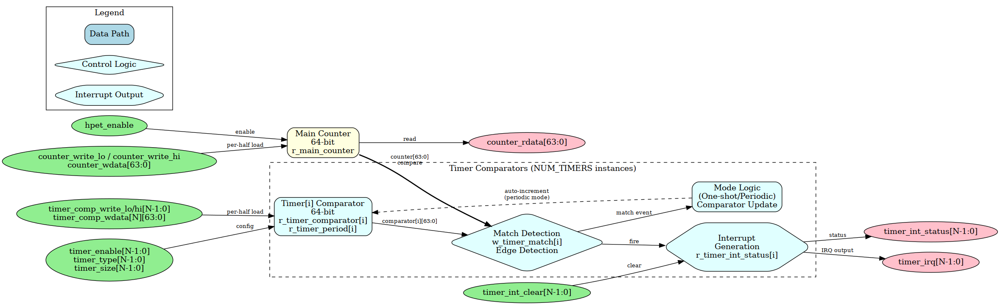
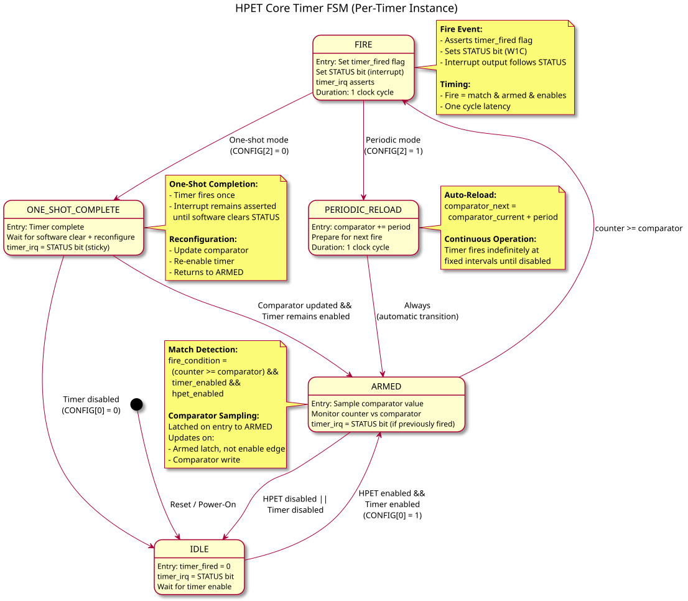

<!-- RTL Design Sherpa Documentation Header -->
<table>
<tr>
<td width="80">
  <a href="https://github.com/sean-galloway/RTLDesignSherpa">
    
  </a>
</td>
<td>
  <strong>RTL Design Sherpa</strong> · <em>Learning Hardware Design Through Practice</em><br>
  <sub>
    <a href="https://github.com/sean-galloway/RTLDesignSherpa">GitHub</a> ·
    <a href="https://github.com/sean-galloway/RTLDesignSherpa/blob/main/docs/DOCUMENTATION_INDEX.md">Documentation Index</a> ·
    <a href="https://github.com/sean-galloway/RTLDesignSherpa/blob/main/LICENSE">MIT License</a>
  </sub>
</td>
</tr>
</table>

---

<!-- End Header -->

# hpet_core

## Overview

The HPET core (`hpet_core.sv`) is where the timing actually happens: a 64-bit free-running counter, per-timer comparators, and interrupt generation. This module operates entirely in the `hpet_clk` domain and contains all timing-critical logic.

### Figure 2.8: HPET Core Block Diagram



HPET Core architecture showing main counter, timer comparators, match detection, and interrupt generation.

### Key Features

- **64-bit Free-Running Counter**: Increments every HPET clock cycle, provides timestamp base
- **Configurable Timer Array**: 2, 3, or 8 independent timers (compile-time parameter)
- **64-bit Comparators**: Per-timer comparison values with full counter range
- **Dual Operating Modes**: One-shot and periodic modes per timer
- **Automatic Period Reload**: Periodic mode auto-increments comparator after each fire
- **Individual Interrupts**: Separate fire flag and interrupt output per timer
- **Counter Read/Write Access**: Software can read and write the counter via the config registers, one 32-bit half per write

---

## Parameters

| Parameter | Type | Default | Range | Description |
|-----------|------|---------|-------|-------------|
| `NUM_TIMERS` | int | 3 | 2, 3, 8 | Number of independent timers in array (the `apb4_hpet` top-level default is 2) |

---

## Ports

### Clock and Reset

| Signal Name | Type | Width | Direction | Description |
|-------------|------|-------|-----------|-------------|
| **clk** | logic | 1 | Input | Core clock (hpet_clk or pclk, selected by CDC_ENABLE at the top level) |
| **rst_n** | logic | 1 | Input | Active-low asynchronous reset |

### Configuration Interface (from hpet_config_regs)

| Signal Name | Type | Width | Direction | Description |
|-------------|------|-------|-----------|-------------|
| **hpet_enable** | logic | 1 | Input | Global HPET enable (from HPET_CONFIG[0]) |
| **counter_write_lo** | logic | 1 | Input | One-cycle strobe: load counter[31:0] from counter_wdata[31:0] |
| **counter_write_hi** | logic | 1 | Input | One-cycle strobe: load counter[63:32] from counter_wdata[63:32] |
| **counter_wdata** | logic | 64 | Input | Counter write data (from HPET_COUNTER_LO/HI; only the strobed half is used) |
| **timer_enable[NUM_TIMERS-1:0]** | logic | NUM_TIMERS | Input | Per-timer enable (from TIMER_CONFIG[2]) |
| **timer_int_enable[NUM_TIMERS-1:0]** | logic | NUM_TIMERS | Input | Per-timer interrupt enable (from TIMER_CONFIG[3]) |
| **timer_type[NUM_TIMERS-1:0]** | logic | NUM_TIMERS | Input | Per-timer mode: 0=One-shot, 1=Periodic (from TIMER_CONFIG[4]) |
| **timer_size[NUM_TIMERS-1:0]** | logic | NUM_TIMERS | Input | Per-timer compare width: 0=32-bit, 1=64-bit (from TIMER_CONFIG[5]); a change clears the timer's next-epoch hold bit -- change it only on a stopped timer, then rewrite the comparator |
| **timer_comp_write_lo[NUM_TIMERS-1:0]** | logic | NUM_TIMERS | Input | Per-timer strobe: load comparator[31:0]; re-arms only while the timer is stopped |
| **timer_comp_write_hi[NUM_TIMERS-1:0]** | logic | NUM_TIMERS | Input | Per-timer strobe: load comparator[63:32]; re-arms only while the timer is stopped |
| **timer_comp_wdata[NUM_TIMERS]** | logic [63:0] | NUM_TIMERS x 64 | Input | Per-timer comparator write data |

### Status Interface (to hpet_config_regs)

| Signal Name | Type | Width | Direction | Description |
|-------------|------|-------|-----------|-------------|
| **counter_rdata** | logic | 64 | Output | Current main counter value (to HPET_COUNTER_LO/HI) |
| **timer_int_status[NUM_TIMERS-1:0]** | logic | NUM_TIMERS | Output | Per-timer sticky interrupt status, owned here (mirrored into HPET_STATUS) |
| **timer_int_clear[NUM_TIMERS-1:0]** | logic | NUM_TIMERS | Input | Per-bit one-cycle clear pulses from the register wrapper (W1C) |

### Interrupt Interface

| Signal Name | Type | Width | Direction | Description |
|-------------|------|-------|-----------|-------------|
| **timer_irq[NUM_TIMERS-1:0]** | logic | NUM_TIMERS | Output | Per-timer interrupt outputs (active-high) |

---

## Functional Description

### Per-Timer State Machine

Each timer instance implements an identical FSM controlling its operation:

### Figure 2.9: Timer FSM



#### FSM States

| State | Encoding | Description |
|-------|----------|-------------|
| **IDLE** | Default | Timer disabled, waiting for enable signal |
| **ARMED** | Active | Timer enabled, monitoring counter vs comparator |
| **FIRE** | Transient | Timer match detected, asserting interrupt (1 cycle) |
| **PERIODIC_RELOAD** | Transient | Periodic mode: auto-increment comparator (1 cycle; one boundary per cycle while catching up, counter + 1 at period 1) |
| **ONE_SHOT_COMPLETE** | Sticky | One-shot mode: fired, armed latch clear, waiting for a comparator write with the timer stopped or for the match to fall |

**Note:** FSM is **conceptual** - the implementation is a raw comparator plus two state bits per timer, the armed latch (`r_timer_armed[i]`) and the next-epoch hold bit (`r_comp_next_epoch[i]`), rather than an explicit state register. A timer whose advance carried out of the compare width is epoch-held: it looks ARMED-but-not-matching (the latch is set, the match is forced off) until the counter wraps at that width, and none of the transitions below happen for it in the meantime.

#### State Transitions

**IDLE -> ARMED:**
- Condition: `hpet_enable && timer_enable[i]`
- Action: Latch current comparator value
- Duration: Immediate (next clock cycle)

**ARMED -> FIRE:**
- Condition: `counter_value >= timer_comparator[i]` with the armed latch set
- Action: Assert `timer_int_status[i]` (sticky), clear the armed latch
- Duration: 1 clock cycle (the fire is a one-cycle pulse)

**FIRE -> PERIODIC_RELOAD:**
- Condition: `timer_type[i] == 1` (periodic mode)
- Action: `timer_comparator[i] <= timer_comparator[i] + timer_period[i]`
- Duration: 1 clock cycle

**FIRE -> ONE_SHOT_COMPLETE:**
- Condition: `timer_type[i] == 0` (one-shot mode)
- Action: Hold `timer_int_status[i]` until software clears
- Duration: Until STATUS cleared or timer disabled

**PERIODIC_RELOAD -> ARMED:**
- Condition: Always (automatic)
- Action: Resume monitoring with new comparator value
- Duration: Immediate

**ONE_SHOT_COMPLETE -> ARMED:**
- Condition: a comparator write, LO or HI half (`timer_comp_write_lo/hi[i]`),
  while the timer is NOT running (`timer_enable[i] = 0` or
  `hpet_enable = 0`), even with the value it already holds; or the raw
  match falling (a comparator written above the counter, or the counter
  written back below the comparator)
- Action: Set the armed latch; resume monitoring
- Duration: Immediate on the write strobe or on the match falling
- A comparator written with the timer stopped does NOT have to exceed the
  counter. A value at or below the counter fires on the first cycle both
  enables allow -- that is the explicit re-arm, and it is how software
  fires a timer "now".
- A comparator write on a RUNNING timer loads the half but does not
  re-arm. Written above the counter, the match falls and the timer
  re-arms naturally, firing at the new value. Anything else is outside
  the contract: a torn 64-bit value above the counter re-arms through
  that same path and fires at the final value once it is written, and a
  same-value rewrite on a running periodic timer drags the comparator
  back from its advanced position and can add one off-lattice fire. To
  reprogram a running timer, disable it first.

**ARMED/ONE_SHOT_COMPLETE -> IDLE:**
- Condition: `!hpet_enable || !timer_enable[i]`
- Action: Stop firing. A pending interrupt status/output is NOT cleared
  by disabling -- it holds until software W1C or reset.
- Duration: Immediate
- The enables do not touch the armed latch, so a completed one-shot stays
  complete across a disable/enable cycle: re-enabling with an expired
  comparator does not re-fire it.

### Main Counter Logic

#### Counter Increment

```systemverilog
// 64-bit free-running counter
logic [63:0] r_main_counter;

always_ff @(posedge clk or negedge rst_n) begin
    if (!rst_n) begin
        r_main_counter <= 64'h0;
    end else if (counter_write_lo || counter_write_hi) begin
        // Software write: each half loads on its own strobe, the other
        // half holds, and the write cycle does not increment
        if (counter_write_lo) r_main_counter[31:0]  <= counter_wdata[31:0];
        if (counter_write_hi) r_main_counter[63:32] <= counter_wdata[63:32];
    end else if (hpet_enable) begin
        // Continuous increment when HPET enabled
        r_main_counter <= r_main_counter + 64'd1;
    end
    // else: Hold value when HPET disabled
end

// Output current counter value
assign counter_rdata = r_main_counter;
```

**Key Behavior:**
- **Reset**: Counter initializes to 0
- **Software Write**: each HPET_COUNTER_LO/HI write loads its own half on the write itself; the halves are independent, as on a real HPET, so a 64-bit load is two writes and the intermediate state is visible -- write with the counter halted (`hpet_enable = 0`)
- **Increment**: Counter increments every clock when `hpet_enable = 1`
- **Overflow**: Counter wraps from 64'hFFFF_FFFF_FFFF_FFFF to 64'h0 naturally

#### Counter Timing

```
Clock:      --+ +-+ +-+ +-+ +-+ +-
hpet_clk      +-+ +-+ +-+ +-+ +-

Enable:     --------+
hpet_enable         +-------------

Counter:    [N] [N] [N+1][N+2][N+3]
r_main_counter

Latency: 1 cycle from enable to first increment
```

### Timer Comparator Logic

#### Comparator Storage (Per-Timer)

```systemverilog
// Per-timer comparator and period storage
logic [63:0] r_timer_comparator [NUM_TIMERS-1:0];
logic [63:0] r_timer_period [NUM_TIMERS-1:0];

for (genvar i = 0; i < NUM_TIMERS; i++) begin : gen_timer_advance
    // One advanced value, shared by the fire advance, the catch-up
    // advance, the ahead-of-counter test and the epoch carry. A period-1
    // catch-up step jumps to counter + 1 (every integer is on the
    // period-1 lattice); everything else is comparator + period.
    assign w_adv_base[i]   = (w_timer_catchup[i] && w_timer_period_one[i]) ?
                             r_main_counter : r_timer_comparator[i];
    assign w_adv_addend[i] = (w_timer_catchup[i] && w_timer_period_one[i]) ?
                             64'd1 : r_timer_period[i];
    assign w_adv_sum_64[i] = {1'b0, w_adv_base[i]} + {1'b0, w_adv_addend[i]};
    assign w_adv_sum_32[i] = {1'b0, w_adv_base[i][31:0]} + {1'b0, w_adv_addend[i][31:0]};

    // {carry, sum} at the compare width. The carry is what the epoch bit
    // records; in 32-bit mode the advance never touches comparator[63:32].
    always_comb begin
        if (timer_size[i]) begin
            w_comp_advance[i]   = w_adv_sum_64[i][63:0];
            w_comp_adv_carry[i] = w_adv_sum_64[i][64];
            w_comp_adv_ahead[i] = w_adv_sum_64[i][64] ||
                                  (w_adv_sum_64[i][63:0] >= r_main_counter);
        end else begin
            w_comp_advance[i]   = {r_timer_comparator[i][63:32], w_adv_sum_32[i][31:0]};
            w_comp_adv_carry[i] = w_adv_sum_32[i][32];
            w_comp_adv_ahead[i] = w_adv_sum_32[i][32] ||
                                  (w_adv_sum_32[i][31:0] >= r_main_counter[31:0]);
        end
    end
end

// An advance happens on a periodic fire or a catch-up step, never in a
// cycle software is writing the comparator (software wins, below)
assign w_comp_advance_en = ~w_timer_comp_write &
                           ((w_timer_fire & timer_type) | w_timer_catchup);

for (genvar i = 0; i < NUM_TIMERS; i++) begin : gen_timer_comparators
    always_ff @(posedge clk or negedge rst_n) begin
        if (!rst_n) begin
            r_timer_comparator[i] <= 64'h0;
            r_timer_period[i] <= 64'h0;
        end else if (timer_comp_write_lo[i] || timer_comp_write_hi[i]) begin
            // Software write: one 32-bit half per strobe. Period mirrors
            // the written value so periodic mode advances by the
            // programmed interval while the comparator walks ahead of it.
            // SOFTWARE WINS: this branch outranks both advances below, so
            // a write landing in a fire (or catch-up) cycle loads the
            // software value and the advance is skipped that cycle.
            if (timer_comp_write_lo[i]) begin
                r_timer_comparator[i][31:0]  <= timer_comp_wdata[i][31:0];
                r_timer_period[i][31:0]      <= timer_comp_wdata[i][31:0];
            end
            if (timer_comp_write_hi[i]) begin
                r_timer_comparator[i][63:32] <= timer_comp_wdata[i][63:32];
                r_timer_period[i][63:32]     <= timer_comp_wdata[i][63:32];
            end
        end else if (w_comp_advance_en[i]) begin
            // Periodic advance: one period per fire, or one boundary per
            // CYCLE while catching up (see Fire Detection). Width-masked;
            // the carry goes to the epoch bit, not the comparator
            r_timer_comparator[i] <= w_comp_advance[i];
        end
        // else: Hold value
    end
end
```

**Key Behavior:**
- **Reset**: Comparator and period clear to 0
- **Initial Write**: Both comparator and period latched from the same write, one half per strobe
- **Rewrite**: a write is the event, not a change of value -- writing the
  comparator with the value it already holds reloads the internal
  comparator (discarding any periodic advance). It re-arms the timer only
  while the timer is stopped; on a running timer the reload lands and the
  timer re-arms when the match next falls
- **Periodic Mode**: Comparator auto-increments by period value on each fire
- **Periodic catch-up**: while a periodic timer is running, un-armed and
  its comparator is still at or below the counter, the comparator keeps
  advancing by one period per cycle WITHOUT firing until it is at or
  ahead of the counter, then the timer re-arms (see Fire Detection)
- **Period 1**: a catch-up step sets the comparator to counter + 1, not
  comparator + 1 -- adding 1 to both sides can never close a gap, and
  every integer is on the period-1 lattice
- **Catch-up cost**: one comparator advance per cycle, so a catch-up
  closes its deficit at period - 1 counts per cycle (period 1 is the
  special lattice jump that closes in one) and a large deficit costs a
  proportional catch-up -- a period-2 timer left 2^52 counts behind by a
  counter write rewrites its comparator every cycle for ~2^52 cycles
  with no interrupt. This is the contract behind halting the counter
  before writing it, and behind programming a periodic comparator near
  or ahead of the counter
- **Advance overflow**: an advance that carries out of the compare width
  keeps the wrapped low bits and sets the next-epoch hold bit; in 32-bit
  mode bits [63:32] are never disturbed
- **Same-cycle write and fire**: exactly one fire; the software value
  wins and the periodic advance is skipped that cycle
- **One-Shot Mode**: Comparator remains constant after initial write

#### Match Detection

**64-bit Comparator Match Waveform:**

### Waveform 2.10: Comparator Match Behavior


*Use [WaveDrom Editor](https://wavedrom.com/editor.html) to view/edit, or generate SVG with `wavedrom-cli`*

```systemverilog
// Per-timer match detection (combinational, RAW -- no enable terms)
logic [NUM_TIMERS-1:0] w_timer_match_raw;
logic [NUM_TIMERS-1:0] w_timer_match;

for (genvar i = 0; i < NUM_TIMERS; i++) begin : gen_timer_terms
    // timer_size (TIMER_CONFIG[5]) selects 64-bit or 32-bit compare
    assign w_timer_match_raw[i] = timer_size[i]
                                  ? (r_main_counter >= r_timer_comparator[i])
                                  : (r_main_counter[31:0] >= r_timer_comparator[i][31:0]);
end

// Held off while the comparator sits in the counter's NEXT epoch. Every
// consumer (fire, catch-up, natural re-arm) reads this gated match.
assign w_timer_match = w_timer_match_raw & ~r_comp_next_epoch;
```

**Match Conditions:**
- Counter value >= comparator value (full 64 bits when timer_size=1,
  low 32 bits only when timer_size=0)
- And the next-epoch hold bit is clear. When an advance has carried out
  of the compare width the comparator belongs to the counter's next
  epoch, and the raw comparison says nothing useful until the counter
  wraps at that width; the bit forces the match off until then.
- That is all. The enables (`timer_enable[i]`, `hpet_enable`) are
  deliberately NOT in the match: they gate the fire pulse instead (next
  section), so that turning them on cannot manufacture a match edge.

### Timer Fire Logic

#### Fire Detection (Armed Latch)

A per-timer armed latch decides whether the raw match may still produce a
fire. It holds "this timer still owes one interrupt for this comparator"
as state, which is what a plain rising-edge detect cannot do: an edge on
(match && enables) re-fires every expired one-shot the moment an enable
goes 0->1, while an edge on the raw match is consumed at the comparator
write, before the enables are on, and then never fires at all.

```systemverilog
// Per-timer armed latch and next-epoch hold bit. Reset ARMED: out of
// reset counter == comparator == 0 is already a match, and the enables
// hold the fire off until then. Reset epoch clear.
logic [NUM_TIMERS-1:0] r_timer_armed;
logic [NUM_TIMERS-1:0] r_comp_next_epoch;
logic [NUM_TIMERS-1:0] w_timer_comp_write;   // LO or HI half of timer i written
logic [NUM_TIMERS-1:0] w_timer_running;      // timer_enable[i] & hpet_enable
logic [NUM_TIMERS-1:0] w_comp_write_rearm;   // comparator write on a STOPPED timer
logic [NUM_TIMERS-1:0] w_timer_catchup;      // advance a boundary, do NOT fire
logic [NUM_TIMERS-1:0] w_catchup_rearm;      // catch-up landed at or ahead of the counter

assign w_timer_comp_write = timer_comp_write_lo | timer_comp_write_hi;
assign w_timer_running    = timer_enable & {NUM_TIMERS{hpet_enable}};
assign w_comp_write_rearm = w_timer_comp_write & ~w_timer_running;

// Periodic catch-up: periodic, NOT armed, comparator still at or behind
// the counter (epoch-gated match), no software write this cycle, a
// period that can actually move the compare (period 0 behaves as
// one-shot), and running.
assign w_timer_catchup = timer_type & ~r_timer_armed & w_timer_match &
                         ~w_timer_comp_write & w_timer_period_nz &
                         w_timer_running;

// Finished the cycle the advance lands AT OR AHEAD of the counter
// (w_comp_adv_ahead[i] = carry || advance >= counter, at the compare
// width; see gen_timer_advance). >= not >: the comparator takes the
// advance while the counter takes counter+1, so a tie is a boundary one
// count behind next cycle, and at period 1 the advance can only tie.
assign w_catchup_rearm = w_timer_catchup & w_comp_adv_ahead;

// Next-epoch hold: set when an advance carries out of the compare width;
// cleared, with priority, by the counter wrapping at that width (E1), a
// comparator write (E2), a counter write (E3) or a timer_size change (E4).
// E2 and E3 are taken at the compare width, in the gen_timer_terms mux
// alongside the match: with timer_size = 0 only a LO-half write clears
// (w_epoch_clr_comp = timer_comp_write_lo, w_epoch_clr_ctr =
// counter_write_lo); a HI-half write moves no bit the 32-bit comparison
// reads, so it leaves the hold in place. With timer_size = 1 either half
// clears.
assign w_epoch_set = w_comp_advance_en & w_comp_adv_carry;
assign w_epoch_clr = w_counter_wrap | w_epoch_clr_comp | w_epoch_clr_ctr |
                     w_timer_size_chg;

always_ff @(posedge clk or negedge rst_n) begin
    if (!rst_n) begin
        r_comp_next_epoch <= '0;
    end else begin
        for (int t = 0; t < NUM_TIMERS; t++) begin
            if (w_epoch_clr[t])      r_comp_next_epoch[t] <= 1'b0;
            else if (w_epoch_set[t]) r_comp_next_epoch[t] <= 1'b1;
        end
    end
end

always_ff @(posedge clk or negedge rst_n) begin
    if (!rst_n) begin
        r_timer_armed <= {NUM_TIMERS{1'b1}};
    end else begin
        for (int t = 0; t < NUM_TIMERS; t++) begin
            if (w_comp_write_rearm[t] || !w_timer_match[t] ||
                w_catchup_rearm[t]) begin
                r_timer_armed[t] <= 1'b1;   // explicit, natural or catch-up re-arm
            end else if (w_timer_fire[t]) begin
                r_timer_armed[t] <= 1'b0;   // one fire per arm
            end
        end
    end
end

// Fire: epoch-gated match, still armed, and both enables on
assign w_timer_fire = w_timer_match & r_timer_armed & timer_enable &
                      {NUM_TIMERS{hpet_enable}};
```

The latch is set by exactly three things and cleared only by a fire:

- **Natural re-arm** -- the gated match is LOW: the counter is behind the
  comparator again after a periodic advance, a comparator write that
  moved the target forward, or a counter reload -- or the next-epoch hold
  bit is forcing the match off.
- **Catch-up re-arm** -- a periodic catch-up step (below) lands the
  comparator at or ahead of the counter (`>=`, or a carry out of the
  compare width). This is the only re-arm path for a period of 1, where
  the advance never pulls away from the counter and the match therefore
  never falls on its own.
- **Explicit re-arm** -- a comparator half is written while the timer is
  NOT running (`timer_enable[i] = 0` or `hpet_enable = 0`). This is what
  lets software arm to a value the counter has already passed: a zero
  comparator, or restarting a periodic phase after a counter reset.

A comparator write on a RUNNING timer deliberately does NOT re-arm. The
64-bit comparator arrives as two 32-bit halves, so between them the
register holds the torn value {old HI, new LO}; a re-arm on either strobe
would fire on that value, which software never programmed. The half still
loads -- only the re-arm is withheld -- so a running timer re-arms
naturally, through the first rule, once the completed value is ahead of
the counter. Written above the counter it fires at the new value.

The contract that follows: to reprogram a running timer's 64-bit
comparator without a spurious or a missed event, disable the timer first,
write both halves, then re-enable -- it fires once, at the value
programmed, and a value at or below the counter fires as soon as the
timer is enabled (the `>=` match, the same rule that makes a deficit fire
rather than be missed; there is no wait for a wrap). The real HPET has
the same requirement. Two consequences of reprogramming a running timer
anyway are outside the contract, not defects: a torn 64-bit value ABOVE
the counter re-arms the timer through the natural path and it fires at
the final value once the second half is written -- the completed value
fires it, not the tear -- and a same-value rewrite on a running periodic
timer drags the comparator back from its auto-advanced position and can
add one off-lattice fire.

**Periodic catch-up.** A fire advances a periodic comparator by one
period. If the counter was already more than a period past it --
programmed late, or the counter written forward -- one advance is not
enough: the comparator is still at or below the counter, the match never
falls, and with only the natural re-arm the timer would fire once and go
silent. So a periodic timer that is running, un-armed and still matching
advances its comparator by the period every cycle WITHOUT firing until
the advance lands at or ahead of the counter; the catch-up re-arm then
sets the latch and the timer fires at that next boundary. The test is
`>=`, not `>`: the comparator takes the advance in the same cycle the
counter takes counter+1, so an advance that ties with the counter is one
count behind it next cycle and a legal boundary to fire at. Missed
periods are skipped, never burst: a large deficit yields exactly one
fire, at the next boundary still in the future. Two degenerate periods
are worth knowing. Period 0 behaves as one-shot -- a zero period can
never get ahead of the counter, so the catch-up is suppressed and the
timer fires once and stays quiescent rather than rewriting its own value
forever. Period 1 gains nothing on the counter per cycle -- both step by
exactly 1, so the deficit is an invariant and comparator + period could
never close it -- so a period-1 catch-up step sets the comparator to
counter + 1 instead. Every integer is on the period-1 lattice, so that is
a legal next boundary, and it re-arms immediately. The cadence is one
fire every other tick, the fastest the one-cycle fire/re-arm loop allows,
regardless of how large the deficit is; a live counter write that opens a
gap recovers on the next catch-up cycle. Any other period pays for its
deficit in cycles. The comparator advances once per cycle, so a catch-up
closes the gap at period - 1 counts per cycle -- period 1 is the special
lattice jump that closes it in one -- and the time to close is
proportional to the deficit. A period-2 timer left 2^52 counts behind by
a counter write catches up for ~2^52 cycles, the comparator rewritten
every cycle and no interrupt raised. That bound is a contract, not a
defect: it is why the HPET specification and this book require the main
counter to be HALTED (`HPET_CONFIG.hpet_enable = 0`) before it is
written, and why a periodic timer should be programmed with a comparator
near or ahead of the counter.

**Next-epoch hold.** An advance -- on a fire or a catch-up step -- can
carry out of the compare width: past bit 31 in 32-bit mode, past bit 63
in 64-bit mode. The comparator keeps the wrapped low bits and now belongs
to the counter's NEXT epoch, where a plain `counter >= comparator` would
read as an immediate match and either fire early or churn the catch-up.
The core records the carry in a per-timer hold bit, `r_comp_next_epoch[i]`
(reset 0), that forces the gated match to 0: no fire, no catch-up, no
rewrite loop, and the armed latch simply re-sets through the natural rule
and waits. The bit clears when the counter wraps at the compare width by
incrementing (E1 -- a software counter write is not a wrap), when
software writes the comparator (E2), when software writes the counter
(E3 -- the write re-bases the epoch, so the ordinary
`counter >= comparator` rule applies immediately and a comparator now
behind the counter fires promptly), or when `timer_size[i]` changes (E4 --
the carry was taken at a width that no longer applies). E2 and E3 are
evaluated at the compare width, the same width the carry was taken at.
In 32-bit mode (`timer_size[i] = 0`) only a write to HPET_COUNTER_LO or
TIMERn_COMPARATOR_LO clears the hold; a write to either HI half changes
nothing the comparison reads and leaves the hold in place. In 64-bit mode
either half clears it. Clear beats set, because the two coincide exactly
at the counter's own wrap and taking the set there would hold the
comparator for a whole extra epoch. E4 carries a contract of its own:
change `timer_size` only on a stopped timer, and rewrite the comparator
afterwards. The hold clears on the change, but a comparator that was
advanced at the old width is not on the new width's lattice, and a live
0->1 switch can leave the timer catching up for ~2^32 cycles. What
software sees: a 32-bit periodic timer whose comparator + period passes
2^32 fires at that boundary and then stays quiet until the low 32 bits of
the counter wrap -- up to about 2^32 ticks, though never longer than the
period that caused the carry, so the next fire still lands on the
programmed lattice; a 64-bit timer whose advance carries out of bit 63
waits for the 64-bit counter to wrap -- up to 2^64 counts, roughly
5800 years at 100 MHz -- so in practice it fires once and never again
until reprogrammed. Both are the arithmetic of the register width, not
defects, and in 32-bit mode the advance never disturbs comparator[63:32].

**Same-cycle write and fire.** A software comparator write landing in the
same cycle as a fire (or a catch-up step) on a running timer produces
exactly one fire; the software value wins and the periodic advance is
skipped that cycle, so the comparator holds what software programmed,
not that value plus a period.

**Fire Timing:**
```
Clock:      --+ +-+ +-+ +-+ +-+ +-
hpet_clk      +-+ +-+ +-+ +-+ +-

Counter:    [99][100][101][102][103]
r_main_counter

Comparator:      [100]
                (constant)

Match:      ------+
w_timer_match     +-----------

Armed:      ----------+
r_timer_armed         +-------

Fire:       ------+ +-
w_timer_fire      +-

Fired Flag: --------+
timer_int_status[i] +---------

Note: Fire is a 1-cycle pulse; the armed latch drops with it, so the
match staying high afterwards cannot fire again
```

#### Fire Flag Management

```systemverilog
// Per-timer sticky interrupt status -- identical in BOTH modes
logic [NUM_TIMERS-1:0] r_interrupt_status;

for (genvar i = 0; i < NUM_TIMERS; i++) begin : gen_interrupt_logic
    always_ff @(posedge clk or negedge rst_n) begin
        if (!rst_n) begin
            r_interrupt_status[i] <= 1'b0;
        end else if (w_timer_fire[i]) begin
            r_interrupt_status[i] <= 1'b1;   // Set on fire (wins over a clear)
        end else if (timer_int_clear[i]) begin
            r_interrupt_status[i] <= 1'b0;   // Software W1C, this bit only
        end
    end
end

// Sticky status to the register wrapper (mirrored into HPET_STATUS)
assign timer_int_status = r_interrupt_status;
```

**Fire Flag Behavior:**
- **Both modes are sticky**: the status bit sets on the fire and holds
  until software clears it via HPET_STATUS W1C (or reset). There is no
  `timer_type` term in the interrupt logic -- periodic mode does NOT pulse
  the status per period; from the first fire it stays asserted until W1C,
  while the comparator keeps auto-advancing in the background.
- **Fire beats clear**: a fire and a software clear landing on the same
  bit in the same cycle leave the bit SET. A clear can be repeated; a lost
  fire is gone for good, so the new event takes priority. The wrapper
  narrows the clear to one cycle so there is no trailing cycle that could
  undo a fire the core just accepted.
- **Per bit**: `timer_int_clear[i]` touches only timer i; the other
  timers' status and irq are unaffected.

### Interrupt Generation

**Interrupt Generation and Acknowledgment Waveform:**

### Waveform 2.11: Interrupt Generation


*Use [WaveDrom Editor](https://wavedrom.com/editor.html) to view/edit, or generate SVG with `wavedrom-cli`*

#### Interrupt Output Logic

```systemverilog
// Per-timer interrupt output -- a flop, gated by int_enable AT FIRE TIME
for (genvar i = 0; i < NUM_TIMERS; i++) begin : gen_interrupt_output
    always_ff @(posedge clk or negedge rst_n) begin
        if (!rst_n) begin
            r_interrupt_output[i] <= 1'b0;
        end else if (w_timer_fire[i] && timer_int_enable[i]) begin
            r_interrupt_output[i] <= 1'b1;   // Fire wins over a same-cycle clear
        end else if (timer_int_clear[i]) begin
            r_interrupt_output[i] <= 1'b0;
        end else if (!r_interrupt_status[i]) begin
            r_interrupt_output[i] <= 1'b0;   // Follows status clear
        end
    end
end

assign timer_irq = r_interrupt_output;
```

**Interrupt Behavior:**
- **Registered**: `timer_irq` asserts one core clock after the fire event
- **Gated at fire time**: `timer_int_enable[i]` is sampled only when the
  fire edge occurs. Enabling interrupts AFTER a timer has fired does not
  retroactively assert `timer_irq`, even though the status bit is set.
- **Sticky in both modes**: asserted from (fire + 1 cycle) until the W1C

**Interrupt Clearing:**
Software clears an interrupt by writing 1 to its HPET_STATUS bit (W1C).
The sticky status lives in `hpet_core` (`r_interrupt_status`); the wrapper
mirrors it into the PeakRDL HPET_STATUS register every cycle and turns the
software write into a one-cycle `timer_int_clear[i]` pulse for exactly the
bits written with 1. Bits written 0 -- and a write of 0x0 -- clear nothing.

### Periodic Mode Details

**Periodic Timer Waveform:**

### Waveform 2.12: Periodic Timer Operation


*Use [WaveDrom Editor](https://wavedrom.com/editor.html) to view/edit, or generate SVG with `wavedrom-cli`*

#### Period Storage and Auto-Reload

**Initial Comparator Write:**
```
Software writes: TIMER0_COMPARATOR = 1000
Result:
  r_timer_comparator[0] = 1000
  r_timer_period[0] = 1000  (also latched)
```

**First Fire (at counter = 1000):**
```
Armed match: timer fires
-> timer_int_status[0] asserts
-> Comparator auto-reloads:
  r_timer_comparator[0] = 1000 + 1000 = 2000
```

**Second Fire (at counter = 2000):**
```
Armed match (re-armed when the advance dropped the match): timer fires
-> timer_int_status[0] asserts
-> Comparator auto-reloads:
  r_timer_comparator[0] = 2000 + 1000 = 3000
```

**Process repeats indefinitely until timer disabled**

**Late Start (counter already at 3500 when the timer is enabled):**
```
Armed match with comparator = 1000: timer fires once
-> Comparator advances 1000 -> 2000; still <= 3500, timer un-armed
-> Catch-up, no fire: 2000 -> 3000 (still behind), 3000 -> 4000 (ahead)
-> Catch-up re-arm; next fire at counter = 4000, then 5000, 6000, ...
   (the 2000 and 3000 boundaries are skipped, not burst)
```

#### Periodic Mode Timing Example

```
Clock Cycles:   0   1000 1001 2000 2001 3000 3001 ...

Counter:        0 -> 1000 1001 2000 2001 3000 3001 ...

Comparator:     [1000] [2000] [3000] [4000] ...
                   ↑      ↑      ↑
                Fire 1  Fire 2  Fire 3

timer_int_status: --+
                    +---------------... (sticky: set at Fire 1, holds
                                         through Fire 2/3 until SW W1C)

timer_irq:        --+
                    +---------------... (same shape, one cycle later)

Period = 1000 HPET clock cycles (constant). The comparator keeps advancing
each period, but status/irq do NOT pulse per fire -- they stay asserted from
the first fire until software clears HPET_STATUS.
```

### One-Shot Mode Details

**One-Shot Timer Waveform:**

### Waveform 2.13: One-Shot Mode Operation


*Use [WaveDrom Editor](https://wavedrom.com/editor.html) to view/edit, or generate SVG with `wavedrom-cli`*

#### Fire-Once Behavior

**Initial Comparator Write:**
```
Software writes: TIMER0_COMPARATOR = 5000
Result:
  r_timer_comparator[0] = 5000
  (period not used in one-shot mode)
```

**Fire Event (at counter = 5000):**
```
Armed match: timer fires, armed latch clears
-> timer_int_status[0] asserts (sticky)
-> Comparator remains at 5000 (no auto-reload)
-> Interrupt remains asserted
-> Disabling and re-enabling the timer does NOT fire it again
```

**Interrupt Clearing:**
```
Software writes: HPET_STATUS[0] = 1 (W1C)
Result:
  timer_int_status[0] clears
  timer_irq[0] clears
```

**Reconfiguration:**
```
Software writes: TIMER0_COMPARATOR = 10000
Result:
  r_timer_comparator[0] = 10000
  10000 is above the counter, so the match falls and the timer re-arms
  naturally; it waits for counter = 10000
  (to re-arm to a value the counter has already passed, disable the
  timer around the write -- a write on a running timer does not re-arm)
```

#### One-Shot Mode Timing Example

```
Clock Cycles:   0   5000 5001 5002 ...

Counter:        0 -> 5000 5001 5002 ...

Comparator:     [5000] [5000] [5000] ...
                   ↑
                Fire (once)

timer_int_status: --+
                    +-------------... (sticky until SW clear)

timer_irq:        --+
                    +-------------... (one cycle later, follows status)

Software Write: ------+ +-
HPET_STATUS[0]=1      +-

timer_int_status: --+     +-
(after clear)       +-----+

Fire only once, interrupt sticky until software clear
```

---

## Design Notes

### Resource Utilization

**Per-Timer Resources (Estimated):**
- 64-bit comparator register: 64 flip-flops
- 64-bit period register: 64 flip-flops
- Match comparator: 64-bit >= comparison (~80 LUTs)
- Armed latch, next-epoch hold bit, catch-up and fire pulse: 3 flip-flops
  (armed, epoch, timer_size delay) + a second 64-bit compare (advance >=
  counter, with carry, ~80 LUTs) + a few gates
- Total per timer: ~131 flip-flops, ~165 LUTs

**Shared Resources:**
- 64-bit main counter: 64 flip-flops + 64-bit adder (~70 LUTs)
- Global enable logic: ~10 LUTs

**Total (NUM_TIMERS = 3):**
- Flip-flops: 64 + (131 × 3) = 457 FF
- LUTs: 80 + (165 × 3) = 575 LUTs

---

## Navigation

**Next:** [Chapter 2.2 - hpet_config_regs](02_hpet_config_regs.md)
