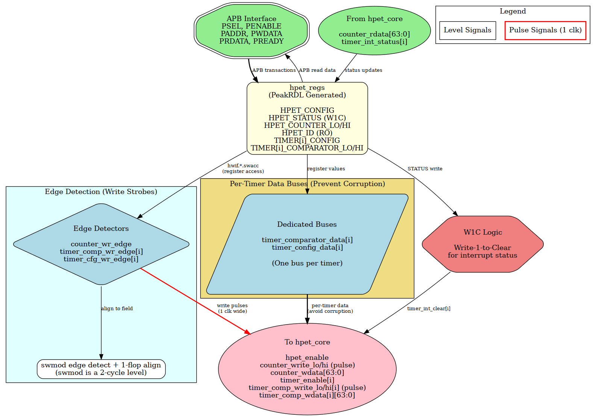

<!-- RTL Design Sherpa Documentation Header -->
<table>
<tr>
<td width="80">
  <a href="https://github.com/sean-galloway/RTLDesignSherpa">
    
  </a>
</td>
<td>
  <strong>RTL Design Sherpa</strong> · <em>Learning Hardware Design Through Practice</em><br>
  <sub>
    <a href="https://github.com/sean-galloway/RTLDesignSherpa">GitHub</a> ·
    <a href="https://github.com/sean-galloway/RTLDesignSherpa/blob/main/docs/DOCUMENTATION_INDEX.md">Documentation Index</a> ·
    <a href="https://github.com/sean-galloway/RTLDesignSherpa/blob/main/LICENSE">MIT License</a>
  </sub>
</td>
</tr>
</table>

---

<!-- End Header -->

# hpet_config_regs

## Overview

The `hpet_config_regs` module is the bridge between the PeakRDL-generated register file (`hpet_regs.sv`) and the HPET core timer logic (`hpet_core.sv`). The wrapper exists because the generated register interface and the core's expectations don't line up on their own: it handles interface adaptation, per-timer data bus isolation, and turning the register block's write indications into the one-cycle strobes the core expects.

### Figure 2.14: HPET Config Registers Block Diagram



*Figure: HPET Config Registers architecture showing APB interface, PeakRDL registers, edge detection, per-timer data buses, and W1C logic. [Source: assets/graphviz/hpet_config_regs.gv](../assets/graphviz/hpet_config_regs.gv) | [SVG](../assets/svg/hpet_config_regs.svg)*

### Key Responsibilities

1. **PeakRDL Integration:** Instantiates `hpet_regs.sv` and `peakrdl_to_cmdrsp` adapter
2. **Interface Mapping:** Converts PeakRDL hardware interface to HPET core signals
3. **Per-Timer Data Buses:** Implements dedicated 64-bit data paths per timer (prevents corruption)
4. **Write Strobes:** Rising-edge detects the register block's `swmod` levels and aligns each to the cycle the field presents the written value -- one strobe per 32-bit half
5. **Counter Write Handling:** Hands the just-written counter half to the core, byte strobes already merged by the register block
6. **Interrupt Management:** Mirrors the core's sticky status into HPET_STATUS and decodes the W1C write into a per-bit, one-cycle clear
7. **Identification:** Drives HPET_ID's vendor, revision and timer-count fields from the module parameters

---

## Parameters

| Parameter | Type | Default | Range | Description |
|-----------|------|---------|-------|-------------|
| `VENDOR_ID` | int | 1 | 0-255 | Drives HPET_ID[31:24] via `hwif_in`; an 8-bit field, so a wider value shows only its low byte (0x8086 reads 0x86) |
| `REVISION_ID` | int | 1 | 0-255 | Drives HPET_ID[23:16] via `hwif_in` (8-bit field, low byte only) |
| `NUM_TIMERS` | int | 2 | 2, 3, 8 | Number of independent timers in array |

---

## Ports

### Clock and Reset

| Signal Name | Type | Width | Direction | Description |
|-------------|------|-------|-----------|----------------|
| **clk** | logic | 1 | Input | Configuration clock (pclk or hpet_clk based on CDC_ENABLE) |
| **rst_n** | logic | 1 | Input | Active-low asynchronous reset |

### Command/Response Interface (from APB Slave)

| Signal Name | Type | Width | Direction | Description |
|-------------|------|-------|-----------|-------------|
| **cmd_valid** | logic | 1 | Input | Command valid |
| **cmd_ready** | logic | 1 | Output | Command ready |
| **cmd_pwrite** | logic | 1 | Input | Command write (1) or read (0) |
| **cmd_paddr** | logic | 12 | Input | Command address |
| **cmd_pwdata** | logic | 32 | Input | Command write data |
| **cmd_pstrb** | logic | 4 | Input | Command write byte strobes |
| **rsp_valid** | logic | 1 | Output | Response valid |
| **rsp_ready** | logic | 1 | Input | Response ready |
| **rsp_prdata** | logic | 32 | Output | Response read data |
| **rsp_pslverr** | logic | 1 | Output | Response error flag |

### HPET Core Interface (to hpet_core.sv)

**Global Configuration:**
| Signal Name | Type | Width | Direction | Description |
|-------------|------|-------|-----------|-------------|
| **hpet_enable** | logic | 1 | Output | Global HPET enable (from HPET_CONFIG[0]) |
| **legacy_replacement** | logic | 1 | Output | Legacy replacement mode (from HPET_CONFIG[1]) |

**Counter Interface:**
| Signal Name | Type | Width | Direction | Description |
|-------------|------|-------|-----------|-------------|
| **counter_write_lo** | logic | 1 | Output | One-cycle strobe: HPET_COUNTER_LO was written |
| **counter_write_hi** | logic | 1 | Output | One-cycle strobe: HPET_COUNTER_HI was written |
| **counter_wdata** | logic | 64 | Output | Counter write data ({HI, LO} field values; the strobed half is the just-written value) |
| **counter_rdata** | logic | 64 | Input | Live counter value (from hpet_core) |

**Per-Timer Configuration:**
| Signal Name | Type | Width | Direction | Description |
|-------------|------|-------|-----------|-------------|
| **timer_enable[NUM_TIMERS-1:0]** | logic | NUM_TIMERS | Output | Per-timer enable bits (from TIMER_CONFIG[2]) |
| **timer_int_enable[NUM_TIMERS-1:0]** | logic | NUM_TIMERS | Output | Per-timer interrupt enable (from TIMER_CONFIG[3]) |
| **timer_type[NUM_TIMERS-1:0]** | logic | NUM_TIMERS | Output | Per-timer mode: 0=One-shot, 1=Periodic (from TIMER_CONFIG[4]) |
| **timer_size[NUM_TIMERS-1:0]** | logic | NUM_TIMERS | Output | Per-timer size: 0=32-bit, 1=64-bit (from TIMER_CONFIG[5]) |
| **timer_value_set[NUM_TIMERS-1:0]** | logic | NUM_TIMERS | Output | From TIMER_CONFIG[6]. Currently unconsumed: the wire dead-ends at the top level (hpet_core has no such input), so the bit stores and reads back with no hardware effect |

**Per-Timer Comparator (Dedicated Buses):**
| Signal Name | Type | Width | Direction | Description |
|-------------|------|-------|-----------|-------------|
| **timer_comp_write_lo[NUM_TIMERS-1:0]** | logic | NUM_TIMERS | Output | Per-timer one-cycle strobe: TIMER_COMPARATOR_LO written |
| **timer_comp_write_hi[NUM_TIMERS-1:0]** | logic | NUM_TIMERS | Output | Per-timer one-cycle strobe: TIMER_COMPARATOR_HI written |
| **timer_comp_wdata[NUM_TIMERS]** | logic [63:0] | NUM_TIMERS×64 | Output | Per-timer comparator data (LO/HI combined) |

**Interrupt Status:**
| Signal Name | Type | Width | Direction | Description |
|-------------|------|-------|-----------|-------------|
| **timer_int_status[NUM_TIMERS-1:0]** | logic | NUM_TIMERS | Input | Per-timer sticky status (from hpet_core; mirrored into HPET_STATUS) |
| **timer_int_clear[NUM_TIMERS-1:0]** | logic | NUM_TIMERS | Output | Per-bit one-cycle clear pulse (the bits written with 1) |

---

## Functional Description

### Internal Architecture

#### Component Instantiation

**1. Protocol Adapter:**
```systemverilog
peakrdl_to_cmdrsp #(
    .ADDR_WIDTH(12),
    .DATA_WIDTH(32)
) u_adapter (
    .aclk(clk), .aresetn(rst_n),
    // cmd/rsp interface (external)
    .cmd_valid, .cmd_ready, .cmd_pwrite, .cmd_paddr, .cmd_pwdata, .cmd_pstrb,
    .rsp_valid, .rsp_ready, .rsp_prdata, .rsp_pslverr,
    // PeakRDL passthrough interface (to register block)
    .regblk_req, .regblk_req_is_wr, .regblk_addr, .regblk_wr_data, .regblk_wr_biten,
    .regblk_req_stall_wr, .regblk_req_stall_rd,
    .regblk_rd_ack, .regblk_rd_err, .regblk_rd_data,
    .regblk_wr_ack, .regblk_wr_err
);
```

**2. PeakRDL Register Block:**
```systemverilog
hpet_regs u_hpet_regs (
    .clk(clk),
    .rst(~rst_n),  // PeakRDL uses active-high reset
    // Passthrough CPU interface
    .s_cpuif_req(regblk_req),
    .s_cpuif_req_is_wr(regblk_req_is_wr),
    .s_cpuif_addr(regblk_addr[8:0]),  // 9-bit internal addressing
    .s_cpuif_wr_data(regblk_wr_data),
    .s_cpuif_wr_biten(regblk_wr_biten),
    .s_cpuif_req_stall_wr(regblk_req_stall_wr),
    .s_cpuif_req_stall_rd(regblk_req_stall_rd),
    .s_cpuif_rd_ack(regblk_rd_ack),
    .s_cpuif_rd_err(regblk_rd_err),
    .s_cpuif_rd_data(regblk_rd_data),
    .s_cpuif_wr_ack(regblk_wr_ack),
    .s_cpuif_wr_err(regblk_wr_err),
    // Hardware interface
    .hwif_in(hwif_in),
    .hwif_out(hwif_out)
);
```

### Mapping Logic Details

#### Global Configuration Mapping

Direct assignment from PeakRDL outputs:
```systemverilog
assign hpet_enable = hwif_out.HPET_CONFIG.hpet_enable.value;
assign legacy_replacement = hwif_out.HPET_CONFIG.legacy_replacement.value;
```

#### Counter Write Strobes

Everything this block hands to hpet_core is driven by the register WRITE,
never by a change in a stored value. The register block exports `swmod`
for HPET_COUNTER_LO/HI and every TIMER_COMPARATOR_LO/HI, and two
corrections are needed before it can be used as an operation pulse:

1. **It is a level, not a pulse.** `peakrdl_to_cmdrsp` deliberately holds
   `regblk_req` from the accept cycle through its wait-for-ack state, so
   `swmod` is asserted for the whole transaction -- two cycles.
2. **It leads the field by one cycle.** `swmod` is high while the field is
   still taking the written value.

So each strobe is a rising-edge detect on the `swmod` level (one
transaction, one pulse) delayed one flop, which lands it in the cycle
where the field presents the newly written value. The strobe's data is
then read straight out of the field, which is what makes byte strobes
work: the register block has already merged `(value & ~biten) | (wr_data
& biten)`, where sampling `regblk_wr_data` raw would write whole 32-bit
words on a partial-byte write. That `value` is the field's own mirror,
which on a running counter is a cycle behind the live count -- so a
partial (`PSTRB != 0xF`) counter write is only exact with the counter
halted (chapter 5, HPET_COUNTER_LO usage notes).

The upstream cpuif must drop `regblk_req` between transactions, or two
back-to-back writes to one register would look like one long level and
produce a single strobe. `apb4_slave` and `apb4_slave_cdc` are both
strictly one-outstanding, so it holds; simulation-only assertions in the
module trip if a `swmod` level ever spans three cycles.

**Counter write strobes:** each half is loaded on its OWN aligned strobe,
from its OWN field, so a "write LO then write HI" sequence lands both
halves and the core never sees a stale partner:

```systemverilog
assign w_counter_lo_swmod = hwif_out.HPET_COUNTER_LO.counter_lo.swmod;
assign w_counter_hi_swmod = hwif_out.HPET_COUNTER_HI.counter_hi.swmod;

always_ff @(posedge clk or negedge rst_n) begin
    if (!rst_n) begin
        r_counter_lo_swmod_d <= 1'b0;
        r_counter_hi_swmod_d <= 1'b0;
        counter_write_lo     <= 1'b0;
        counter_write_hi     <= 1'b0;
    end else begin
        r_counter_lo_swmod_d <= w_counter_lo_swmod;
        r_counter_hi_swmod_d <= w_counter_hi_swmod;
        counter_write_lo     <= w_counter_lo_swmod & ~r_counter_lo_swmod_d;
        counter_write_hi     <= w_counter_hi_swmod & ~r_counter_hi_swmod_d;
    end
end

// In the aligned strobe cycle the field holds the value the write just
// committed; one cycle later the hardware write-back resumes mirroring
// the live counter.
assign counter_wdata = {hwif_out.HPET_COUNTER_HI.counter_hi.value,
                        hwif_out.HPET_COUNTER_LO.counter_lo.value};
```

**Timing:**
```
Clock:           -+ +-+ +-+ +-+ +-+ +-
clk              +-+ +-+ +-+ +-+ +-

swmod (level):   ---+     +---------
counter_lo.swmod   +-----+

Field:           [LIVE][LIVE][NEW ][LIVE]
counter_lo.value

Strobe:          ---------+ +-------
counter_write_lo          +-

Note: one pulse per write, aligned to the cycle the field shows NEW;
the core loads counter[31:0] from that value and HI is untouched
```

#### Timer Configuration Mapping

Per-timer array mapping:
```systemverilog
generate
    for (genvar i = 0; i < NUM_TIMERS; i++) begin : g_timer_mapping
        assign timer_enable[i]     = hwif_out.TIMER[i].TIMER_CONFIG.timer_enable.value;
        assign timer_int_enable[i] = hwif_out.TIMER[i].TIMER_CONFIG.timer_int_enable.value;
        assign timer_type[i]       = hwif_out.TIMER[i].TIMER_CONFIG.timer_type.value;
        assign timer_size[i]       = hwif_out.TIMER[i].TIMER_CONFIG.timer_size.value;
        assign timer_value_set[i]  = hwif_out.TIMER[i].TIMER_CONFIG.timer_value_set.value;
    end
endgenerate
```

#### Per-Timer Data Bus Architecture (Corruption Fix)

**The Problem:**
Early designs shared a single 64-bit bus for all timer comparators. Rapid writes to different timers caused corruption when one timer's data overwrote another timer's registers.

**The Solution:**
Each timer gets a dedicated 64-bit data bus, preventing any possibility of cross-timer corruption:

```systemverilog
// CORRECT: Per-timer dedicated data buses
generate
    for (genvar i = 0; i < NUM_TIMERS; i++) begin : g_timer_wdata
        assign timer_comp_wdata[i] = {
            hwif_out.TIMER[i].TIMER_COMPARATOR_HI.timer_comp_hi.value,
            hwif_out.TIMER[i].TIMER_COMPARATOR_LO.timer_comp_lo.value
        };
    end
endgenerate

// Per-timer write strobes: the same swmod rising-edge-plus-one-flop
// alignment as the counter, one strobe per half. The comparator fields
// are hw = r, so the value is simply whatever software last wrote; the
// STROBE is what tells the core to reload it, which is what makes
// rewriting the same value reload it. Whether the reload also re-arms
// the timer is the core's decision (only while the timer is stopped).
generate
    for (genvar i = 0; i < NUM_TIMERS; i++) begin : g_timer_mapping
        assign w_comp_lo_swmod[i] = hwif_out.TIMER[i].TIMER_COMPARATOR_LO.timer_comp_lo.swmod;
        assign w_comp_hi_swmod[i] = hwif_out.TIMER[i].TIMER_COMPARATOR_HI.timer_comp_hi.swmod;
    end
endgenerate

always_ff @(posedge clk or negedge rst_n) begin
    if (!rst_n) begin
        r_comp_lo_swmod_d   <= '0;
        r_comp_hi_swmod_d   <= '0;
        timer_comp_write_lo <= '0;
        timer_comp_write_hi <= '0;
    end else begin
        r_comp_lo_swmod_d   <= w_comp_lo_swmod;
        r_comp_hi_swmod_d   <= w_comp_hi_swmod;
        timer_comp_write_lo <= w_comp_lo_swmod & ~r_comp_lo_swmod_d;
        timer_comp_write_hi <= w_comp_hi_swmod & ~r_comp_hi_swmod_d;
    end
end
```

**Architecture Benefit:**

```
Timer 0:  hwif.TIMER[0].COMP_LO/HI -> timer_comp_wdata[0] -> hpet_core timer 0 ONLY
Timer 1:  hwif.TIMER[1].COMP_LO/HI -> timer_comp_wdata[1] -> hpet_core timer 1 ONLY
Timer 2:  hwif.TIMER[2].COMP_LO/HI -> timer_comp_wdata[2] -> hpet_core timer 2 ONLY

No shared bus -> No corruption possible
```

#### Interrupt Status Handling

**HPET_STATUS is a mirror.** hpet_core owns the sticky interrupt status.
The register's field is driven from the core's live level every cycle
(`hw = w`), and the software write is turned into a per-bit clear pulse
into the core. The field is a fixed 8 bits wide regardless of NUM_TIMERS;
zero-extending here is what keeps the bits with no timer behind them
reading 0 forever.

```systemverilog
// Mirror out: the core's level, zero-extended to the 8-bit field
always_comb begin
    w_timer_int_status_reg                 = '0;
    w_timer_int_status_reg[NUM_TIMERS-1:0] = timer_int_status;
end
assign hwif_in.HPET_STATUS.timer_int_status.next = w_timer_int_status_reg;
```

**Interrupt Clearing (W1C, per bit):**

The clear mask comes from the write itself -- `regblk_wr_data &
regblk_wr_biten`, masked to NUM_TIMERS bits -- so a bit clears only if
software wrote a 1 to it, and a write of 0x0 is the no-op W1C requires.
The write is detected by mirroring the register block's own address decode
rather than through `swmod` (whose extra `|biten` term makes it a different
decode); a simulation-only assertion guards the two against drifting apart.

```systemverilog
// Mirror of the regblock's decode for HPET_STATUS (offset 0x008)
assign w_status_sw_wr = regblk_req && regblk_req_is_wr &&
                        (regblk_addr[8:0] == ADDR_HPET_STATUS);

// One event per transaction: the request is held for two cycles, and a
// clear that spanned both would undo a fire the core accepted in the first
assign w_status_wr_event = w_status_sw_wr & ~r_status_sw_wr_d;

// Per-bit W1C mask from the write being committed
assign w_status_w1c_mask = regblk_wr_data[NUM_TIMERS-1:0] &
                           regblk_wr_biten[NUM_TIMERS-1:0];

assign timer_int_clear = w_status_wr_event ? w_status_w1c_mask : '0;
```

The clear is narrowed to ONE cycle even though the mask makes it
idempotent: a two-cycle level would eat a fire that landed in its first
cycle (the core sets the bit, the level's second cycle clears it again).
One cycle here plus fire-over-clear priority in the core closes that
window.

**Timing:**
```
Clock:           -+ +-+ +-+ +-+ +-+ +-
clk              +-+ +-+ +-+ +-+ +-

Timer Fires:     --+
timer_int_status   +---------------+
                                   +---

HPET_STATUS:     ----+
(mirror, 1 cyc)      +-------------+
                                   +---

SW Write (lvl):  ----------+     +-----
regblk_req, addr 0x008     +-----+

Clear Pulse:     ----------+ +---------
timer_int_clear[i]         +-

Note: the mirror follows the core one register stage later; the clear
is one cycle wide, for the bits written with 1 only
```

### Register-to-Core Signal Summary

**Critical Signals:**

1. **hpet_enable:** Level signal, directly gates counter incrementing
2. **counter_write_lo / counter_write_hi:** Pulse (1 cycle) per counter half written
3. **counter_wdata:** The field values, valid for the strobed half in the strobe cycle
4. **timer_enable[i]:** Level signal per timer
5. **timer_comp_write_lo/hi[i]:** Pulse (1 cycle) per comparator half written
6. **timer_comp_wdata[i]:** Per-timer dedicated data bus (corruption-proof)
7. **timer_int_clear[i]:** Pulse (1 cycle) for the status bits written with 1

**Signal Types:**
- **Level Signals:** Direct PeakRDL `.value` outputs (enable, type, size)
- **Pulse Signals:** Rising-edge detects on the `swmod` write levels (strobes) or on the mirrored HPET_STATUS write decode (clear) -- never on a value change
- **Data Buses:** Combined register field values (counter, comparators)

---

## Design Notes

### Resource Utilization

**Configuration Register Logic (hpet_config_regs only, excluding hpet_regs):**

| Component | NUM_TIMERS=2 | NUM_TIMERS=3 | NUM_TIMERS=8 |
|-----------|--------------|--------------|--------------|
| **Mapping Logic** | ~50 FF, ~100 LUTs | ~75 FF, ~150 LUTs | ~150 FF, ~300 LUTs |
| **Edge Detect** | ~10 FF, ~20 LUTs | ~15 FF, ~30 LUTs | ~30 FF, ~60 LUTs |
| **Interrupt Handling** | ~10 FF, ~20 LUTs | ~15 FF, ~30 LUTs | ~30 FF, ~60 LUTs |
| **Total** | ~70 FF, ~140 LUTs | ~105 FF, ~210 LUTs | ~210 FF, ~420 LUTs |

**Scaling:** Primarily driven by number of timers. Each additional timer adds ~35 FF and ~70 LUTs for mapping and edge detection logic.

---

## Navigation

**Next:** [Chapter 2.3 - hpet_regs (PeakRDL)](03_hpet_regs.md)
