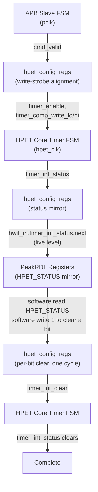

<!-- RTL Design Sherpa Documentation Header -->
<table>
<tr>
<td width="80">
  <a href="https://github.com/sean-galloway/RTLDesignSherpa">
    
  </a>
</td>
<td>
  <strong>RTL Design Sherpa</strong> · <em>Learning Hardware Design Through Practice</em><br>
  <sub>
    <a href="https://github.com/sean-galloway/RTLDesignSherpa">GitHub</a> ·
    <a href="https://github.com/sean-galloway/RTLDesignSherpa/blob/main/docs/DOCUMENTATION_INDEX.md">Documentation Index</a> ·
    <a href="https://github.com/sean-galloway/RTLDesignSherpa/blob/main/LICENSE">MIT License</a>
  </sub>
</td>
</tr>
</table>

---

<!-- End Header -->

# APB HPET FSM Summary

## Overview

The APB HPET component contains multiple state machines across different modules. This chapter collects all of them -- states, transitions, and interactions -- in one place so you don't have to chase them across the block pages.

### FSM Inventory

| Module | FSM Name | Type | States | Purpose |
|--------|----------|------|--------|---------|
| **apb4_slave** | APB Protocol FSM | Explicit | 2-3 | APB handshake protocol |
| **apb4_slave_cdc** | CDC Handshake FSM | Explicit | 4 | Clock domain crossing protocol |
| **hpet_core** | Per-Timer FSM | Conceptual | 5 | Timer operation and fire control |

**Note:** The hpet_config_regs and hpet_regs modules use combinational and sequential logic without explicit state machines.

---

## Functional Description

### 1. APB Slave Protocol FSM

**Module:** `apb4_slave.sv`
**Clock Domain:** `pclk`
**Implementation:** Explicit state register

#### States

| State | Encoding | Description |
|-------|----------|-------------|
| **IDLE** | 2'b00 | Waiting for PSEL assertion |
| **SETUP** | 2'b01 | PSEL asserted, waiting for PENABLE |
| **ACCESS** | 2'b10 | PENABLE asserted, transaction active |

#### State Transitions

**IDLE -> SETUP:**
- **Condition:** `PSEL = 1`
- **Action:** Latch address, write data, and control signals
- **Duration:** 1 clock cycle

**SETUP -> ACCESS:**
- **Condition:** `PENABLE = 1` (always follows SETUP in next cycle)
- **Action:** Assert cmd_valid to downstream, wait for rsp_valid
- **Duration:** Variable (1 cycle minimum, waits for rsp_valid)

**ACCESS -> IDLE:**
- **Condition:** `rsp_valid = 1` (response received)
- **Action:** Assert PREADY, complete transaction
- **Duration:** Immediate return to IDLE

**ACCESS -> IDLE (Early Termination):**
- **Condition:** `PSEL = 0` (transaction aborted)
- **Action:** Deassert cmd_valid, return to IDLE
- **Duration:** Immediate

#### Timing Diagram

```
Clock:      -+ +-+ +-+ +-+ +-+ +-
pclk        +-+ +-+ +-+ +-+ +-

PSEL:       ---+       +-------
            +-----------+

PENABLE:    -------+   +-------
            +-----------+

State:      [IDLE][SETUP][ACCESS][IDLE]

PREADY:     -----------+ +-----
            +-----------+

Latency: 2 cycles (SETUP + ACCESS)
```

---

### 2. APB Slave CDC (async-FIFO crossing)

**Module:** `apb4_slave_cdc.sv`
**Clock Domains:** `pclk` (APB side) and `aclk` (application side)
**Implementation:** NOT a handshake FSM. The wrapper instantiates the plain
`apb4_slave` in the pclk domain and crosses its command and response streams
through two `gaxi_fifo_async` instances (`u_cmd_cdc_fifo`, `u_rsp_cdc_fifo`,
DEPTH=2 here), with Gray- or Johnson-coded pointers selected by the
USE_JOHNSON parameter. There are no request/acknowledge toggle FSMs and no
per-signal 2-stage synchronizers on the data path -- the FIFO pointer
synchronizers are the only crossing logic.

Latency per access spans the apb4_slave FSM plus one FIFO traversal each
way (a few cycles of each clock domain, ratio-dependent).

---

### 3. HPET Core Per-Timer FSM

**Module:** `hpet_core.sv`
**Clock Domain:** `hpet_clk` (or `pclk` if CDC_ENABLE=0)
**Implementation:** Conceptual FSM (implemented as combinational logic, not explicit state register)

**Note:** The HPET core uses a conceptual FSM model for specification clarity, but the actual implementation is a raw comparator plus two state bits per timer -- the armed latch and the next-epoch hold bit -- rather than an explicit state register. This provides simpler timing and resource usage while maintaining the same functional behavior.

#### States

| State | Description | Duration |
|-------|-------------|----------|
| **IDLE** | Timer disabled, waiting for enable signal | Until timer enabled |
| **ARMED** | Timer enabled, monitoring counter vs comparator | Until counter match |
| **FIRE** | Armed match detected, asserting interrupt | 1 cycle (one-cycle pulse) |
| **PERIODIC_RELOAD** | Periodic mode: auto-increment comparator | 1 cycle, or one boundary per cycle while catching up (counter + 1 at period 1) |
| **ONE_SHOT_COMPLETE** | One-shot mode: fired, armed latch clear, waiting for a comparator write with the timer stopped or for the match to fall | Until the comparator is rewritten (timer stopped) or written above the counter, or the timer disabled |

An epoch-held timer -- one whose advance carried out of the compare width,
setting `r_comp_next_epoch[i]` -- is not a state of its own. It looks
ARMED-but-not-matching: the latch is set, the match is forced off, and it
sits there with no fire and no catch-up until the counter wraps at that
width (or software writes the comparator or counter half the comparison
reads -- LO only in 32-bit mode, either half in 64-bit -- or changes
`timer_size`).

#### State Transition Conditions

**IDLE -> ARMED:**
- **Condition:** `hpet_enable = 1 AND timer_enable[i] = 1`
- **Action:** Latch current comparator value, begin monitoring
- **Trigger:** Rising edge of enable signals

**ARMED -> FIRE:**
- **Condition:** `counter >= comparator[i]` with the armed latch set
- **Action:** Assert `timer_int_status[i]` (sticky), clear the armed latch, interrupt output one cycle later
- **Trigger:** Counter comparison (combinational), gated by the enables and the latch

**FIRE -> PERIODIC_RELOAD:**
- **Condition:** `timer_type[i] = 1` (periodic mode)
- **Action:** `comparator[i] <= comparator[i] + period[i]` at the compare
  width; a carry out of that width sets the next-epoch hold bit instead
  of reaching the comparator
- **Trigger:** Immediate (next clock cycle after fire)

**FIRE -> ONE_SHOT_COMPLETE:**
- **Condition:** `timer_type[i] = 0` (one-shot mode)
- **Action:** Hold `timer_int_status[i]`, interrupt remains asserted
- **Trigger:** Immediate (next clock cycle after fire)

**PERIODIC_RELOAD -> ARMED:**
- **Condition:** The advanced comparator is ahead of the counter (the
  usual case: the match falls and the latch re-arms)
- **Action:** Resume monitoring with new comparator value
- **Trigger:** Immediate (next clock cycle)
- **Catch-up:** if the advanced comparator is still at or below the
  counter, the timer stays in RELOAD, advancing one boundary per cycle
  WITHOUT firing, until the advance lands at or ahead of the counter
  (`>=`, or a carry); that step re-arms the latch. Missed periods are
  skipped, never burst. Period 0 cannot get ahead and is treated as
  one-shot (fires once, no churn). Period 1 gains nothing on the counter
  per cycle, so its catch-up step sets the comparator to counter + 1
  (every integer is on the period-1 lattice) and re-arms at once: one
  fire every other tick, at any deficit. Any other period closes its
  deficit at period - 1 counts per cycle, one advance per cycle, so the
  catch-up is proportional to the deficit -- a period-2 timer left 2^52
  behind by a counter write catches up for ~2^52 cycles with no
  interrupt, which is why the counter is written halted
- **Epoch hold:** an advance that carries out of the compare width leaves
  the timer ARMED-but-not-matching until the counter wraps at that width;
  no fire and no further catch-up in between

**ONE_SHOT_COMPLETE -> ARMED:**
- **Condition:** `timer_comp_write_lo[i]` or `timer_comp_write_hi[i]`
  while the timer is NOT running (`timer_enable[i] = 0` or
  `hpet_enable = 0`; software writes the LO or HI half, even with
  the value it already holds), or the raw match falling (comparator
  written above the counter, or the counter reloaded below it)
- **Action:** Set the armed latch and resume monitoring. A comparator
  written with the timer stopped need not exceed the counter: a value
  already passed fires on the first cycle both enables allow
- **Trigger:** Comparator write strobe on a stopped timer, or the match
  falling

A 0->1 of `hpet_enable` or `timer_enable[i]` while counter >= comparator
does NOT re-enter FIRE: the armed latch is the fired-state memory, and the
enables cannot set it. A completed one-shot stays complete across a
disable/enable cycle.

A comparator write on a RUNNING timer does not re-arm either: the half
loads, and the timer re-arms only when the completed value moves the match
low. That keeps the torn {old HI, new LO} between two half-writes from ever
firing. The contract is to disable the timer before reprogramming it; a
write on a STOPPED timer always re-arms, and a value at or below the
counter fires as soon as the timer is enabled. Reprogramming a running
timer anyway has two consequences that are outside the contract, not
bugs: a torn 64-bit value above the counter re-arms through the natural
path and fires at the final value once it is written, and a same-value
rewrite on a running periodic timer drags the comparator back and can
add one off-lattice fire.

**ARMED -> IDLE:**
- **Condition:** `hpet_enable = 0 OR timer_enable[i] = 0`
- **Action:** Stop match generation. A pending interrupt status/output is
  NOT cleared by disabling -- it holds until software W1C or reset.
- **Trigger:** Falling edge of enable signals

**ONE_SHOT_COMPLETE -> IDLE:**
- **Condition:** `timer_enable[i] = 0`
- **Action:** Stop monitoring (pending status, if any, holds until W1C)
- **Trigger:** Timer disable

#### FSM Timing Examples

**One-Shot Mode:**
```
Clock:      -+ +-+ +-+ +-+ +-+ +-+ +-+ +-+ +-+ +-+ +-+ +-
hpet_clk    +-+ +-+ +-+ +-+ +-+ +-+ +-+ +-+ +-+ +-+ +-

Enable:     ---+                       +-------------------
timer_enable   +-----------------------+

Counter:    [0] [1] [2] [3] [4] [5] [6] [0] [1] [2] [3]

Comparator: [5] [5] [5] [5] [5] [5] [5] [5] [5] [5] [5]

State:      [IDLE][ARMED][ARMED][ARMED][ARMED][FIRE][ONE_SHOT_COMPLETE][IDLE]

timer_int_status:----------------+           +-------
            +-----------------------------------+

timer_irq:  ---------------------+           +-------
            +-----------------------------------+

Status Clear:-----------------------------+ +-
            +-------------------------------+

Note: Fire at counter=5, interrupt sticky until status cleared
```

**Periodic Mode:**
```
Clock:      -+ +-+ +-+ + +-+ +-+ + +-+ +-+ + +-+ +-
hpet_clk    +-+ +-+ +- +-+ +-+ +- +-+ +-+ +- +-+ +-

Counter:    [8] [9] [10][11][12][13][14][15][16][17]

Comparator: [10][10][10][13][13][13][16][16][16][19]
                    ↑       ↑       ↑
                Fire 1  Fire 2  Fire 3

State:      [ARMED][ARMED][FIRE][RELOAD][ARMED][ARMED][FIRE][RELOAD]...

timer_int_status: --+
                    +------------------------------... (sticky: set at
                                                        Fire 1, holds until
                                                        software W1C)

timer_irq:        --+
                    +------------------------------... (same, one cycle later)

Period:     [3] [3] [3] [3] [3] [3] [3] [3] [3] [3]

Note: The comparator auto-increments by the period every fire, but the
status/irq do NOT pulse per fire -- there is no timer_type term in the
interrupt logic. From the first fire they stay asserted until W1C.
```

---

### FSM Interaction Summary

#### Cross-Module State Dependencies



#### Clock Domain Considerations

**Synchronous Mode (CDC_ENABLE=0):**
- All FSMs run on `pclk`
- No synchronization required
- Direct signal propagation

**Asynchronous Mode (CDC_ENABLE=1):**
- APB Slave CDC FSM bridges `pclk` and `hpet_clk`
- Configuration registers and timers run on `hpet_clk`
- Handshake protocol ensures data stability

---

## Design Notes

### State Machine Design Patterns

#### Pattern 1: Explicit State Register (APB Slave)

```systemverilog
typedef enum logic [1:0] {
    IDLE   = 2'b00,
    SETUP  = 2'b01,
    ACCESS = 2'b10
} state_t;

state_t r_state, w_next_state;

always_ff @(posedge pclk or negedge presetn) begin
    if (!presetn) r_state <= IDLE;
    else          r_state <= w_next_state;
end

always_comb begin
    w_next_state = r_state;  // Default: hold state
    case (r_state)
        IDLE:   if (PSEL)               w_next_state = SETUP;
        SETUP:  if (PENABLE)            w_next_state = ACCESS;
        ACCESS: if (rsp_valid || !PSEL) w_next_state = IDLE;
    endcase
end
```

**Characteristics:**
- Explicit state storage
- Separate combo/sequential blocks
- Easy to verify and debug
- Standard FSM coding style

#### Pattern 2: Combinational Match with an Armed Latch (Timer FSM)

```systemverilog
// No explicit state register - a raw comparator plus two state bits

// Raw match: deliberately NO enable terms; held off by the epoch bit
assign w_timer_match_raw[i] = (counter >= comparator[i]);   // at the compare width
assign w_timer_match[i]     = w_timer_match_raw[i] && !r_comp_next_epoch[i];

// Periodic catch-up: running, periodic, un-armed, still matching, no
// software write this cycle, period able to move the compare. Advances
// the comparator a boundary per cycle without firing (counter + 1 at
// period 1); re-arms the cycle the advance lands at or ahead of the
// counter (w_comp_adv_ahead[i] = carry || advance >= counter).
assign w_comp_write_rearm[i] = w_timer_comp_write[i] && !w_timer_running[i];
assign w_timer_catchup[i]    = timer_type[i] && !r_timer_armed[i] && w_timer_match[i] &&
                               !w_timer_comp_write[i] && w_timer_period_nz[i] &&
                               w_timer_running[i];
assign w_catchup_rearm[i]    = w_timer_catchup[i] && w_comp_adv_ahead[i];

// Next-epoch hold: set when an advance carries out of the compare width;
// cleared (clear beats set) by the counter wrapping at that width, a
// comparator write, a counter write or a timer_size change. The write
// clears are taken at the compare width (w_epoch_clr_comp/w_epoch_clr_ctr,
// built in the same mux as the match): in 32-bit mode only a LO-half write
// clears, a HI-half write leaves the hold in place. Reset 0.
assign w_epoch_set[i] = w_comp_advance_en[i] && w_comp_adv_carry[i];
assign w_epoch_clr[i] = w_counter_wrap[i] || w_epoch_clr_comp[i] ||
                        w_epoch_clr_ctr[i] || w_timer_size_chg[i];
always_ff @(posedge clk or negedge rst_n) begin
    if (!rst_n)                r_comp_next_epoch[i] <= 1'b0;
    else if (w_epoch_clr[i])   r_comp_next_epoch[i] <= 1'b0;
    else if (w_epoch_set[i])   r_comp_next_epoch[i] <= 1'b1;
end

// Armed latch: set on a comparator write to a STOPPED timer, when the
// gated match drops, or when a catch-up step lands at or ahead of the
// counter; cleared when the timer fires. Reset armed.
always_ff @(posedge clk or negedge rst_n) begin
    if (!rst_n)                                  r_timer_armed[i] <= 1'b1;
    else if (w_comp_write_rearm[i] || !w_timer_match[i] ||
             w_catchup_rearm[i])                 r_timer_armed[i] <= 1'b1;
    else if (w_timer_fire[i])                    r_timer_armed[i] <= 1'b0;
end

// Fire: match, still armed, both enables on
assign w_timer_fire[i] = w_timer_match[i] && r_timer_armed[i] &&
                         timer_enable[i] && hpet_enable;

// Sticky interrupt status -- identical in BOTH modes (no timer_type term)
always_ff @(posedge clk or negedge rst_n) begin
    if (!rst_n) begin
        r_interrupt_status[i] <= 1'b0;
    end else if (w_timer_fire[i]) begin
        r_interrupt_status[i] <= 1'b1;   // Set on fire (wins over a clear)
    end else if (timer_int_clear[i]) begin
        r_interrupt_status[i] <= 1'b0;   // Software W1C, this bit only
    end
end
```

**Characteristics:**
- No explicit state register; the armed latch and the next-epoch hold
  bit are the only state bits
- One fire per arm, so the enables cannot manufacture a fire
- A comparator write re-arms only a stopped timer, so a half-written
  64-bit comparator cannot fire on the torn value
- Periodic catch-up skips missed periods without bursting; period 1
  steps to counter + 1 and keeps its every-other-tick cadence at any
  deficit
- An advance that carries out of the compare width is held off until the
  counter wraps there, instead of matching early or churning
- Simpler implementation
- Lower resource usage
- Same functional behavior as FSM

---

## Testing

### FSM Verification Considerations

#### State Coverage

**APB Slave FSM:**
- [ ] IDLE state entry and exit
- [ ] SETUP state timing (1 cycle)
- [ ] ACCESS state with response wait
- [ ] ACCESS state early termination (PSEL deassert)

**CDC Handshake FSM:**
- [ ] Request synchronization (pclk -> aclk)
- [ ] Response synchronization (aclk -> pclk)
- [ ] Concurrent requests handling
- [ ] Clock ratio corner cases (fast pclk, slow aclk and vice versa)

**Timer FSM:**
- [ ] IDLE -> ARMED transition
- [ ] ARMED -> FIRE on match
- [ ] FIRE -> PERIODIC_RELOAD path
- [ ] FIRE -> ONE_SHOT_COMPLETE path
- [ ] PERIODIC_RELOAD -> ARMED auto-transition
- [ ] ONE_SHOT_COMPLETE -> ARMED on reconfigure
- [ ] Return to IDLE on disable

#### Transition Coverage

**Edge Cases:**
- [ ] Enable/disable during active timer
- [ ] Comparator write during countdown
- [ ] Counter write during active timer
- [ ] Multiple timers firing simultaneously
- [ ] Interrupt clear during fire event (the fire wins)
- [ ] Re-enable with counter >= comparator (must NOT re-fire)
- [ ] Comparator rewritten with the same value (reloads the comparator;
      re-arms only if the timer is disabled or the match falls)
- [ ] 64-bit comparator reprogrammed on a running timer (the torn
      {old HI, new LO} never fires; disable-write-enable fires once)
- [ ] Comparator write in the same cycle as a fire (exactly one fire,
      software value wins, no periodic advance that cycle)
- [ ] Periodic timer more than one period behind the counter (catch-up:
      exactly one fire, missed periods skipped)
- [ ] Period 0 (fires once, no churn) and period 1 (every other tick)
- [ ] Period-1 timer with a deficit (catch-up steps to counter + 1 and
      recovers within a cycle; a live counter write that opens a gap)
- [ ] Comparator advance carrying out of the compare width (32- and
      64-bit: epoch hold, no fire and no churn until the counter wraps;
      comparator[63:32] untouched in 32-bit mode; clear beats set at the
      wrap)
- [ ] Counter write while epoch-held (re-base: a comparator now at or
      below the counter fires promptly; in 32-bit mode a HI-half write
      to counter or comparator leaves the hold in place), and a
      timer_size change while epoch-held (hold cleared)
- [ ] Mode switch (one-shot ↔ periodic) mid-operation

---

## Navigation

**Next:** [Chapter 3 - Interfaces](../ch03_interfaces/01_top_level.md)
