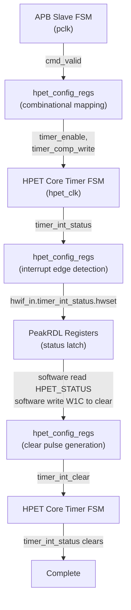

<!-- RTL Design Sherpa Documentation Header -->
<table>
<tr>
<td width="80">
  <a href="https://github.com/sean-galloway/RTLDesignSherpa">
    
  </a>
</td>
<td>
  <strong>RTL Design Sherpa</strong> · <em>Learning Hardware Design Through Practice</em><br>
  <sub>
    <a href="https://github.com/sean-galloway/RTLDesignSherpa">GitHub</a> ·
    <a href="https://github.com/sean-galloway/RTLDesignSherpa/blob/main/docs/DOCUMENTATION_INDEX.md">Documentation Index</a> ·
    <a href="https://github.com/sean-galloway/RTLDesignSherpa/blob/main/LICENSE">MIT License</a>
  </sub>
</td>
</tr>
</table>

---

<!-- End Header -->

# APB HPET FSM Summary

## Overview

The APB HPET component contains multiple state machines across different modules. This chapter collects all of them -- states, transitions, and interactions -- in one place so you don't have to chase them across the block pages.

### FSM Inventory

| Module | FSM Name | Type | States | Purpose |
|--------|----------|------|--------|---------|
| **apb4_slave** | APB Protocol FSM | Explicit | 2-3 | APB handshake protocol |
| **apb4_slave_cdc** | CDC Handshake FSM | Explicit | 4 | Clock domain crossing protocol |
| **hpet_core** | Per-Timer FSM | Conceptual | 5 | Timer operation and fire control |

**Note:** The hpet_config_regs and hpet_regs modules use combinational and sequential logic without explicit state machines.

---

## Functional Description

### 1. APB Slave Protocol FSM

**Module:** `apb4_slave.sv`
**Clock Domain:** `pclk`
**Implementation:** Explicit state register

#### States

| State | Encoding | Description |
|-------|----------|-------------|
| **IDLE** | 2'b00 | Waiting for PSEL assertion |
| **SETUP** | 2'b01 | PSEL asserted, waiting for PENABLE |
| **ACCESS** | 2'b10 | PENABLE asserted, transaction active |

#### State Transitions

**IDLE -> SETUP:**
- **Condition:** `PSEL = 1`
- **Action:** Latch address, write data, and control signals
- **Duration:** 1 clock cycle

**SETUP -> ACCESS:**
- **Condition:** `PENABLE = 1` (always follows SETUP in next cycle)
- **Action:** Assert cmd_valid to downstream, wait for rsp_valid
- **Duration:** Variable (1 cycle minimum, waits for rsp_valid)

**ACCESS -> IDLE:**
- **Condition:** `rsp_valid = 1` (response received)
- **Action:** Assert PREADY, complete transaction
- **Duration:** Immediate return to IDLE

**ACCESS -> IDLE (Early Termination):**
- **Condition:** `PSEL = 0` (transaction aborted)
- **Action:** Deassert cmd_valid, return to IDLE
- **Duration:** Immediate

#### Timing Diagram

```
Clock:      -+ +-+ +-+ +-+ +-+ +-
pclk        +-+ +-+ +-+ +-+ +-

PSEL:       ---+       +-------
            +-----------+

PENABLE:    -------+   +-------
            +-----------+

State:      [IDLE][SETUP][ACCESS][IDLE]

PREADY:     -----------+ +-----
            +-----------+

Latency: 2 cycles (SETUP + ACCESS)
```

---

### 2. APB Slave CDC (async-FIFO crossing)

**Module:** `apb4_slave_cdc.sv`
**Clock Domains:** `pclk` (APB side) and `aclk` (application side)
**Implementation:** NOT a handshake FSM. The wrapper instantiates the plain
`apb4_slave` in the pclk domain and crosses its command and response streams
through two `gaxi_fifo_async` instances (`u_cmd_cdc_fifo`, `u_rsp_cdc_fifo`,
DEPTH=2 here), with Gray- or Johnson-coded pointers selected by the
USE_JOHNSON parameter. There are no request/acknowledge toggle FSMs and no
per-signal 2-stage synchronizers on the data path -- the FIFO pointer
synchronizers are the only crossing logic.

Latency per access spans the apb4_slave FSM plus one FIFO traversal each
way (a few cycles of each clock domain, ratio-dependent).

---

### 3. HPET Core Per-Timer FSM

**Module:** `hpet_core.sv`
**Clock Domain:** `hpet_clk` (or `pclk` if CDC_ENABLE=0)
**Implementation:** Conceptual FSM (implemented as combinational logic, not explicit state register)

**Note:** The HPET core uses a conceptual FSM model for specification clarity, but the actual implementation uses combinational logic and edge detection rather than explicit state registers. This provides simpler timing and resource usage while maintaining the same functional behavior.

#### States

| State | Description | Duration |
|-------|-------------|----------|
| **IDLE** | Timer disabled, waiting for enable signal | Until timer enabled |
| **ARMED** | Timer enabled, monitoring counter vs comparator | Until counter match |
| **FIRE** | Timer match detected, asserting interrupt | 1 cycle (edge-detected) |
| **PERIODIC_RELOAD** | Periodic mode: auto-increment comparator | 1 cycle |
| **ONE_SHOT_COMPLETE** | One-shot mode: timer complete, waiting for reconfigure | Until STATUS cleared or timer disabled |

#### State Transition Conditions

**IDLE -> ARMED:**
- **Condition:** `hpet_enable = 1 AND timer_enable[i] = 1`
- **Action:** Latch current comparator value, begin monitoring
- **Trigger:** Rising edge of enable signals

**ARMED -> FIRE:**
- **Condition:** `counter >= comparator[i]`
- **Action:** Assert `timer_int_status[i]` (sticky), interrupt output one cycle later
- **Trigger:** Counter comparison (combinational)

**FIRE -> PERIODIC_RELOAD:**
- **Condition:** `timer_type[i] = 1` (periodic mode)
- **Action:** `comparator[i] <= comparator[i] + period[i]`
- **Trigger:** Immediate (next clock cycle after fire)

**FIRE -> ONE_SHOT_COMPLETE:**
- **Condition:** `timer_type[i] = 0` (one-shot mode)
- **Action:** Hold `timer_int_status[i]`, interrupt remains asserted
- **Trigger:** Immediate (next clock cycle after fire)

**PERIODIC_RELOAD -> ARMED:**
- **Condition:** Always (automatic transition)
- **Action:** Resume monitoring with new comparator value
- **Trigger:** Immediate (next clock cycle)

**ONE_SHOT_COMPLETE -> ARMED** (deviation #46: a 0->1 of hpet_enable
or timer_enable while counter >= comparator also re-enters FIRE
immediately -- the conceptual FSM has no fired-state latch):
- **Condition:** `timer_comp_write[i] = 1` (software reconfigures comparator)
- **Action:** Resume monitoring with new comparator value. Fire detection
  is edge-based, so the new comparator must EXCEED the current counter or
  no further fire occurs
- **Trigger:** Comparator write strobe

**ARMED -> IDLE:**
- **Condition:** `hpet_enable = 0 OR timer_enable[i] = 0`
- **Action:** Stop match generation. A pending interrupt status/output is
  NOT cleared by disabling -- it holds until software W1C or reset.
- **Trigger:** Falling edge of enable signals

**ONE_SHOT_COMPLETE -> IDLE:**
- **Condition:** `timer_enable[i] = 0`
- **Action:** Stop monitoring (pending status, if any, holds until W1C)
- **Trigger:** Timer disable

#### FSM Timing Examples

**One-Shot Mode:**
```
Clock:      -+ +-+ +-+ +-+ +-+ +-+ +-+ +-+ +-+ +-+ +-+ +-
hpet_clk    +-+ +-+ +-+ +-+ +-+ +-+ +-+ +-+ +-+ +-+ +-

Enable:     ---+                       +-------------------
timer_enable   +-----------------------+

Counter:    [0] [1] [2] [3] [4] [5] [6] [0] [1] [2] [3]

Comparator: [5] [5] [5] [5] [5] [5] [5] [5] [5] [5] [5]

State:      [IDLE][ARMED][ARMED][ARMED][ARMED][FIRE][ONE_SHOT_COMPLETE][IDLE]

timer_int_status:----------------+           +-------
            +-----------------------------------+

timer_irq:  ---------------------+           +-------
            +-----------------------------------+

Status Clear:-----------------------------+ +-
            +-------------------------------+

Note: Fire at counter=5, interrupt sticky until status cleared
```

**Periodic Mode:**
```
Clock:      -+ +-+ +-+ + +-+ +-+ + +-+ +-+ + +-+ +-
hpet_clk    +-+ +-+ +- +-+ +-+ +- +-+ +-+ +- +-+ +-

Counter:    [8] [9] [10][11][12][13][14][15][16][17]

Comparator: [10][10][10][13][13][13][16][16][16][19]
                    ↑       ↑       ↑
                Fire 1  Fire 2  Fire 3

State:      [ARMED][ARMED][FIRE][RELOAD][ARMED][ARMED][FIRE][RELOAD]...

timer_int_status: --+
                    +------------------------------... (sticky: set at
                                                        Fire 1, holds until
                                                        software W1C)

timer_irq:        --+
                    +------------------------------... (same, one cycle later)

Period:     [3] [3] [3] [3] [3] [3] [3] [3] [3] [3]

Note: The comparator auto-increments by the period every fire, but the
status/irq do NOT pulse per fire -- there is no timer_type term in the
interrupt logic. From the first fire they stay asserted until W1C.
```

---

### FSM Interaction Summary

#### Cross-Module State Dependencies



#### Clock Domain Considerations

**Synchronous Mode (CDC_ENABLE=0):**
- All FSMs run on `pclk`
- No synchronization required
- Direct signal propagation

**Asynchronous Mode (CDC_ENABLE=1):**
- APB Slave CDC FSM bridges `pclk` and `hpet_clk`
- Configuration registers and timers run on `hpet_clk`
- Handshake protocol ensures data stability

---

## Design Notes

### State Machine Design Patterns

#### Pattern 1: Explicit State Register (APB Slave)

```systemverilog
typedef enum logic [1:0] {
    IDLE   = 2'b00,
    SETUP  = 2'b01,
    ACCESS = 2'b10
} state_t;

state_t r_state, w_next_state;

always_ff @(posedge pclk or negedge presetn) begin
    if (!presetn) r_state <= IDLE;
    else          r_state <= w_next_state;
end

always_comb begin
    w_next_state = r_state;  // Default: hold state
    case (r_state)
        IDLE:   if (PSEL)               w_next_state = SETUP;
        SETUP:  if (PENABLE)            w_next_state = ACCESS;
        ACCESS: if (rsp_valid || !PSEL) w_next_state = IDLE;
    endcase
end
```

**Characteristics:**
- Explicit state storage
- Separate combo/sequential blocks
- Easy to verify and debug
- Standard FSM coding style

#### Pattern 2: Combinational Logic with Edge Detection (Timer FSM)

```systemverilog
// No explicit state register - use combinational logic + edge detect

// Current match condition
assign w_timer_match[i] = (counter >= comparator[i]) && timer_enable[i] && hpet_enable;

// Previous match state (for edge detection)
always_ff @(posedge clk or negedge rst_n) begin
    if (!rst_n) r_timer_match_prev[i] <= 1'b0;
    else             r_timer_match_prev[i] <= w_timer_match[i];
end

// Fire edge (rising edge of match)
assign w_timer_fire_edge[i] = w_timer_match[i] && !r_timer_match_prev[i];

// Sticky interrupt status -- identical in BOTH modes (no timer_type term)
always_ff @(posedge clk or negedge rst_n) begin
    if (!rst_n) begin
        r_interrupt_status[i] <= 1'b0;
    end else if (timer_int_clear[i]) begin
        r_interrupt_status[i] <= 1'b0;   // Software W1C
    end else if (w_timer_fire[i]) begin
        r_interrupt_status[i] <= 1'b1;   // Set on fire edge
    end
end
```

**Characteristics:**
- No explicit state register
- Edge detection for transitions
- Simpler implementation
- Lower resource usage
- Same functional behavior as FSM

---

## Testing

### FSM Verification Considerations

#### State Coverage

**APB Slave FSM:**
- [ ] IDLE state entry and exit
- [ ] SETUP state timing (1 cycle)
- [ ] ACCESS state with response wait
- [ ] ACCESS state early termination (PSEL deassert)

**CDC Handshake FSM:**
- [ ] Request synchronization (pclk -> aclk)
- [ ] Response synchronization (aclk -> pclk)
- [ ] Concurrent requests handling
- [ ] Clock ratio corner cases (fast pclk, slow aclk and vice versa)

**Timer FSM:**
- [ ] IDLE -> ARMED transition
- [ ] ARMED -> FIRE on match
- [ ] FIRE -> PERIODIC_RELOAD path
- [ ] FIRE -> ONE_SHOT_COMPLETE path
- [ ] PERIODIC_RELOAD -> ARMED auto-transition
- [ ] ONE_SHOT_COMPLETE -> ARMED on reconfigure
- [ ] Return to IDLE on disable

#### Transition Coverage

**Edge Cases:**
- [ ] Enable/disable during active timer
- [ ] Comparator write during countdown
- [ ] Counter write during active timer
- [ ] Multiple timers firing simultaneously
- [ ] Interrupt clear during fire event
- [ ] Mode switch (one-shot ↔ periodic) mid-operation

---

## Navigation

**Next:** [Chapter 3 - Interfaces](../ch03_interfaces/01_top_level.md)
