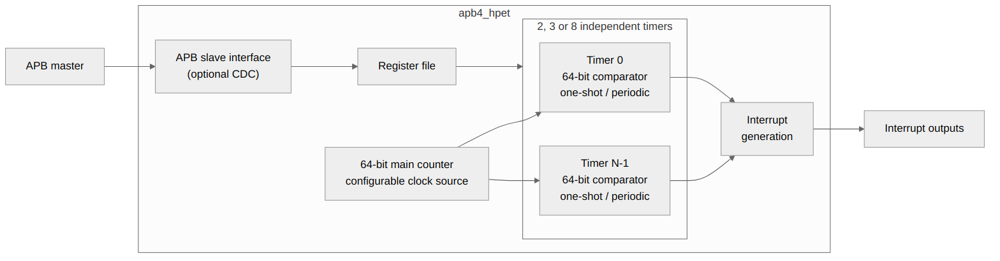
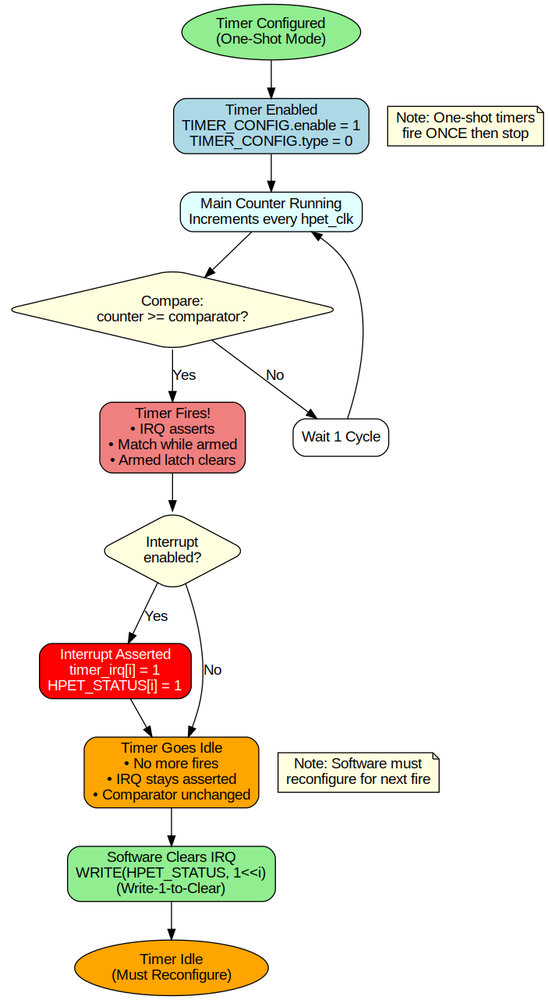
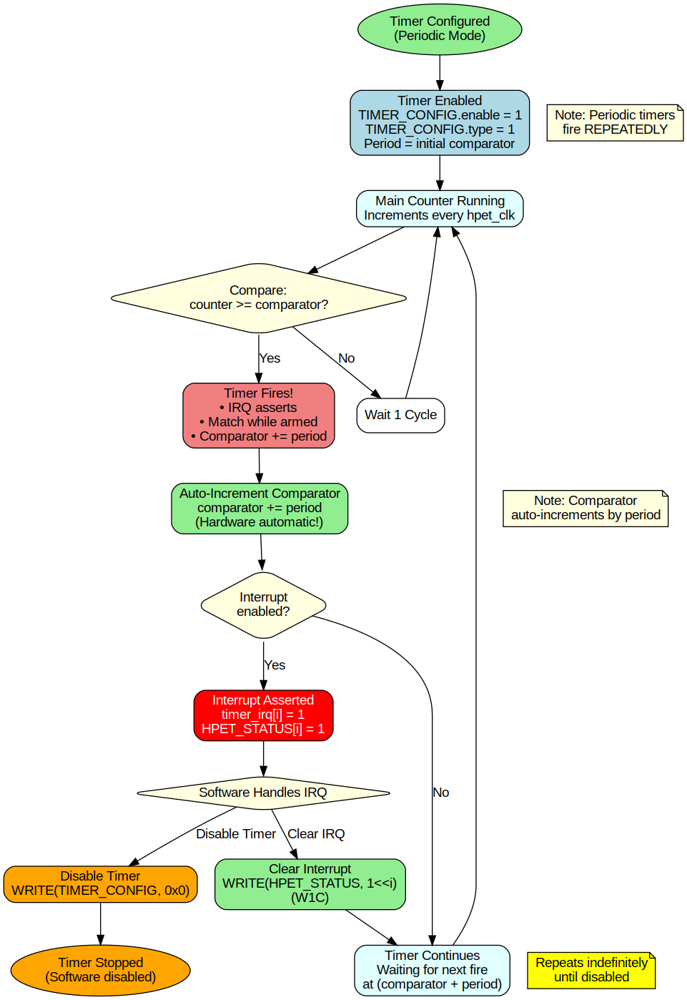
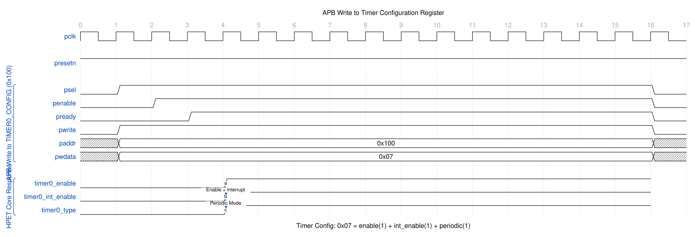
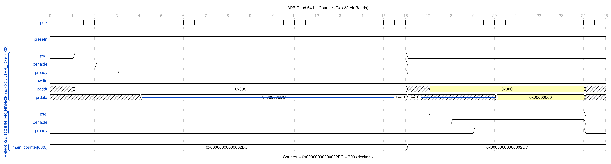
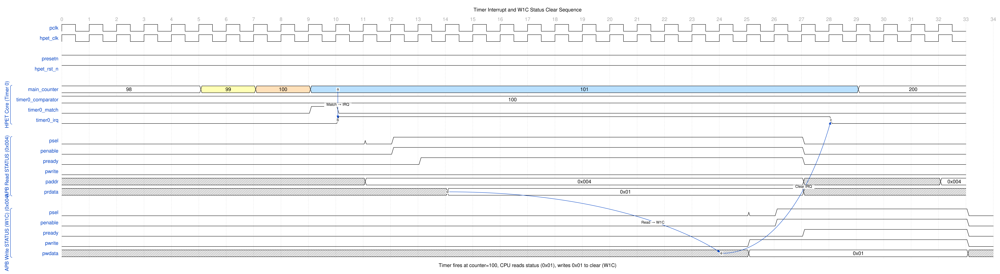
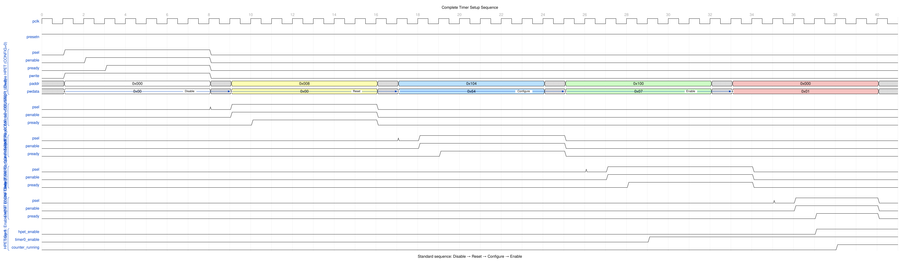
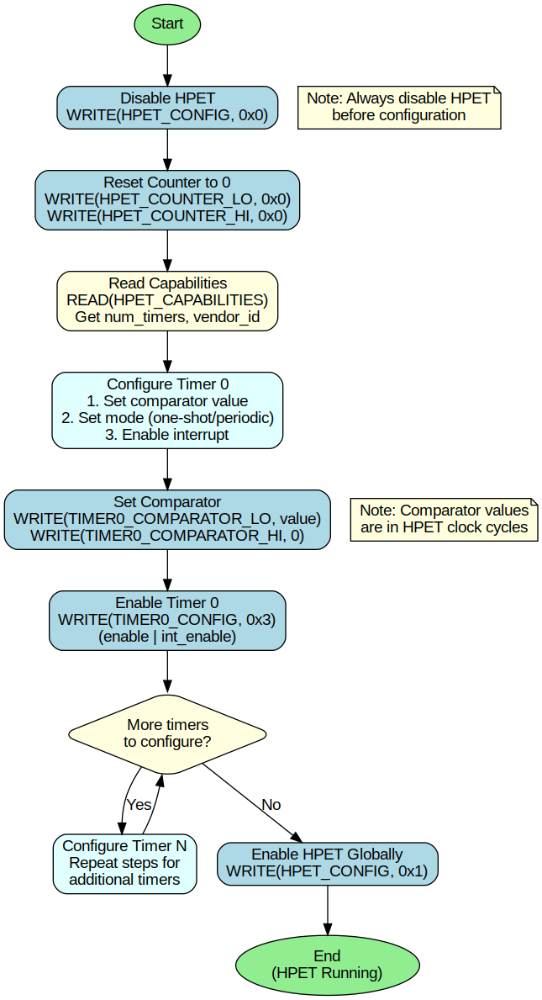
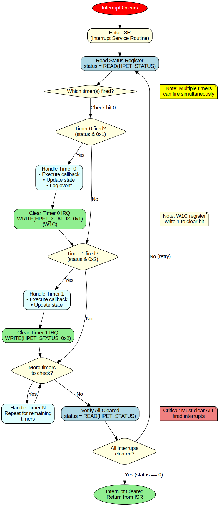

<!-- RTL Design Sherpa Documentation Header -->
<table>
<tr>
<td width="80">
  <a href="https://github.com/sean-galloway/RTLDesignSherpa">
    
  </a>
</td>
<td>
  <strong>RTL Design Sherpa</strong> · <em>Learning Hardware Design Through Practice</em><br>
  <sub>
    <a href="https://github.com/sean-galloway/RTLDesignSherpa">GitHub</a> ·
    <a href="https://github.com/sean-galloway/RTLDesignSherpa/blob/main/docs/DOCUMENTATION_INDEX.md">Documentation Index</a> ·
    <a href="https://github.com/sean-galloway/RTLDesignSherpa/blob/main/LICENSE">MIT License</a>
  </sub>
</td>
</tr>
</table>

---

<!-- End Header -->

# APB HPET Register Map

**Chapter:** 5.1
**Title:** Complete Register Address Map
**Version:** 1.1
**Last Updated:** 2026-09-08

---

## Overview

The APB HPET provides a memory-mapped register interface accessible via the APB slave port. The register space is organized into two main sections:

1. **Global Registers (0x000-0x0FF):** Configuration, status, and main counter
2. **Per-Timer Registers (0x100-0x1FF):** Timer-specific configuration and comparators

Each timer occupies a 32-byte (0x20) register block, supporting up to 8 timers.

### Figure 5.1: APB HPET Block Diagram



APB HPET top-level architecture showing APB interface, configuration registers, HPET core, and timer outputs.

---

## Functional Description

### Register Address Map Summary

#### Global Registers

| Offset | Register Name | Access | Width | Description |
|--------|---------------|--------|-------|-------------|
| 0x000 | HPET_ID | RO | 32b | Identification register (vendor, revision, capabilities) |
| 0x004 | HPET_CONFIG | RW | 32b | Global configuration and control |
| 0x008 | HPET_STATUS | RW/W1C | 32b | Interrupt status for all timers (write-1-to-clear) |
| 0x00C | RESERVED | RO | 32b | Reserved |
| 0x010 | HPET_COUNTER_LO | RW | 32b | Main counter bits [31:0] |
| 0x014 | HPET_COUNTER_HI | RW | 32b | Main counter bits [63:32] |
| 0x018-0x0FF | RESERVED | RO | - | Reserved for future use |

#### Per-Timer Registers

Each timer (N = 0 to NUM_TIMERS-1) has a 32-byte register block at base address `0x100 + N*0x20`.

**Timer N Base Address:** `0x100 + N * 0x20`

| Offset | Register Name | Access | Width | Description |
|--------|---------------|--------|-------|-------------|
| +0x00 | TIMER_CONFIG | RW | 32b | Timer configuration and control |
| +0x04 | TIMER_COMPARATOR_LO | RW | 32b | Timer comparator bits [31:0] |
| +0x08 | TIMER_COMPARATOR_HI | RW | 32b | Timer comparator bits [63:32] |
| +0x0C | RESERVED | RO | 32b | Reserved |
| +0x10-0x1F | RESERVED | RO | - | Reserved for timer expansion |

**Example Timer Addresses:**

| Timer | Base Address | CONFIG | COMPARATOR_LO | COMPARATOR_HI |
|-------|--------------|--------|---------------|---------------|
| 0 | 0x100 | 0x100 | 0x104 | 0x108 |
| 1 | 0x120 | 0x120 | 0x124 | 0x128 |
| 2 | 0x140 | 0x140 | 0x144 | 0x148 |
| 3 | 0x160 | 0x160 | 0x164 | 0x168 |
| 4 | 0x180 | 0x180 | 0x184 | 0x188 |
| 5 | 0x1A0 | 0x1A0 | 0x1A4 | 0x1A8 |
| 6 | 0x1C0 | 0x1C0 | 0x1C4 | 0x1C8 |
| 7 | 0x1E0 | 0x1E0 | 0x1E4 | 0x1E8 |

### Global Register Descriptions

#### HPET_ID (0x000) - Identification Register

**Access:** Read-Only
**Reset Value:** `(VENDOR_ID[7:0] << 24) | (REVISION_ID[7:0] << 16) | ((NUM_TIMERS-1) << 8) | 0x80`

Contains capability information and identification fields. `vendor_id`,
`rev_id` and `num_tim_cap` are all driven from the top-level parameters
through the register block's hardware interface, so one generated block
serves every instantiation. The two ID fields are 8 bits wide -- narrower
than the 16-bit vendor field of a real HPET's GCAP_ID -- so a PCI-style
`VENDOR_ID(16'h8086)` reads back as 0x86.

| Bits | Field | Access | Reset | Description |
|------|-------|--------|-------|-------------|
| [31:24] | vendor_id | RO | VENDOR_ID[7:0] | Vendor identifier (low byte of the parameter) |
| [23:16] | rev_id | RO | REVISION_ID[7:0] | Revision identifier (low byte of the parameter) |
| [15:13] | reserved | RO | 0 | Reserved |
| [12:8] | num_tim_cap | RO | NUM_TIMERS-1 | Number of timers minus 1 (e.g., 7 for 8 timers) |
| [7] | count_size_cap | RO | 1 | Counter size capability (1 = 64-bit counter) |
| [6] | reserved | RO | 0 | Reserved |
| [5] | leg_rt_cap | RO | 0 | Legacy-replacement capability: reads 0 because the feature is NOT implemented (the HPET_CONFIG bit is storage only; see HPET_CONFIG below) |
| [4:0] | reserved | RO | 0 | Reserved |

**Example Values (32-bit register, default VENDOR_ID/REVISION_ID = 1):**
- 2 timers: `0x01010180` (num_tim_cap=1)
- 3 timers: `0x01010280` (num_tim_cap=2)
- 8 timers: `0x01010780` (num_tim_cap=7)

#### HPET_CONFIG (0x004) - Configuration Register

**Access:** Read-Write
**Reset Value:** 0x00000000

Global enable and configuration control.

| Bits | Field | Access | Reset | Description |
|------|-------|--------|-------|-------------|
| [31:2] | reserved | RO | 0 | Reserved |
| [1] | legacy_replacement | RW | 0 | Stores and reads back, but has NO hardware effect (nothing consumes the signal; legacy replacement is not implemented) |
| [0] | hpet_enable | RW | 0 | HPET main counter enable (0=stopped, 1=running) |

**Usage Notes:**
- Write `hpet_enable=1` to start the main counter
- Write `hpet_enable=0` to stop the main counter (value preserved)
- `legacy_replacement` is a no-op: the bit stores and reads back, but no
  logic consumes it, and HPET_ID.leg_rt_cap reads 0 to say so
- Counter must be enabled for any timer to fire

**Example Configuration Sequence:**
```c
// Disable HPET
WRITE(HPET_CONFIG, 0x0);

// Reset counter
WRITE(HPET_COUNTER_LO, 0x0);
WRITE(HPET_COUNTER_HI, 0x0);

// Configure timers...

// Enable HPET
WRITE(HPET_CONFIG, 0x1);
```

#### HPET_STATUS (0x008) - Interrupt Status Register

**Access:** Read-Write (Write-1-to-Clear)
**Reset Value:** 0x00000000

Interrupt status bits for all timers. The register is a mirror of the
sticky status held in `hpet_core`: hardware re-drives it from the core's
level every cycle, and a software write is forwarded to the core as a
per-bit clear. Write 1 to a bit to clear the corresponding interrupt.

| Bits | Field | Access | Reset | Description |
|------|-------|--------|-------|-------------|
| [31:8] | reserved | RO | 0 | Hard zero |
| [7:NUM_TIMERS] | (unused timer bits) | RO | 0 | The field is a fixed 8 bits wide; bits with no timer behind them read 0 and cannot be set |
| [NUM_TIMERS-1:0] | timer_int_status | RW/W1C | 0 | Timer interrupt status bits, mirrored from `hpet_core` |

**Per-Timer Status Bit:**
- **Bit[N]** = Timer N interrupt status
  - 0 = No interrupt pending
  - 1 = Timer N has fired, interrupt pending

**Write-1-to-Clear (W1C) Behavior:**
- Write 1 to bit[N] to clear Timer N interrupt status (and its irq)
- Write 0 to a bit leaves it alone; a write of 0x00000000 is a no-op
- Clearing one timer's bit does not touch the other timers' bits or irq
  outputs
- A timer that fires in the same cycle its own bit is being cleared keeps
  the bit set: the new event wins, and the clear can simply be repeated
- Reading returns the current interrupt status

**Example Interrupt Handling:**
```c
// Read interrupt status
uint32_t status = READ(HPET_STATUS);

// Check if Timer 0 fired
if (status & 0x1) {
    // Handle Timer 0 interrupt

    // Clear Timer 0 interrupt
    WRITE(HPET_STATUS, 0x1);  // Write 1 to clear bit 0 only
}
```

#### HPET_COUNTER_LO (0x010) - Main Counter Low

**Access:** Read-Write
**Reset Value:** 0x00000000

Lower 32 bits of the 64-bit free-running main counter.

| Bits | Field | Access | Reset | Description |
|------|-------|--------|-------|-------------|
| [31:0] | counter_lo | RW | 0 | Main counter bits [31:0] |

**Behavior:**
- **Read:** Returns current counter value [31:0]
- **Write:** Loads counter bits [31:0] on the write itself, byte enables
  respected; bits [63:32] are untouched (see the 64-bit write ordering
  note below)
- Counter increments every `hpet_clk` cycle when `HPET_CONFIG.hpet_enable=1`
- Software can write to reset or set counter to specific value

**Usage Notes:**
- Writing counter is useful for test/debug or implementing periodic reset
- Write the counter with it halted (`HPET_CONFIG.hpet_enable=0`), as on a
  real HPET: the two halves load independently, so a running timer could
  see the intermediate {old HI, new LO} value. The halt also bounds what
  a periodic timer has to catch up: a catch-up advances the comparator
  once per cycle and closes period - 1 counts each time, so a timer left
  far behind -- a torn or stale half on a running counter is exactly how
  a 2^52 deficit appears -- is silent for cycles in proportion to the
  deficit. A contract, not a defect; see Periodic Mode
- Partial (byte-strobed, `PSTRB != 0xF`) counter writes REQUIRE a halted
  counter, which is the stricter rule: the register block merges the
  bytes software did not write from its own mirror of the field, and on
  a running counter that mirror is a cycle old, so the preserved bytes
  come back behind the counter they were meant to keep. Halted, the
  mirror is stable and the merge exact. Full-word writes never read the
  mirror and are unaffected
- Counter write takes effect immediately (on next `hpet_clk`)
- All timers compare against this counter value

#### HPET_COUNTER_HI (0x014) - Main Counter High

**Access:** Read-Write
**Reset Value:** 0x00000000

Upper 32 bits of the 64-bit free-running main counter.

| Bits | Field | Access | Reset | Description |
|------|-------|--------|-------|-------------|
| [31:0] | counter_hi | RW | 0 | Main counter bits [63:32] |

**Behavior:**
- Same as HPET_COUNTER_LO but for upper 32 bits
- Forms complete 64-bit counter value: `{counter_hi, counter_lo}`

**Reading 64-bit Counter:**
```c
// LO-then-HI gives NO rollover protection (a carry between the reads
// yields old-LO with new-HI). Use the HI/LO/HI retry loop from
// ch01_overview/03_clocks_and_reset.md:
uint32_t hi1, lo, hi2;
do {
    hi1 = READ(HPET_COUNTER_HI);
    lo  = READ(HPET_COUNTER_LO);
    hi2 = READ(HPET_COUNTER_HI);
} while (hi1 != hi2);
uint64_t counter = ((uint64_t)hi1 << 32) | lo;
```

**Writing 64-bit Counter:**
```c
// Halt the counter first; each write loads only its own half
WRITE(HPET_CONFIG, 0x0);
WRITE(HPET_COUNTER_LO, 0x00000000);
WRITE(HPET_COUNTER_HI, 0x00000000);
```

### Per-Timer Register Descriptions

Each timer has a dedicated 32-byte register block. The following descriptions apply to Timer N at base address `0x100 + N*0x20`.

#### TIMER_CONFIG (Timer Base + 0x00) - Timer Configuration

**Access:** Read-Write
**Reset Value:** 0x00000000

Configuration and control for individual timer.

| Bits | Field | Access | Reset | Description |
|------|-------|--------|-------|-------------|
| [31:7] | reserved | RO | 0 | Reserved |
| [6] | timer_value_set | RW | 0 | Stores and reads back, but has NO hardware effect (the signal dead-ends at the top level) |
| [5] | timer_size | RW | 0 | Timer size (0=32-bit, 1=64-bit) |
| [4] | timer_type | RW | 0 | Timer mode (0=one-shot, 1=periodic) |
| [3] | timer_int_enable | RW | 0 | Interrupt enable (0=disabled, 1=enabled) |
| [2] | timer_enable | RW | 0 | Timer enable (0=disabled, 1=enabled) |
| [1:0] | reserved | RO | 0 | Reserved |

**Field Descriptions:**

**timer_enable (bit 2):**
- 0 = Timer disabled (comparator inactive)
- 1 = Timer enabled (comparator active)
- Timer only fires when enabled AND `HPET_CONFIG.hpet_enable=1`

**timer_int_enable (bit 3):**
- 0 = Interrupt generation disabled (timer fires but no interrupt)
- 1 = Interrupt generation enabled (sets `HPET_STATUS` bit on fire)

**timer_type (bit 4):**
- 0 = **One-shot mode:** Timer fires once when counter >= comparator, then stays idle
- 1 = **Periodic mode:** Timer fires repeatedly, auto-increments comparator by period

**timer_size (bit 5):**
- 0 = 32-bit timer (uses only COMPARATOR_LO, ignores COMPARATOR_HI)
- 1 = 64-bit timer (uses full 64-bit comparator)
- APB HPET supports 64-bit by default
- Change it only on a stopped timer, and rewrite the comparator
  afterwards. The change clears the next-epoch hold, but a comparator
  advanced at the old width is not on the new width's lattice, and a
  live 0->1 switch can leave the timer catching up for ~2^32 cycles

**timer_value_set (bit 6):**
- No hardware effect: the register bit stores and reads back, but nothing
  consumes it (`hpet_core` has no such input; the wire dead-ends at the top
  level). Documented for completeness only.

**Common Configurations:**
```c
// One-shot timer with interrupt
WRITE(TIMER0_CONFIG, 0x0C);  // bits [3:2] = enable | int_enable

// Periodic timer with interrupt
WRITE(TIMER0_CONFIG, 0x1C);  // bits [4:3:2] = periodic | int_enable | enable

// One-shot timer, 64-bit, with interrupt
WRITE(TIMER0_CONFIG, 0x2C);  // bits [5:3:2] = 64-bit | int_enable | enable
```

#### TIMER_COMPARATOR_LO (Timer Base + 0x04) - Comparator Low

**Access:** Read-Write
**Reset Value:** 0x00000000

Lower 32 bits of the 64-bit timer comparator value.

| Bits | Field | Access | Reset | Description |
|------|-------|--------|-------|-------------|
| [31:0] | timer_comp_lo | RW | 0 | Timer comparator bits [31:0] |

**Behavior:**
- Timer fires when `main_counter >= comparator`
- For **one-shot mode:** Comparator value stays unchanged after fire
- For **periodic mode:** the CORE's working comparator auto-increments by the
  period on each fire, but this is not reflected back into the register --
  reads always return the last software-written value
- Each half loads the core on its own write; writing the value the
  register already holds still counts (the internal comparator reloads,
  discarding any periodic advance)
- The write re-arms the timer only while the timer is stopped
  (`timer_enable=0` or `HPET_CONFIG.hpet_enable=0`). On a running timer
  the half loads but the timer re-arms only when the completed value
  moves the match low -- see Reprogramming a Running Timer below
- Software writes to set initial comparator value

**Usage:**
```c
// Set Timer 0 to fire at 1000 cycles (assuming HPET_clk = counter increment)
WRITE(TIMER0_COMPARATOR_LO, 1000);
WRITE(TIMER0_COMPARATOR_HI, 0);
```

#### TIMER_COMPARATOR_HI (Timer Base + 0x08) - Comparator High

**Access:** Read-Write
**Reset Value:** 0x00000000

Upper 32 bits of the 64-bit timer comparator value.

| Bits | Field | Access | Reset | Description |
|------|-------|--------|-------|-------------|
| [31:0] | timer_comp_hi | RW | 0 | Timer comparator bits [63:32] |

**Behavior:**
- Forms complete 64-bit comparator: `{timer_comp_hi, timer_comp_lo}`
- Same behavior as COMPARATOR_LO but for upper 32 bits

**64-bit Timer Example:**
```c
// Set Timer 1 to fire at 0x0000_0001_0000_0000 (4.3 billion cycles)
WRITE(TIMER1_COMPARATOR_LO, 0x00000000);
WRITE(TIMER1_COMPARATOR_HI, 0x00000001);
```

#### Reprogramming a Running Timer

A comparator write re-arms the timer only while the timer is stopped
(`timer_enable=0` or `HPET_CONFIG.hpet_enable=0`), and then it always
re-arms, whatever the value: a comparator at or below the counter fires
as soon as the timer is enabled (the `>=` match, the same rule that makes
a deficit fire rather than be missed -- there is no wait for a wrap).
That is how software arms to an already-passed target: a zero comparator,
or a periodic phase restarted after a counter reset.

On a running timer the write still loads the half it names, but does not
re-arm; the timer re-arms only when the completed value moves the match
low. Written above the counter, the match falls, the timer re-arms and
fires at the new value, so the usual "next deadline = now + interval"
one-shot restart works with the timer running.

The reason is the 64-bit comparator arriving as two 32-bit halves. Between
the two writes the core holds the torn value `{old HI, new LO}`, which
software never programmed; withholding the re-arm on a running timer is
what guarantees that value can never fire.

The contract: to reprogram a running timer's comparator, disable the
timer first, write both halves, then re-enable. It fires once, at the
programmed value -- even one the counter has already passed. The real
HPET has the same requirement. Two consequences of reprogramming a
running timer anyway are outside the contract, not defects:

- A torn 64-bit value that lands above the counter re-arms the timer
  through the natural path, and the timer then fires at the final value
  once the second half is written. The completed value fires it, not the
  tear.
- A same-value rewrite on a running periodic timer drags the comparator
  back from its auto-advanced position to the originally programmed
  value, and can add one off-lattice fire.

```c
// Move a running 64-bit timer to a new deadline, any value
WRITE(TIMER1_CONFIG, 0x20);              // 64-bit, timer disabled
WRITE(TIMER1_COMPARATOR_LO, new_lo);
WRITE(TIMER1_COMPARATOR_HI, new_hi);
WRITE(TIMER1_CONFIG, 0x2C);              // 64-bit | int_enable | enable
```

A software write landing in the same cycle as a fire on a running timer
yields exactly one fire; the software value wins, and the periodic advance
is skipped that cycle.

The same rule covers `timer_size`: change it only on a stopped timer,
and rewrite the comparator afterwards. The next-epoch hold clears on the
change, but a comparator that was advanced at the old width is not on
the new width's lattice, and a live 0->1 switch can leave the timer
catching up for ~2^32 cycles before it fires again.

### Timer Operation Modes

#### One-Shot Mode (timer_type = 0)

### Figure 5.2: One-Shot Timer Operation



One-shot timer operation flow showing counter increment, comparator match, and idle state after fire.

**Behavior:**
1. Counter increments: 0 → 1 → 2 → ... → comparator
2. When `counter >= comparator` and the timer is armed: Timer fires, and the armed latch clears
3. Sets the `HPET_STATUS` bit; if `timer_int_enable=1`, also raises `timer_irq`
4. Timer stays complete until the comparator is rewritten with the timer
   stopped, or written above the counter while running -- disabling and
   re-enabling it does not re-fire

**Comparator Behavior:**
- Stays unchanged after fire
- Software re-arms the timer by writing the comparator (either half, any
  value -- even the same one) with the timer disabled, or by writing a
  value above the counter while it runs

**Use Cases:**
- Single timeout events
- Software-initiated timing
- Watchdog timers (with software reload)

**Example:**
```c
// Configure Timer 0: One-shot, 1000 cycles
WRITE(TIMER0_COMPARATOR_LO, 1000);
WRITE(TIMER0_CONFIG, 0x0C);  // enable | int_enable

// Enable HPET
WRITE(HPET_CONFIG, 0x1);

// Wait for interrupt
while (!(READ(HPET_STATUS) & 0x1));

// Clear interrupt
WRITE(HPET_STATUS, 0x1);

// Re-arm for the next fire at 2000 cycles. Disable the timer around the
// write: a comparator write re-arms only while the timer is stopped, so
// this works for any value, even one the counter has already passed
// (which then fires on the first enabled cycle). Writing 2000 with the
// timer still running would also work here -- but only because 2000 is
// above the counter, so the match falls and the timer re-arms naturally.
WRITE(TIMER0_CONFIG, 0x00);
WRITE(TIMER0_COMPARATOR_LO, 2000);
WRITE(TIMER0_CONFIG, 0x0C);
```

#### Periodic Mode (timer_type = 1)

### Figure 5.3: Periodic Timer Operation



Periodic timer operation flow showing counter increment, comparator match, auto-increment, and continuous firing.

**Behavior:**
1. Counter increments: 0 → 1 → 2 → ... → comparator
2. When `counter >= comparator` and the timer is armed: Timer fires
3. Sets the `HPET_STATUS` bit; if `timer_int_enable=1`, also raises `timer_irq`
4. **Comparator auto-increments:** `comparator = comparator + period` (the
   match drops, which re-arms the timer for the next period)
5. **Catch-up:** if the advanced comparator is still at or below the
   counter (timer programmed late, or the counter written forward), it
   keeps advancing one boundary per cycle WITHOUT firing until it is at
   or ahead of the counter, then re-arms. Missed periods are skipped,
   never burst: one interrupt for the whole batch, at the next boundary
   still in the future. The catch-up closes the deficit at period - 1
   counts per cycle, one comparator advance per cycle (period 1 is the
   special lattice jump to counter + 1, closed in one), so its length is
   proportional to the deficit: a period-2 timer left 2^52 counts behind
   by a counter write catches up for ~2^52 cycles, the comparator
   rewritten every cycle and no interrupt raised. That bound is why the
   HPET specification and this book require the main counter halted
   (`HPET_CONFIG.hpet_enable=0`) before it is written, and why a periodic
   comparator is programmed near or ahead of the counter
6. **Epoch hold:** if an advance carries out of the compare width (past
   bit 31 for a 32-bit timer, bit 63 for a 64-bit one), the comparator
   keeps the wrapped low bits and the timer is held -- no fire, no
   catch-up -- until the counter wraps at that width, or software writes
   the comparator, the counter (which re-bases the epoch, so a comparator
   now behind the counter fires promptly) or `timer_size`. The write
   clears are evaluated at the compare width: a 32-bit timer is released
   only by a write to HPET_COUNTER_LO or TIMERn_COMPARATOR_LO, and a
   write to either HI half leaves it held; a 64-bit timer is released by
   either half
7. Timer repeats indefinitely (fires at 1×period, 2×period, 3×period, ...)

**Comparator Auto-Increment:**
- Hardware automatically adds period value to comparator
- Period = initial comparator value written by software
- Example: Initial comparator = 1000 → Fires at 1000, 2000, 3000, ...
- Period 0 behaves as one-shot: it can never get ahead of the counter, so
  the timer fires once and stays quiescent (no churn)
- Period 1 gains nothing on the counter per cycle (both step by 1), so a
  catch-up step sets the comparator to counter + 1 -- every integer is on
  the period-1 lattice -- and re-arms at once. It delivers on every other
  tick, the fastest the one-cycle fire/re-arm loop allows, at any deficit;
  a live counter write that opens a gap recovers within a cycle
- The advance is evaluated at the compare width. A 32-bit periodic timer
  whose comparator + period passes 2^32 fires at that boundary and then
  stays quiet until the low 32 bits of the counter wrap -- up to about
  2^32 ticks, though never longer than the period that caused the carry,
  so the next fire still lands on the programmed lattice. A 64-bit timer
  whose advance carries out of bit 63 waits for the 64-bit counter to
  wrap -- in practice it fires once and never again until reprogrammed
  (chapter 2 puts a number on the wait). Both are the arithmetic of the
  register width, not defects; in
  32-bit mode the advance never disturbs TIMER_COMPARATOR_HI's half of
  the comparator ([63:32])

**Use Cases:**
- Periodic interrupts (e.g., 1 kHz tick)
- PWM generation
- Periodic data sampling
- Heartbeat signals

**Example:**
```c
// Configure Timer 1: Periodic, 2000 cycle period
WRITE(TIMER1_COMPARATOR_LO, 2000);  // Initial comparator = period
WRITE(TIMER1_CONFIG, 0x1C);  // periodic | int_enable | enable

// Enable HPET
WRITE(HPET_CONFIG, 0x1);

// Timer fires at:
// - 2000 cycles (counter >= 2000)
// - 4000 cycles (counter >= 4000) [comparator auto-incremented to 4000]
// - 6000 cycles (counter >= 6000) [comparator auto-incremented to 6000]
// - ... indefinitely

// Interrupt handler
void timer1_isr(void) {
    // Clear interrupt
    WRITE(HPET_STATUS, 0x2);  // Clear bit 1 (Timer 1)

    // Handle periodic event
    // ...

    // No need to reconfigure - timer continues automatically
}
```

### Register Access Conventions

#### Access Types

| Type | Description | Behavior |
|------|-------------|----------|
| **RO** | Read-Only | Software can read, writes ignored |
| **RW** | Read-Write | Software can read and write |
| **W1C** | Write-1-to-Clear | Write 1 to clear bit, write 0 has no effect |
| **RW/W1C** | Read-Write with W1C | Readable, writable, with W1C clear behavior |

#### Reset Values

- **Global registers:** Reset to 0x00000000 (except HPET_ID)
- **HPET_ID:** Constant: vendor/revision from the low byte of
  VENDOR_ID/REVISION_ID, num_tim_cap = NUM_TIMERS-1, leg_rt_cap = 0
- **All timers:** Reset to disabled state (0x00000000)
- **Main counter:** Reset to 0x00000000_00000000

#### Read/Write Ordering

**64-bit Register Writes:**
Each 32-bit write lands its own half on the write itself, so the order is
free, but the value is not atomic: between the two writes the hardware
holds {old HI, new LO} (or the reverse). Halt the counter
(`HPET_CONFIG[0] = 0`) before writing it, as on a real HPET -- and always
for a partial, byte-strobed write, whose merge reads a cycle-old mirror.
The mixed comparator value can never fire, because a comparator write does
not re-arm a running timer; the flip side is that a running timer re-arms
only when the completed value is above the counter, so disable the timer
around the pair whenever the new value may already be behind it (see
Reprogramming a Running Timer).

**64-bit Register Reads:**
Use the HI/LO/HI retry sequence (read HI, read LO, re-read HI; retry if
the two HI reads differ). A plain LO-then-HI read has no rollover
protection.

### Memory Map Diagram

```
0x000  ┌─────────────────────────┐
       │ HPET_ID (RO)            │  Vendor, revision, capabilities
0x004  ├─────────────────────────┤
       │ HPET_CONFIG (RW)        │  Global enable, legacy mode
0x008  ├─────────────────────────┤
       │ HPET_STATUS (RW/W1C)    │  Timer interrupt status
0x00C  ├─────────────────────────┤
       │ RESERVED (RO)           │
0x010  ├─────────────────────────┤
       │ HPET_COUNTER_LO (RW)    │  Main counter [31:0]
0x014  ├─────────────────────────┤
       │ HPET_COUNTER_HI (RW)    │  Main counter [63:32]
0x018  ├─────────────────────────┤
       │                         │
       │ RESERVED                │
       │                         │
0x0FF  ├─────────────────────────┤

0x100  ┌─────────────────────────┐
       │ TIMER0_CONFIG (RW)      │  Timer 0 configuration
0x104  ├─────────────────────────┤
       │ TIMER0_COMPARATOR_LO    │  Timer 0 comparator [31:0]
0x108  ├─────────────────────────┤
       │ TIMER0_COMPARATOR_HI    │  Timer 0 comparator [63:32]
0x10C  ├─────────────────────────┤
       │ RESERVED                │
       │                         │
0x11F  ├─────────────────────────┤

0x120  ┌─────────────────────────┐
       │ TIMER1_CONFIG (RW)      │  Timer 1 configuration
0x124  ├─────────────────────────┤
       │ TIMER1_COMPARATOR_LO    │  Timer 1 comparator [31:0]
0x128  ├─────────────────────────┤
       │ TIMER1_COMPARATOR_HI    │  Timer 1 comparator [63:32]
0x12C  ├─────────────────────────┤
       │ RESERVED                │
       │                         │
0x13F  ├─────────────────────────┤

       │         ...             │

0x1E0  ┌─────────────────────────┐
       │ TIMER7_CONFIG (RW)      │  Timer 7 configuration (if 8 timers)
0x1E4  ├─────────────────────────┤
       │ TIMER7_COMPARATOR_LO    │  Timer 7 comparator [31:0]
0x1E8  ├─────────────────────────┤
       │ TIMER7_COMPARATOR_HI    │  Timer 7 comparator [63:32]
0x1EC  ├─────────────────────────┤
       │ RESERVED                │
       │                         │
0x1FF  └─────────────────────────┘
```

Only address bits [8:0] reach the register block, so 0x200-0xFFF alias
back onto 0x000-0x1FF (0x200 reads HPET_ID, and so on). No error is
raised for any address.

Timer slots at or above NUM_TIMERS (e.g. 0x140-0x1FF on a 2-timer
build) are REAL decoded storage: they read back written values but
reach no core timer. Probe HPET_ID.num_tim_cap, not register
writability, to discover the timer count.

---

## Waveforms

The following timing diagrams illustrate key register access sequences:

### Waveform 5.1: APB Write Timer Config



APB write to TIMER0_CONFIG register (0x100). [Source: assets/wavedrom/apb_write_timer_config.json](../assets/wavedrom/apb_write_timer_config.json)

### Waveform 5.2: APB Read Counter



APB read of 64-bit counter (two 32-bit reads from COUNTER_LO and COUNTER_HI). [Source: assets/wavedrom/apb_read_counter.json](../assets/wavedrom/apb_read_counter.json)

### Waveform 5.3: Interrupt W1C Sequence



Timer interrupt generation and W1C (Write-1-to-Clear) status clearing sequence. [Source: assets/wavedrom/interrupt_w1c_sequence.json](../assets/wavedrom/interrupt_w1c_sequence.json)

### Waveform 5.4: Timer Setup Sequence



Complete timer setup sequence: disable HPET, reset counter, configure comparator, enable timer, enable HPET. [Source: assets/wavedrom/timer_setup_sequence.json](../assets/wavedrom/timer_setup_sequence.json)

---

## Usage Example

### Initialization Sequence

### Figure 5.4: Software Initialization Flow



Software initialization sequence showing configuration steps from disable to enable.

```c
// 1. Disable HPET
WRITE(HPET_CONFIG, 0x0);

// 2. Reset main counter
WRITE(HPET_COUNTER_LO, 0x0);
WRITE(HPET_COUNTER_HI, 0x0);

// 3. Configure Timer 0 (one-shot, 10ms @ 10MHz)
WRITE(TIMER0_COMPARATOR_LO, 100000);  // 100,000 cycles = 10ms
WRITE(TIMER0_COMPARATOR_HI, 0x0);
WRITE(TIMER0_CONFIG, 0x0C);  // enable | int_enable

// 4. Configure Timer 1 (periodic, 1ms @ 10MHz)
WRITE(TIMER1_COMPARATOR_LO, 10000);  // 10,000 cycles = 1ms period
WRITE(TIMER1_COMPARATOR_HI, 0x0);
WRITE(TIMER1_CONFIG, 0x1C);  // periodic | int_enable | enable

// 5. Enable HPET
WRITE(HPET_CONFIG, 0x1);
```

### Reading Capabilities

```c
// Read identification register
uint32_t id = READ(HPET_ID);

// Extract fields
uint8_t vendor_id = (id >> 24) & 0xFF;
uint8_t rev_id = (id >> 16) & 0xFF;
uint8_t num_timers = ((id >> 8) & 0x1F) + 1;  // num_tim_cap + 1
uint8_t is_64bit = (id >> 7) & 0x1;
uint8_t leg_cap = (id >> 5) & 0x1;

printf("HPET: Vendor=0x%02X, Rev=%d, Timers=%d, 64-bit=%d\n",
       vendor_id, rev_id, num_timers, is_64bit);
```

### Interrupt Handling

### Figure 5.5: Interrupt Handling Flow



Interrupt handling flow showing status check, handler dispatch, and W1C clear sequence.

```c
// Generic interrupt handler
void hpet_interrupt_handler(void) {
    // Read status register
    uint32_t status = READ(HPET_STATUS);

    // Check which timers fired
    if (status & (1 << 0)) {
        // Timer 0 fired
        handle_timer0();
        WRITE(HPET_STATUS, (1 << 0));  // Clear Timer 0 interrupt
    }

    if (status & (1 << 1)) {
        // Timer 1 fired
        handle_timer1();
        WRITE(HPET_STATUS, (1 << 1));  // Clear Timer 1 interrupt
    }

    // Each write clears only the bit(s) written with 1; a timer that
    // fires after the READ keeps its bit for the next pass.
}
```

---

## Related Modules

- [Chapter 2: Blocks](../ch02_blocks/00_overview.md) - Block-level architecture
- Chapters 3 (Interfaces) and 4 (Programming Model) are planned and not
  yet written -- see the index
- [PeakRDL Specification](../../../rtl/hpet/peakrdl/hpet_regs.rdl) - SystemRDL register definition

### Additional Diagrams

- [Block Diagram](../assets/draw.io/apb4_hpet_blocks.png) - Top-level architecture
- [One-Shot Timer](../assets/graphviz/oneshot_timer.png) - One-shot mode operation
- [Periodic Timer](../assets/graphviz/periodic_timer.png) - Periodic mode operation
- [Software Init](../assets/graphviz/software_init.png) - Initialization sequence
- [Interrupt Handling](../assets/graphviz/interrupt_handling.png) - Interrupt flow
- [Timer Mode Switch](../assets/graphviz/timer_mode_switch.png) - Mode switching
- [Multi-Timer Concurrent](../assets/graphviz/multi_timer_concurrent.png) - Concurrent operation
- [CDC Handshake](../assets/graphviz/cdc_handshake.png) - Clock domain crossing

---

**Document Version:** 1.1
**Generated:** 2026-09-08
**Based on:** hpet_regs.rdl v2
