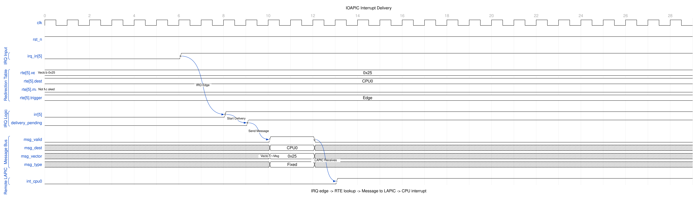
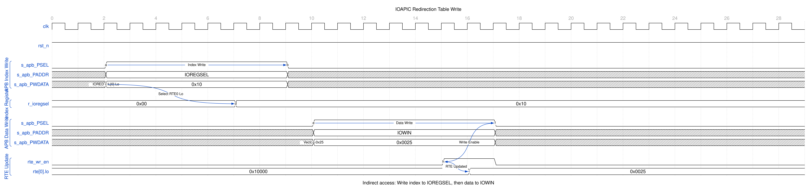
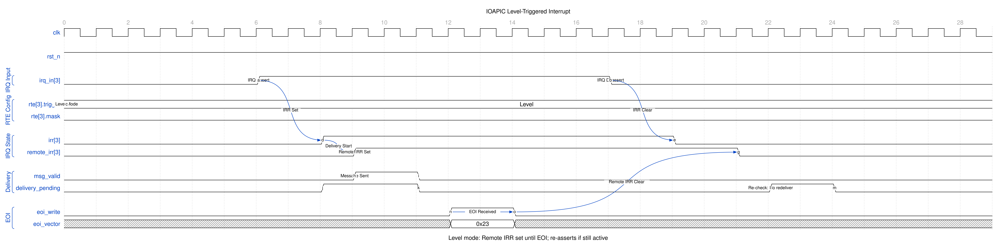
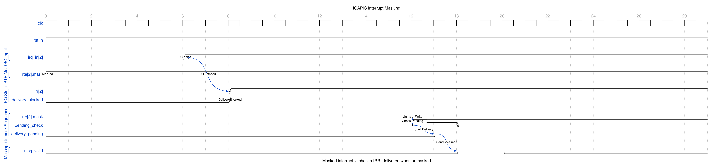

<!-- RTL Design Sherpa Documentation Header -->
<table>
<tr>
<td width="80">
  
</td>
<td>
  <strong>RTL Design Sherpa</strong> · <em>Learning Hardware Design Through Practice</em> 
  
    <a href="https://github.com/sean-galloway/RTLDesignSherpa">GitHub</a> ·
    <a href="https://github.com/sean-galloway/RTLDesignSherpa/blob/main/docs/DOCUMENTATION_INDEX.md">Documentation Index</a> ·
    <a href="https://github.com/sean-galloway/RTLDesignSherpa/blob/main/LICENSE">MIT License</a>
  
</td>
</tr>
</table>

---

<!-- End Header -->

# ioapic

## Overview

### Introduction

The APB I/O Advanced Programmable Interrupt Controller (IOAPIC) is the interrupt router you reach for when a plain 8259 won't cut it: 24 programmable interrupt inputs, flexible redirection to multiple CPUs, and both edge and level-triggered modes. Register access is Intel 82093AA-compatible (the IOREGSEL/IOWIN indirect dance), and the bus side is a standard AMBA APB4 interface, so it drops into the RLB architecture without any special pleading.

### Key Features

- **24 Independent IRQ Inputs**: IRQ0-IRQ23 with individual configuration per interrupt source
- **Programmable Redirection Table**: 64-bit entry per IRQ defining vector, mode, destination, trigger, polarity
- **Indirect Register Access**: Intel-compatible IOREGSEL/IOWIN mechanism for register access
- **Dual Trigger Modes**: 
  - **Edge-triggered**: Latches interrupt on signal edge, delivered exactly
    once per edge - the pending latch clears on the CPU's accept, and a new
    edge landing in that same cycle sets it again rather than being lost
    (fixed 2026-09-09, issue #48)
  - **Level-triggered**: Tracks signal level, uses Remote IRR, requires EOI
- **Configurable Polarity**: Active-high or active-low per IRQ input
- **Priority Arbitration**: Static priority (lowest IRQ number wins, the 82093AA scheme and the reset default) or round robin behind `IOAPICARBCFG.rr_enable`
- **Delivery Modes**: Fixed mode (MVP), with support for LowestPri, SMI, NMI, INIT, ExtINT (future)
- **Remote IRR**: Level-triggered interrupt tracking with End-of-Interrupt (EOI) handling
- **APB Interface**: Standard AMBA APB4 compliant with 12-bit addressing
- **Clock Domain Crossing**: Optional CDC support via CDC_ENABLE parameter 
- **PeakRDL Integration**: Register map generated from SystemRDL specification
- **Intel 82093AA Compatible**: Register layout and behavior match Intel specification

### Applications

**Multi-Processor Systems:**
- Flexible interrupt routing to multiple CPUs
- Per-IRQ destination configuration
- Delivery mode selection per interrupt
- Scalable interrupt distribution

**PC-Compatible Systems:**
- x86 PC interrupt architecture
- ISA bus interrupt routing
- PCI interrupt support (INTA-INTD mapping)
- Legacy IRQ redirection (IRQ0-15)

**Embedded Systems:**
- Complex interrupt topologies
- Priority-based interrupt handling
- Mixed edge/level interrupt sources
- Polarity-agnostic interrupt inputs

**System Management:**
- Interrupt masking per source
- Delivery status monitoring
- Remote IRR tracking
- Flexible interrupt mapping

## Functional Description

### Design Philosophy

**Intel Compatibility:**
The IOAPIC implements the Intel 82093AA indirect register access method (IOREGSEL/IOWIN) for compatibility with existing software. This allows software written for Intel chipsets to work with minimal modifications.

**Flexibility:**
Each of the 24 IRQ inputs can be independently configured for trigger mode (edge/level), polarity (active-high/low), delivery mode, destination CPU, and interrupt vector. This flexibility supports diverse system architectures.

**Reliability:**
- 3-stage input synchronization prevents metastability
- Edge detection on the synchronized inputs (no dedicated glitch filter:
  pulses shorter than the synchronizer depth are simply not seen)
- Remote IRR prevents level interrupt re-triggering until EOI, per pin: a
  level interrupt that is never EOI'd blocks only its own input
- EOI is matched against the vector that was actually delivered, so an RTE
  can be re-pointed while its interrupt is in flight
- Delivery status tracking ensures reliable interrupt delivery

**Standards Compliance:**
- **APB Protocol**: Full AMBA APB4 specification compliance
- **PeakRDL**: Industry-standard SystemRDL for register generation
- **Intel 82093AA**: Register layout and access method compatibility
- **Reset Convention**: mixed -- hand-written logic uses active-low
  asynchronous reset; the generated ioapic_regs.sv resets SYNCHRONOUSLY
  (active-high, derived from the reset input)

**Modularity:**
Clean separation between interrupt routing logic (ioapic_core), register interface (ioapic_config_regs), and bus interface (apb4_ioapic) enables easy customization and integration.

### Comparison with Intel 82093AA IOAPIC

The APB IOAPIC draws directly from the Intel 82093AA I/O APIC specification with RLB architecture enhancements:

| Feature | Intel 82093AA | APB IOAPIC |
| --- | --- | --- |
| **Interface** | Memory-mapped | AMBA APB4 |
| **Register Access** | Indirect (IOREGSEL/IOWIN) | Indirect (IOREGSEL/IOWIN) — Same |
| **IRQ Inputs** | 24 (IRQ0-23) | 24 (IRQ0-23) — Same |
| **Redirection Table** | 24 entries × 64-bit | 24 entries × 64-bit — Same |
| **Delivery Modes** | Fixed, LowestPri, SMI, NMI, INIT, ExtINT | Fixed (MVP), others future |
| **Destination Modes** | Physical, Logical | Physical (MVP), Logical future |
| **Trigger Modes** | Edge, Level | Edge, Level — Same |
| **Polarity** | High, Low | High, Low — Same |
| **Version Register** | 0x11, Max Entry 0x17 | 0x11, Max Entry 0x17 — Same |
| **Remote IRR** | Level interrupts | Level interrupts — Same |
| **Priority** | Implementation-defined | Static (lowest IRQ) |
| **Multi-APIC** | Supported | Future enhancement |
| **Clock Domains** | Single | Optional CDC support |

**Retained Features:**
- Indirect register access method
- Redirection table structure
- Edge/level trigger modes
- Polarity configuration
- Remote IRR mechanism
- Delivery/destination fields

**MVP Simplifications:**
- Fixed delivery mode only; the other modes are forwarded on
  `irq_out_deliv_mode` unmodified rather than acted on
- Single IOAPIC (multi-IOAPIC arbitration future)

**RLB Enhancements:**
- Round-robin arbitration behind `IOAPICARBCFG.rr_enable`, at IOWIN selector
  0x03. Not an 82093AA register: that selector is reserved on the real part,
  so a driver written for it never writes this and gets static priority
- APB4 bus interface (instead of direct memory-map)
- Optional CDC for clock domain flexibility
- PeakRDL register generation
- Modern SystemVerilog coding practices
- Comprehensive validation framework

### Intel 82093AA Register Compatibility

**Direct APB Registers:**
- `0x00`: IOREGSEL - Register offset selector
- `0x04`: IOWIN - Data window for selected register
- Nothing else in the 4 KB window is decoded: any other address, 0x08 upward,
  is dropped with PSLVERR (reads 0), so the indirect pair is the only way to
  the internal register file - 82093AA semantics, see Chapter 5

**Internal Registers (via IOREGSEL/IOWIN):**
- **0x00**: IOAPICID - I/O APIC identification
- **0x01**: IOAPICVER - Version (0x11) and Max Entry (0x17 for 24 IRQs)
- **0x02**: IOAPICARB - Arbitration priority (read-only)
- **0x10-0x3F**: IOREDTBL - Redirection table (24 entries × 2 registers)

Each redirection entry is 64 bits:
- **LO register**: Vector, delivery mode, dest mode, polarity, trigger, mask, status fields
- **HI register**: Destination CPU APIC ID

This matches Intel's specification exactly for software compatibility.

## Timing

### Performance Characteristics

**Interrupt Latency:**
- IRQ detection: 3 clock cycles (synchronization)
- Edge detection: 1 clock cycle
- Arbitration: Combinational (<1 cycle)
- Delivery initiation: 1 clock cycle
- **Total:** ~5 clock cycles from IRQ assertion to delivery request

**Register Access Performance:**
- Direct APB access (IOREGSEL): 2 APB clock cycles
- Indirect access (IOWIN): 2 APB clock cycles per register
- Full redirection entry (LO+HI): 4 transactions (~8 cycles) through
  IOREGSEL/IOWIN; there is no direct decode to shortcut it
- With CDC: Add 2-4 cycles for synchronization

**Resource Utilization (Post-Synthesis Estimates):**
- No CDC: ~800-1000 LUTs, ~600-800 flip-flops
- With CDC: ~1000-1200 LUTs, ~800-1000 flip-flops
- BRAM: None (all logic-based)

**Scalability:**
Fixed 24 IRQ inputs per Intel specification. For more IRQs, use multiple IOAPIC instances with different APIC IDs.

## Waveforms

### Waveform 1.1: Interrupt Delivery

Shows the flow from IRQ input to message delivery to LAPIC.

When an IRQ edge is detected, the corresponding IRR bit sets. The redirection table entry (RTE) is consulted for vector, destination, and delivery mode. An interrupt message is sent to the target LAPIC.

### Waveform 1.2: Redirection Table Write

Indirect register access to configure an RTE.

Two APB transactions required:
1. Write index to IOREGSEL (selects RTE low or high word)
2. Write data to IOWIN (updates the selected RTE)

### Waveform 1.3: Level-Triggered Interrupt

Level mode with Remote IRR and EOI handling.

For level-triggered interrupts:
- Remote IRR set on delivery, blocking re-delivery
- EOI clears Remote IRR on every pin delivered with that vector
- If IRQ still asserted, re-delivery occurs

### Waveform 1.4: Interrupt Masking

Masked interrupts latch in IRR and deliver when unmasked.

When an IRQ arrives while masked, the IRR bit latches but delivery is blocked. Upon unmask, the IOAPIC checks for pending interrupts and delivers them.

## Testing

### Verification Status

**Implementation Status:** RTL Complete - 36/36 in all six DV configurations
(CDC off/on x gate/func/full, 2026-09-09)

**Completed Implementation:**
- [x] PeakRDL register specification with indirect access
- [x] Core interrupt routing logic (edge/level/polarity)
- [x] Priority arbitration (static)
- [x] One-entry valid/ready delivery stage with per-pin EOI handling
- [x] Remote IRR management
- [x] Configuration register wrapper
- [x] APB top-level with CDC support, LAPIC interface presented in pclk
- [x] Complete filelist and documentation

**Validation Coverage (`dv/tests/test_apb4_ioapic.py`):**
- [x] APB indirect register access tests
- [x] Edge-triggered IRQ tests (all 24 inputs)
- [x] Level-triggered IRQ tests with Remote IRR
- [x] Polarity tests (active-high/low)
- [x] Priority arbitration tests
- [x] Delivery status tests
- [x] EOI handling with level interrupts
- [x] Redirection table configuration tests
- [x] CDC mode validation
- [x] Issue #48 defect regressions (`dv/tbclasses/ioapic/ioapic_tests_medium.py`):
  single delivery per edge, no parked valid, per-pin blocking, wrong-vector
  EOI, EOI before accept, mid-service vector rewrite, unmapped selector
  readback, no aliasing above 0x0FF, single-pclk EOI through the CDC

### Development Status

**Status:** MVP Complete - issue #48 defects fixed 2026-09-09

**MVP Scope Delivered:**
- [x] 24 IRQ inputs with synchronization
- [x] Edge and level trigger detection
- [x] Active high/low polarity support
- [x] Fixed delivery mode
- [x] Physical destination mode
- [x] Static priority arbitration, and round robin behind a control bit
- [x] Remote IRR for level interrupts
- [x] EOI handling
- [x] Indirect register access (IOREGSEL/IOWIN)
- [x] Complete redirection table
- [x] Delivery status per IRQ
- [x] Logical destination mode (`irq_out_dest_mode` carries the RTE's mode
      alongside the destination; the local APICs do the matching)
- [x] Round-robin arbitration behind `IOAPICARBCFG.rr_enable`

**Deferred features (tracked as RLB-008 in `vault/Tasks/RLB/open.md`, not defects):**
- [ ] LowestPriority delivery mode
- [ ] Additional delivery modes acted on rather than forwarded (SMI, NMI, INIT, ExtINT)
- [ ] Multi-IOAPIC support
- [ ] Boot interrupt delivery

## References

### Related Documentation

- `../../rtl/ioapic/README.md` - Block summary and verification entry point
- `vault/Tasks/RLB/open.md` - RLB-008, deferred IOAPIC features
- `../../rtl/ioapic/peakrdl/README.md` - Register generation guide
- `../../rtl/RLB_STATUS_AND_ROADMAP.md` - System-wide planning
- Intel 82093AA I/O APIC Datasheet

## Navigation

This specification document is organized as follows:

- **Chapter 1 (this chapter)**: Overview, features, applications, Intel compatibility
- **Chapter 2**: Detailed block specifications (ioapic_core, config_regs, PeakRDL integration)
- **Chapter 3**: Interface specifications (APB, indirect access, IRQ, EOI)
- **Chapter 4**: Programming model (initialization, redirection table, edge/level handling)
- **Chapter 5**: Register definitions (address map, indirect access, field descriptions)

---

**Next:** [Chapter 1.2 - Architecture](02_architecture.md)
