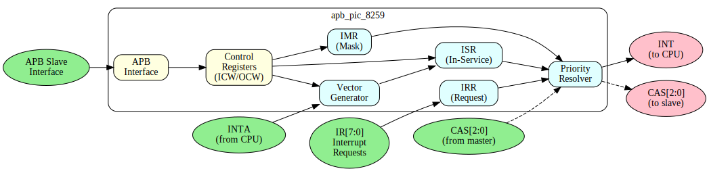
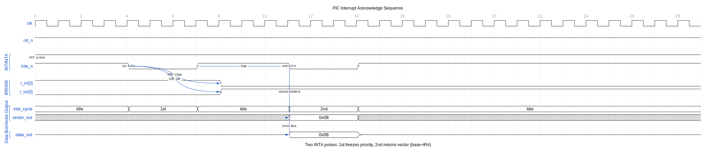
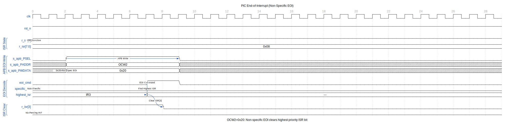
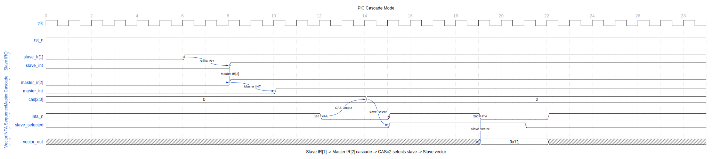

<!-- RTL Design Sherpa Documentation Header -->
<table>
<tr>
<td width="80">
  
</td>
<td>
  <strong>RTL Design Sherpa</strong> · <em>Learning Hardware Design Through Practice</em> 
  
    <a href="https://github.com/sean-galloway/RTLDesignSherpa">GitHub</a> ·
    <a href="https://github.com/sean-galloway/RTLDesignSherpa/blob/main/docs/DOCUMENTATION_INDEX.md">Documentation Index</a> ·
    <a href="https://github.com/sean-galloway/RTLDesignSherpa/blob/main/LICENSE">MIT License</a>
  
</td>
</tr>
</table>

---

<!-- End Header -->

# APB PIC 8259 - Overview

## Introduction

The APB PIC 8259 is an 8259A-compatible Programmable Interrupt Controller with an APB interface. It provides interrupt management for legacy PC-compatible systems.

## Key Features

- 8 interrupt inputs per controller
- Master/Slave cascade support
- Programmable priority modes
- Edge or level triggering
- Automatic EOI option
- Interrupt masking
- Polling mode support
- Special fully nested mode

## Applications

- PC-compatible interrupt management
- Legacy device support
- x86 system integration

## Block Diagram

## Timing Diagrams

### Interrupt Request

Shows an IRQ input assertion triggering the interrupt process.

When an IR pin asserts, the corresponding IRR bit is set. The priority resolver selects the highest priority unmasked interrupt and asserts INT to the CPU.

### Interrupt Acknowledge Sequence

The two-pulse INTA sequence from CPU to PIC.

On the first INTA pulse, priority is frozen and IRR transfers to ISR. On the second INTA pulse, the PIC outputs the interrupt vector (base + IR number) on the data bus.

### End-of-Interrupt (EOI)

Software clears the in-service bit with an EOI command.

Non-specific EOI (0x20) clears the highest priority ISR bit. Specific EOI (0x60-0x67) clears a designated IR.

### Cascade Mode

Master-slave configuration for 15 IRQ sources.

Slave INT connects to master IR2. During INTA, master outputs cascade select (CAS) lines. Slave with matching ID provides the interrupt vector.

### Priority Rotation

Automatic priority rotation for equal-service scheduling.

Rotate-on-EOI (0xA0) makes the just-serviced IR the lowest priority, implementing round-robin scheduling among interrupt sources.

## Register Summary

| Offset | A0 | Read | Write |
|--------|-----|------|-------|
| 0x00 | 0 | IRR/ISR | ICW1/OCW2/OCW3 |
| 0x04 | 1 | IMR | ICW2/ICW3/ICW4/OCW1 |

## Interrupt Priority

| IRQ | Default Priority |
|-----|-----------------|
| IR0 | Highest (0) |
| IR1 | 1 |
| IR2 | 2 (cascade in master) |
| IR3 | 3 |
| IR4 | 4 |
| IR5 | 5 |
| IR6 | 6 |
| IR7 | Lowest (7) |

## Priority Modes

- **Fixed Priority**: IR0 highest, IR7 lowest
- **Rotating Priority**: Lowest priority rotates after EOI
- **Specific Priority**: Programmable lowest priority

---

**Next:** [02_architecture.md](02_architecture.md)
