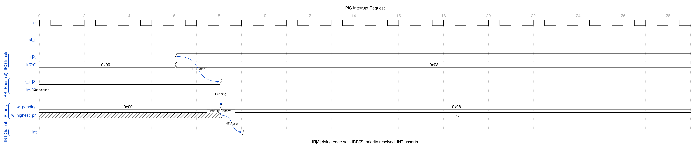
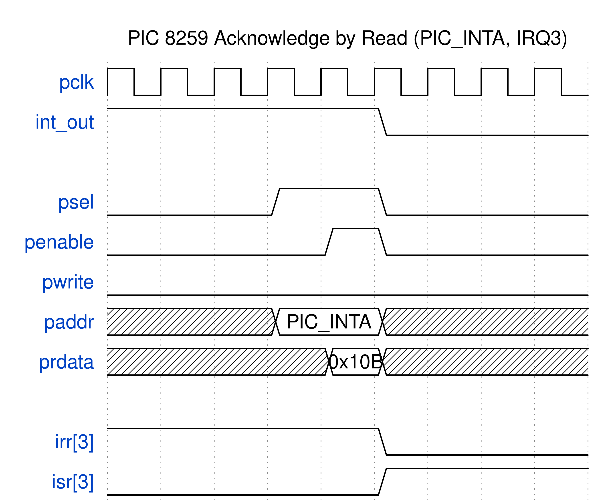
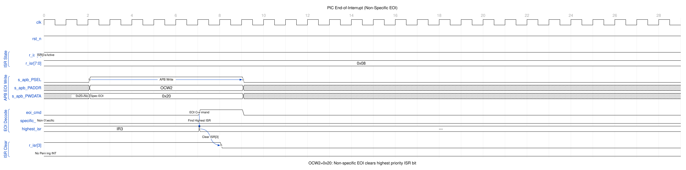
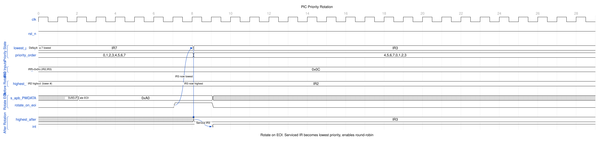

<!-- RTL Design Sherpa Documentation Header -->
<table>
<tr>
<td width="80">
  
</td>
<td>
  <strong>RTL Design Sherpa</strong> · <em>Learning Hardware Design Through Practice</em> 
  
    <a href="https://github.com/sean-galloway/RTLDesignSherpa">GitHub</a> ·
    <a href="https://github.com/sean-galloway/RTLDesignSherpa/blob/main/docs/DOCUMENTATION_INDEX.md">Documentation Index</a> ·
    <a href="https://github.com/sean-galloway/RTLDesignSherpa/blob/main/LICENSE">MIT License</a>
  
</td>
</tr>
</table>

---

<!-- End Header -->

# pic_8259 -- Overview

## Overview

The pic_8259 is an 8259A-compatible Programmable Interrupt Controller with an
APB interface. It handles interrupt management for legacy PC-compatible
systems: eight request lines in, one interrupt line out, with masking,
priority resolution, and an initialization sequence in between.

Implemented in the current RTL:

- 8 interrupt inputs (`irq_in[7:0]`) with a single `int_out` line.
  `irq_in` may be asynchronous -- it passes a `SYNC_STAGES`-flop synchronizer
  (default 2) before the edge detector, so a pin transition costs
  `SYNC_STAGES + 1` clocks before `int_out` reflects it
- Fully-decoded 32-bit APB register file (no legacy A0 two-port model). Only
  0x00-0x2C are decoded; everything else in the 4 KB window is dropped with
  `PSLVERR`
- Acknowledge by read: a read of PIC_INTA (0x2C) stands in for the INTA bus
  cycle. It returns `{vector_base[7:3], irq}` with a valid bit, sets the ISR
  bit, and clears an edge-mode IRR bit
- Live IRR and ISR with the fully nested rule: an in-service level blocks
  itself and every lower-priority level until its EOI; a higher-priority level
  preempts
- All eight OCW2 commands: non-specific, specific and rotating EOI,
  set-priority, rotate-on-AEOI arm/disarm, and automatic EOI (ICW4 AEOI)
- Special mask mode (OCW3)
- Edge or level triggering
- Interrupt masking (IMR / OCW1)

Now the other half of the story. The following register bits are
software-visible storage with no hardware effect -- they are kept so a
classic ICW/OCW sequence runs unchanged, and that is all they do (see the
register map design notes):

- Master/Slave cascade (ICW3). There are no CAS or SP/EN pins
- Special fully nested mode (ICW4 SFNM)
- Buffered mode (ICW4 BUF)
- OCW3 read-register-select and poll. IRR and ISR have dedicated read-only
  registers, and PIC_INTA answers the poll question with the acknowledge
  folded in
- `auto_reset_init` (PIC_CONFIG bit 2) affects only whether `init_mode`
  clears itself after ICW4

This is the block after the 2026-09-09 fixes (issue #50); before them there
was no acknowledge path at all.

### Parameters

| Parameter | Type | Default | Description |
|-----------|------|---------|-------------|
| SYNC_STAGES | int | 2 | `irq_in` synchronizer depth in flops. Minimum 2 (a simulation-time guard rejects less) |

### Applications

- PC-compatible interrupt management
- Legacy device support
- x86 system integration

## Functional Description

### Figure 1.1: PIC 8259 Block Diagram

### Register Summary

The block uses a fully-decoded 32-bit register file, not the legacy A0 two-port
model. See [Chapter 5: Register Map](../ch05_registers/01_register_map.md) for
full field definitions.

| Offset | Register | Access | Description |
|--------|----------|--------|-------------|
| 0x00 | PIC_CONFIG | RW | Global configuration (pic_enable, init_mode, auto_reset_init) |
| 0x04 | PIC_ICW1 | WO | Initialization Command Word 1 |
| 0x08 | PIC_ICW2 | WO | Initialization Command Word 2 (vector base) |
| 0x0C | PIC_ICW3 | WO | Initialization Command Word 3 (cascade; storage only) |
| 0x10 | PIC_ICW4 | WO | Initialization Command Word 4 |
| 0x14 | PIC_OCW1 | RW | Interrupt Mask Register (IMR) |
| 0x18 | PIC_OCW2 | WO | EOI / priority command |
| 0x1C | PIC_OCW3 | WO | Special mask (read-select and poll are storage only) |
| 0x20 | PIC_IRR | RO | Interrupt Request Register |
| 0x24 | PIC_ISR | RO | In-Service Register |
| 0x28 | PIC_STATUS | RO | Initialization state / diagnostics |
| 0x2C | PIC_INTA | RO | Interrupt acknowledge by read (side-effecting) |

The PIC is disabled at reset - firmware must BOTH complete the ICW
initialization sequence (ICW1 -> ICW2 -> ICW3 if cascaded -> ICW4 if
requested; PIC_STATUS.init_complete=1) AND set `pic_enable` (PIC_CONFIG
bit 0) before any interrupt can be requested or delivered -- out of reset
the init FSM sits in INIT_IDLE and IRR never updates. OCW2 and OCW3
commands are ignored until both conditions hold.

### Interrupt Priority

| IRQ | Default Priority |
|-----|-----------------|
| IR0 | Highest (0) |
| IR1 | 1 |
| IR2 | 2 (cascade input in a classic master; cascade not implemented here) |
| IR3 | 3 |
| IR4 | 4 |
| IR5 | 5 |
| IR6 | 6 |
| IR7 | Lowest (7) |

### Priority Modes

- **Fixed Priority**: IR0 highest, IR7 lowest (the reset and post-ICW1 order)
- **Rotating Priority**: the level just retired becomes lowest -- rotate on
  non-specific EOI (0xA0), rotate on specific EOI (0xE0-0xE7), or once per
  acknowledge with rotate-on-AEOI armed (0x80) in AEOI mode
- **Specific Priority**: set-priority (0xC0-0xC7) names the lowest level

In every mode an in-service level blocks itself and all lower-priority levels
until its EOI, and `int_out` asserts only for an unmasked request that outranks
everything in service. Special mask mode (OCW3) relaxes that for an in-service
level that software has also masked.

## Waveforms

### Waveform 1.1: Interrupt Request

Shows an IRQ input assertion triggering the interrupt process.

When an IR pin asserts, the synchronized input sets the corresponding IRR bit
(on the rising edge in edge mode; for as long as the pin is high in level
mode). The priority resolver selects the highest priority unmasked request
that outranks every in-service level and asserts INT to the CPU. A masked
request stays in the IRR and never reaches INT until it is unmasked.

### Waveform 1.2: Interrupt Acknowledge Sequence

The acknowledge, as an APB read of PIC_INTA.

This block has no INTA pin; a single APB read of PIC_INTA (0x2C) does the
work of both classic INTA pulses. In the access cycle the read data carries
the vector (base + IR number) with bit 8 set to say a request was
acknowledged, and at the end of that same cycle the core transfers the level
from IRR to ISR (in edge mode the IRR bit clears; in level mode it keeps
following the pin). The data returned is the pre-acknowledge state. INT drops
in the next cycle unless a higher-priority request is still waiting. With
nothing pending the read returns valid=0 and the spurious IRQ7 vector, and
changes nothing.

### Waveform 1.3: End-of-Interrupt (EOI)

Software clears the in-service bit with an EOI command.

Non-specific EOI (0x20) clears the highest priority ISR bit -- under the
fully nested rule, the level acknowledged most recently; under special mask
mode, the highest in-service level that is not masked. Specific EOI
(0x60-0x67) clears a designated IR. Either is a no-op when nothing is in
service. Once the bit clears, the levels it was blocking become eligible
again, so INT reasserts if a lower-priority request was waiting; in AEOI mode
the acknowledge itself retires the level and no EOI is written.

### Waveform 1.4: Cascade Mode

Master-slave configuration for 15 IRQ sources.

Slave INT connects to master IR2. During INTA, master outputs cascade select
(CAS) lines. Slave with matching ID provides the interrupt vector.

> Note: cascade mode is not implemented in this block. ICW3 is storage only
> and there are no CAS or SP/EN pins. This waveform is illustrative of the
> classic-8259A architecture, not of this RTL.

### Waveform 1.5: Priority Rotation

Automatic priority rotation for equal-service scheduling.

Rotate-on-EOI (0xA0) retires the highest-priority in-service level and makes
it the lowest priority, implementing round-robin scheduling among interrupt
sources. Rotate on specific EOI (0xE0-0xE7) does the same for a named level,
set-priority (0xC0-0xC7) moves the base without an EOI, and with
rotate-on-AEOI armed (0x80) each acknowledge in AEOI mode rotates exactly
once. ICW1 restores the fixed IR0-highest order.

## Navigation

**Next:** 02_architecture.md *(planned, not yet written)*
