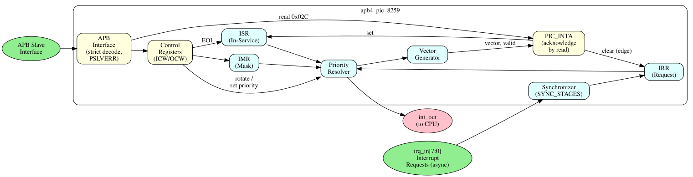
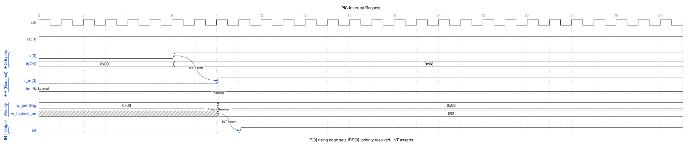
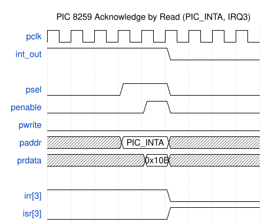
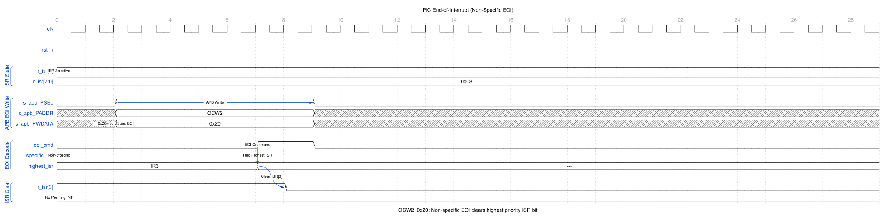
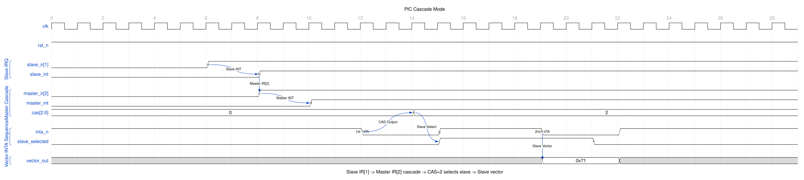
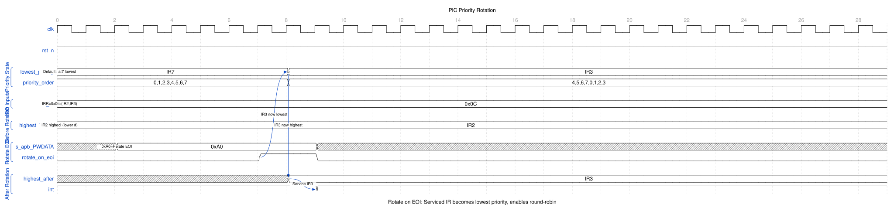

<!-- RTL Design Sherpa Documentation Header -->
<table>
<tr>
<td width="80">
  
</td>
<td>
  <strong>RTL Design Sherpa</strong> · <em>Learning Hardware Design Through Practice</em> 
  
    <a href="https://github.com/sean-galloway/RTLDesignSherpa">GitHub</a> ·
    <a href="https://github.com/sean-galloway/RTLDesignSherpa/blob/main/docs/DOCUMENTATION_INDEX.md">Documentation Index</a> ·
    <a href="https://github.com/sean-galloway/RTLDesignSherpa/blob/main/LICENSE">MIT License</a>
  
</td>
</tr>
</table>

---

<!-- End Header -->

# APB PIC 8259 - Overview

## Introduction

The APB PIC 8259 is an 8259A-compatible Programmable Interrupt Controller with an APB interface. It provides interrupt management for legacy PC-compatible systems.

## Key Features

Implemented in the current RTL:

- 8 interrupt inputs (`irq_in[7:0]`) with a single `int_out` line
- Fully-decoded 32-bit APB register file (no legacy A0 two-port model)
- Programmable priority with rotation (set-priority / rotate-on-EOI)
- Edge or level triggering
- Interrupt masking (IMR / OCW1)

Register bits exist but are **not** functional in the current core (see the
register map implementation notes): Master/Slave cascade (ICW3), Automatic EOI
(ICW4 AEOI), polling mode (OCW3), special fully nested mode (ICW4 SFNM), and
buffered mode (ICW4 BUF). There is also no INTA handshake or vector-output pin.

## Applications

- PC-compatible interrupt management
- Legacy device support
- x86 system integration

## Block Diagram

### Figure 1.1: PIC 8259 Block Diagram

## Timing Diagrams

### Waveform 1.1: Interrupt Request

Shows an IRQ input assertion triggering the interrupt process.

When an IR pin asserts, the corresponding IRR bit is set. The priority resolver selects the highest priority unmasked interrupt and asserts INT to the CPU.

### Waveform 1.2: Interrupt Acknowledge Sequence

The two-pulse INTA sequence from CPU to PIC.

On the first INTA pulse, priority is frozen and IRR transfers to ISR. On the second INTA pulse, the PIC outputs the interrupt vector (base + IR number) on the data bus.

> Note: the current RTL implements no INTA handshake. There are no `inta_n`,
> `cas`, or `sp_n/en_n` pins, ISR is never set, and the computed vector is not
> exposed to software. This waveform describes classic-8259A behavior that this
> block does not yet provide.

### Waveform 1.3: End-of-Interrupt (EOI)

Software clears the in-service bit with an EOI command.

Non-specific EOI (0x20) clears the highest priority ISR bit. Specific EOI (0x60-0x67) clears a designated IR.

> Note: because the current RTL never sets an ISR bit, EOI commands (written via
> PIC_OCW2 at offset 0x18) have no effect on live state today. See the register
> map implementation notes.

### Waveform 1.4: Cascade Mode

Master-slave configuration for 15 IRQ sources.

Slave INT connects to master IR2. During INTA, master outputs cascade select (CAS) lines. Slave with matching ID provides the interrupt vector.

> Note: cascade mode is not implemented in the current RTL. ICW3 is stored but
> inert, and there are no CAS or SP/EN pins. This waveform is illustrative of the
> classic-8259A architecture only.

### Waveform 1.5: Priority Rotation

Automatic priority rotation for equal-service scheduling.

Rotate-on-EOI (0xA0) makes the just-serviced IR the lowest priority, implementing round-robin scheduling among interrupt sources.

> Note: the set-priority command (PIC_OCW2 = 0xC0-0xC7) does move the priority
> base in the current RTL, but rotate-on-EOI depends on the EOI path, which is
> inert because ISR is never set. See the register map implementation notes.

## Register Summary

The block uses a fully-decoded 32-bit register file, not the legacy A0 two-port
model. See [Chapter 5: Register Map](../ch05_registers/01_register_map.md) for
full field definitions.

| Offset | Register | Access | Description |
|--------|----------|--------|-------------|
| 0x00 | PIC_CONFIG | RW | Global configuration (pic_enable, init_mode, auto_reset_init) |
| 0x04 | PIC_ICW1 | WO | Initialization Command Word 1 |
| 0x08 | PIC_ICW2 | WO | Initialization Command Word 2 (vector base) |
| 0x0C | PIC_ICW3 | WO | Initialization Command Word 3 (cascade; inert) |
| 0x10 | PIC_ICW4 | WO | Initialization Command Word 4 |
| 0x14 | PIC_OCW1 | RW | Interrupt Mask Register (IMR) |
| 0x18 | PIC_OCW2 | WO | EOI / priority command |
| 0x1C | PIC_OCW3 | WO | Special mask / read-select / poll |
| 0x20 | PIC_IRR | RO | Interrupt Request Register |
| 0x24 | PIC_ISR | RO | In-Service Register |
| 0x28 | PIC_STATUS | RO | Initialization state / diagnostics |

The PIC is disabled at reset - firmware must set `pic_enable` (PIC_CONFIG bit 0)
before any interrupt can be requested or delivered.

## Interrupt Priority

| IRQ | Default Priority |
|-----|-----------------|
| IR0 | Highest (0) |
| IR1 | 1 |
| IR2 | 2 (cascade input in a classic master; cascade not implemented here) |
| IR3 | 3 |
| IR4 | 4 |
| IR5 | 5 |
| IR6 | 6 |
| IR7 | Lowest (7) |

## Priority Modes

- **Fixed Priority**: IR0 highest, IR7 lowest
- **Rotating Priority**: Lowest priority rotates after EOI
- **Specific Priority**: Programmable lowest priority

---

**Next:** 02_architecture.md *(planned, not yet written)*
