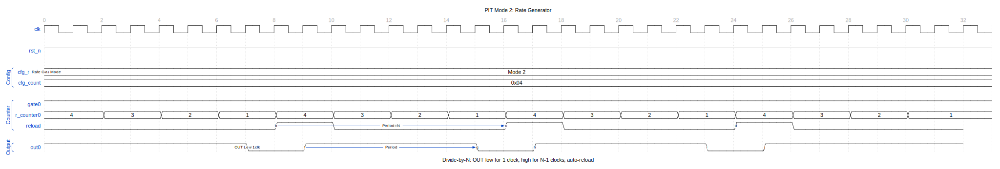
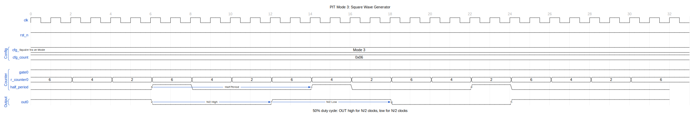
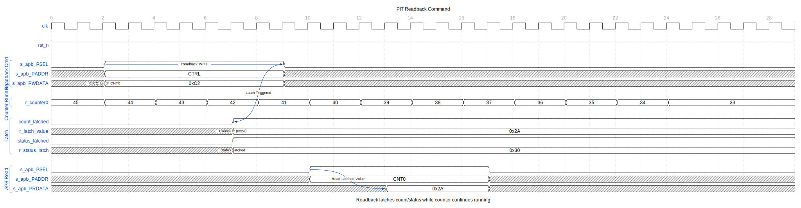

<!-- RTL Design Sherpa Documentation Header -->
<table>
<tr>
<td width="80">
  
</td>
<td>
  <strong>RTL Design Sherpa</strong> · <em>Learning Hardware Design Through Practice</em> 
  
    <a href="https://github.com/sean-galloway/RTLDesignSherpa">GitHub</a> ·
    <a href="https://github.com/sean-galloway/RTLDesignSherpa/blob/main/docs/DOCUMENTATION_INDEX.md">Documentation Index</a> ·
    <a href="https://github.com/sean-galloway/RTLDesignSherpa/blob/main/LICENSE">MIT License</a>
  
</td>
</tr>
</table>

---

<!-- End Header -->

### APB PIT 8254 - Overview

#### Introduction

The APB Programmable Interval Timer (PIT 8254) is an Intel 8254-compatible timer peripheral designed for precise interval timing and event generation in embedded systems. It provides 3 independent 16-bit hardware counters with Mode 0 (Interrupt on Terminal Count) operation, accessible via APB interface with optional clock domain crossing support.

#### Timing Diagrams

##### Mode 0: Terminal Count

In Mode 0, the counter counts down from the loaded value and asserts OUT when reaching zero.

The counter loads with the programmed value and decrements on each clock. When terminal count (0) is reached, OUT goes high and remains high until a new count is loaded.

##### Mode 2: Rate Generator

Mode 2 produces a divide-by-N clock output.

OUT is normally high, going low for one clock when the counter reaches 1. The counter auto-reloads, creating a periodic pulse train.

##### Mode 3: Square Wave Generator

Mode 3 produces a 50% duty cycle square wave.

OUT toggles every N/2 clocks, producing a symmetric square wave output.

##### Gate Control

The GATE input controls counter operation.

When GATE goes low, counting suspends. When GATE returns high, counting resumes from the current value (not reloaded).

##### Readback Command

The readback command latches counter value and status while the counter continues running.

This allows software to read a consistent counter value without stopping the timer.

#### Key Features

- **Three Independent Counters**: Three fully independent 16-bit down-counters
- **16-bit Count Values**: Each counter supports counts from 1 to 65,536
- **Mode 0 Implementation**: Interrupt on terminal count (one-shot operation)
- **Binary Counting**: Standard binary countdown (BCD implemented but not yet tested)
- **GATE Control**: Individual GATE inputs for external counter control
- **OUT Signals**: Individual OUT outputs indicating terminal count reached
- **APB Interface**: Standard AMBA APB4 compliant register interface
- **Clock Domain Crossing**: Optional CDC support for independent APB and timer clocks
- **PeakRDL Integration**: Register map generated from SystemRDL specification
- **Status Readback**: Per-counter status including mode, RW mode, NULL_COUNT, and OUT state
- **Control Word Programming**: Intel 8254-compatible control word format

#### Applications

**Real-Time Operating Systems:**
- Periodic tick generation for RTOS schedulers
- Timeout implementation
- Task deadline enforcement
- System time tracking

**Performance Profiling:**
- Code execution timing
- Event interval measurement
- Timeout detection
- Profiling counters

**Multi-Rate Timing:**
- Multiple simultaneous timing domains
- Independent periodic tasks
- Asynchronous event generation
- Programmable delay generation

**Legacy System Compatibility:**
- PC/AT timer emulation
- Retro system peripherals
- Sound generation base timer
- Speaker control timing

#### Design Philosophy

**8254 Compatibility:**
The PIT component follows Intel 8254 specifications for control word format, counter behavior, and status readback. While not a cycle-exact clone, it maintains functional compatibility for Mode 0 operation.

**Modern Integration:**
Unlike the original 8254 (with separate port I/O addresses), this implementation uses a unified APB register interface, making it suitable for modern SoC integration.

**Reliability:**
Comprehensive testing (6/6 tests at 100% pass rate in both configurations) validates core functionality. The design includes proper clock enable gating and readback paths.

**Standards Compliance:**
- **APB Protocol**: Full AMBA APB4 specification compliance
- **PeakRDL**: Industry-standard SystemRDL for register generation
- **Reset Convention**: Consistent active-low asynchronous reset (`presetn`)

**Reusability:**
Clean module hierarchy and well-defined interfaces enable easy integration. Optional CDC support allows flexible clock domain configuration without design changes.

#### Comparison with Intel 8254

The APB PIT 8254 is architecturally compatible with the Intel 8254 but has key differences:

| Feature | Intel 8254 | APB PIT 8254 |
|---------|-----------|----------|
| **Interface** | Port I/O (8-bit) | AMBA APB4 (32-bit) |
| **Counter Count** | 3 | 3 (fixed) |
| **Counter Size** | 16-bit | 16-bit |
| **Modes** | 0-5 | Mode 0 only (currently) |
| **BCD Counting** | Supported | Implemented, not tested |
| **Read/Write** | Byte-by-byte | Full 16-bit via APB |
| **Latch Command** | Supported | Not implemented |
| **Read-Back Command** | Supported | Simplified (status only) |
| **Clock Source** | External CLK pins | Configurable (`pit_clk`) |
| **Integration** | Standalone chip | SoC peripheral block |

#### Design Scope

**Currently Implemented:**
- Mode 0 (Interrupt on Terminal Count)
- Binary counting
- Control word programming
- Counter data writes
- Status readback
- GATE input control
- OUT signal generation
- Optional clock domain crossing

**Not Yet Implemented:**
- Modes 1-5 (Retriggerable One-Shot, Rate Generator, Square Wave, etc.)
- Counter latching
- Full read-back command support
- BCD counting verification

**Implementation Quality:**
- **Production Ready** for Mode 0 operation
- **100% Test Pass Rate** (6/6 tests, both CDC configurations)
- **Well-Documented** RTL and verification
- **FPGA Verified** on Verilator simulation

---

**Version:** 1.0
**Last Updated:** 2025-11-08
**Status:** Production Ready (Mode 0)
