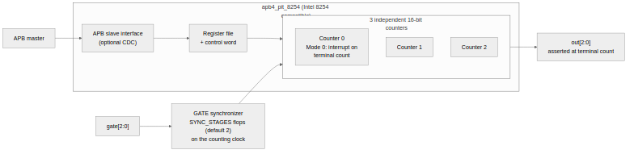
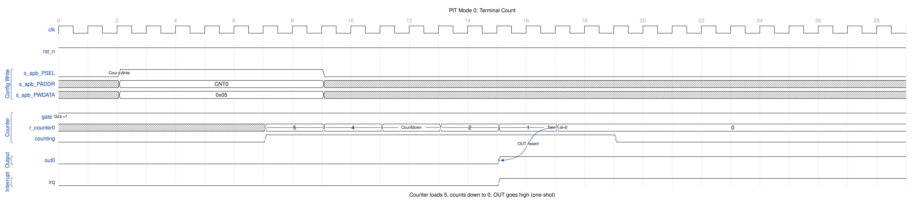
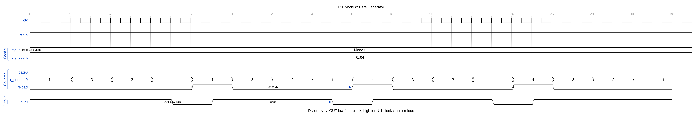
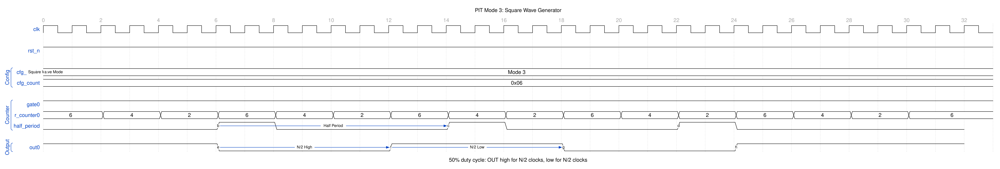
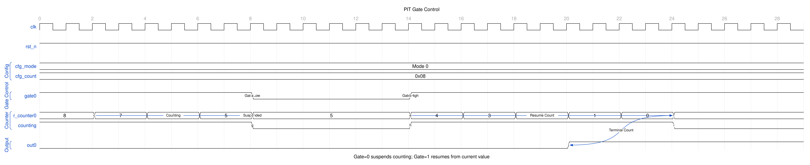
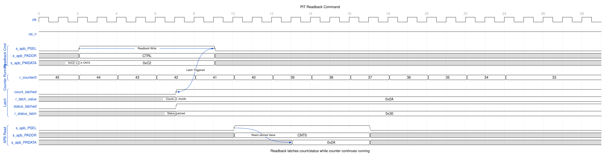

<!-- RTL Design Sherpa Documentation Header -->
<table>
<tr>
<td width="80">
  
</td>
<td>
  <strong>RTL Design Sherpa</strong> · <em>Learning Hardware Design Through Practice</em> 
  
    <a href="https://github.com/sean-galloway/RTLDesignSherpa">GitHub</a> ·
    <a href="https://github.com/sean-galloway/RTLDesignSherpa/blob/main/docs/DOCUMENTATION_INDEX.md">Documentation Index</a> ·
    <a href="https://github.com/sean-galloway/RTLDesignSherpa/blob/main/LICENSE">MIT License</a>
  
</td>
</tr>
</table>

---

<!-- End Header -->

# APB PIT 8254 - Overview

## Overview

The APB Programmable Interval Timer (PIT 8254) is an Intel 8254-compatible timer peripheral for precise interval timing and event generation in embedded systems. You get 3 independent 16-bit hardware counters running Mode 0 (Interrupt on Terminal Count), sitting behind an APB interface, with optional clock domain crossing if your timer ticks in its own clock domain.

### Figure 1.1: APB PIT 8254 Block Diagram

## Functional Description

### Key Features

- **Three Independent Counters**: Three fully independent 16-bit down-counters
- **16-bit Count Values**: Each counter supports counts from 1 to 65,535 (1 to 9,999 in BCD), and a count of 0 means 65,536 (10,000 in BCD) -- the 8254 convention, terminal count after a full wrap
- **Mode 0 Implementation**: Interrupt on terminal count (one-shot operation)
- **Binary Counting**: Standard binary countdown (BCD implemented but not yet tested)
- **GATE Control**: Individual GATE inputs; in Mode 0 a low GATE pauses the count and a high GATE resumes it from where it stopped, through a SYNC_STAGES synchronizer
- **OUT Signals**: Individual OUT outputs indicating terminal count reached
- **APB Interface**: Standard AMBA APB4 compliant register interface
- **Clock Domain Crossing**: Optional CDC support for independent APB and timer clocks
- **PeakRDL Integration**: Register map generated from SystemRDL specification
- **Counter Latch**: A control word with RW=00 freezes the selected count for an atomic read, the 8254 way
- **Status Readback**: Per-counter status including mode, RW mode, NULL_COUNT, and OUT state
- **Control Word Programming**: Intel 8254-compatible control word format

### Applications

**Real-Time Operating Systems:**
- Periodic tick generation for RTOS schedulers
- Timeout implementation
- Task deadline enforcement
- System time tracking

**Performance Profiling:**
- Code execution timing
- Event interval measurement
- Timeout detection
- Profiling counters

**Multi-Rate Timing:**
- Multiple simultaneous timing domains
- Independent periodic tasks
- Asynchronous event generation
- Programmable delay generation

**Legacy System Compatibility:**
- PC/AT timer emulation
- Retro system peripherals
- Sound generation base timer
- Speaker control timing

### Design Philosophy

**8254 Compatibility:**
The PIT follows the Intel 8254 specification for control word format, counter behavior, and status readback. It is not a cycle-exact clone -- it holds functional compatibility for Mode 0 operation, and where it deviates, this document says so out loud.

**Modern Integration:**
The original 8254 hangs off separate port I/O addresses. This implementation uses a unified APB register interface instead, which is what you want for modern SoC integration.

**Reliability:**
A 30-test suite (gate, func and full levels, both CDC configurations) validates the core functionality, including a dedicated regression for every issue #52 finding. The design includes proper clock enable gating and readback paths.

**Standards Compliance:**
- **APB Protocol**: Full AMBA APB4 specification compliance
- **PeakRDL**: Industry-standard SystemRDL for register generation
- **Reset Convention**: Consistent active-low asynchronous reset (`presetn`)

**Reusability:**
Clean module hierarchy and well-defined interfaces make integration straightforward. Optional CDC support gives you flexible clock domain configuration without design changes.

## Waveforms

### Waveform 1.1: Mode 0 Terminal Count

In Mode 0, the counter counts down from the loaded value and asserts OUT when reaching zero.

The counter loads with the programmed value and decrements on each clock. When terminal count (0) is reached, OUT goes high and remains high until a new count is loaded.

### Waveform 1.2: Mode 2 Rate Generator (reference only - not implemented)

Mode 2 on a real 8254 produces a divide-by-N clock output. This waveform is
Intel 8254 reference behavior: the RTL implements Mode 0 only, and a control
word selecting Mode 2 still yields Mode 0 counting (see Known Limitations).

OUT is normally high, going low for one clock when the counter reaches 1. The counter auto-reloads, creating a periodic pulse train.

### Waveform 1.3: Mode 3 Square Wave Generator (reference only - not implemented)

Mode 3 on a real 8254 produces a 50% duty cycle square wave. As with Mode 2,
this is reference behavior only - the RTL runs Mode 0 regardless of the
programmed mode.

OUT toggles every N/2 clocks, producing a symmetric square wave output.

### Waveform 1.4: Gate Control

In Mode 0 GATE is an enable, not a trigger: while it is low the counter holds
its value, and when it goes high again counting resumes from that value with
no reload. A load lands whatever GATE is doing -- only the decrement is
gated. GATE reaches the counter through a SYNC_STAGES-flop synchronizer
(default 2), so a transition takes effect two counting clocks after the pin
moves. This is the 8254 behaviour, and since the issue #52 fixes
(2026-09-09) it is what the RTL does.

### Waveform 1.5: Readback Command (reference only - not implemented)

On a real 8254, the readback command (SC=11) latches counter value and status
while the counter continues running. In the delivered RTL, SC=11 is a NO-OP:
status is always live in PIT_STATUS, and the count is latched through the
ordinary counter-latch command instead (a control word with RW=00, released
by the next COUNTERx_DATA read or by reprogramming the counter -- see ch05). The waveform shows the Intel
reference behavior for the read-back command itself.

## Design Notes

### Comparison with Intel 8254

The APB PIT 8254 is architecturally compatible with the Intel 8254 but has key differences:

| Feature | Intel 8254 | APB PIT 8254 |
|---------|-----------|----------|
| **Interface** | Port I/O (8-bit) | AMBA APB4 (32-bit) |
| **Counter Count** | 3 | 3 (fixed) |
| **Counter Size** | 16-bit | 16-bit |
| **Modes** | 0-5 | Mode 0 only (currently) |
| **BCD Counting** | Supported | Implemented, not tested |
| **Read/Write** | Byte-by-byte on D7-D0 | 16-bit word, or one byte on its own lane: RW=01 in [7:0], RW=10 in [15:8] (write and read) |
| **Latch Command** | Supported | Supported: control word with RW=00 latches; the next data read returns the value and releases, and a reprogram or reload releases it too (see ch05) |
| **Read-Back Command** | Supported | No-op (SC=11 ignored; status bytes are always live) |
| **Clock Source** | External CLK pins | Configurable (`pit_clk`) |
| **Integration** | Standalone chip | SoC peripheral block |

### Design Scope

**Currently Implemented:**
- Mode 0 (Interrupt on Terminal Count)
- Binary counting
- Control word programming
- Counter data writes
- Status readback
- Counter latch command
- GATE pause/resume with input synchronizer
- OUT signal generation
- Optional clock domain crossing

**Not Yet Implemented:**
- Modes 1-5 (Retriggerable One-Shot, Rate Generator, Square Wave, etc.)
- Full read-back command support
- BCD counting verification

**Implementation Quality:**
- **Validated** for Mode 0 operation (30 tests, both CDC configs; one
  test-tolerance gap, see the index)
- **Issue #52 closed** (fixed 2026-09-09) with a regression test per finding
- **Well-Documented** RTL and verification
- **FPGA Verified** on Verilator simulation

---

**Version:** 1.1
**Last Updated:** 2026-09-09
**Status:** RTL Functional (Mode 0; issue #52 fixed 2026-09-09; see the index)
