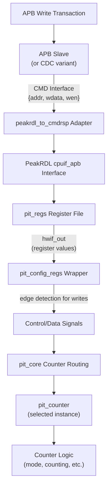
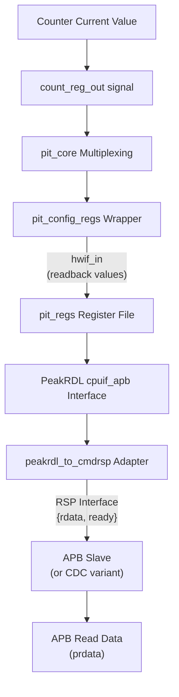

<!-- RTL Design Sherpa Documentation Header -->
<table>
<tr>
<td width="80">
  <a href="https://github.com/sean-galloway/RTLDesignSherpa">
    
  </a>
</td>
<td>
  <strong>RTL Design Sherpa</strong> · <em>Learning Hardware Design Through Practice</em><br>
  <sub>
    <a href="https://github.com/sean-galloway/RTLDesignSherpa">GitHub</a> ·
    <a href="https://github.com/sean-galloway/RTLDesignSherpa/blob/main/docs/DOCUMENTATION_INDEX.md">Documentation Index</a> ·
    <a href="https://github.com/sean-galloway/RTLDesignSherpa/blob/main/LICENSE">MIT License</a>
  </sub>
</td>
</tr>
</table>

---

<!-- End Header -->

### APB PIT 8254 - Block Hierarchy Overview

#### Module Hierarchy

The APB PIT 8254 follows a clean three-layer architecture for maintainability and clarity:

```
apb_pit_8254 (Top Level)
├── apb_slave or apb_slave_cdc (APB Interface)
│   └── Protocol conversion: APB → cmd/rsp interface
│
├── pit_config_regs (Configuration Registers)
│   ├── peakrdl_to_cmdrsp (Protocol Adapter)
│   │   └── Converts cmd/rsp → PeakRDL cpuif_apb protocol
│   │
│   └── pit_regs (PeakRDL Generated Register File)
│       └── Register storage with hwif interface
│
└── pit_core (Core Logic)
    ├── pit_counter (Counter 0)
    ├── pit_counter (Counter 1)
    └── pit_counter (Counter 2)
```

#### Dataflow Between Blocks

**Write Path (Software → Hardware):**



**Read Path (Hardware → Software):**



#### Block Responsibilities

**apb_pit_8254 (Top Level)**
- Module instantiation and parameter propagation
- Signal routing between major blocks
- Optional clock domain crossing selection
- Top-level I/O connection

**apb_slave / apb_slave_cdc (APB Interface)**
- APB protocol state machine
- Address decode and transaction control
- Optional CDC when `CDC_ENABLE=1`
- Error response generation

**pit_config_regs (Configuration Registers)**
- PeakRDL register file instantiation
- Protocol adaptation (cmd/rsp ↔ cpuif_apb)
- Edge detection for write strobes
- Counter readback connection
- Control word decode and routing

**pit_regs (PeakRDL Generated)**
- Register storage (flip-flops)
- Hardware interface (hwif_out, hwif_in)
- Reset value initialization
- Access control (RO, WO, RW fields)

**pit_core (Core Logic)**
- Counter instance management (3 counters)
- Control word routing to selected counter
- Data routing to/from selected counter
- Global enable (clock enable) distribution
- Status aggregation from all counters

**pit_counter (Individual Counter)**
- 16-bit down-counter logic
- Mode 0 state machine
- GATE input control
- OUT signal generation
- Control word storage (mode, RW mode, BCD flag)
- Count value reload logic

#### Interface Summary

**Between Blocks:**

| From Block | To Block | Interface | Signals |
|------------|----------|-----------|---------|
| apb_pit_8254 | apb_slave | APB4 | psel, penable, pwrite, paddr, pwdata, prdata, pready, pslverr |
| apb_slave | pit_config_regs | cmd/rsp | cmd_addr, cmd_wdata, cmd_wen, rsp_rdata, rsp_valid |
| pit_config_regs | pit_regs | cpuif_apb | Various PeakRDL interface signals |
| pit_regs | pit_config_regs | hwif | hwif_out, hwif_in (struct interfaces) |
| pit_config_regs | pit_core | Control | pit_enable, control_word, control_wr, counter_data, counter_wr |
| pit_core | pit_counter | Per-Counter | reload, mode, rw_mode, bcd, gate, clk_en, out, status |

**External Interfaces:**

| Interface | Direction | Purpose |
|-----------|-----------|---------|
| APB4 | Bidirectional | Register access from CPU |
| GATE[2:0] | Input | External counter enable controls |
| timer_irq[2:0] | Output | Interrupt outputs (driven by OUT signals) |
| pit_clk | Input | Timer clock (when CDC_ENABLE=1) |

#### Signal Flow Examples

**Example 1: Writing Counter 0 Control Word**
```
CPU writes 0x30 to PIT_CONTROL (0x004)
    ↓
APB transaction on paddr=0x004, pwdata=0x30, pwrite=1
    ↓
apb_slave asserts cmd_wen, cmd_addr=0x004, cmd_wdata=0x30
    ↓
peakrdl_to_cmdrsp converts to cpuif_apb protocol
    ↓
pit_regs.PIT_CONTROL field updates (hwif_out)
    ↓
pit_config_regs detects edge on PIT_CONTROL write
    ↓
Decodes: SC=00 (Counter 0), RW=11, MODE=000, BCD=0
    ↓
Asserts control_word_wr[0], routes control_word to pit_core
    ↓
pit_core updates counter0_mode, counter0_rw_mode, counter0_bcd
```

**Example 2: Reading Counter 1 Value**
```
CPU reads from COUNTER1_DATA (0x014)
    ↓
APB read transaction on paddr=0x014, pwrite=0
    ↓
apb_slave asserts cmd_addr=0x014, cmd_wen=0 (read)
    ↓
peakrdl_to_cmdrsp converts to cpuif_apb read
    ↓
pit_regs needs COUNTER1_DATA.counter1_data field value
    ↓
hwif_in.COUNTER1_DATA.counter1_data.next = counter1_readback
    ↓ (continuously connected)
pit_core routes count_reg_out from counter 1 instance
    ↓
pit_counter[1].count_reg_out reflects current r_count value
    ↓
Value propagates back through read path
    ↓
prdata returns current counter 1 value to CPU
```

**Example 3: Counter Decrement Operation**
```
pit_counter instance in COUNTING state
    ↓
i_clk_en=1 (PIT enabled), i_gate=1 (GATE high)
    ↓
On rising edge of clk:
    if (r_counting && i_clk_en) begin
        if (r_count == 16'd0) begin
            r_out <= 1'b1;        // Terminal count
            r_counting <= 1'b0;
        end else begin
            r_count <= r_count - 16'd1;
        end
    end
    ↓
Updated r_count value available at count_reg_out
    ↓
Updated r_out value propagates to OUT signal and timer_irq output
```

#### Reset Behavior Flow

**Power-On Reset (presetn asserted):**
```
presetn = 0 (active-low reset asserted)
    ↓
All apb_slave state machines → IDLE
    ↓
All pit_regs fields → reset values (0x00 for most)
    ↓
pit_core: pit_enable → 0 (disabled)
    ↓
All pit_counter instances:
    r_count → 16'd0
    r_null_count → 1'b1 (no count loaded)
    r_counting → 1'b0
    r_out → 1'b0
    r_mode → 3'b000
    r_rw_mode → 2'b00
    r_bcd → 1'b0
    ↓
External outputs:
    timer_irq[2:0] → 3'b000
    prdata → 32'h0
    pready → 1'b0
```

**Reset Deassertion (presetn = 1):**
```
presetn = 1 (reset released)
    ↓
All state machines begin normal operation
    ↓
Counters remain idle (r_null_count=1) until programmed
    ↓
Ready to accept APB transactions
```

#### Clock Domain Considerations

**Single Clock Configuration (CDC_ENABLE=0):**
- All blocks use `pclk`
- No domain crossing required
- Direct connections throughout hierarchy
- Lowest latency (2-3 cycle register access)

**Dual Clock Configuration (CDC_ENABLE=1):**
- `apb_slave_cdc` uses `pclk` for APB interface
- `pit_config_regs` and `pit_core` use `pit_clk`
- CDC logic inside `apb_slave_cdc` handles crossing
- Higher latency (4-6 cycle register access)
- Independent timer clock frequency

---

**Version:** 1.0
**Last Updated:** 2025-11-08
