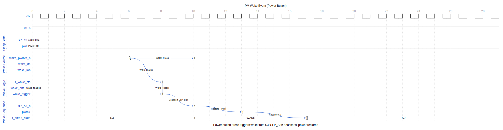
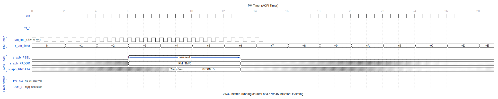
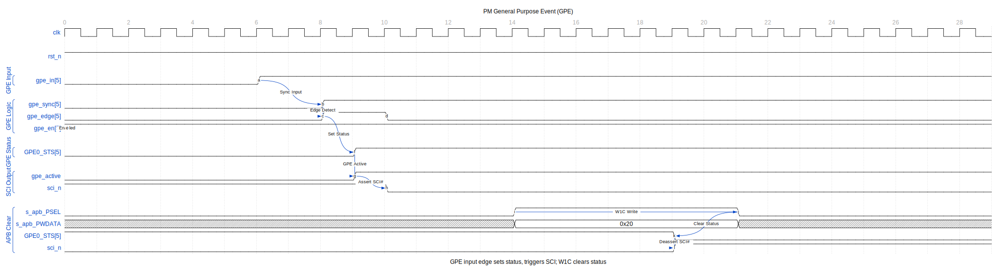

<!-- RTL Design Sherpa Documentation Header -->
<table>
<tr>
<td width="80">
  
</td>
<td>
  <strong>RTL Design Sherpa</strong> · <em>Learning Hardware Design Through Practice</em> 
  
    <a href="https://github.com/sean-galloway/RTLDesignSherpa">GitHub</a> ·
    <a href="https://github.com/sean-galloway/RTLDesignSherpa/blob/main/docs/DOCUMENTATION_INDEX.md">Documentation Index</a> ·
    <a href="https://github.com/sean-galloway/RTLDesignSherpa/blob/main/LICENSE">MIT License</a>
  
</td>
</tr>
</table>

---

<!-- End Header -->

# APB PM/ACPI - Overview

## Introduction

The APB PM/ACPI controller provides ACPI-compatible power management functionality with an APB interface. It handles system power states, events, and timer functionality.

## Key Features

- ACPI power management events
- PM1a/PM1b event blocks
- PM1 control block
- PM timer (24-bit, 3.579545 MHz)
- GPE (General Purpose Events) support
- System sleep state control
- Sci/SMI generation

## Applications

- System power management
- Sleep state transitions (S0-S5)
- Wake event handling
- Power button events
- Thermal events

## Block Diagram

## Timing Diagrams

### Sleep Entry (S3 Suspend)

Software initiates sleep by writing to PM1_CNT.

The sequence:
1. OS writes PM1_CNT with SLP_TYP (sleep type) and SLP_EN (enable)
2. PM controller initiates cache flush
3. Asserts SLP_S3# signal
4. Power removed from non-essential components

### Wake Event

Power button or other source triggers wake from sleep.

Wake sequence:
1. Wake source detected (power button, RTC alarm, LAN, etc.)
2. Wake status latched
3. SLP_Sx# deasserted
4. Power restored, system resumes to S0

### PM Timer

ACPI timer for OS timing services.

The 24-bit (or 32-bit) free-running counter clocked at 3.579545 MHz provides high-resolution timing for the OS. Timer overflow generates TMR_STS if enabled.

### General Purpose Event (GPE)

External events trigger SCI interrupt to OS.

GPE input edge sets status bit, which triggers SCI# if enabled. OS reads status, handles event, then writes 1-to-clear the status bit.

## Register Summary

| Offset | Name | Description |
|--------|------|-------------|
| 0x00 | PM1_STS | PM1 Event Status |
| 0x04 | PM1_EN | PM1 Event Enable |
| 0x08 | PM1_CNT | PM1 Control |
| 0x0C | PM_TMR | PM Timer (24-bit) |
| 0x10 | GPE0_STS | GPE0 Status |
| 0x14 | GPE0_EN | GPE0 Enable |
| 0x18 | GPE1_STS | GPE1 Status |
| 0x1C | GPE1_EN | GPE1 Enable |

---

**Next:** [02_architecture.md](02_architecture.md)
