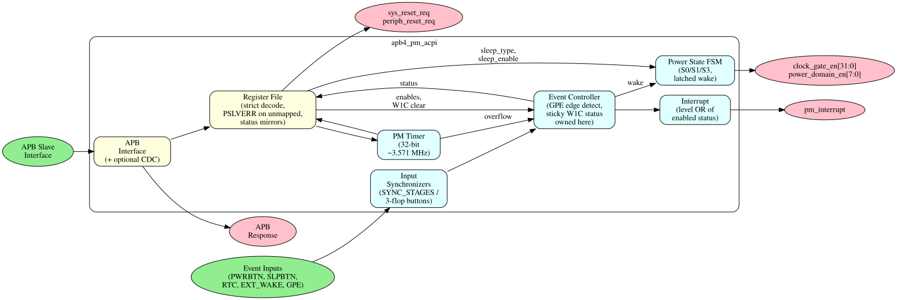
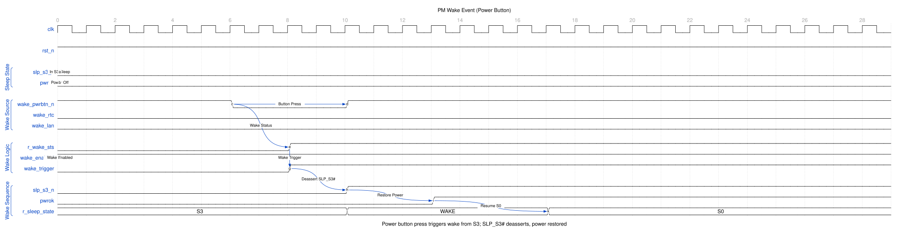
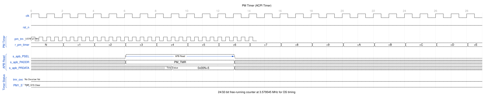
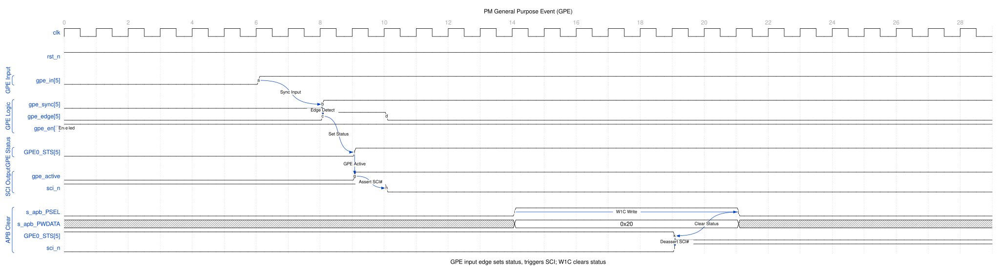

<!-- RTL Design Sherpa Documentation Header -->
<table>
<tr>
<td width="80">
  
</td>
<td>
  <strong>RTL Design Sherpa</strong> · <em>Learning Hardware Design Through Practice</em> 
  
    <a href="https://github.com/sean-galloway/RTLDesignSherpa">GitHub</a> ·
    <a href="https://github.com/sean-galloway/RTLDesignSherpa/blob/main/docs/DOCUMENTATION_INDEX.md">Documentation Index</a> ·
    <a href="https://github.com/sean-galloway/RTLDesignSherpa/blob/main/LICENSE">MIT License</a>
  
</td>
</tr>
</table>

---

<!-- End Header -->

# APB PM/ACPI - Overview

## Introduction

The APB PM/ACPI controller provides ACPI-compatible power management functionality with an APB interface. It handles system power states, events, and timer functionality.

## Key Features

- ACPI-style power management events
- Single PM1 control/status/enable block (no separate PM1a/PM1b)
- PM timer (32-bit, 3.579545 MHz equivalent via configurable divider)
- GPE (General Purpose Events) support: 32 sources in one bank
- Clock gating control (32 domains) and power domain control (8 domains)
- System sleep state control (S0/S1/S3)
- Single active-high `pm_interrupt` output (no separate SCI/SMI outputs)

## Applications

- System power management
- Sleep state transitions (S0/S1/S3)
- Wake event handling
- Power button events

## Block Diagram

### Figure 1.1: PM/ACPI Block Diagram

## Timing Diagrams

> Note: The rendered waveforms use illustrative, ACPI-generic signal names
> (for example SLP_S3#, SCI#) that do not all correspond to RTL ports. The RTL
> has no dedicated sleep-state pins or cache-flush request, and its only
> interrupt is the single active-high `pm_interrupt`. Refer to the register map
> (Chapter 5) for the authoritative register and field names.

### Waveform 1.1: Sleep Entry (S3 Suspend)

Software initiates sleep by writing PM1_CONTROL (0x010).

The sequence:
1. Software writes PM1_CONTROL with sleep_type (0=S0, 1=S1, 3=S3) and sleep_enable
2. The PM core FSM enters the requested sleep state (S1 or S3)
3. Clock gating / power domain outputs are updated for the target state
4. On completion, state_transition status is set

### Waveform 1.2: Wake Event

A wake source triggers a return to S0 from sleep.

Wake sequence:
1. Enabled wake source detected (power button, RTC alarm, external, or GPE)
2. Wake status latched in WAKE_STATUS / PM1_STATUS.wak_sts
3. The FSM transitions back to S0
4. `pm_interrupt` asserts if the corresponding enable is set

### Waveform 1.3: PM Timer

Free-running PM timer for timing services.

The 32-bit free-running counter (PM_TIMER_VALUE, 0x020) increments at a
3.579545 MHz equivalent rate using the PM_TIMER_CONFIG divider (default 0x001B,
divide-by-28). Overflow sets the timer_overflow / tmr_sts status.

### Waveform 1.4: General Purpose Event (GPE)

External events set a GPE status bit and can raise `pm_interrupt`.

A GPE input edge sets a bit in GPE0_STATUS_LO/HI. If the matching GPE0_ENABLE_LO/HI
bit is set, the aggregated GPE interrupt asserts `pm_interrupt`. Software reads
status, services the event, then writes 1-to-clear the status bit.

## Register Summary

Selected registers; see [Chapter 5](../ch05_registers/01_register_map.md) for the
complete map, fields, resets, and access types.

| Offset | Name | Access | Description |
|--------|------|--------|-------------|
| 0x000 | ACPI_CONTROL | RW | Global control and power state |
| 0x004 | ACPI_STATUS | W1C | Global status and power events |
| 0x008 | ACPI_INT_ENABLE | RW | Interrupt enable mask |
| 0x00C | ACPI_INT_STATUS | W1C | Interrupt status |
| 0x010 | PM1_CONTROL | RW | PM1 control (sleep, button override) |
| 0x014 | PM1_STATUS | W1C | PM1 status flags |
| 0x018 | PM1_ENABLE | RW | PM1 event enable mask |
| 0x020 | PM_TIMER_VALUE | RO | PM Timer current value (32-bit) |
| 0x024 | PM_TIMER_CONFIG | RW | PM Timer clock divider |
| 0x030 | GPE0_STATUS_LO | W1C | GPE status bits [15:0] |
| 0x034 | GPE0_STATUS_HI | W1C | GPE status bits [31:16] |
| 0x038 | GPE0_ENABLE_LO | RW | GPE enable bits [15:0] |
| 0x03C | GPE0_ENABLE_HI | RW | GPE enable bits [31:16] |
| 0x050 | CLOCK_GATE_CTRL | RW | Clock gating control [31:0] |
| 0x054 | CLOCK_GATE_STATUS | RO | Clock gate status |
| 0x058 | POWER_DOMAIN_CTRL | RW | Power domain control [7:0] |
| 0x05C | POWER_DOMAIN_STATUS | RO | Power domain status |
| 0x060 | WAKE_STATUS | W1C | Wake event sources |
| 0x064 | WAKE_ENABLE | RW | Wake event enable mask |
| 0x068 | RESET_CTRL | RW | Reset generation control |
| 0x06C | RESET_STATUS | RO | Reset source information |

---

**Next:** [02_architecture.md](02_architecture.md)
