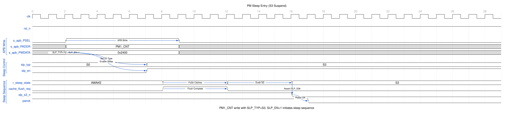
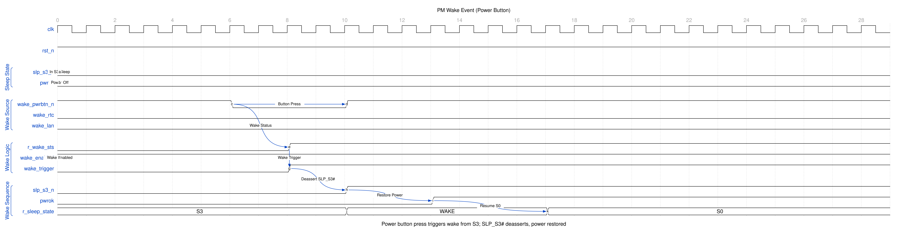
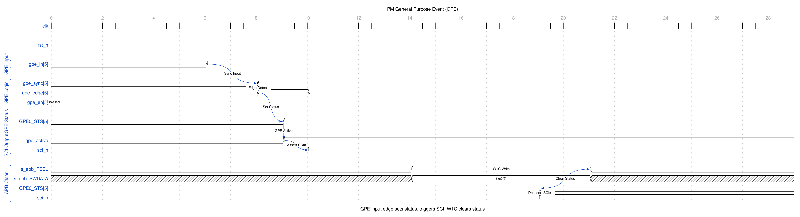

<!-- RTL Design Sherpa Documentation Header -->
<table>
<tr>
<td width="80">
  
</td>
<td>
  <strong>RTL Design Sherpa</strong> · <em>Learning Hardware Design Through Practice</em> 
  
    <a href="https://github.com/sean-galloway/RTLDesignSherpa">GitHub</a> ·
    <a href="https://github.com/sean-galloway/RTLDesignSherpa/blob/main/docs/DOCUMENTATION_INDEX.md">Documentation Index</a> ·
    <a href="https://github.com/sean-galloway/RTLDesignSherpa/blob/main/LICENSE">MIT License</a>
  
</td>
</tr>
</table>

---

<!-- End Header -->

# pm_acpi -- Overview

## Overview

The APB PM/ACPI controller provides ACPI-compatible power management
functionality with an APB interface. It handles system power states, events,
and timer functionality.

Key features:

- ACPI-style power management events
- Single PM1 control/status/enable block (no separate PM1a/PM1b)
- PM timer (32-bit, ~3.571 MHz at the default divider; 3.579545 MHz is
  the ACPI target -- exact only with pm_clk = 100.227 MHz)
- GPE (General Purpose Events) support: 32 sources in one bank, rising-edge
  detected, per-bit sticky status with a W1C clear
- Clock gating control (32 domains) and power domain control (8 domains)
- System sleep state control (S0/S1/S3)
- Single active-high `pm_interrupt` output (no separate SCI/SMI outputs),
  a level over the enabled sticky status bits
- Wake from GPE, power button, RTC alarm or an external pin, with the wake
  request latched so a one-cycle source lands in S0 and stays there

Applications:

- System power management
- Sleep state transitions (S0/S1/S3)
- Wake event handling
- Power button events

### Figure 1.1: PM/ACPI Block Diagram

## Parameters

Top-level parameters on apb4_pm_acpi:

| Parameter | Description |
|-----------|-------------|
| `CDC_ENABLE` | 0 = single pclk domain, 1 = separate core clock via apb4_slave_cdc |
| `USE_JOHNSON` | CDC counter encoding (default 0) |
| `SYNC_STAGES` | Depth of the `rtc_alarm`, `ext_wake_n` and `gpe_events` input synchronizers in pm_acpi_core; must be at least 2 (default 2) |

There is no depth parameter -- the CDC FIFO depth is hardcoded to 2 at the
apb4_slave_cdc instantiation.

### Input Synchronizers

Every device pin that feeds the core is asynchronous to it, in both
CDC_ENABLE settings, so each one passes a synchronizer before anything looks
at it. `rtc_alarm`, `ext_wake_n` and the 32 `gpe_events` bits go through
SYNC_STAGES flops; `power_button_n` and `sleep_button_n` keep their own
3-flop chain, whose last two stages also supply the press edge detect. The
cost is SYNC_STAGES clocks of latency on the first three (three clocks on
the buttons), and a pulse shorter than one core clock may not be seen at
all -- drive any of them for at least two core-clock periods. The GPE edge
reference tracks the synchronized input every cycle, so a level that changed
while GPE was disabled does not fabricate an edge when software enables it.
`rtc_alarm` and `ext_wake_n` are edge-latched the same way as GPE and the
buttons: a rising-edge detector follows the synchronizer and the edge sets
the sticky bit, so a held level sets it once, a W1C clears it while the pin
is still asserted, and the pin must deassert and reassert to set it again.

One clocking caveat up front, because it bites: `pm_interrupt` and the
clock-gate, power-domain and reset-request outputs are driven from the CORE
clock domain (pm_clk when CDC_ENABLE=1) -- synchronize them externally if
you consume them on another clock.

## Functional Description

### Register Summary

Selected registers; see [Chapter 5](../ch05_registers/01_register_map.md) for the
complete map, fields, resets, and access types.

| Offset | Name | Access | Description |
|--------|------|--------|-------------|
| 0x000 | ACPI_CONTROL | RW | Global control and power state |
| 0x004 | ACPI_STATUS | W1C | Global status and power events |
| 0x008 | ACPI_INT_ENABLE | RW | Interrupt enable mask |
| 0x00C | ACPI_INT_STATUS | W1C | Interrupt status |
| 0x010 | PM1_CONTROL | RW | PM1 control (sleep, button override) |
| 0x014 | PM1_STATUS | W1C | PM1 status flags |
| 0x018 | PM1_ENABLE | RW | PM1 event enable mask |
| 0x020 | PM_TIMER_VALUE | RO | PM Timer current value (32-bit) |
| 0x024 | PM_TIMER_CONFIG | RW | PM Timer clock divider |
| 0x030 | GPE0_STATUS_LO | W1C | GPE status bits [15:0] |
| 0x034 | GPE0_STATUS_HI | W1C | GPE status bits [31:16] |
| 0x038 | GPE0_ENABLE_LO | RW | GPE enable bits [15:0] |
| 0x03C | GPE0_ENABLE_HI | RW | GPE enable bits [31:16] |
| 0x050 | CLOCK_GATE_CTRL | RW | Clock gating control [31:0] |
| 0x054 | CLOCK_GATE_STATUS | RO | Clock gate status |
| 0x058 | POWER_DOMAIN_CTRL | RW | Power domain control [7:0] |
| 0x05C | POWER_DOMAIN_STATUS | RO | Power domain status |
| 0x060 | WAKE_STATUS | W1C | Wake event sources |
| 0x064 | WAKE_ENABLE | RW | Wake event enable mask |
| 0x068 | RESET_CTRL | RW | Reset generation control |
| 0x06C | RESET_STATUS | RO | Reset source information |

Only these twenty-one addresses decode. Every other address in the 4 KB
window is dropped -- the write is ignored, the read returns 0 -- and answered
with PSLVERR.

### Sticky Status and the Interrupt

Every W1C status bit in the map -- ACPI_STATUS, ACPI_INT_STATUS, PM1_STATUS,
WAKE_STATUS and GPE0_STATUS_LO/HI -- lives in pm_acpi_core, and the register
block only mirrors it. A hardware event sets the bit, and it holds until
software writes a 1 to that bit position; a write of 0 does nothing, a write
to one register never touches another, and a byte-strobed write (PSTRB) can
only clear bits inside the enabled bytes. If a set and a clear land in the
same cycle the set wins, so an event cannot fall between a read and its
acknowledge.

`pm_interrupt` is a level: the OR of the enabled sticky bits, deasserting
only once software has cleared every enabled source. Three groups feed it:

| Term | Status bit | Enabled by |
|------|------------|------------|
| PME, wake, timer overflow, state transition | ACPI_STATUS bit N | ACPI_INT_ENABLE bit N |
| PM1 timer, power button, sleep button, RTC | PM1_STATUS bit N | PM1_ENABLE bit N, then ACPI_INT_ENABLE.pm1_enable |
| GPE source N | GPE0_STATUS bit N | GPE0_ENABLE bit N, then ACPI_INT_ENABLE.gpe_int_enable |

PM1_STATUS.wak_sts has no enable bit, matching ACPI: a wake is reported, it
is not an interrupt source on its own, so it is masked out of the PM1 term.
ACPI_CONTROL.acpi_enable is the SCI_EN-like master gate: it gates GPE event
capture and the pin itself, while PM1_STATUS and WAKE_STATUS keep recording
their events with it clear, so software can see what happened before it
enabled the block. ACPI_INT_STATUS is an unconditional per-source event log
of the same events: each bit sets when its event occurs whether or not the
matching enable is set (gpe_int from the GPE edge events, not the pending
level), each clears by its own W1C on its own, and none of it feeds the pin
-- if it did, dropping one interrupt would mean clearing two registers.

### Power State FSM

Four states: S0 working, S1 sleep, S3 suspend and a one-cycle TRANSITION
state the machine passes through on the way in and on the way out.
PM1_CONTROL.sleep_enable is a one-shot request (it self-clears and the core
edge-detects it), so one write is one sleep request: from S0, a request with
sleep_type 1 or 3 goes through TRANSITION into S1 or S3; any other
sleep_type stays in S0. From S1 or S3, any enabled wake source goes through
TRANSITION back to S0.

The part that matters for a pulsed source: the core latches the wake request
while it is out of S0, and in TRANSITION a latched or live wake outranks the
still-programmed sleep_type. A one-cycle power-button press therefore lands
in S0 and stays there, and software does not have to unprogram sleep_type
after a wake. The latch drops on reaching S0 and on the next sleep request.
A wake event that lands in the exact cycle of the sleep request is not
latched as a wake: the sticky status bit and the level interrupt still
record it, the machine enters the programmed sleep state, and the next wake
event brings it back. ACPI_CONTROL.soft_reset (one core-clock pulse per
write, like the RESET_CTRL requests) forces the machine back to S0, clears
every sticky status register and the latched wake, and leaves configuration
alone.

## Waveforms

> Note: The rendered waveforms use illustrative, ACPI-generic signal names
> (for example SLP_S3#, SCI#) that do not all correspond to RTL ports. The RTL
> has no dedicated sleep-state pins or cache-flush request, and its only
> interrupt is the single active-high `pm_interrupt`. Refer to the register map
> (Chapter 5) for the authoritative register and field names.

### Waveform 1.1: Sleep Entry (S3 Suspend)

Software initiates sleep by writing PM1_CONTROL (0x010).

The sequence:
1. Software writes PM1_CONTROL with sleep_type (0=S0, 1=S1, 3=S3) and sleep_enable
2. The PM core FSM enters the requested sleep state (S1 or S3)
3. Clock gating / power domain outputs are updated for the target state
4. On completion, ACPI_STATUS.state_transition sets and holds until
   software writes 1 to clear it; `pm_interrupt` asserts if
   ACPI_INT_ENABLE.state_trans_enable is set

### Waveform 1.2: Wake Event

A wake source triggers a return to S0 from sleep.

Wake sequence:
1. Enabled wake source detected (power button press, RTC alarm, external
   pin or an enabled GPE), after its synchronizer
2. Wake status set in WAKE_STATUS and PM1_STATUS.wak_sts, and the wake
   request latched in the core
3. The FSM passes through TRANSITION back to S0; the latched request
   outranks the still-programmed sleep_type, so a one-cycle source such as
   the button stays in S0
4. `pm_interrupt` asserts if the corresponding enable is set, and holds
   until software clears the status

The waveform is drawn with the power button, the one source that is a
single-cycle pulse; the level-driven sources (RTC alarm, `ext_wake_n`, GPE)
are edge-latched after their synchronizers and follow the same path.

### Waveform 1.3: PM Timer

Free-running PM timer for timing services.

The 32-bit free-running counter (PM_TIMER_VALUE, 0x020) increments at
~3.571 MHz from a 100 MHz pm_clk using the PM_TIMER_CONFIG divider
(default 0x001B, divide-by-28; 0.23% below the ACPI-standard
3.579545 MHz). Overflow sets ACPI_STATUS.timer_overflow and
PM1_STATUS.tmr_sts, both sticky until cleared, and `pm_interrupt` holds
while either bit is set and enabled.

### Waveform 1.4: General Purpose Event (GPE)

External events set a GPE status bit and can raise `pm_interrupt`.

A rising edge on a synchronized GPE input sets that one bit in
GPE0_STATUS_LO/HI (when ACPI and GPE are enabled) and it holds. If the
source is enabled in GPE0_ENABLE and ACPI_INT_ENABLE.gpe_int_enable is set,
`pm_interrupt` asserts; software reads the status, services the event and
writes 1 to the bit, which clears it, drops the interrupt and -- because the
same pending term feeds the GPE wake -- unblocks the next sleep entry.
Clearing is never gated by the enables, so software can always drain the
register.

---

## Navigation

**Next:** Chapter 2 (Architecture) is planned and not yet written -- see
the index
