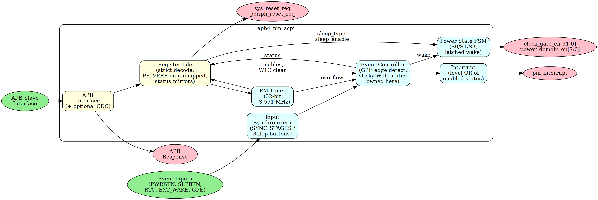

<!-- RTL Design Sherpa Documentation Header -->
<table>
<tr>
<td width="80">
  
</td>
<td>
  <strong>RTL Design Sherpa</strong> · <em>Learning Hardware Design Through Practice</em> 
  
    <a href="https://github.com/sean-galloway/RTLDesignSherpa">GitHub</a> ·
    <a href="https://github.com/sean-galloway/RTLDesignSherpa/blob/main/docs/DOCUMENTATION_INDEX.md">Documentation Index</a> ·
    <a href="https://github.com/sean-galloway/RTLDesignSherpa/blob/main/LICENSE">MIT License</a>
  
</td>
</tr>
</table>

---

<!-- End Header -->

# pm_acpi MAS -- Micro Architecture Specification

**Component:** APB Power Management / ACPI Controller
**Version:** 1.1
**Last Updated:** 2026-09-09
**Status:** RTL Functional -- per-bit sticky W1C status owned by the core
(ACPI_STATUS, ACPI_INT_STATUS, PM1_STATUS, WAKE_STATUS, GPE0_STATUS), a GPE
clear path that drops the interrupt and unblocks sleep, PM1_ENABLE gating the
interrupt, a level `pm_interrupt`, a latched wake request so a pulsed source
lands in S0 and stays, SYNC_STAGES input synchronizers, strict address decode
with PSLVERR and a sticky RESET_STATUS (issue #54 fixes, 2026-09-09).
Clock-gate and power-domain transitions are instant, there is no S5 and GPE is
edge-only; that deferred work is tracked as RLB-009.

---

## Overview

> Status (2026-07-22): Only the Chapter 1 overview and the Chapter 5 register
> map exist in this tree today. The remaining chapters listed below are planned
> but not yet written; they are shown without links.

### Block Diagram

### Version History

| Version | Date | Author | Changes |
|---------|------|--------|---------|
| 1.0 | 2025-12-01 | RTL Design Sherpa | Initial specification |
| 1.1 | 2026-09-09 | RTL Design Sherpa | Issue #54 fixes: sticky per-bit W1C status moved into pm_acpi_core with set-wins-over-clear and PSTRB-honoured clears, GPE status on the synchronized edge with a W1C clear that drops gpe_int and unblocks sleep, PM1_ENABLE per-source interrupt gating (wak_sts has no enable), level pm_interrupt over enabled sticky bits, latched wake outranking sleep_type with a one-shot sleep_enable, SYNC_STAGES synchronizers on rtc_alarm/ext_wake_n/gpe_events, strict 21-register decode with PSLVERR (no 0x80 aliasing), sticky por_reset/sw_reset with wired RESET_CTRL requests and a soft_reset that clears all status; storage-only fields stated; deferred work moved to RLB-009 |

---

## Navigation

### Chapter 1: Overview
- [01_overview.md](ch01_overview/01_overview.md) - Component overview
- 02_architecture.md - Architecture *(planned, not yet written)*

### Chapter 2: Blocks
- 00_overview.md - Block hierarchy *(planned, not yet written)*

### Chapter 3: Interfaces
- 00_overview.md - Interface summary *(planned, not yet written)*

### Chapter 4: Programming Model
- 00_overview.md - Programming overview *(planned, not yet written)*

### Chapter 5: Registers
- [01_register_map.md](ch05_registers/01_register_map.md) - Register map
