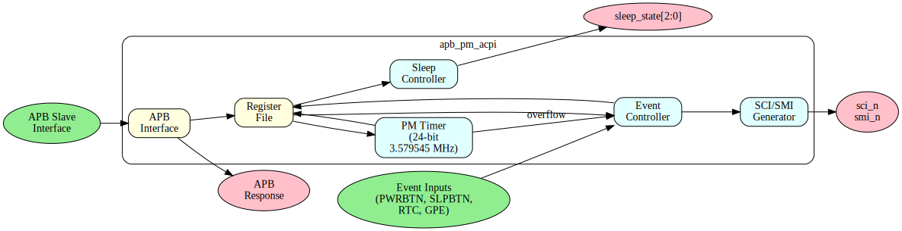

# APB PM/ACPI - Overview

## Introduction

The APB PM/ACPI controller provides ACPI-compatible power management functionality with an APB interface. It handles system power states, events, and timer functionality.

## Key Features

- ACPI power management events
- PM1a/PM1b event blocks
- PM1 control block
- PM timer (24-bit, 3.579545 MHz)
- GPE (General Purpose Events) support
- System sleep state control
- Sci/SMI generation

## Applications

- System power management
- Sleep state transitions (S0-S5)
- Wake event handling
- Power button events
- Thermal events

## Block Diagram

## Register Summary

| Offset | Name | Description |
|--------|------|-------------|
| 0x00 | PM1_STS | PM1 Event Status |
| 0x04 | PM1_EN | PM1 Event Enable |
| 0x08 | PM1_CNT | PM1 Control |
| 0x0C | PM_TMR | PM Timer (24-bit) |
| 0x10 | GPE0_STS | GPE0 Status |
| 0x14 | GPE0_EN | GPE0 Enable |
| 0x18 | GPE1_STS | GPE1 Status |
| 0x1C | GPE1_EN | GPE1 Enable |

---

**Next:** [02_architecture.md](02_architecture.md)
