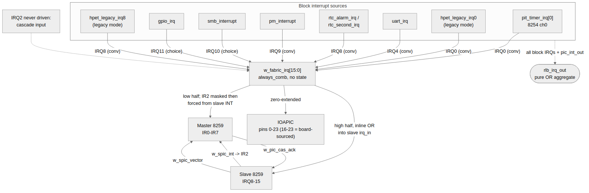

<!-- RTL Design Sherpa Documentation Header -->
<table>
<tr>
<td width="80">
  
</td>
<td>
  <strong>RTL Design Sherpa</strong> · <em>Learning Hardware Design Through Practice</em> 
  
    <a href="https://github.com/sean-galloway/RTLDesignSherpa">GitHub</a> ·
    <a href="https://github.com/sean-galloway/RTLDesignSherpa/blob/main/docs/DOCUMENTATION_INDEX.md">Documentation Index</a> ·
    <a href="https://github.com/sean-galloway/RTLDesignSherpa/blob/main/LICENSE">MIT License</a>
  
</td>
</tr>
</table>

---

<!-- End Header -->

# RLB Top - The Interrupt Fabric Block

## Overview

The interrupt fabric is not a module. It is one `always_comb` block that
builds `w_fabric_irq[15:0]` from the blocks' interrupt outputs, plus three
continuous assignments that distribute the result: to the two 8259s, to
the IOAPIC, and into the `rlb_irq_out` aggregate. It is listed here as a
block because the integration behaviour lives in this glue, and a reader
who skips it understands the address map but not the subsystem.

Its job: put every block interrupt on its **conventional legacy line**
so that standard driver software and either interrupt controller see a
recognisable PC/AT wiring, without the board having to wire ten interrupt
pins back in.

## The Routing Table

Seven block-level sources drive the fabric's six lines — PIT channel 0 and
HPET's legacy pair both land on IRQ0. The six driven lines:

| Line | Driver(s) | Origin |
| --- | --- | --- |
| IRQ0 | `pit_timer_irq[0]` \| `hpet_legacy_irq0` | 8254 channel-0 tick, replaced by HPET timer 0 in legacy-replacement mode |
| IRQ4 | `uart_irq` | UART 16550 (COM1 by convention) |
| IRQ8 | `rtc_alarm_irq` \| `rtc_second_irq` \| `hpet_legacy_irq8` | RTC alarm + periodic, replaced by HPET timer 1 in legacy mode |
| IRQ9 | `pm_interrupt` | PM/ACPI |
| IRQ10 | `smb_interrupt` | SMBus — **choice**, parameter `IRQ_SMBUS` |
| IRQ11 | `gpio_irq` | GPIO — **choice**, parameter `IRQ_GPIO` |

Every other fabric line is constant zero, including **IRQ2, which is
deliberately never driven**: it is the 8259 cascade input, carried from
the slave controller's `INT` (see [The Cascade Cross-Connect](03_cascade.md)).
Anything routed onto IRQ2 reaches nothing — QEMU shipped exactly that
bug, which is why the line is commented in the RTL rather than left
implicit.

### Convention versus choice

IRQ0/4/8/9 come straight from the "Typical IRQ Assignments" table in the
IOAPIC book's register chapter, and are fixed `localparam`s inside
`rlb_top`. Making them overridable would invite silently diverging from
the wiring every driver already assumes. SMBus and GPIO have no
traditional line — the table offers only "Available" — so those two are
this subsystem's choice and are exposed as module parameters, meant to be
changed by an integrator who needs them elsewhere.

### The HPET legacy pair

`hpet_legacy_irq0` and `hpet_legacy_irq8` are not the general
`hpet_timer_irq` outputs. They are asserted only while
`HPET_CONFIG.legacy_replacement` is set, and while it is set the HPET
core suppresses timers 0/1 on their own pins — so the HPET and the
device it replaces can never both drive the same line for the same event.
The general `hpet_timer_irq` lines are deliberately **not** routed into
the fabric: they have no conventional legacy line (the same reason
`TIMER_INT_ROUTE_CAP` reads 0), and they reach `rlb_irq_out` and their
own pins only.

## Distribution

The built vector goes to three consumers:

**Both 8259s.** The master sees the low half through the IR2 mask and
cascade force described in the cascade page; the slave OR-es the upper
half into its external input inline:
`pic_irq_in[15:8] | w_fabric_irq[15:8]`. The fabric is **OR-ed into the
external inputs, not substituted for them** — `pic_irq_in` stays an
input, so a board keeps its external interrupt path and every existing
test keeps its direct drive.

**The IOAPIC.** `w_ioapic_irq = ioapic_irq_in | {zero-extend of
w_fabric_irq}` — the same sources on the same pin numbers, zero-extended
to `IOAPIC_NUM_IRQS` (24). The upper eight pins are PCI or additional
devices this subsystem does not source; they remain for the board.

**The aggregate.** `rlb_irq_out` is a pure OR of every block interrupt,
including `pic_int_out` — the delivered controller output, which is
exactly what a single-line consumer wants. `pic_int_out` appears **only**
here: feeding the 8259's own output back into its inputs would be a
combinational loop, and the aggregate drives no internal logic, so it is
safe to include.

## What the Fabric Does Not Do

- **No masking, latching, or priority.** It is wires and one OR tree.
  All policy — masking, vector selection, delivery — belongs to the
  8259s and the IOAPIC, and to the software that programs them
  ([Chapter 4](../ch04_programming/01_initialization.md)).
- **No CDC.** The fabric is combinational in the `pclk` domain. Every
  block runs `CDC_ENABLE(0)` in this configuration, so block interrupts
  are already synchronous to `pclk` before they reach the fabric.
- **No boot-interrupt rerouting.** That is the separate
  `u_ioapic_boot_intx` companion, described in the
  [Block Hierarchy Overview](00_overview.md) — it produces its own PIC
  inputs, which the master's input OR then combines with the fabric's.

## Verification Heritage

The routing table and the "OR-ed, not substituted" contract are the
subject of RLB TASK-015 (the fabric), TASK-017/TASK-018 (per-line and
per-block routing proof) and TASK-019 (the follow-up batch). The `full`
suite proves each of the six sourcing blocks reaches its own master or
slave IR line, per line rather than in aggregate, and its IOAPIC pin, and
passes coincident-assert cases across both PICs.

## Related Documents

- [Block Hierarchy Overview](00_overview.md) - where the fabric sits among the twelve instances
- [The Cascade Cross-Connect](03_cascade.md) - why IRQ2 is never driven
- [Per-Block Interrupt Pin Reference](../ch03_interfaces/03_interrupt_interfaces.md) - pin-level table including the pins the fabric does not touch
- [Use Cases](../ch04_programming/02_use_cases.md) - routing an interrupt end to end
