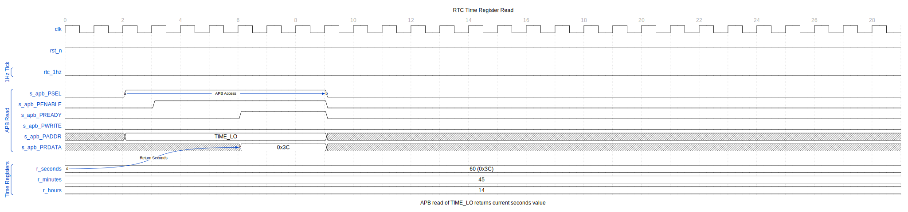
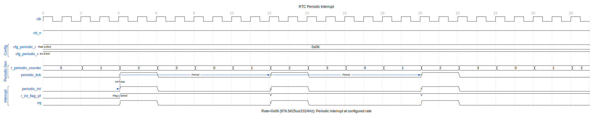

<!-- RTL Design Sherpa Documentation Header -->
<table>
<tr>
<td width="80">
  
</td>
<td>
  <strong>RTL Design Sherpa</strong> · <em>Learning Hardware Design Through Practice</em> 
  
    <a href="https://github.com/sean-galloway/RTLDesignSherpa">GitHub</a> ·
    <a href="https://github.com/sean-galloway/RTLDesignSherpa/blob/main/docs/DOCUMENTATION_INDEX.md">Documentation Index</a> ·
    <a href="https://github.com/sean-galloway/RTLDesignSherpa/blob/main/LICENSE">MIT License</a>
  
</td>
</tr>
</table>

---

<!-- End Header -->

# APB RTC - Overview

## Introduction

The APB RTC is a Real-Time Clock controller with an APB slave interface. It maintains time and date with battery backup support and provides alarm and periodic interrupt capabilities.

## Key Features

### Time Keeping
- Seconds, minutes, hours (12/24-hour mode)
- Day of week, date, month, year
- Century support (2000-2099)
- Leap year calculation
- BCD format storage

### Alarm Function
- Configurable alarm time
- Second, minute, hour, date match
- Daily or specific date alarm

### Interrupt Support
- Alarm match interrupt
- Periodic interrupt (1 Hz)
- Update-ended interrupt

### Power Management
- Low-power 32.768 kHz oscillator
- Battery backup domain support
- RAM retention (optional)

## Applications

- System timekeeping
- Scheduled wake-up
- Event timestamping
- Calendar functions
- Alarm clock

## Block Diagram

## Timing Diagrams

### Time Register Read

Reading the time registers returns the current time value.

### Time Increment with Rollover

Shows the cascade of time registers as seconds overflow to minutes, minutes to hours, etc.

The 1Hz tick from the 32.768kHz prescaler triggers the seconds counter. Each overflow cascades to the next register, demonstrating the 23:59:59 to 00:00:00 rollover.

### Alarm Match

When the current time matches the alarm setting, an interrupt is generated.

All configured alarm fields (seconds, minutes, hours) must match simultaneously for the alarm to trigger.

### Periodic Interrupt

The RTC can generate periodic interrupts at a configurable rate.

The rate selector determines the interrupt frequency from the 32.768kHz oscillator.

### Update-In-Progress (UIP)

Software should check UIP before reading time to avoid inconsistent values.

The UIP flag asserts before the time update cycle begins. Software polls until UIP clears, then reads time registers for consistent values.

## Register Summary

| Offset | Name | Access | Description |
|--------|------|--------|-------------|
| 0x00 | RTC_SECONDS | RW | Seconds (0-59) |
| 0x04 | RTC_MINUTES | RW | Minutes (0-59) |
| 0x08 | RTC_HOURS | RW | Hours (0-23 or 1-12) |
| 0x0C | RTC_DAY | RW | Day of week (1-7) |
| 0x10 | RTC_DATE | RW | Day of month (1-31) |
| 0x14 | RTC_MONTH | RW | Month (1-12) |
| 0x18 | RTC_YEAR | RW | Year (0-99) |
| 0x1C | RTC_CENTURY | RW | Century (20-29) |
| 0x20 | RTC_ALARM_SEC | RW | Alarm seconds |
| 0x24 | RTC_ALARM_MIN | RW | Alarm minutes |
| 0x28 | RTC_ALARM_HOUR | RW | Alarm hours |
| 0x2C | RTC_ALARM_DATE | RW | Alarm date |
| 0x30 | RTC_CONTROL | RW | Control register |
| 0x34 | RTC_STATUS | RO/W1C | Status register |

## Parameters

| Parameter | Default | Description |
|-----------|---------|-------------|
| CDC_ENABLE | 0 | Clock domain crossing |

---

**Next:** [02_architecture.md](02_architecture.md) - Architecture details
