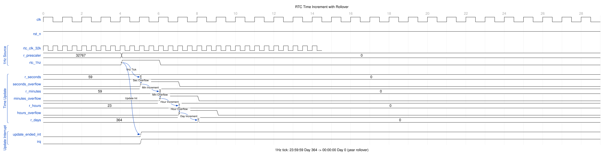
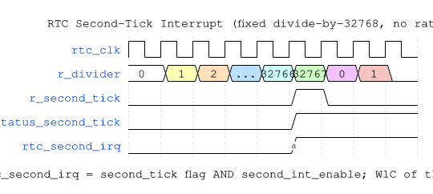

<!-- RTL Design Sherpa Documentation Header -->
<table>
<tr>
<td width="80">
  
</td>
<td>
  <strong>RTL Design Sherpa</strong> · <em>Learning Hardware Design Through Practice</em> 
  
    <a href="https://github.com/sean-galloway/RTLDesignSherpa">GitHub</a> ·
    <a href="https://github.com/sean-galloway/RTLDesignSherpa/blob/main/docs/DOCUMENTATION_INDEX.md">Documentation Index</a> ·
    <a href="https://github.com/sean-galloway/RTLDesignSherpa/blob/main/LICENSE">MIT License</a>
  
</td>
</tr>
</table>

---

<!-- End Header -->

# APB RTC - Overview

## Overview

The APB RTC is a real-time clock controller with an APB slave interface. It keeps time and date, and it raises two kinds of interrupts: a programmable alarm and a fixed 1 Hz tick. The counters live on their own 32.768 kHz clock; the register file lives on pclk; every path between the two is an explicit clock crossing.

### Figure 1.1: RTC Block Diagram

## Functional Description

The feature set is short. Each item below is what the RTL does as of the issue #56 fixes (2026-09-09) — the earlier caveats about broken modes and missing crossings no longer apply.

### Time Keeping
- Seconds, minutes, hours in 24-hour or 12-hour (AM/PM) mode — in 12-hour
  mode bit 7 of RTC_HOURS is the PM flag, in binary and in BCD alike
- Day of month (1-31), month, year (0-99, base year 2000 is hardcoded)
- Leap year calculation (every year divisible by 4 in 2000-2099); the year field wraps 99 to 00 with no century carry
- Binary or BCD register format; the calendar arithmetic runs in binary
  internally and BCD exists only at the register boundary, so the
  days-in-month table — leap Februaries included — is right in both formats

### Alarm Function
- Single programmable alarm
- Seconds, minutes, hours match with per-field match enables
- Held off while the time is being set or a new time is being loaded
- Asserts on the tick at which the readable time equals the programmed
  value, never a second later

### Interrupt Support
- Alarm match interrupt
- Second-tick interrupt (fixed 1 Hz)
- Both flags are sticky, write-1-to-clear, and a set that lands in the same
  cycle as a clear wins

### Clock Domains
- Counter domain on `rtc_clk`, reset by `rtc_resetn` through a reset
  synchronizer; APB domain on `pclk`, reset by `presetn` — the two reset
  independently
- Four crossings between them, each on one of the repo's CDC primitives, so
  setting the time works at the real 100 MHz : 32.768 kHz ratio and a
  six-register read is one coherent snapshot; the time-set commit is a
  four-phase request/acknowledge whose source side is reset by `rtc_resetn`
  alone (synchronized into pclk), so a `presetn` reset alone can neither lose nor
  fabricate a transfer and an `rtc_resetn` reset alone resets the link on
  both sides; the destination sides of the snapshot and tick synchronizers
  share that reset, so a `presetn` pulse can neither destroy nor fabricate a
  snapshot pulse or a flag event either
- A `presetn`-only reset keeps the clock: the counter domain holds its
  run/enable state and its clock source across it, RTC_CONFIG reads its
  reset value afterwards, and the counter domain applies the crossed
  configuration (enable, clock source, mode bits, alarm fields) only once
  software has written RTC_CONFIG again, so the counters keep counting in
  the mode they were set in — the time is still correct after a bus reset
  and `time_valid` is as it was
- `clock_select=1` runs the counters from pclk for test; change it only with
  `rtc_enable` low

### Power Management
- External 32.768 kHz clock input (no oscillator or power-management
  logic on chip)

### Applications

- System timekeeping
- Scheduled wake-up
- Event timestamping
- Calendar functions
- Alarm clock

### Register Summary

| Offset | Name | Access | Description |
|--------|------|--------|-------------|
| 0x00 | RTC_CONFIG | RW | Global configuration (enable, hour/BCD/clock mode, time-set) |
| 0x04 | RTC_CONTROL | RW | Alarm and interrupt enables |
| 0x08 | RTC_STATUS | RO/W1C | Status flags and indicators |
| 0x0C | RTC_SECONDS | RW | Seconds (0-59) |
| 0x10 | RTC_MINUTES | RW | Minutes (0-59) |
| 0x14 | RTC_HOURS | RW | Hours (0-23 or 1-12) |
| 0x18 | RTC_DAY | RW | Day of month (1-31) |
| 0x1C | RTC_MONTH | RW | Month (1-12) |
| 0x20 | RTC_YEAR | RW | Year (0-99, base 2000) |
| 0x24 | RTC_ALARM_SEC | RW | Alarm seconds |
| 0x28 | RTC_ALARM_MIN | RW | Alarm minutes |
| 0x2C | RTC_ALARM_HOUR | RW | Alarm hours |
| 0x30 | RTC_ALARM_MASK | RW | Alarm field match enables |

Only these thirteen addresses are decoded; everything else in the 4 KB window is dropped with PSLVERR. See [ch05 Register Map](../ch05_registers/01_register_map.md) for full bit-level definitions, the time-set protocol and the coherent-read contract.

## Timing

The four scenarios below cover normal operation: reading the time, watching it roll over, and the two interrupt sources.

### Waveform 1.1: Time Register Read

Reading the time registers returns the current time value.

Read the six time registers as the burst RTC_SECONDS through RTC_YEAR. The RTC_SECONDS read returns the live seconds and in the same cycle latches minutes, hours, day, month, year, `pm_indicator` and `time_valid`, so the reads that follow belong to the same instant as the seconds value and a tick landing in the middle of the burst cannot mix an old seconds value with a new minutes value. Nothing opens, closes or times out: minutes through year hold what the most recent seconds read captured until the next one, and RTC_SECONDS itself is never latched, so polling it alone returns the live seconds every time — read seconds first. A read reflects a tick about 3-4 pclk cycles after it happens.

### Waveform 1.2: Time Increment with Rollover

Shows the cascade of time registers as seconds overflow to minutes, minutes to hours, etc.

The 1 Hz tick from the 32.768 kHz prescaler triggers the seconds counter. Each overflow cascades to the next register, demonstrating the 23:59:59 to 00:00:00 rollover.

### Waveform 1.3: Alarm Match

When the current time matches the alarm setting, an interrupt is generated.

All configured alarm fields (seconds, minutes, hours) must match simultaneously for the alarm to trigger. The compare is made against the time that becomes readable on that tick, so the alarm asserts at the moment the time registers equal the programmed value, never one second later: an alarm set for hh:mm:ss reads back as hh:mm:ss when the flag sets. In 12-hour mode RTC_ALARM_HOUR is compared as the full byte, PM flag included.

### Waveform 1.4: Second-Tick Interrupt

The RTC generates a fixed 1 Hz tick interrupt when enabled by `second_int_enable`.

The 1 Hz tick is derived from the 32.768 kHz oscillator by a fixed divide-by-32768; there is no programmable rate selector. Each tick sets the `second_tick` status flag and, when enabled, asserts the second-tick interrupt.

---

## Navigation

**Next:** [02_architecture.md](02_architecture.md) - Architecture details
