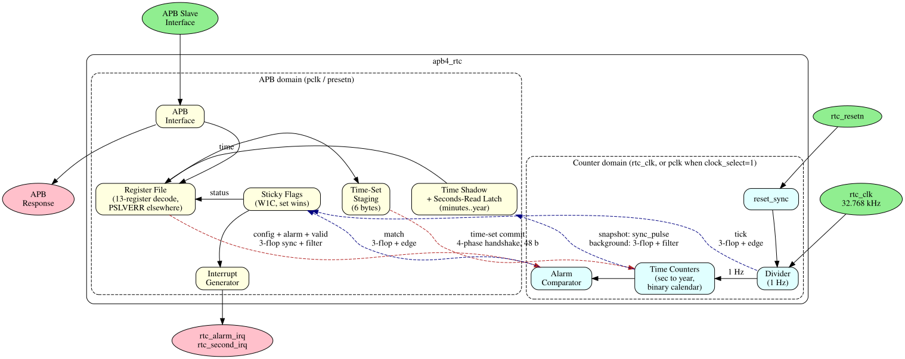
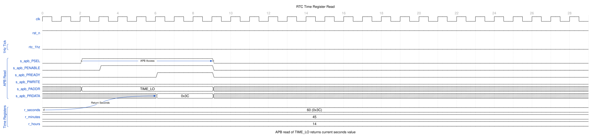
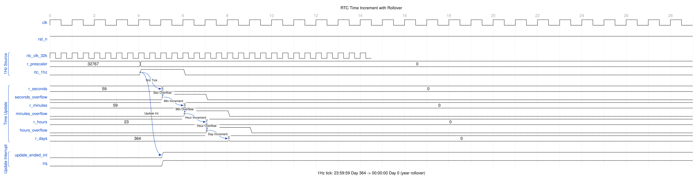
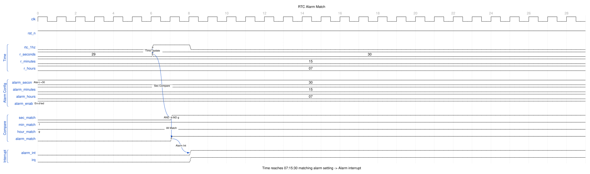
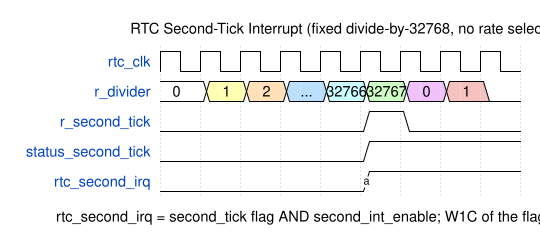

<!-- RTL Design Sherpa Documentation Header -->
<table>
<tr>
<td width="80">
  
</td>
<td>
  <strong>RTL Design Sherpa</strong> · <em>Learning Hardware Design Through Practice</em> 
  
    <a href="https://github.com/sean-galloway/RTLDesignSherpa">GitHub</a> ·
    <a href="https://github.com/sean-galloway/RTLDesignSherpa/blob/main/docs/DOCUMENTATION_INDEX.md">Documentation Index</a> ·
    <a href="https://github.com/sean-galloway/RTLDesignSherpa/blob/main/LICENSE">MIT License</a>
  
</td>
</tr>
</table>

---

<!-- End Header -->

# APB RTC - Overview

## Introduction

The APB RTC is a Real-Time Clock controller with an APB slave interface. It maintains time and date and provides alarm and 1 Hz tick interrupt capabilities.

## Key Features

### Time Keeping
- Seconds, minutes, hours (12/24-hour mode)
- Day of month (1-31), month, year (0-99, base year 2000 is hardcoded)
- Leap year calculation (base 2000, valid through 2099); the year field wraps 99 to 00 with no century carry
- Binary format by default, optional BCD format

### Alarm Function
- Single programmable alarm
- Seconds, minutes, hours match with per-field match enables

### Interrupt Support
- Alarm match interrupt
- Second-tick interrupt (fixed 1 Hz)

### Power Management
- Low-power 32.768 kHz oscillator

## Applications

- System timekeeping
- Scheduled wake-up
- Event timestamping
- Calendar functions
- Alarm clock

## Block Diagram

### Figure 1.1: RTC Block Diagram

## Timing Diagrams

### Waveform 1.1: Time Register Read

Reading the time registers returns the current time value.

### Waveform 1.2: Time Increment with Rollover

Shows the cascade of time registers as seconds overflow to minutes, minutes to hours, etc.

The 1Hz tick from the 32.768kHz prescaler triggers the seconds counter. Each overflow cascades to the next register, demonstrating the 23:59:59 to 00:00:00 rollover.

### Waveform 1.3: Alarm Match

When the current time matches the alarm setting, an interrupt is generated.

All configured alarm fields (seconds, minutes, hours) must match simultaneously for the alarm to trigger.

### Waveform 1.4: Second-Tick Interrupt

The RTC generates a fixed 1 Hz tick interrupt when enabled by `second_int_enable`.

The 1 Hz tick is derived from the 32.768 kHz oscillator by a fixed divide-by-32768; there is no programmable rate selector. Each tick sets the `second_tick` status flag and, when enabled, asserts the second-tick interrupt.

## Register Summary

| Offset | Name | Access | Description |
|--------|------|--------|-------------|
| 0x00 | RTC_CONFIG | RW | Global configuration (enable, hour/BCD/clock mode, time-set) |
| 0x04 | RTC_CONTROL | RW | Alarm and interrupt enables |
| 0x08 | RTC_STATUS | RO/W1C | Status flags and indicators |
| 0x0C | RTC_SECONDS | RW | Seconds (0-59) |
| 0x10 | RTC_MINUTES | RW | Minutes (0-59) |
| 0x14 | RTC_HOURS | RW | Hours (0-23 or 1-12) |
| 0x18 | RTC_DAY | RW | Day of month (1-31) |
| 0x1C | RTC_MONTH | RW | Month (1-12) |
| 0x20 | RTC_YEAR | RW | Year (0-99, base 2000) |
| 0x24 | RTC_ALARM_SEC | RW | Alarm seconds |
| 0x28 | RTC_ALARM_MIN | RW | Alarm minutes |
| 0x2C | RTC_ALARM_HOUR | RW | Alarm hours |
| 0x30 | RTC_ALARM_MASK | RW | Alarm field match enables |

See [ch05 Register Map](../ch05_registers/01_register_map.md) for full bit-level definitions and the time-set protocol.

---

**Next:** [02_architecture.md](02_architecture.md) - Architecture details
