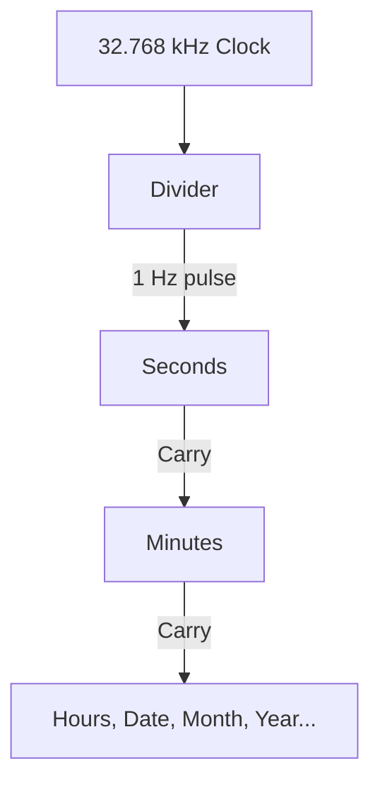
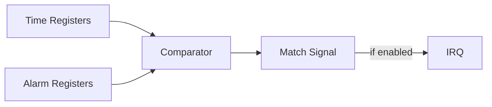
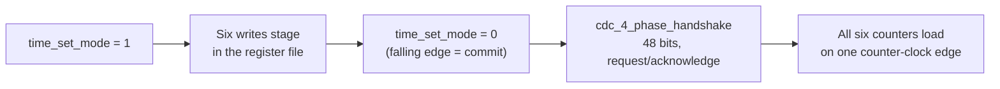

<!-- RTL Design Sherpa Documentation Header -->
<table>
<tr>
<td width="80">
  <a href="https://github.com/sean-galloway/RTLDesignSherpa">
    
  </a>
</td>
<td>
  <strong>RTL Design Sherpa</strong> · <em>Learning Hardware Design Through Practice</em><br>
  <sub>
    <a href="https://github.com/sean-galloway/RTLDesignSherpa">GitHub</a> ·
    <a href="https://github.com/sean-galloway/RTLDesignSherpa/blob/main/docs/DOCUMENTATION_INDEX.md">Documentation Index</a> ·
    <a href="https://github.com/sean-galloway/RTLDesignSherpa/blob/main/LICENSE">MIT License</a>
  </sub>
</td>
</tr>
</table>

---

<!-- End Header -->

# APB RTC - Architecture

## Overview

### Figure 1.2: RTC Architecture


The design splits the way you'd expect: the APB slave and register wrapper up top, the timekeeping core underneath. What the figure adds is the line down the middle — the register side is on pclk, the counters are on their own clock, and the five dashed arrows are the only traffic that crosses it.

### Module Hierarchy

```
apb4_rtc (Top Level)
+-- apb4_slave
+-- rtc_config_regs (Register Wrapper)         [pclk]
|   +-- peakrdl_to_cmdrsp
|   +-- rtc_regs (PeakRDL Generated)
|   +-- 13-register decode, PSLVERR elsewhere
|   +-- time-set staging and commit
|   +-- seconds-read latch (minutes to year)
|
+-- rtc_core
    +-- reset_sync (rtc_resetn onto the counter clock)
    +-- Divider and Time Counters (seconds to year)   [counter clock]
    +-- Calendar Arithmetic (binary; BCD at the boundary)
    +-- Alarm Comparator                               [counter clock]
    +-- Time Shadow, Sticky Flags, Interrupts          [pclk]
    +-- Clock crossings: glitch_free_n_dff_arn (x3),
        cdc_4_phase_handshake, sync_pulse
```

## Functional Description

### Time Update Flow


```mermaid
flowchart TD
    A["32.768 kHz Clock"] --> B["Divider"]
    B -->|"1 Hz pulse"| C["Seconds"]
    C -->|"Carry"| D["Minutes"]
    D -->|"Carry"| E["Hours, Date, Month, Year..."]
```

The counters advance on the divider rollover edge. The tick is raised on that same edge and marks the new second; the alarm compare is made against that new second — the time that becomes readable on the tick — so the alarm asserts at the moment the readable time equals the programmed value, and when either flag is visible on the APB side the time registers show the second the alarm was set for.

### Alarm Match Flow


```mermaid
flowchart LR
    A["Time Registers"] --> B["Comparator"]
    C["Alarm Registers"] --> B
    B --> D["Match Signal"]
    D -->|"if enabled"| E["IRQ"]
```

The comparator is held off while the counter domain sees `time_set_mode` set and for the few counter cycles of a commit, so a counter paused on the alarm value mid-programming does not raise the flag. A commit that lands exactly on the alarm value does not fire the alarm either: alarms fire on a tick, and the next evaluation compares the following second. The alarm values, mask and mode bits reach the comparator through a bit-by-bit crossing, so a change made while the RTC runs can be sampled as a value that was never programmed for one counter cycle; program the alarm and the mode bits with `alarm_enable` low (or the RTC disabled), then enable.

### Time Set Flow


```mermaid
flowchart LR
    A["time_set_mode = 1"] --> B["Six writes stage<br/>in the register file"]
    B --> C["time_set_mode = 0<br/>(falling edge = commit)"]
    C --> D["cdc_4_phase_handshake<br/>48 bits, request/acknowledge"]
    D --> E["All six counters load<br/>on one counter-clock edge"]
```

The pause while the time is staged is best effort at the production ratio: `time_set_mode` reaches the counter domain through the 3-flop config crossing, so the counters pause only if the bit is held long enough for the counter clock to sample it — about three counter clocks, ~90 us at 32.768 kHz. A staging window shorter than that is never seen, and the clock keeps running until the commit replaces the time. The commit does not depend on the pause: it brackets the tick, so the counters never take two updates on consecutive counter clocks, and the readable time after the commit is exactly the committed time.

### Clock Domains

| Domain | Clock | Reset | Holds |
|---|---|---|---|
| APB | `pclk` | `presetn` | register file, address decode, the time shadow software reads, the sticky status flags, the source side of the commit and the destination sides of the snapshot and tick synchronizers (reset by `rtc_resetn` alone, synchronized into pclk, never by `presetn` alone), the config-valid flag that gates the enable/clock-select crossing (set by any RTC_CONFIG write, cleared by `presetn`); the `commit_timeout` flag is the one sticky flag reset by the synchronized `rtc_resetn` instead, with the commit bookkeeping it reports on |
| Counter | `rtc_clk` (32.768 kHz), or `pclk` when `RTC_CONFIG.clock_select=1` | `rtc_resetn`, release synchronized onto the counter clock by `reset_sync` and additionally held until the clock-select flop has settled, which takes about seven to nine `pclk` edges after release — so the counter domain cannot leave reset while `pclk` is stopped; synchronized into pclk it also resets the bus-side commit bookkeeping (pending, busy, the timeout event detector) together with the handshake's source side | divider, the six counters, calendar arithmetic, alarm comparator, the run/enable state and the clock-source select (held in a flop under `rtc_resetn`; the counter domain's reset release waits until that select has been stable for three pclk, so a reset pulse cannot release the domain across a mux switch) |

The two resets are independent, in both directions, and the commit handshake's source side is reset by `rtc_resetn` alone (synchronized into pclk), never by `presetn` alone — `rtc_resetn` is synchronized into pclk for that purpose. A `presetn` reset alone clears the register file and the bus-side state but keeps the clock: the counter domain holds its run/enable state and its clock source across it, so timekeeping continues exactly as before, the time is still correct after the reset and `time_valid` remains as it was. RTC_CONFIG reads its reset value after the reset, but the counter domain applies a crossed `rtc_enable` or `clock_select` only after software has written RTC_CONFIG — a config-valid flag, set by any RTC_CONFIG write and cleared by `presetn`, crosses inside the 34-bit bundle and the hold loads only a settled word whose valid bit is set, so the valid bit is never seen ahead of the values it qualifies — and the clock-mux select is held in a flop under `rtc_resetn`, so `presetn` cannot switch the counter clock; software re-writes RTC_CONFIG to re-establish its configuration, and until it does the counters still format the time with the held BCD/12-hour settings while RTC_CONFIG reads 0, so the time is not to be read before that write. `time_set_mode` is the one field that is not held: it is a transient control, taken live from the crossing, so a `presetn` during staging releases the divider pause on its own and drops the staged time. The `commit_timeout` report is reset with the commit bookkeeping (the synchronized `rtc_resetn`), never by `presetn`, so a bus reset during a stall leaves the report standing while the stall is outstanding and an `rtc_resetn` that drops the transfer clears it. Any commit already in flight lands intact, never as zeros, and no stale acknowledge can complete a later commit early. Nor does a warm bus reset abort a commit software issued before it: a queued commit still lands with the data captured at its commit pulse, so the time can change shortly after a bus reset because of a request that predates it. An `rtc_resetn` reset alone returns the counters to the reset default (2000-01-01 00:00:00) and resets the commit link on both sides: a commit that already landed is not replayed, a commit that was still unacknowledged is dropped and software must re-issue it, and a commit issued after the reset works normally. The bus-side commit bookkeeping — pending, busy and the timeout event detector — is reset by either `presetn` or the synchronized `rtc_resetn`, the same term that resets the handshake's source side, so a commit staged while `rtc_resetn` is held low is dropped cleanly: busy does not hang, no timeout is reported for it, the counters read the reset default after release, and software re-issues the commit. This is why the commit crosses on a four-phase request/acknowledge and not a toggle: a toggle stores its state as parity on both sides, and a reset on one side alone would fabricate a transfer the other side never asked for. The completion evidence shares the bookkeeping's reset: the destination sides of the snapshot and tick synchronizers reset only with the synchronized `rtc_resetn`, so a `presetn` pulse can neither destroy nor fabricate a snapshot pulse — busy always clears once a commit lands, the register file never publishes a pre-commit time as the answer to a commit, and `presetn` release cannot manufacture a `second_tick` or `alarm_flag` event. Short of a timeout, busy is released only on evidence that the load happened since the commit was accepted — a dedicated load pulse synchronized back into pclk, its destination side on the same reset — together with the shadow showing the committed bytes; a match alone is not enough, so committing the time the clock already shows cannot release busy before the load. The other release is the commit's own window expiring, and then `commit_timeout` is set to say so. A `presetn` while busy is set clears the register file, so the six time registers read reset defaults with `time_valid=0` until busy clears and the mirror resumes with the committed time.

Every crossing between the domains is explicit, and each uses a primitive from `rtl/cdc` rather than a hand-rolled synchronizer:

| Direction | What crosses | Primitive | Latency |
|---|---|---|---|
| pclk -> counter | config + alarm compare values + the config-valid flag (quasi-static, 34 bits) | `glitch_free_n_dff_arn` (3 flops) + a two-identical-samples filter on its output; the hold loads only a settled word whose own valid bit is set | 5 counter clocks (3 chain + 2 for the filter to see the same word twice); `time_set_mode` is taken live from the chain output, 3 counter clocks |
| pclk -> counter | the six staged time bytes + the commit event | `cdc_4_phase_handshake` (request/acknowledge, 48-bit quasi-static bus behind it); `RTC_STATUS.commit_timeout` reports an acknowledge missing after `COMMIT_TIMEOUT_CYCLES` pclk (default 65535, about 655 us at 100 MHz), the data held until it lands | ~5 counter clocks (~150 us on a 32.768 kHz crystal); the report stands while the stall is outstanding — it clears on W1C, or by itself once the commit that finally lands from that slot completes (a retry that replaced the stalled one included), and it is reset with the commit bookkeeping (synchronized `rtc_resetn`), not by `presetn` |
| counter -> pclk | the coherent time snapshot | `sync_pulse` on the update event, capturing a snapshot register; destination side reset by the synchronized `rtc_resetn`, not `presetn` | 3-4 pclk after the counters change |
| counter -> pclk | the same time as a background refresh (49 bits: six bytes + `time_valid`) | `glitch_free_n_dff_arn` (3 flops) + a two-identical-samples filter | 4-5 pclk after any change |
| counter -> pclk | `second_tick`, `alarm_match` | `glitch_free_n_dff_arn` + edge detect in pclk; destination side reset by the synchronized `rtc_resetn`, not `presetn` | 3-4 pclk |

The closed-loop handshake on the write side is what makes the block work at the real clock ratio: a one-pclk strobe sampled by a 32.768 kHz clock is captured about one time in three thousand, which is why the commit is a handshake and not a pulse. It is a four-phase one because the two sides can be reset independently: request rises, the counter side loads and raises acknowledge, request falls, acknowledge falls, and neither side carries parity across a reset. If the counter clock is not running the acknowledge does not come; after `COMMIT_TIMEOUT_CYCLES` pclk (a parameter, default 65535 — about 655 us at 100 MHz) `RTC_STATUS.commit_timeout` sets and the register mirror is released, but the transfer is held — it lands, unchanged, when the counter clock returns. The release is by that transfer's timeout event, never by a persisting timeout condition, so a commit issued meanwhile keeps its staged values visible and the path busy until it lands after the pending one, reports a timeout only if it exceeds the window itself — its own watchdog runs from its commit pulse while it waits to be accepted, so a retry queued behind a link that never returns reports `commit_timeout` again and releases busy rather than hanging — and nothing is delivered twice. A stall is always reported the other way round too: `commit_timeout` sets when the in-flight transfer exceeds the window even if a retry has been queued behind it, and the queued commit keeps busy and its staged values (until its own window expires) and lands after the stalled one when the counter clock returns. Busy never drops while a transfer is pending and inside its own window: a commit accepted in the very cycle the previous timed-out transfer returns to idle keeps busy and its staged values (until its own window expires) until it lands, and no timeout is reported for a transfer that completed. Nor does `commit_timeout` set itself — the bit sets only when a commit issued by software exceeds the window, so a `presetn` pulse, at any time and including during a stall, cannot produce a commit_timeout event after release. The parameter has to exceed the ten or so counter clocks a commit needs at the slowest pclk:rtc_clk ratio, about 30500 pclk at 100 MHz against 32.768 kHz; 0 disables both watchdogs, and a commit on a dead counter clock then holds busy until the clock returns. On the read side the snapshot path is the fast one and the filtered path is the safety net — it needs no event, so a change the pulse never announced still reaches the shadow, and requiring two identical consecutive samples means it can never latch a half-old, half-new word.

For the integrator, the two bundles are multi-bit crossings and the constraints have to say so: the 49-bit time bundle (counter -> pclk) and the alarm/config bundle (pclk -> counter) need their bits to land within one destination clock period of each other, which is `set_max_delay -datapath_only` at the destination period on each bundle — a `set_false_path` alone is not sufficient, since it lets the bits of one word skew across periods and the filter or the comparator can then see a value that was never there. The commit handshake's data bus is quasi-static behind the four-phase and needs only the ordinary multi-cycle treatment against the request bit.

`selected_clk` is a plain combinational clock mux, and the divider target depends on `clock_select` as well. The select is held in a flop under `rtc_resetn`, so a `presetn` reset cannot switch the counter clock — the counter domain keeps its clock source, and its run/enable state, until software writes RTC_CONFIG again. An `rtc_resetn` pulse does move that flop (clear on assert, reload after release), so the counter domain's reset release is held until the select has been stable for three pclk and the domain never leaves reset across a mux switch. The hold is a one-shot per `rtc_resetn` and a live `clock_select` write never touches the counter reset — it would wipe the time of day, and the mux has already moved by the time a gate could react — which is why the change-only-with-`rtc_enable`-low rule stands. Change `RTC_CONFIG.clock_select` only with `rtc_enable` low; switching it while the RTC runs can produce a runt clock pulse, and a runt on the counter clock can also leave an in-flight commit unacknowledged until `commit_timeout` reports it. In `clock_select=1` mode the crossings still exist, they simply degenerate to a same-clock delay.

---

## Navigation

**Next:** [03_clocks_and_reset.md](03_clocks_and_reset.md)
