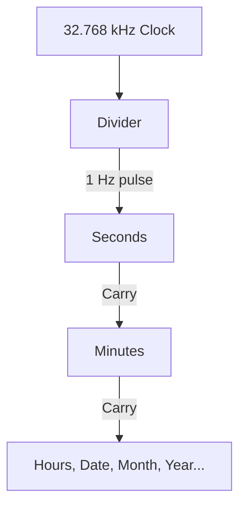
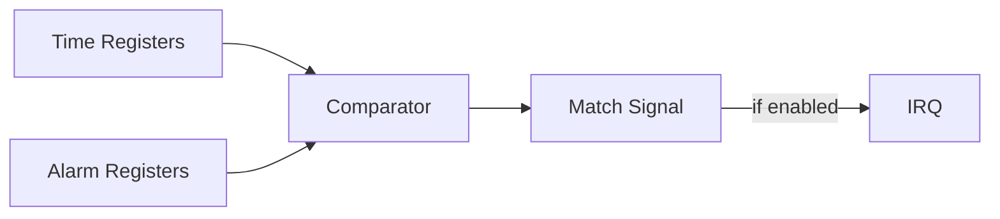

<!-- RTL Design Sherpa Documentation Header -->
<table>
<tr>
<td width="80">
  <a href="https://github.com/sean-galloway/RTLDesignSherpa">
    
  </a>
</td>
<td>
  <strong>RTL Design Sherpa</strong> · <em>Learning Hardware Design Through Practice</em><br>
  <sub>
    <a href="https://github.com/sean-galloway/RTLDesignSherpa">GitHub</a> ·
    <a href="https://github.com/sean-galloway/RTLDesignSherpa/blob/main/docs/DOCUMENTATION_INDEX.md">Documentation Index</a> ·
    <a href="https://github.com/sean-galloway/RTLDesignSherpa/blob/main/LICENSE">MIT License</a>
  </sub>
</td>
</tr>
</table>

---

<!-- End Header -->

# APB RTC - Architecture

## High-Level Block Diagram

### Figure 1.2: RTC Architecture


## Module Hierarchy

```
apb4_rtc (Top Level)
+-- apb4_slave
+-- rtc_config_regs (Register Wrapper)
|   +-- rtc_regs (PeakRDL Generated)
|
+-- rtc_core
    +-- Time Counter (seconds to year)
    +-- Alarm Comparator
    +-- Interrupt Generator
    +-- BCD Logic
```

## Data Flow

### Time Update Flow


```mermaid
flowchart TD
    A["32.768 kHz Clock"] --> B["Divider"]
    B -->|"1 Hz pulse"| C["Seconds"]
    C -->|"Carry"| D["Minutes"]
    D -->|"Carry"| E["Hours, Date, Month, Year..."]
```

### Alarm Match Flow


```mermaid
flowchart LR
    A["Time Registers"] --> B["Comparator"]
    C["Alarm Registers"] --> B
    B --> D["Match Signal"]
    D -->|"if enabled"| E["IRQ"]
```

## Clock Domains

- APB domain (pclk): Register access
- RTC domain (32.768 kHz): Time counting
- NO CDC exists in the current RTL (issue #56): the pclk-domain status
  flops sample rtc-domain signals directly and the counter mirrors cross
  unsynchronized (multi-register reads can tear across a rollover). It
  works in practice for the rtc->pclk DIRECTION ONLY (one 32.768 kHz
  cycle spans many pclk cycles). The pclk->rtc direction has NO working
  path at all: the time-set load strobe is a single pclk cycle sampled by
  rtc_clk, so with clock_select=0 a time-set write is captured with
  probability ~1/3000 -- the time-set protocol is effectively DEAD in the
  production 32.768 kHz configuration and only functions in
  clock_select=1 test mode, where everything runs on pclk (issue #56)

---

**Next:** [03_clocks_and_reset.md](03_clocks_and_reset.md)
