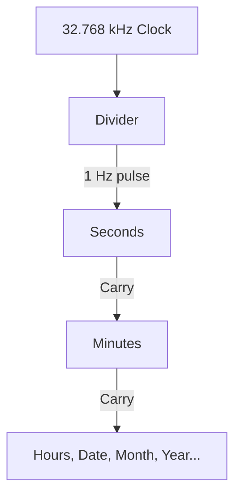
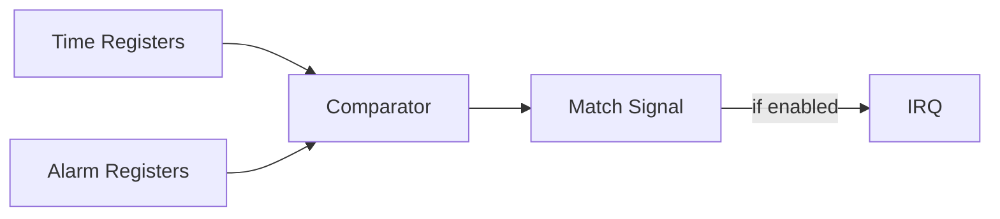

<!-- RTL Design Sherpa Documentation Header -->
<table>
<tr>
<td width="80">
  <a href="https://github.com/sean-galloway/RTLDesignSherpa">
    
  </a>
</td>
<td>
  <strong>RTL Design Sherpa</strong> · <em>Learning Hardware Design Through Practice</em><br>
  <sub>
    <a href="https://github.com/sean-galloway/RTLDesignSherpa">GitHub</a> ·
    <a href="https://github.com/sean-galloway/RTLDesignSherpa/blob/main/docs/DOCUMENTATION_INDEX.md">Documentation Index</a> ·
    <a href="https://github.com/sean-galloway/RTLDesignSherpa/blob/main/LICENSE">MIT License</a>
  </sub>
</td>
</tr>
</table>

---

<!-- End Header -->

# APB RTC - Architecture

## High-Level Block Diagram

### Figure 1.2: RTC Architecture


## Module Hierarchy

```
apb_rtc (Top Level)
+-- apb_slave
+-- rtc_config_regs (Register Wrapper)
|   +-- rtc_regs (PeakRDL Generated)
|
+-- rtc_core
    +-- Time Counter (seconds to century)
    +-- Alarm Comparator
    +-- Interrupt Generator
    +-- BCD Logic
```

## Data Flow

### Time Update Flow



### Alarm Match Flow



## Clock Domains

- APB domain (pclk): Register access
- RTC domain (32.768 kHz): Time counting
- CDC when clocks are asynchronous

---

**Next:** [03_clocks_and_reset.md](03_clocks_and_reset.md)
