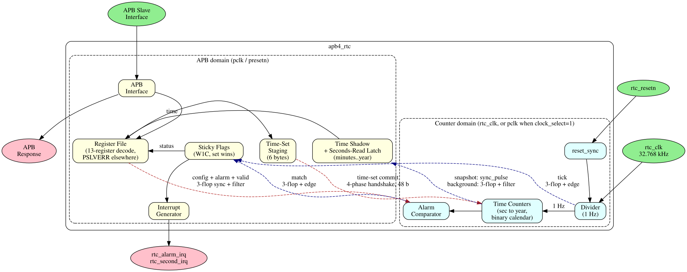

<!-- RTL Design Sherpa Documentation Header -->
<table>
<tr>
<td width="80">
  
</td>
<td>
  <strong>RTL Design Sherpa</strong> · <em>Learning Hardware Design Through Practice</em> 
  
    <a href="https://github.com/sean-galloway/RTLDesignSherpa">GitHub</a> ·
    <a href="https://github.com/sean-galloway/RTLDesignSherpa/blob/main/docs/DOCUMENTATION_INDEX.md">Documentation Index</a> ·
    <a href="https://github.com/sean-galloway/RTLDesignSherpa/blob/main/LICENSE">MIT License</a>
  
</td>
</tr>
</table>

---

<!-- End Header -->

# APB RTC Specification - Table of Contents

**Component:** APB Real-Time Clock (RTC) Controller
**Version:** 1.6
**Last Updated:** 2026-09-09
**Status:** RTL Functional - two clock domains with explicit crossings on the
repo's CDC primitives, an atomic time-set commit that works at the real
32.768 kHz ratio, coherent six-register time reads, sticky single-event W1C
status, a correct BCD calendar and 12-hour sequencing, and strict
thirteen-register decode with PSLVERR (issue #56 fixes, 2026-09-09).
Remaining limitations are stated as such in ch05.

---

## Document Organization

The specification is organized into five chapters covering the APB RTC end to end:

> Status (2026-07-22): Only the Chapter 1 overview and architecture sections and the
> Chapter 5 register map exist in this tree today. The remaining sections listed below
> are planned but not yet written; they are shown without links.

### Chapter 1: Overview
**Location:** `ch01_overview/`

- [01_overview.md](ch01_overview/01_overview.md) - Component overview, features, applications
- [02_architecture.md](ch01_overview/02_architecture.md) - High-level architecture
- 03_clocks_and_reset.md - Clock domains and reset *(planned, not yet written)*
- 04_acronyms.md - Acronyms and terminology *(planned, not yet written)*
- 05_references.md - External references *(planned, not yet written)*

### Chapter 2: Blocks
**Location:** `ch02_blocks/` *(planned, not yet written)*

- 00_overview.md - Block hierarchy overview
- 01_apb_interface.md - APB interface block
- 02_time_counter.md - Time keeping logic
- 03_alarm.md - Alarm comparison
- 04_interrupt.md - Interrupt generation

### Chapter 3: Interfaces
**Location:** `ch03_interfaces/` *(planned, not yet written)*

- 00_overview.md - Interface summary
- 01_apb4_slave.md - APB protocol specification
- 02_interrupt.md - Interrupt output
- 03_system.md - Clock and reset interface

### Chapter 4: Programming Model
**Location:** `ch04_programming/` *(planned, not yet written)*

- 00_overview.md - Programming overview
- 01_initialization.md - RTC initialization
- 02_time_operations.md - Reading/setting time
- 03_alarm.md - Alarm configuration
- 04_examples.md - Programming examples

### Chapter 5: Registers
**Location:** `ch05_registers/`

- [01_register_map.md](ch05_registers/01_register_map.md) - Complete register map

---

## Block Diagram

---

## Version History

| Version | Date | Author | Changes |
|---------|------|--------|---------|
| 1.0 | 2025-12-01 | RTL Design Sherpa | Initial specification |
| 1.1 | 2026-09-09 | RTL Design Sherpa | Issue #56 fixes: counter domain on rtc_clk with rtc_resetn through a reset synchronizer, four explicit crossings (3-flop config/alarm bundle, 48-bit time-set commit on a two-phase toggle handshake that 1.2 replaced with the four-phase form, sync_pulse snapshot plus filtered background time read, edge-detected tick/alarm events), time-set as stage-then-commit on the time_set_mode falling edge with staged readback, seconds-first coherent read window, sticky W1C flags with set-wins and no re-arm, binary-internal calendar with correct BCD days-in-month, 12-hour PM in bit 7 for binary and BCD with a single midnight carry, alarm held off during time-set and commit, strict thirteen-register decode with PSLVERR (no aliases); remaining limitations stated as such, deferred lint items moved to RLB-010 |
| 1.2 | 2026-09-09 | RTL Design Sherpa | Precision pass, contract points settled in review: alarm asserts when the readable time equals the programmed value (not a second later), time-set commit on a four-phase request/acknowledge (replacing the 1.1 toggle) with independent resets and a COMMIT_TIMEOUT_CYCLES timeout reported in RTC_STATUS.commit_timeout that holds the transfer rather than cancelling it, seconds read returning live seconds and latching minutes through year with pm_indicator and time_valid (no hold window), time-set mode stopping the divider, 33-bit config/alarm bundle, full-byte RTC_ALARM_HOUR compare with PM in bit 7, alarm/mode reprogramming with the alarm disabled, clock_select only with rtc_enable low, set_max_delay -datapath_only on the two bundles, BCD out-of-range clamp |
| 1.3 | 2026-09-09 | RTL Design Sherpa | Precision pass, third review: commit handshake source side is reset by `rtc_resetn` alone (synchronized into pclk), never by `presetn` alone (presetn alone leaves an in-flight commit to land intact, rtc_resetn alone resets the link on both sides and drops an unacknowledged commit for re-issue), time-set busy released by the timeout event of the transfer that timed out rather than a persisting condition, first second after a commit exactly one divider period, timeout wording aligned to held/lands unchanged/read back |
| 1.4 | 2026-09-09 | RTL Design Sherpa | Precision pass, fourth review: bus-side commit bookkeeping (pending, busy, timeout event detector) reset by either presetn or the synchronized rtc_resetn so a commit staged under rtc_resetn is dropped without hanging busy or reporting a timeout, commit_timeout never self-setting (a presetn pulse cannot produce it after release), busy never dropping while a transfer is pending (a commit accepted as a timed-out transfer returns to idle keeps busy and its staged values), staging pause stated as best effort at the production ratio (about three counter clocks to be seen) with the commit bracketing the tick regardless |
| 1.5 | 2026-09-09 | RTL Design Sherpa | Precision pass, fifth review: a presetn-only reset keeps the clock (the counter domain holds its run/enable state and clock source; RTC_CONFIG reads its reset value but a crossed rtc_enable or clock_select is applied only after software writes RTC_CONFIG, gated by a config-valid flag set by any RTC_CONFIG write and cleared by presetn; the mux select is held in a flop under rtc_resetn; time and time_valid remain correct), completion evidence shares the bookkeeping's reset (snapshot and tick synchronizer destination sides reset only with the synchronized rtc_resetn, so a presetn pulse can neither destroy nor fabricate a snapshot pulse or a flag event, busy always clears once a commit lands, no pre-commit time is published as the answer to a commit), a stall is always reported (commit_timeout sets for the in-flight transfer even with a retry queued behind it), a warm bus reset does not abort a commit issued before it, COMMIT_TIMEOUT_CYCLES=65535 stated as about 655 us at 100 MHz, a commit landing exactly on the alarm value does not fire the alarm |
| 1.6 | 2026-09-09 | RTL Design Sherpa | Precision pass, sixth review: time_set_mode not held in the counter domain's configuration copy (taken live from the crossing, so a presetn during staging releases the pause and drops the staged time), the config-valid flag crossing inside the 34-bit bundle with the hold loaded only from a settled word whose valid bit is set (5 counter clocks), busy released only on load evidence (a dedicated load pulse synchronized back into pclk) plus the shadow showing the committed bytes, commit_timeout reset with the commit bookkeeping (survives presetn while the stall is outstanding, cleared by rtc_resetn dropping the transfer), the counter domain's reset release held until the clock-source select has settled, register file reading reset defaults with time_valid=0 while busy spans a presetn, time not to be read after a bus reset until RTC_CONFIG is re-written, held/outstanding wording replacing abandoned; a commit queued behind a stalled link has its own timeout window from its commit pulse (busy cannot hang on a dead clock); counter reset release needs pclk (settle one-shot) |

---

## Navigation

### For Software Developers
- Reference [Chapter 5: Registers](ch05_registers/01_register_map.md) (the programming-model chapter is planned but not yet written)

### For Hardware Integrators
- Start with [Chapter 1: Overview](ch01_overview/01_overview.md)
- The interfaces chapter is planned but not yet written; see `../../rtl/rtc/apb4_rtc.sv` for the current port list

### Related Documentation
- [PRD.md](../../PRD.md) - Product Requirements Document
