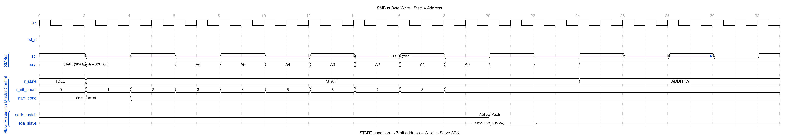
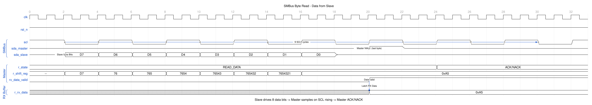
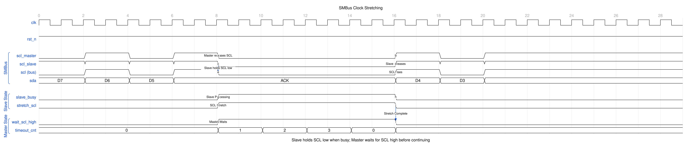
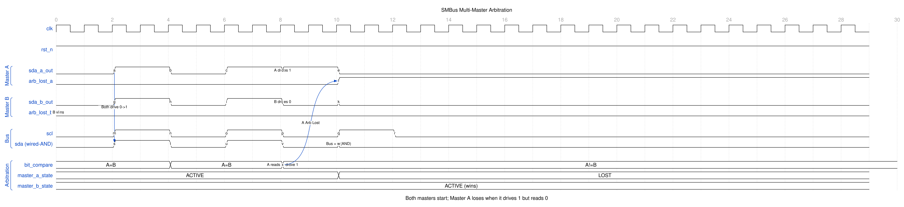
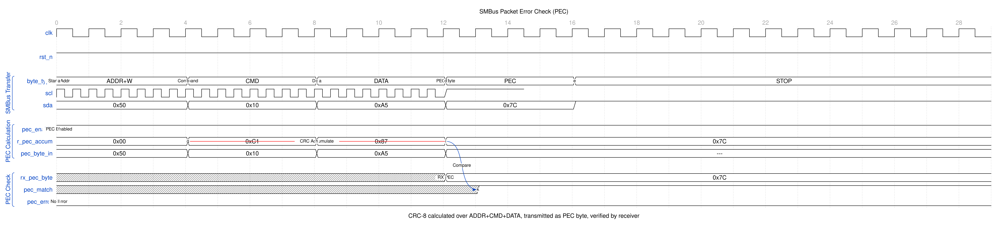
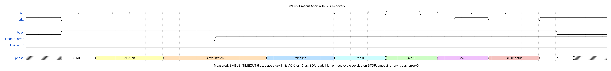

<!-- RTL Design Sherpa Documentation Header -->
<table>
<tr>
<td width="80">
  <a href="https://github.com/sean-galloway/RTLDesignSherpa">
    
  </a>
</td>
<td>
  <strong>RTL Design Sherpa</strong> · <em>Learning Hardware Design Through Practice</em><br>
  <sub>
    <a href="https://github.com/sean-galloway/RTLDesignSherpa">GitHub</a> ·
    <a href="https://github.com/sean-galloway/RTLDesignSherpa/blob/main/docs/DOCUMENTATION_INDEX.md">Documentation Index</a> ·
    <a href="https://github.com/sean-galloway/RTLDesignSherpa/blob/main/LICENSE">MIT License</a>
  </sub>
</td>
</tr>
</table>

---

<!-- End Header -->

# APB SMBus - Overview

## Overview

The APB SMBus controller provides System Management Bus communication with an
APB interface. It is an SMBus 2.0 master: software programs registers over
APB, and the core handles the two-wire protocol. All ten transaction types,
packet error checking, clock stretching, a bus timeout with recovery, and a
strict register decode are implemented and regression-clean as of the
GitHub #58 rewrite (2026-09-09).

### Key Features

- SMBus 2.0 master
- Quick Command, Send/Receive Byte
- Read/Write Byte/Word
- Block Read/Write and Block Write-Block Read Process Call, up to `FIFO_DEPTH`
  bytes (parameter, 2..63, default 32)
- PEC (Packet Error Checking), CRC-8 polynomial 0x07, generated on writes
  and checked on reads
- Programmable clock divider; standard-mode (100 kHz) and fast-mode
  (400 kHz) timing sets from the same divider, 100.0 kHz and 390.6 kHz at
  the default divider
- Clock stretching honoured on every release of SCL
- SCL-low timeout with I2C bus recovery; 0 disables the timeout; worst case
  from a wedged SCL to `busy=0` is five x `SMBUS_TIMEOUT`
- Open-drain signalling: the block only ever drives a 0
- Sticky, W1C interrupt status; a registered interrupt pin
- Strict seventeen-register decode; everything else returns PSLVERR
- Target (slave) mode: address match with an optional general call, an ACK
  policy, RX and TX paths through the shared FIFOs, clock stretching while
  software fills the queue, and its own PEC
- Multi-master arbitration: every transmitted bit is read back, and a 1 that
  reads as 0 releases the bus within the bit

What the block does not do is listed at the end of this chapter under
Limitations. The short version is SMBALERT#, Host Notify and ARP; everything
else the register map advertises is built.

### Applications

- Temperature monitoring
- Voltage monitoring
- Fan control
- EEPROM access
- Power management
- System health monitoring

### Block Diagram

#### Figure 1.1: SMBus Block Diagram


## Architecture

### Module decomposition

```
apb4_smbus                 APB4 attach, clocking, the interrupt pin
+- apb4_slave / apb4_slave_cdc   APB4 -> cmd/rsp (CDC_ENABLE picks which)
+- smbus_config_regs       strict decode, PeakRDL block, W1C decode, FIFO ports
|  +- peakrdl_to_cmdrsp    cmd/rsp -> PeakRDL passthrough
|  +- smbus_regs           generated register block
+- smbus_core              TRANSACTION SEQUENCER
   +- smbus_bit_phy        BIT-LEVEL PHY: every SCL and SDA movement
   +- smbus_trans_decode   the transaction table, as combinational logic
   +- smbus_flow_rules     what happens next: byte states, ACK policy, the
   |                       TX FIFO load/pop discipline, FIFO exhaustion
   +- smbus_abort_track    when the abort's OWN STOP has finished
   +- smbus_byte_fifos     TX/RX byte buffers and their three reset sources
   |  +- simple_fifo x2 -> fifo_sync
   +- smbus_int_status     sticky, edge-set, W1C-cleared interrupt bits
   +- smbus_pec            CRC-8, polynomial 0x07 (one per engine)
   +- smbus_slave_engine   TARGET ENGINE: the half that answers
      +- smbus_pec         the target's own CRC-8
```

| Module | Owns |
|--------|------|
| `apb4_smbus` | The APB4 attach, the choice of `apb4_slave` or `apb4_slave_cdc`, the core clock/reset muxing, and the registered `smb_interrupt` pin |
| `smbus_config_regs` | The strict seventeen-address decode with local PSLVERR, the generated PeakRDL block, the W1C decode for SMBUS_INT_STATUS, and the TX/RX FIFO access ports |
| `smbus_core` | The transaction: which bytes go out, in what order, with what R/W bit, where the repeated START goes, which byte is ACKed, what the PEC covers, and when it is done. It owns no bit timing and touches neither SCL nor SDA |
| `smbus_bit_phy` | The only module that touches SCL and SDA. Executes one primitive at a time (START, repeated START, STOP, transmit one bit, receive one bit, bus recovery) and reports completion with a single-cycle `op_done` |
| `smbus_trans_decode` | The SMBus 2.0 transaction table as combinational logic: command byte present, direction, repeated START needed, data source, count byte, data byte count per type |
| `smbus_flow_rules` | Byte-state classification, byte-complete detection, ACK/NAK policy for received bytes, the TX FIFO load/pop discipline, and TX underrun detection |
| `smbus_abort_track` | Tells the sequencer when the abort's own STOP has finished, as opposed to the op_done of the primitive being aborted or the PHY's timeout level |
| `smbus_byte_fifos` | The TX and RX FIFOs (`fifo_sync` via `simple_fifo`) and their three reset sources: `rst_n`, `soft_reset`, `fifo_reset` |
| `smbus_int_status` | The eight sticky SMBUS_INT_STATUS bits: set on the rising edge of the condition, cleared only by a decoded W1C, set wins over a simultaneous clear |
| `smbus_slave_engine` | The target: START/STOP detection on somebody else's clock, address match, the ACK policy, the RX and TX byte paths, clock stretching, and its own PEC |
| `smbus_pec` | CRC-8, polynomial x^8 + x^2 + x + 1 (0x07), initial value 0x00 |

The split that matters is `smbus_core` / `smbus_bit_phy`. Quoting the RTL
README: "The sequencer owns the transaction and the PHY owns the wire; the
sequencer never sees a clock period and the PHY never sees a transaction.
They meet at five primitives - START, repeated START, STOP, transmit one bit,
receive one bit - each answered with a single-cycle `op_done`."

### The open-drain contract

SMBus is a wired-AND bus: a device may pull a line LOW or RELEASE it, and may
never drive it high. The pins are split `smb_scl_i/o/t` and `smb_sda_i/o/t`,
where `smb_*_o` is the value and `smb_*_t` = 1 means released (input). With
that convention the contract collapses to one statement, which is how the PHY
implements it:

```
smb_scl_o == smb_scl_t    and    smb_sda_o == smb_sda_t
```

Driving is only ever driving a 0 and a 1 is always a release, so actively
driving a 1 on an open-drain line is structurally impossible rather than
something a reviewer has to re-check state by state.

### Bit timing, fast mode and clock stretching

One SCL period is eight base units. In standard mode the unit is
`(CLK_DIV + 1) / 2` clocks, so `SCL = clk / (4 x (CLK_DIV + 1))`; the RDL
default of 249 gives 100 kHz from a 100 MHz clock. In fast mode the unit is
`(CLK_DIV + 1) / 8`, so the same divider runs four times faster:
`SCL = clk / (CLK_DIV + 1)`, and 249 gives 390.6 kHz. Both unit divides
round up, so a small divider cannot silently shorten the period.

`SMBUS_CONTROL.fast_mode` selects the whole 400 kHz timing set, not just a
frequency, and the set is asymmetric. A symmetric period cannot meet fast
mode at all: tLOW >= 1.3 us and tHIGH >= 0.6 us do not both fit in two equal
halves of a 2.5 us period at the ratio standard mode uses. In fast mode the
low phase takes 5/8 of the period and the high phase 3/8.

#### Table 1.1: PHY phase lengths in base units

| Phase | Standard | Fast | What it is |
|-------|----------|------|------------|
| LO_A | 2 | 2 | SCL low, data driven (tSU;DAT) |
| HI_A | 2 | 1 | SCL released, up to the sample point |
| HI_B | 2 | 2 | Rest of the high phase |
| LO_B | 2 | 3 | SCL driven low again |
| HD_STA | 4 | 2 | START hold, SDA low to SCL low |
| SU_STA | 4 | 2 | Repeated-START setup, SCL high to SDA low |
| SU_STO | 5 | 5 | STOP setup, SCL high to SDA released |
| BUF | 5 | 5 | Bus free, and the wait before a START |

tLOW = LO_B + LO_A and tHIGH = HI_A + HI_B. tSU;STO and tBUF stay at five
units in both modes because their fast-mode minimums are not proportionally
smaller.

#### Table 1.2: Achieved timing at the default divider

At the RDL default (`CLK_DIV = 249`, 100 MHz core clock), against the SMBus
2.0 / I2C minimums. Every figure is a minimum the block clears, not a target
it sits on: the units are integers, so the achieved values sit above the spec
rather than on it.

| | Standard achieved | Required | Fast achieved | Required |
|---|---|---|---|---|
| Base unit | 125 clk = 1250 ns | - | 32 clk = 320 ns | - |
| SCL period | 10.00 us (100.0 kHz) | - | 2.56 us (390.6 kHz) | - |
| tLOW | 5000 ns | >= 4700 | 1600 ns | >= 1300 |
| tHIGH | 5000 ns | >= 4000 | 960 ns | >= 600 |
| tHD;STA | 5000 ns | >= 4000 | 640 ns | >= 600 |
| tSU;STA | 5000 ns | >= 4700 | 640 ns | >= 600 |
| tSU;STO | 6250 ns | >= 4000 | 1600 ns | >= 600 |
| tBUF | 6250 ns | >= 4700 | 1600 ns | >= 1300 |

**A START waits for the bus to be free.** Before pulling SDA down the master
waits for SCL and SDA to be sampled high together and then holds tBUF. A
master that pulls SDA low under a low SCL has not generated a START at all;
it has put a data bit on somebody else's transfer. The wait is bounded by
`SMBUS_TIMEOUT` only when it is non-zero: a bus that never goes free then
reports a timeout rather than hanging. With `SMBUS_TIMEOUT = 0` and a bus
that never frees, `busy` stays 1 in the start state until software writes
`SMBUS_COMMAND.stop`, which aborts cleanly with a lone STOP.

**Clock stretching is honoured on every release of SCL.** After letting SCL
go, the PHY holds its unit counter at zero until the synchronized SCL input
actually reads high, so a slave holding SCL down extends the high phase
instead of being clocked through. That applies to data bits, ACK bits, the
repeated START and the STOP alike.

### Timeout

SCL low for longer than `SMBUS_TIMEOUT` clocks aborts the transaction,
reports `SMBUS_STATUS.timeout_error`, releases the bus and returns the FSM to
idle. "Low" means low on the bus, either this master pulling it down or the
line still reading low after it let go, so it covers a slave stretching
forever, a short, and a wedged master.

**`SMBUS_TIMEOUT = 0` disables the timeout.** It must never mean "expire
immediately".

The timeout also covers the START's bus-free wait, and every state that can
wait on SCL is timeout-covered, including the final STOP. On expiry the PHY
abandons the primitive: it releases both lines and reports. Releasing is the
only exit that always exists; a STOP cannot be generated at all while another
device is holding SCL down.

A normal bit's low phase is 5/8 of the period, orders of magnitude under any
legal SMBus timeout, so the check never fires on healthy traffic. The counter
only runs while this master owns a primitive: an idle bus held low by
somebody else does not arm it, and the report is consumed once, by the
sequencer that acts on it.

**Worst case from "SCL wedges" to `busy` = 0 is five timeout windows**, about
125 ms at the default `SMBUS_TIMEOUT`. One window for the primitive that
stalls, then four for the abort's STOP, which gets `WINDOWS_STOP = 3` (four
windows) against `WINDOWS_NORMAL = 0` (one). Cutting an abort off after one
window would strand transactions that were a moment from ending; size
`SMBUS_TIMEOUT` with the multiplier in mind.

### Bus recovery

A STOP needs SDA to rise while SCL is high. If another device is holding SDA
down (a slave stuck part-way through a byte, which is what a timeout usually
means) the master cannot generate one, and simply releasing leaves every other
device watching a transfer that was never terminated.

Whenever the master needs to issue a STOP and finds SDA held low when it goes
to release it, and on every timeout abort, it performs I2C bus recovery: with
SDA released it pulses SCL up to nine times, open-drain and stretch-aware,
sampling SDA at the end of each high phase and stopping as soon as SDA reads
high; then it generates a proper STOP (SDA low while SCL is low, SCL high,
SDA high). Nine is the I2C limit: it is one more clock than a byte, so a
device stuck anywhere inside one has been clocked out of it. A STOP that
escalated into recovery and recovered reports `complete=1` with no error:
recovery inside a normal STOP is invisible to software.

Recovery clocks are full standard-mode bits, whatever `fast_mode` says:
tLOW 5000 ns and tHIGH 5000 ns at the default divider, against the 4.7 us /
4.0 us standard-mode minimums, in both modes. The device being recovered is
by definition not keeping up, so the slowest legal clock is the one most
likely to shake it loose, and a recovery clock that is only a fraction of a
bit low is not standard-mode timing whatever its unit count says. Before the
STOP that follows, SCL is driven low a whole phase before SDA moves, never on
the same edge.

If SDA is still low after nine clocks the master releases both lines, reports
`SMBUS_STATUS.bus_error` (and `timeout_error` as well if a timeout is what
started it), and returns to idle without a STOP. `busy` dropping still
coincides with both lines released.

Recovery does not run on two exits:

- a timeout in the final STOP itself: the PHY has already released both lines
  to report it, so re-driving them would be the only way to get it wrong;
- a timeout before anything of ours was framed, unless SDA is the line being
  held and SCL is quiet. If SCL is also low somebody else is mid-transfer, and
  pulsing SCL would clock their bits. A stuck SDA on an otherwise quiet bus is
  recovered even though no START ever went out; a bus found stuck at power-on
  is exactly what the nine clocks are for.

#### Table 1.4: What the status bits mean together

| `complete` | `bus_error` | `timeout_error` | Meaning |
|---|---|---|---|
| 1 | 0 | 0 | the transaction finished and the bus was released with a STOP. This includes a STOP that found SDA held low, escalated into recovery and recovered: recovery inside a normal STOP is invisible to software |
| 0 | 0 | 1 | a timeout; the bus was released. Recovery either was not applicable (nothing framed, or the STOP itself timed out) or ran and succeeded, and a STOP was generated |
| 0 | 1 | 1 | a timeout, recovery was attempted and failed: SDA was still low after nine clocks, both lines were released and no STOP reached the wire |
| 0 | 1 | 0 | aborted without a timeout: `COMMAND.stop` alone, a TX underrun, an RX overrun, or a STOP whose recovery failed |
| 0 | x | x | with `nak_received` or `pec_error`: the slave did not acknowledge, or the PEC did not match |

`complete` is never set alongside any error. It is computed from the
next-state error terms, including the ones raised on the very edge the STOP
completes, so a transaction that did not terminate the bus cannot report
success.

#### Table 1.3: Measured timeout abort with recovery

Measured against a slave stuck in its ACK after a 15 us stretch with
`SMBUS_TIMEOUT` at 5 us:

| Time | Event |
|------|-------|
| 0.965 us | START |
| ~5 us | timeout expires; PHY abandons the ACK bit, releases both lines, reports |
| 17.805 us | recovery clock 0 - SCL rises, SDA still low |
| 17.945 us | recovery clock 1 - SCL rises, SDA still low |
| 18.085 us | recovery clock 2 - SCL rises, SDA reads high: the slave let go |
| 18.225 us | SCL high with SDA driven low - the STOP setup |
| 18.345 us | STOP |

ending with `busy=0`, `timeout_error=1`, `bus_error=0` and both lines
released. Waveform 1.6 below draws this sequence.

### Busy, completion and the abort discipline

`SMBUS_STATUS.busy` is high from the accepted START request until the FSM is
back in idle, whether the transaction succeeded or not, so busy dropping is
the single "the bus is yours again" signal.

Every exit runs through a STOP, and error recovery never waits for software.
A NAK anywhere (address, command, data or PEC), a PEC mismatch, a FIFO
underrun or overrun, or a bus timeout all go to the error state, which issues
a STOP, releases both lines and returns to idle on its own. Software does not
have to write `SMBUS_COMMAND.stop` to un-wedge the block.

`busy` dropping to 0 always coincides with both lines released, on every
path, including the ones where the STOP itself could not be generated. Every
exit is therefore either a real STOP on the wire or a reported release
(`bus_error` set, and `timeout_error` if a timeout started it).

An abort (`SMBUS_COMMAND.stop` alone, or a timeout) terminates the primitive
that is running, at a point where moving the lines is safe, and then generates
the STOP. The abort's first phase pulls SCL low and leaves SDA unchanged,
because moving SDA while SCL is high is a START or a STOP, not an abort.
`smbus_abort_track` is the single authority on when the sequencer may leave
the error state: busy=0 is allowed only when the abort's own STOP has
finished, not on the op_done of the primitive being aborted and not on the
PHY's timeout level.

`SMBUS_COMMAND.stop` written together with `start` is the ordinary case and is
accepted as a no-op, because every transaction ends with a STOP anyway.
Written alone while busy it is an abort: the transaction stops, the bus is
released and `bus_error` is reported.

`SMBUS_STATUS.complete` is set when a transaction finishes without a PEC
mismatch, and never alongside any error (Table 1.4). Read it together with
the error bits, not instead of them.

### PEC

The CRC-8 (polynomial 0x07) covers every byte that was actually on the wire,
in wire order, including both address bytes: the `Addr+W` after the START and
the `Addr+R` after the repeated START. It is cleared once, when the START is
issued, and never held in clear afterwards.

On a write, the computed PEC is transmitted after the last data byte. On a
read, the master ACKs the last data byte instead of NAKing it, receives the
slave's PEC byte, NAKs that, and compares it against the running CRC; a
mismatch sets `SMBUS_STATUS.pec_error`. The received PEC byte is never folded
into the CRC; it is the thing being checked.

`SMBUS_PEC` is written by hardware only at the end of a transaction, so a
software-written value survives until a transfer replaces it. After a
transfer it holds the transmitted PEC byte on a write and the received PEC
byte on a read; the computed CRC is not exposed, so on a PEC error the
register shows the slave's byte and `pec_error` says it did not match.

### Interrupts

`smb_interrupt` is `(SMBUS_INT_STATUS & SMBUS_INT_ENABLE) != 0`, registered.
Not the live status: a pin built from live status cannot be deasserted by
software at all, only by the underlying condition going away, which with a
level-sensitive interrupt controller upstream is an interrupt storm.

Every `SMBUS_INT_STATUS` bit is sticky: set by the rising edge of its
condition and cleared only by a write-1-to-clear, with set winning over a
simultaneous clear. That includes the two FIFO threshold bits. Set winning
matters because an event arriving in the same cycle software clears the
previous one must not be lost: an extra interrupt costs a wasted read, a lost
one is a hang.

A NAK counts as an error for `error_int`. It has its own status bit, but it
is still a transaction that failed.

The sticky bits live in hardware (`smbus_int_status`); the generated register
field is a live mirror of them, and the W1C is decoded in `smbus_config_regs`
from `wr_data & wr_biten` at the register's own address, on the rising edge
of the held request. The edge detector is armed one cycle after reset so a
condition that is true at time zero (an empty TX FIFO) does not set a bit
with no access having taken place; SMBUS_INT_STATUS reads 0 out of reset.

### Soft reset, FIFO reset and the two-cycle strobe

`SMBUS_CONTROL.soft_reset` is a self-clearing strobe that synchronously
restarts the master engine, the bit PHY, the PEC accumulator, both FIFOs and
the sticky status, and does not touch the register file. It is a synchronous
clear of those blocks, not an asynchronous reset. It always reads back
0. Software keeps everything it programmed and only the engine starts over.
The PHY releases both lines as it aborts; stopping mid-primitive while still
driving would wedge the bus for every other device.

`SMBUS_CONTROL.fifo_reset` clears the two byte buffers only, leaving the
engine alone. It is likewise self-clearing and likewise a synchronous clear.

Every self-clearing strobe is two `pclk` cycles wide as the hardware sees it
(`soft_reset`, `fifo_reset`, `COMMAND.start` and `COMMAND.stop`), because the
cmd/rsp bridge holds its request for two cycles. Every consumer acts once
across that window: `start` is only taken in the idle state, an abort is
blocked once the error state has been entered, and the two reset strobes are
level clears where a second cycle changes nothing.

### Clock domains (CDC_ENABLE)

`CDC_ENABLE` picks the attach, and it is the only thing that changes. With
`CDC_ENABLE=0` there is one clock domain: `apb4_slave` converts APB to
cmd/rsp and the register block and the whole master engine run on
`pclk`/`presetn`; nothing crosses. With `CDC_ENABLE=1`, `pclk` and
`smbus_clk` are independent: the register block, `smbus_core` and the PHY run
on `smbus_clk`/`smbus_resetn`, and exactly two things cross:

- The APB command and response cross through `apb4_slave_cdc`
  (`USE_JOHNSON` selects its counter encoding).
- The masked interrupt vector `|(SMBUS_INT_STATUS & SMBUS_INT_ENABLE)`, a
  level and quasi-static between events, crosses from `smbus_clk` to `pclk`
  through `glitch_free_n_dff_arn` (three flops), the house level
  synchronizer, and is then registered on `pclk`. Its destination side takes
  `presetn`, the reset of the domain it lands in: the source is sticky and
  re-presents itself after any reset on either side, so no interrupt can be
  manufactured or lost by the crossing.

SCL and SDA are asynchronous in both builds. They come from pads, and no
amount of same-clock design makes a pad synchronous: `smbus_bit_phy` puts two
flops on each of them and nothing in the block looks at a raw pin. That is
the crossing that always exists; the bus being slow does not make it
synchronous.

`CDC_ENABLE` must be 0 or 1; any other value is a `$fatal` at elaboration.

**Resets.** The block instantiates no reset synchronizer. `presetn` and
`smbus_resetn` must be delivered already synchronized by the integrator
(asynchronous assert, synchronous deassert), as the other RLB blocks assume.

## Transaction Table

`S` = START, `Sr` = repeated START, `P` = STOP, `A` = master ACKs,
`N` = master NAKs. Every byte from the slave is acknowledged by the master as
shown; every byte from the master is acknowledged by the slave, and a slave
NAK anywhere aborts the transaction. `[PEC]` is present only when
`SMBUS_CONTROL.pec_en` is set.

#### Table 1.5: Transaction types and wire sequences

| Code | Type | On the wire | Data bytes |
|------|------|-------------|------------|
| 0x0 | Quick Command | `S, Addr+W, P` | 0 |
| 0x1 | Send Byte | `S, Addr+W, Data, [PEC], P` | 1 |
| 0x2 | Receive Byte | `S, Addr+R, Data(N), [PEC], P` | 1 |
| 0x3 | Write Byte | `S, Addr+W, Cmd, Data, [PEC], P` | 1 |
| 0x4 | Read Byte | `S, Addr+W, Cmd, Sr, Addr+R, Data(N), [PEC], P` | 1 |
| 0x5 | Write Word | `S, Addr+W, Cmd, DataLo, DataHi, [PEC], P` | 2 |
| 0x6 | Read Word | `S, Addr+W, Cmd, Sr, Addr+R, DataLo(A), DataHi(N), [PEC], P` | 2 |
| 0x7 | Block Write | `S, Addr+W, Cmd, Count, Data x Count, [PEC], P` | Count |
| 0x8 | Block Read | `S, Addr+W, Cmd, Sr, Addr+R, Count, Data x Count(N), [PEC], P` | Count, from the slave |
| 0x9 | Block Proc Call | Block Write then `Sr, Addr+R, Count, Data x Count(N), [PEC], P` | both |

With PEC enabled on a read, the last data byte is ACKed rather than NAKed and
the slave's PEC byte is the byte that receives the NAK.

Every read that carries a command code has a repeated START. The slave is
addressed for WRITE to receive the command byte, then `Sr` and addressed
again for READ. Only Receive Byte, which has no command code, addresses for
read straight away.

The data byte count is per transaction type. `SMBUS_BLOCK_COUNT` governs the
block transfers and nothing else: a Write Byte sends exactly one data byte
whatever `BLOCK_COUNT` happens to hold from a previous transfer.

#### Table 1.6: Where the data comes from

| Transaction | Transmitted data | Received data |
|---|---|---|
| Send Byte, Write Byte | `SMBUS_DATA` | - |
| Write Word, Block Write | TX FIFO, in order | - |
| Block Write count byte | `SMBUS_BLOCK_COUNT` | - |
| Receive Byte, Read Byte | - | RX FIFO and `SMBUS_DATA` |
| Read Word, Block Read (last byte) | - | `SMBUS_DATA` as well: every received data byte writes it, so it holds the last one |
| Read Word, Block Read | - | RX FIFO, in order |
| Block Read count byte | - | from the slave, clamped to the FIFO depth and written back to `SMBUS_BLOCK_COUNT` |

A one-byte read lands in `SMBUS_DATA` as well as the FIFO so that reading a
single byte needs no FIFO access at all. `SMBUS_DATA` is written by every
received data byte, so after a Read Word or Block Read it holds the last byte
received; the RX FIFO has them all in order.

### Register Summary

| Offset | Name | Access | Description |
|--------|------|--------|-------------|
| 0x00 | SMBUS_CONTROL | RW | Global control (enable, mode, PEC, resets) |
| 0x04 | SMBUS_STATUS | RO | Status flags and FSM state |
| 0x08 | SMBUS_COMMAND | RW | Transaction type, command byte, start/stop |
| 0x0C | SMBUS_SLAVE_ADDR | RW | Target slave address |
| 0x10 | SMBUS_DATA | RW | Single data byte |
| 0x14 | SMBUS_TX_FIFO | WO | Transmit FIFO write port |
| 0x18 | SMBUS_RX_FIFO | RO | Receive FIFO read port |
| 0x1C | SMBUS_FIFO_STATUS | RO | TX/RX FIFO levels and flags |
| 0x20 | SMBUS_CLK_DIV | RW | SCL clock divider |
| 0x24 | SMBUS_TIMEOUT | RW | SCL-low limit, 0 = disabled |
| 0x28 | SMBUS_OWN_ADDR | RW | The address this target answers, and its enable |
| 0x2C | SMBUS_INT_ENABLE | RW | Interrupt enable mask |
| 0x30 | SMBUS_INT_STATUS | W1C | Sticky interrupt status |
| 0x34 | SMBUS_PEC | RW | PEC value (CRC-8) |
| 0x38 | SMBUS_BLOCK_COUNT | RW | Block transfer byte count |
| 0x3C | SMBUS_SLAVE_CTRL | RW | Target policy: general call, NAK-all, PEC, stretching |
| 0x40 | SMBUS_SLAVE_STATUS | RO | Target direction, stretching, PEC verdict and value |

Only these seventeen addresses decode. Every other address in the 4 KB window
is dropped: no internal strobe fires, the read returns 0, and the access is
acknowledged locally with `PSLVERR`. See
[Chapter 5: Register Map](../ch05_registers/01_register_map.md) for full field
definitions, reset values, the FIFO contract and the programming sequences.

## Parameters

`apb4_smbus` takes three top-level parameters:

| Parameter | Default | Description |
|-----------|---------|-------------|
| `FIFO_DEPTH` | 32 | TX/RX FIFO depth; the default is the SMBus 2.0 block size. Legal range 2..63 (a `$fatal` outside it): the level and count fields are six bits, and `fifo_sync` addresses with `$clog2(DEPTH)` so a depth of 1 does not elaborate. Every value in the range is lint-clean, with the FIFO level width resized to fit. The slave-supplied block count is clamped to it |
| `CDC_ENABLE` | 0 | 0 = single `pclk` domain (`apb4_slave`), 1 = independent `smbus_clk` via `apb4_slave_cdc` and the interrupt level synchronizer. Only 0 and 1 are legal |
| `USE_JOHNSON` | 0 | Counter encoding forwarded to `apb4_slave_cdc` |

There is no skid-depth parameter.

### Integration notes

- Deliver `presetn` (and `smbus_resetn` when `CDC_ENABLE=1`) already
  synchronized: asynchronous assert, synchronous deassert. The block adds no
  reset synchronizer of its own.
- Wire `smb_scl_i/o/t` and `smb_sda_i/o/t` to open-drain pads; the block
  only ever drives a 0 (`smb_*_o == smb_*_t`), and it synchronizes both
  inputs with two flops itself.
- Build with the default active-low reset polarity; see Limitations for the
  `RESET_ACTIVE_HIGH` build.

## Waveforms

Waveforms 1.1 to 1.5 draw the protocol elements this controller speaks, in
composed wire view; Waveform 1.6 draws the measured timeout abort of Table
1.3. The signal names the captions use are real and are listed in the
wavedrom directory README.

### Waveform 1.1: Byte Write (Start + Address)

Shows the START condition and 7-bit address transmission.



START condition is SDA falling while SCL is high, after the bus-free wait. The
7-bit slave address plus R/W bit is clocked out, followed by slave ACK (SDA
low during the 9th clock).

### Waveform 1.2: Byte Read

Shows slave-to-master data transfer.



Slave drives 8 data bits while master clocks SCL. Master samples each bit on
SCL rising edge, then provides ACK (more data) or NACK (last byte).

### Waveform 1.3: Clock Stretching

Slave flow control by holding SCL low.



When the slave needs processing time, it holds SCL low after the master
releases it. The PHY holds its unit counter at zero until the synchronized
SCL input reads high, so the high phase extends and no data is lost. A
stretch longer than `SMBUS_TIMEOUT` is a timeout (Waveform 1.6).

### Waveform 1.4: Multi-Master Arbitration

Collision detection when multiple masters start simultaneously.



Every transmitted bit is read back in the SCL-high phase. Sending a 0 means
driving SDA down and everyone driving down agrees, so only a **1 that reads
back as 0** says another master is still transmitting and has won. START is
exempt, because pulling SDA down there is the framing rather than data.

On loss the PHY releases both lines in the same bit and the sequencer reports
`SMBUS_STATUS.arb_lost` and returns to idle **without generating a STOP** --
the winner's transfer is still in progress, and re-driving the lines to frame
a STOP would corrupt it. Retry is left to software, and the bus-free wait
before START is what makes the retry safe.

### Waveform 1.5: Packet Error Check (PEC)

CRC-8 error detection for data integrity.



PEC is calculated over every byte on the wire, both address bytes included,
using CRC-8 polynomial 0x07. On a write the PEC byte is transmitted after the
last data byte; on a read it is received, NAKed, and compared.

### Waveform 1.6: Timeout Abort with Bus Recovery

The measured sequence of Table 1.3: a slave stuck in its ACK, the timeout
expiring, three recovery clocks, and the STOP.



The PHY releases both lines on expiry, then clocks SCL with SDA released
(full standard-mode bits) until SDA reads high at the end of a high phase,
then drives SCL low, SDA low a phase later, and generates the STOP. `busy`
falls only when that STOP has finished; `timeout_error` is set and
`bus_error` is not, because recovery succeeded (Table 1.4, row 2).

## Target mode

The block answers as well as asks. `smbus_slave_engine` is a separate module
from `smbus_bit_phy` for a structural reason: **the master owns the clock and
a target does not.** Every master primitive is something the PHY schedules;
every target action is a response to an edge somebody else produced. One
module that is sometimes a clock source and sometimes a passenger would be
the wrong shape.

It never drives a 1 either. It emits two pull-down requests and `smbus_core`
wired-ANDs them with the master's, which is the rule the bus itself obeys, so
the merge needs no ownership mux to be electrically correct. **SDA only ever
changes on a falling edge of SCL** -- a transition while SCL is high is a
START or a STOP, not data -- so every drive decision is taken on a fall and
held.

| control | what it decides |
|---------|-----------------|
| `SMBUS_CONTROL.slave_en` | the engine runs at all |
| `SMBUS_OWN_ADDR` | the address it answers, and whether it answers one |
| `SMBUS_SLAVE_CTRL.gc_en` | also answer the general call, address 0x00 |
| `SMBUS_SLAVE_CTRL.nack_all` | software is busy: NAK our own address |
| `SMBUS_SLAVE_CTRL.pec_en` | maintain, check and append the target PEC |
| `SMBUS_SLAVE_CTRL.stretch_en` | hold SCL while a read waits for software |

A full RX FIFO is answered with a NAK rather than a silently dropped byte:
the master has to be told, or it is writing into a target that is not
listening.

### The target PEC never counts bytes

A target does not know how long a transfer is; the protocol does, and the
protocol lives in software. CRC-8 removes the need to know. On a **write**
the running CRC covers the address byte and every data byte, and a correct
trailing PEC byte drives it to **zero**, so "PEC good" is "the running value
is zero at the STOP". On a **read**, when the TX FIFO runs dry the byte sent
IS the running CRC, which is exactly the PEC the master is waiting for;
software sets the length by how many bytes it queues.

### Stretching, or not

With `stretch_en` set, a read that finds the TX FIFO empty holds SCL low
until software puts a byte in it, and `SMBUS_SLAVE_STATUS.stretching` says
so. With it clear the engine sends `0xFF` instead, which is what an
unprogrammed target on a real bus looks like and keeps a slow CPU from
wedging the whole wire.

### One engine on the wire

A master START is refused while the target half is **answering** -- not
merely while a transfer is visible on the bus. The distinction matters: SDA
pulled low under a high SCL looks exactly like a START that never ends, and a
target that claimed the wire for that would block the bus recovery that
exists to clear it. Whether the bus is busy is the master PHY's own question,
answered by the bus-free wait in front of every START.

## Limitations

- **A `start` written while `master_en` is clear is silently discarded.** It
  is not reported as an error, so software that forgets to enable master mode
  sees a transaction that simply never happens.
- Block Process Call is a block write followed by a repeated START and a
  block read; the two halves share `SMBUS_BLOCK_COUNT`.
- A slave-supplied block length of 0, or one larger than the FIFO depth, is
  clamped rather than honoured.
- SMBALERT# and the Host Notify protocol are not implemented; there is no
  `smbalert_n` pin, and with them goes the Alert Response Address a target
  would answer.
- ARP, the SMBus address resolution protocol, is not implemented.
  `SMBUS_OWN_ADDR` is a fixed address software programs.

---

## Navigation

**Next:** Chapter 2 (Architecture) is planned and not yet written; the
architecture of the block is described above. See the index.
