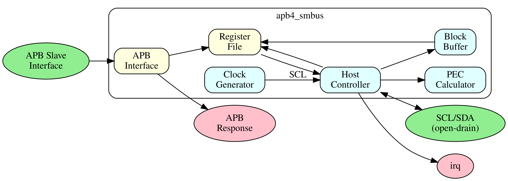

<!-- RTL Design Sherpa Documentation Header -->
<table>
<tr>
<td width="80">
  
</td>
<td>
  <strong>RTL Design Sherpa</strong> · <em>Learning Hardware Design Through Practice</em> 
  
    <a href="https://github.com/sean-galloway/RTLDesignSherpa">GitHub</a> ·
    <a href="https://github.com/sean-galloway/RTLDesignSherpa/blob/main/docs/DOCUMENTATION_INDEX.md">Documentation Index</a> ·
    <a href="https://github.com/sean-galloway/RTLDesignSherpa/blob/main/LICENSE">MIT License</a>
  
</td>
</tr>
</table>

---

<!-- End Header -->

# APB SMBus Specification - Table of Contents

**Component:** APB System Management Bus (SMBus) Controller
**Version:** 1.0
**Last Updated:** 2025-12-01
**Status:** Production Ready

---

## Document Organization

> Status (2026-07-22): Only the Chapter 1 overview and the Chapter 5 register map exist
> in this tree today. The remaining chapters listed below are planned but not yet
> written; they are shown without links.

### Chapter 1: Overview
- [01_overview.md](ch01_overview/01_overview.md) - Component overview
- 02_architecture.md - Architecture *(planned, not yet written)*

### Chapter 2: Blocks
- 00_overview.md - Block hierarchy *(planned, not yet written)*

### Chapter 3: Interfaces
- 00_overview.md - Interface summary *(planned, not yet written)*

### Chapter 4: Programming Model
- 00_overview.md - Programming overview *(planned, not yet written)*

### Chapter 5: Registers
- [01_register_map.md](ch05_registers/01_register_map.md) - Register map

---

## Block Diagram

---

## Version History

| Version | Date | Author | Changes |
|---------|------|--------|---------|
| 1.0 | 2025-12-01 | RTL Design Sherpa | Initial specification |
