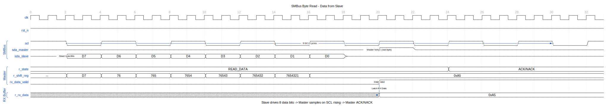
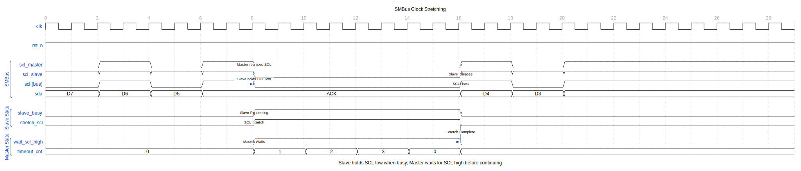

# APB SMBus - Overview

## Introduction

The APB SMBus controller provides System Management Bus communication with APB interface. It supports host controller functionality for accessing SMBus devices.

## Key Features

- SMBus 2.0 compatible
- Host controller mode
- Quick Command, Send/Receive Byte
- Read/Write Byte/Word
- Block Read/Write (up to 32 bytes)
- PEC (Packet Error Checking) support
- Programmable clock divider
- Interrupt-driven operation
- Timeout detection

## Applications

- Temperature monitoring
- Voltage monitoring
- Fan control
- EEPROM access
- Power management
- System health monitoring

## Block Diagram

## Timing Diagrams

### Byte Write (Start + Address)

Shows the START condition and 7-bit address transmission.

START condition is SDA falling while SCL is high. The 7-bit slave address plus R/W bit is clocked out, followed by slave ACK (SDA low during 9th clock).

### Byte Read

Shows slave-to-master data transfer.

Slave drives 8 data bits while master clocks SCL. Master samples each bit on SCL rising edge, then provides ACK (more data) or NACK (last byte).

### Clock Stretching

Slave flow control by holding SCL low.

When the slave needs processing time, it holds SCL low after the master releases it. Master waits for SCL to rise before continuing. This provides backpressure without data loss.

### Multi-Master Arbitration

Collision detection when multiple masters start simultaneously.

Both masters monitor SDA while transmitting. If a master drives 1 but reads 0 (wired-AND bus), it loses arbitration and backs off. The winner continues the transaction.

### Packet Error Check (PEC)

CRC-8 error detection for data integrity.

PEC is calculated over address, command, and data bytes using CRC-8. The PEC byte is transmitted after data and verified by the receiver to detect transmission errors.

## Register Summary

| Offset | Name | Description |
|--------|------|-------------|
| 0x00 | SMBUS_STATUS | Status register |
| 0x04 | SMBUS_CONTROL | Control register |
| 0x08 | SMBUS_COMMAND | Command type |
| 0x0C | SMBUS_ADDRESS | Target address |
| 0x10 | SMBUS_DATA0 | Data byte 0 |
| 0x14 | SMBUS_DATA1 | Data byte 1 |
| 0x18 | SMBUS_BLOCK | Block data count |
| 0x1C | SMBUS_PEC | PEC value |
| 0x20 | SMBUS_AUXCTL | Auxiliary control |
| 0x80-0x9F | SMBUS_BLOCKDATA | Block data buffer |

---

**Next:** [02_architecture.md](02_architecture.md)
