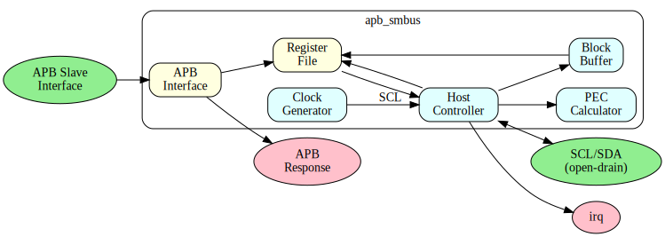

# APB SMBus Specification - Table of Contents

**Component:** APB System Management Bus (SMBus) Controller
**Version:** 1.0
**Last Updated:** 2025-12-01
**Status:** Production Ready

---

## Document Organization

### Chapter 1: Overview
- [01_overview.md](ch01_overview/01_overview.md) - Component overview
- [02_architecture.md](ch01_overview/02_architecture.md) - Architecture

### Chapter 2: Blocks
- [00_overview.md](ch02_blocks/00_overview.md) - Block hierarchy

### Chapter 3: Interfaces
- [00_overview.md](ch03_interfaces/00_overview.md) - Interface summary

### Chapter 4: Programming Model
- [00_overview.md](ch04_programming/00_overview.md) - Programming overview

### Chapter 5: Registers
- [01_register_map.md](ch05_registers/01_register_map.md) - Register map

---

## Block Diagram

---

## Version History

| Version | Date | Author | Changes |
|---------|------|--------|---------|
| 1.0 | 2025-12-01 | RTL Design Sherpa | Initial specification |
