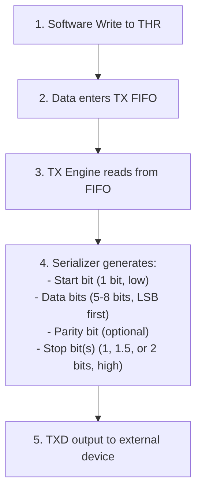
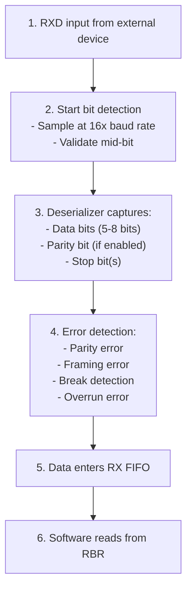
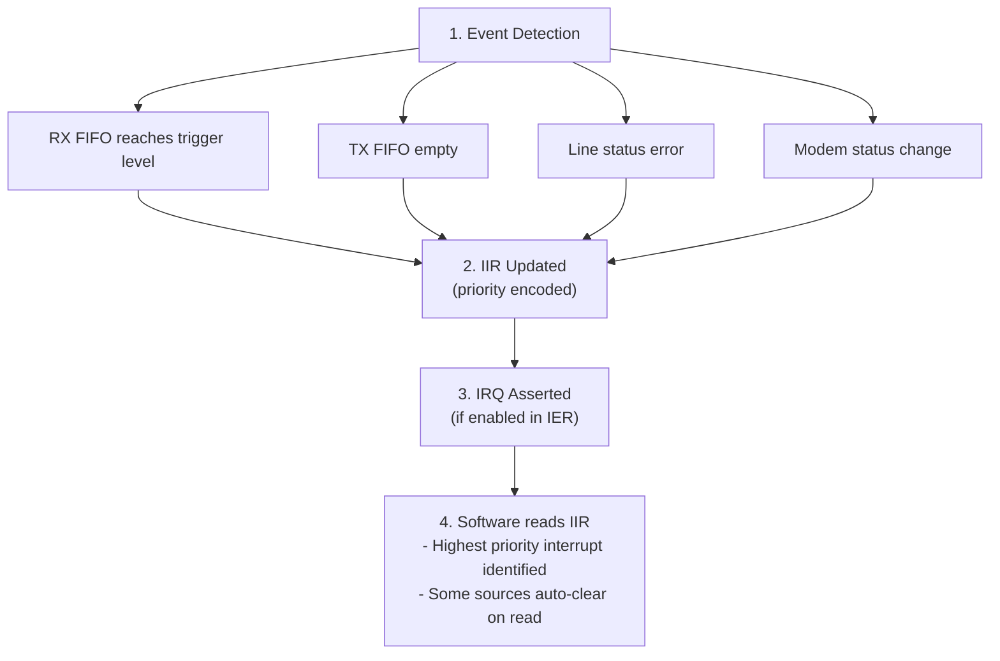
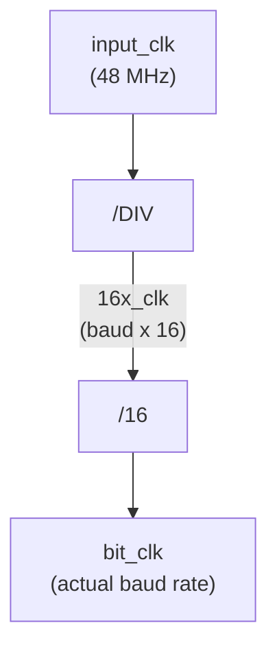

<!-- RTL Design Sherpa Documentation Header -->
<table>
<tr>
<td width="80">
  <a href="https://github.com/sean-galloway/RTLDesignSherpa">
    
  </a>
</td>
<td>
  <strong>RTL Design Sherpa</strong> · <em>Learning Hardware Design Through Practice</em><br>
  <sub>
    <a href="https://github.com/sean-galloway/RTLDesignSherpa">GitHub</a> ·
    <a href="https://github.com/sean-galloway/RTLDesignSherpa/blob/main/docs/DOCUMENTATION_INDEX.md">Documentation Index</a> ·
    <a href="https://github.com/sean-galloway/RTLDesignSherpa/blob/main/LICENSE">MIT License</a>
  </sub>
</td>
</tr>
</table>

---

<!-- End Header -->

# APB UART 16550 - Architecture

## High-Level Block Diagram

### Figure 1.2: UART Architecture


## Module Hierarchy

```
apb_uart_16550 (Top Level)
+-- apb_slave
|   +-- APB protocol handling
|   +-- CMD/RSP interface conversion
|
+-- uart_16550_config_regs (Register Wrapper)
|   +-- uart_16550_regs (PeakRDL Generated)
|   |   +-- RBR/THR/DLL register
|   |   +-- IER/DLM register
|   |   +-- IIR/FCR registers
|   |   +-- LCR/MCR/LSR/MSR/SCR
|   |
|   +-- Baud Rate Generator
|   |   +-- Divisor latch
|   |   +-- 16x clock generation
|   |
|   +-- TX Engine
|   |   +-- TX FIFO (16 bytes)
|   |   +-- Serializer
|   |   +-- Start/Stop/Parity generation
|   |
|   +-- RX Engine
|       +-- RX FIFO (16 bytes)
|       +-- Deserializer
|       +-- Start detection
|       +-- Error detection
```

## Data Flow

### Transmit Path



### Receive Path



### Interrupt Flow



## Baud Rate Generation

### Divisor Calculation

```
Divisor = Input Clock / (16 x Desired Baud Rate)

Examples (48 MHz input):
  9600 baud:   Divisor = 48000000 / (16 x 9600)   = 312.5  -> 312 or 313
  115200 baud: Divisor = 48000000 / (16 x 115200) = 26.04  -> 26
  3000000 baud: Divisor = 48000000 / (16 x 3000000) = 1    -> 1
```

### Clock Generation



## FIFO Organization

### TX FIFO

| Feature | Value |
|---------|-------|
| Depth | 16 bytes |
| Width | 8 bits |
| Write | THR writes |
| Read | TX serializer |
| Status | THRE, TEMT in LSR |

### RX FIFO

| Feature | Value |
|---------|-------|
| Depth | 16 bytes |
| Width | 11 bits (8 data + 3 error) |
| Write | RX deserializer |
| Read | RBR reads |
| Trigger | 1, 4, 8, or 14 bytes |

## Resource Estimates

| Component | Flip-Flops | LUTs |
|-----------|-----------|------|
| apb_slave | ~20 | ~50 |
| uart_regs | ~150 | ~100 |
| baud_gen | ~20 | ~30 |
| tx_engine + FIFO | ~200 | ~150 |
| rx_engine + FIFO | ~250 | ~200 |
| **Total** | ~640 | ~530 |

---

**Next:** [03_clocks_and_reset.md](03_clocks_and_reset.md) - Clock and reset behavior
